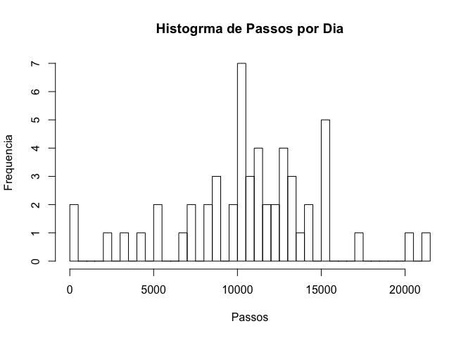
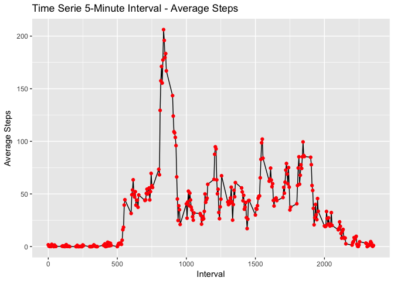

# Reproducible Research: Peer Assessment 1

## Loading and preprocessing the data
Here is where I load the data.

```r
library(knitr)
library(ggplot2)
dados <- read.csv("activity.csv")
```

## What is mean total number of steps taken per day?
Plotting Histogram  

```r
passosOctNov <- aggregate(steps ~ date, dados, sum)
hist(passosOctNov$steps, breaks = length(passosOctNov$date), main = "Histogrma de Passos por Dia", xlab = "Passos", ylab = "Frequencia")
```

<!-- -->

Calculating mean and median

```r
meanSteps <- format(mean(passosOctNov$steps, na.rm = TRUE), digits = 7, nsmall = 2)
medianSteps <- median(passosOctNov$steps, na.rm = TRUE)
```
The mean of steps is 10766.19 and the median of steps is 10765 


## What is the average daily activity pattern?
Plotting time serie

```r
passosInt <- aggregate(dados$steps ~ dados$interval, dados, mean)

graf <- ggplot(data = passosInt, aes(x=passosInt$`dados$interval`, y=passosInt$`dados$steps`))

graf <- graf + geom_line() + geom_point(color = "red")

graf <- graf + labs(title = "Time Serie 5-Minute Interval - Average Steps", x = "Interval" , y = "Average Steps")

print(graf)
```

<!-- -->


```r
maximo <- passosInt[which.max(passosInt$`dados$steps`), 1]
```

The 5-Minute interval with the maximum number of steps is 835.


## Imputing missing values


## Are there differences in activity patterns between weekdays and weekends?
