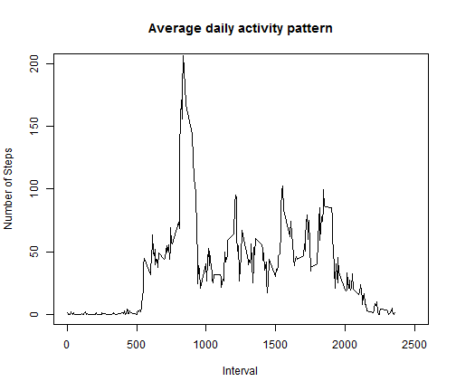
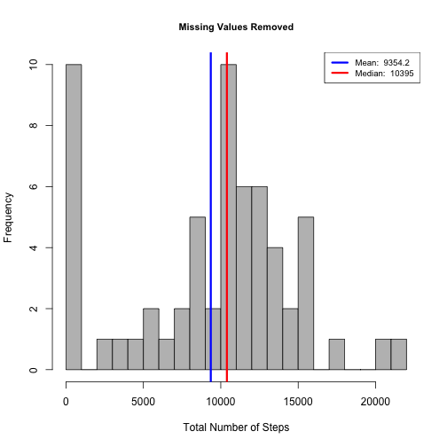
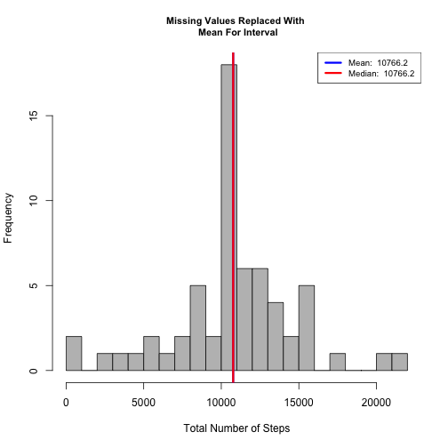
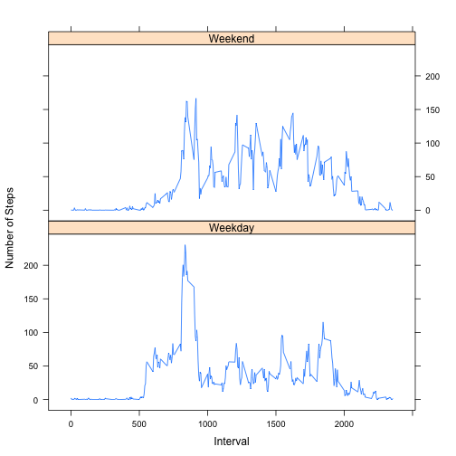

**This document contains the completed work for peer assignment #1 for the Coursera Reproducable Research class.**

###Loading & Preprocessing Data

---

First, I will remove all variables from the environment

```r
#removes all variables from environment
rm(list=ls(all=TRUE)) 
```

Next, I will download the dataset required for this assignment.  Description of this data from course website: 

*This assignment makes use of data from a personal activity monitoring device. This device collects data at 5 minute intervals through out the day. The data consists of two months of data from an anonymous individual collected during the months of October and November, 2012 and include the number of steps taken in 5 minute intervals each day.*


The variables included in this dataset are:

1. **steps**: Number of steps taking in a 5-minute interval (missing values are coded as NA ) 
2. **date**: The date on which the measurement was taken in YYYY-MM-DD format 
3. **interval**: Identifier for the 5-minute interval in which measurement was taken

Next, I will read this data into a dataframe and inspect the structure of the data

```r
dat = read.csv('activity.csv', header = T)
names(dat)
```

```
## [1] "steps"    "date"     "interval"
```

```r
str(dat)
```

```
## 'data.frame':	17568 obs. of  3 variables:
##  $ steps   : int  NA NA NA NA NA NA NA NA NA NA ...
##  $ date    : Factor w/ 61 levels "2012-10-01","2012-10-02",..: 1 1 1 1 1 1 1 1 1 1 ...
##  $ interval: int  0 5 10 15 20 25 30 35 40 45 ...
```

```r
head(dat)
```

```
##   steps       date interval
## 1    NA 2012-10-01        0
## 2    NA 2012-10-01        5
## 3    NA 2012-10-01       10
## 4    NA 2012-10-01       15
## 5    NA 2012-10-01       20
## 6    NA 2012-10-01       25
```


###Histogram, Mean & Median

---

Next, I will make a histogram of the total number of steps taken each day, but first I will summarize the data by day:

```r
library(data.table)
dat_tbl = data.table(dat)
dat_tbl_summary = dat_tbl[, list(total_steps = sum(steps, na.rm = T)), 
                          by = date]
```

**Make The Histogram, And Report on Mean and Median:**

The below histogram addresses the following items:

1.  Make a histogram of the total number of steps taken each day
2.  Calculate and report the mean and median total number of steps taken per day

**Note: Mean and Median Are Reported In Legend Of Histogram**


```r
#Making The Generation of This Plot Into A Function So I Can Re-use Later
gen_hist = function(x, title){
        hist(x, 
             breaks = 20,
             main = title,
             xlab = 'Total Number of Steps', col = 'grey',
            
             cex.main = .9)
        
        #caluclate mean and median
        mean_value = round(mean(x), 1)
        median_value = round(median(x), 1)
        
        #place lines for mean and median on histogram
        abline(v=mean_value, lwd = 3, col = 'blue')
        abline(v=median_value, lwd = 3, col = 'red')
        
        #create legend
        legend('topright', lty = 1, lwd = 3, col = c("blue", "red"),
               cex = .8, 
               legend = c(paste('Mean: ', mean_value),
               paste('Median: ', median_value))
               )
}

gen_hist(dat_tbl_summary$total_steps, 'Number of Steps Taken Per Day')
```

 


###Daily Activity Pattern

----------------------------


**Next, I will try to visualize the daily activity pattern**

The below plot addresses the following items:

1.  Make a time series plot (i.e. type = "l") of the 5-minute interval (x-axis) and the average number of steps taken, averaged across all days (y-axis)
2.  Which 5-minute interval, on average across all the days in the dataset, contains the maximum number of steps?


```r
#summarize dataset by interval
dat_tbl_summary_intv = dat_tbl[, list(avg_steps = mean(steps, na.rm = T)), 
                          by = interval]
#plot the time series
with(dat_tbl_summary_intv, {
        plot(interval, avg_steps, type = 'l',
             main = 'Average Steps by Time Interval',
             xlab = '5 Minute Time Interval',
             ylab = 'Average Number of Steps')
        })
#Find Interval That Has The Maximum Avg Steps
max_steps = dat_tbl_summary_intv[which.max(avg_steps), ]

#Generate Label String
max_lab = paste('Maximum Of ', round(max_steps$avg_steps, 1), ' Steps \n On ', max_steps$interval, 'th Time Interval', sep = '')

#Collect Cooridinates of The Max Interval For Graphing
points(max_steps$interval,  max_steps$avg_steps, col = 'red', lwd = 3, pch = 19)

#Add Label To Annotate Maximum # Steps And Interval
legend("topright",
       legend = max_lab,
       text.col = 'red',
       bty = 'n'
       )
```

 

---

###Missing Values

1. Calculate & Report The Number of Missing Values

```r
sum(is.na(dat$steps))
```

```
## [1] 2304
```

1. Devise a strategy for filling in all of the missing values in the dataset. The strategy does not need to be sophisticated. For example, you could use the mean/median for that day, or the mean for that 5-minute interval, etc.

2. Create a new dataset that is equal to the original dataset but with the missing data filled in.

```r
#First I will join the dataframe I created earlier that summarizes the average number of steps per interval to the original dataset
setkey(dat_tbl, interval)
setkey(dat_tbl_summary_intv, interval)


#Create function that will return the second value if the first value is NA
NA_replace = function(x,y){
        if(is.na(x)){
                
                return(y)
        }
        return(x)
}

#create new dataset that replaces NAs with average values
dat_tbl_miss = dat_tbl[dat_tbl_summary_intv]
dat_tbl_miss$new_steps = mapply(NA_replace,dat_tbl_miss$steps, dat_tbl_miss$avg_steps)

#summaryize new dataset by day
dat_tbl_summary_miss = dat_tbl_miss[, list(new_steps = sum(new_steps, na.rm = T)), 
                          by = date]
#preview new dataset
head(dat_tbl_summary_miss)
```

```
##          date new_steps
## 1: 2012-10-01     10766
## 2: 2012-10-02       126
## 3: 2012-10-03     11352
## 4: 2012-10-04     12116
## 5: 2012-10-05     13294
## 6: 2012-10-06     15420
```

4.  Make a histogram of the total number of steps taken each day and Calculate and report the mean and median total number of steps taken per day. Do these values differ from the estimates from the first part of the assignment? What is the impact of imputing missing data on the estimates of the total daily number of steps?

**Note: Mean and Median Are Reported In Legend Of Histogram**


```r
gen_hist(dat_tbl_summary$total_steps, 'Missing Values Removed')
```

 

```r
gen_hist(dat_tbl_summary_miss$new_steps, 'Missing Values Replaced With \n Mean For Interval')
```

 

**Answer To Question:**
The mean and the median are now almost the same after replacing missing values with the mean value for the relevant interval. It makes sense that the median value would now move closer to the mean. So the Median value increased after this method of missing value replacement.

###Are there differences in activity patterns between weekdays and weekends?

---
1.  Create a new factor variable in the dataset with two levels – “weekday” and “weekend” indicating whether a given date is a weekday or weekend day.

```r
#Make Function To Return Either "Weekday" or "Weekend"
weekpart = function(x){
        if(x %in% c('Saturday', 'Sunday')){
                return('Weekend')
        }
        
        return('Weekday')
}

#Add Name of Week
dat_tbl_miss$dayname = weekdays(as.Date(dat_tbl_miss$date))

#Add Factor Variable To Differentiate Weekday and Weekend
dat_tbl_miss$daytype = as.factor(apply(as.matrix(dat_tbl_miss$dayname), 1, weekpart))

#Summarize Dataset: Mean grouped by interval and daytype
dat_tbl_summary_miss = dat_tbl_miss[, list(avg_steps = mean(new_steps, na.rm = T)), 
                          by = list(interval, daytype)]

#inspect dataset
str(dat_tbl_summary_miss)
```

```
## Classes 'data.table' and 'data.frame':	576 obs. of  3 variables:
##  $ interval : int  0 0 5 5 10 10 15 15 20 20 ...
##  $ daytype  : Factor w/ 2 levels "Weekday","Weekend": 1 2 1 2 1 2 1 2 1 2 ...
##  $ avg_steps: num  2.2512 0.2146 0.4453 0.0425 0.1732 ...
##  - attr(*, ".internal.selfref")=<externalptr>
```

Below is the panel plot:

```r
library(lattice)
xyplot(avg_steps~interval | daytype, data = dat_tbl_summary_miss,
      type = 'l',
      xlab = 'Interval',
      ylab = 'Number of Steps',
      layout = c(1,2))
```

 

