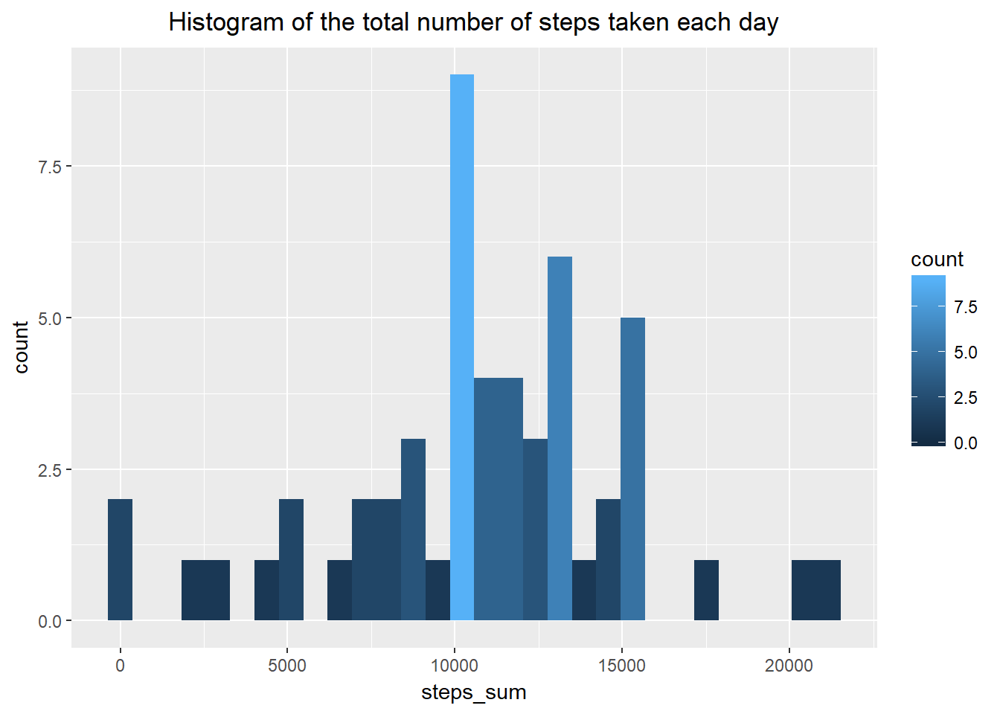
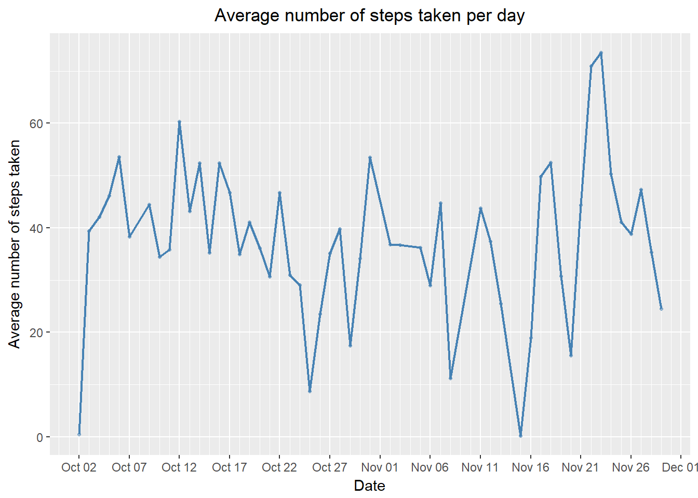
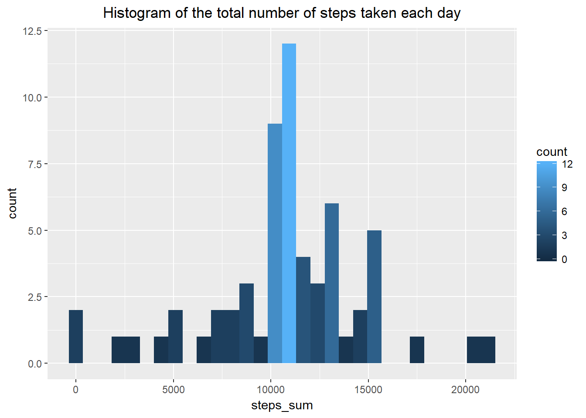
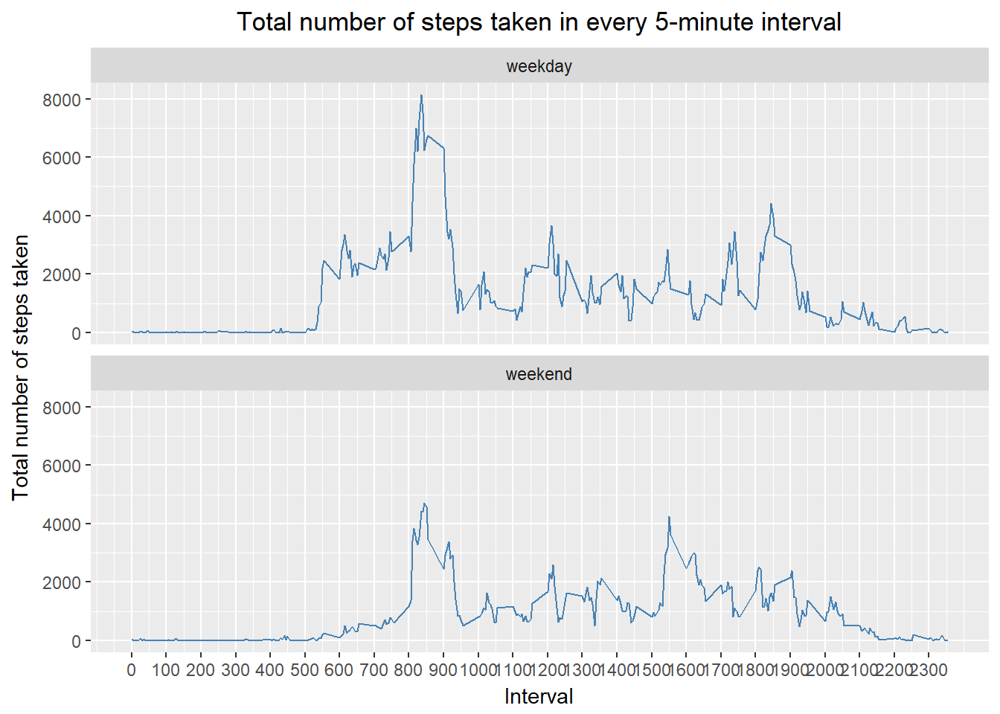

# Reproducible Research: Peer Assessment 1

## 0. Loading the libraries required to run the script


```r
library(data.table)
library(ggplot2)
library(lubridate)
library(dplyr)
```

## 1. Code for reading in the dataset and/or processing the data


```r
## Downloading the file

url <-"https://d396qusza40orc.cloudfront.net/repdata%2Fdata%2Factivity.zip"
dest <- paste0(getwd(), "/" , "Activity_monitoring_data.zip")
download.file(url, dest)
zipF <- "./Activity_monitoring_data.zip"
outDir <-"./Activity_monitoring_data"
unzip(zipF, exdir = outDir)
setwd("./Activity_monitoring_data")

## Reading data set

Activity_monitoring <- read.table("activity.csv", sep = ",", header = TRUE)
setwd("..")

## Date format

Activity_monitoring$date <- as.Date(as.character(Activity_monitoring$date))
ndate <- as.POSIXlt(Activity_monitoring$date)
ndate$hour <- ndate$hour + Activity_monitoring$interval%/%100
ndate$min <- ndate$min + Activity_monitoring$interval%%100
Activity_monitoring$int_label <- paste(paste(Activity_monitoring$interval%/%100, 
                                 "h", sep = " "), 
                                 paste(Activity_monitoring$interval%%100, "min", 
                                 sep = " "), sep = ":")
head(Activity_monitoring, 10)
```

```
##    steps       date interval  int_label
## 1     NA 2012-10-01        0  0 h:0 min
## 2     NA 2012-10-01        5  0 h:5 min
## 3     NA 2012-10-01       10 0 h:10 min
## 4     NA 2012-10-01       15 0 h:15 min
## 5     NA 2012-10-01       20 0 h:20 min
## 6     NA 2012-10-01       25 0 h:25 min
## 7     NA 2012-10-01       30 0 h:30 min
## 8     NA 2012-10-01       35 0 h:35 min
## 9     NA 2012-10-01       40 0 h:40 min
## 10    NA 2012-10-01       45 0 h:45 min
```

## 2. Histogram of the total number of steps taken each day

### Here is the summary of the steps taken per day


```r
## Steps taken each day

steps_sum <- aggregate(steps ~ date, data = Activity_monitoring, FUN = sum, na.rm = TRUE)
names(steps_sum) <- c("date", "steps_sum")
head(steps_sum, 10)
```

```
##          date steps_sum
## 1  2012-10-02       126
## 2  2012-10-03     11352
## 3  2012-10-04     12116
## 4  2012-10-05     13294
## 5  2012-10-06     15420
## 6  2012-10-07     11015
## 7  2012-10-09     12811
## 8  2012-10-10      9900
## 9  2012-10-11     10304
## 10 2012-10-12     17382
```

### Histrogram


```r
g <- ggplot(data = steps_sum, aes(steps_sum))
        g + 
        geom_histogram(bins = 30, aes(fill = ..count..)) + 
        ggtitle("Histogram of the total number of steps taken each day") +
        theme(plot.title = element_text(hjust = 0.5))
```



## 3. Mean and median of the number of steps taken each day


```r
summary_steps <- Activity_monitoring[!is.na(Activity_monitoring$steps), ]
summary_steps <- group_by(summary_steps, date)
summary_steps <- summarize(summary_steps, 
                           steps_sum = sum(steps, na.rm = TRUE), 
                           steps_mean = mean(steps, na.rm = TRUE), 
                           steps_median = median(steps, na.rm = TRUE))
head(summary_steps)
```

```
## # A tibble: 6 x 4
##         date steps_sum steps_mean steps_median
##       <date>     <int>      <dbl>        <dbl>
## 1 2012-10-02       126    0.43750            0
## 2 2012-10-03     11352   39.41667            0
## 3 2012-10-04     12116   42.06944            0
## 4 2012-10-05     13294   46.15972            0
## 5 2012-10-06     15420   53.54167            0
## 6 2012-10-07     11015   38.24653            0
```

## 4. Time series plot of the average number of steps taken


```r
g <- ggplot(data = summary_steps, aes(date, steps_mean))
        g + 
        scale_x_date(date_labels = "%b %d", 
                     date_breaks = "5 days", 
                     date_minor_breaks = "1 day") +       
        geom_line(na.rm = TRUE, color = "steelblue", size = 0.8) +
        geom_point(na.rm = TRUE, color = "steelblue", size = 0.9, alpha = 0.5) + 
        xlab("Date") + 
        ylab("Average number of steps taken") +
        ggtitle("Average number of steps taken per day") +
        theme(plot.title = element_text(hjust = 0.5)) 
```



## 5. The 5-minute interval that, on average, contains the maximum number of steps

### First the data frame is grouped by interval


```r
summary_interval <- group_by(Activity_monitoring, interval)
summary_interval <- summarize(summary_interval, 
                              steps_sum = sum(steps, na.rm = TRUE), 
                              steps_mean = mean(steps, na.rm = TRUE), 
                              steps_median = median(steps, na.rm = TRUE))
head(summary_interval, 10)
```

```
## # A tibble: 10 x 4
##    interval steps_sum steps_mean steps_median
##       <int>     <int>      <dbl>        <int>
##  1        0        91  1.7169811            0
##  2        5        18  0.3396226            0
##  3       10         7  0.1320755            0
##  4       15         8  0.1509434            0
##  5       20         4  0.0754717            0
##  6       25       111  2.0943396            0
##  7       30        28  0.5283019            0
##  8       35        46  0.8679245            0
##  9       40         0  0.0000000            0
## 10       45        78  1.4716981            0
```

### Time series plot of the 5-minute interval (x-axis) and the average number of steps taken, averaged across all days (y-axis)


```r
g <- ggplot(data = summary_interval, aes(interval, steps_mean))
        g + 
        geom_line(na.rm = TRUE, color = "steelblue", size = 0.8) +
        geom_point(na.rm = TRUE, color = "steelblue", size = 0.9, alpha = 0.5) + 
        scale_x_continuous(breaks = seq(0, 2360, 100)) +
        xlab("Interval") + 
        ylab("Average number of steps taken") +
        ggtitle("Average number of steps taken in every 5-minute interval") +
        theme(plot.title = element_text(hjust = 0.5)) 
```


```r
max_int <- summary_interval[which.max(summary_interval$steps_mean), 1]
max_int <- paste(paste(max_int%/%100, "h", sep = " "), 
                 paste(max_int%%100, "min", sep = " "), sep = ":")
```

### The 5-minute interval that, on average, contains the maximum number of steps is at 8 h:35 min.

## 6. Code describing and showing the strategy for imputing missing data

### Total number of missing values in the dataset


```r
data.na <- sum(!complete.cases(Activity_monitoring))
```

### The total number of missing values in the dataset is 2304. 

### As a strategy for filling in all of the missing values in the datase I used the mean for each that 5-minute interval


```r
## Function to replace the na values with the mean

fill_mean <- function(x) {
        replace(x, is.na(x), mean(x, na.rm = TRUE))
}

## Create a new dataset that is equal to the original dataset but with the 
## missing data filled in.

Activity_monitoring_c <- Activity_monitoring %>%
        group_by(interval) %>%
        mutate(steps = fill_mean(steps))
Activity_monitoring_c <- ungroup(Activity_monitoring_c)
head(Activity_monitoring_c, 10)
```

```
## # A tibble: 10 x 4
##        steps       date interval  int_label
##        <dbl>     <date>    <int>      <chr>
##  1 1.7169811 2012-10-01        0  0 h:0 min
##  2 0.3396226 2012-10-01        5  0 h:5 min
##  3 0.1320755 2012-10-01       10 0 h:10 min
##  4 0.1509434 2012-10-01       15 0 h:15 min
##  5 0.0754717 2012-10-01       20 0 h:20 min
##  6 2.0943396 2012-10-01       25 0 h:25 min
##  7 0.5283019 2012-10-01       30 0 h:30 min
##  8 0.8679245 2012-10-01       35 0 h:35 min
##  9 0.0000000 2012-10-01       40 0 h:40 min
## 10 1.4716981 2012-10-01       45 0 h:45 min
```

### Steps taken each day after missing values are imputed


```r
## Steps taken each day
steps_sum_c <- aggregate(Activity_monitoring_c$steps, 
                by = list(Category = Activity_monitoring_c$date), 
                FUN = sum, na.rm = TRUE)
names(steps_sum_c) <- c("date","steps_sum")
head(steps_sum_c)
```

```
##         date steps_sum
## 1 2012-10-01  10766.19
## 2 2012-10-02    126.00
## 3 2012-10-03  11352.00
## 4 2012-10-04  12116.00
## 5 2012-10-05  13294.00
## 6 2012-10-06  15420.00
```

### Mean and median of the number of steps taken each day after missing values are imputed


```r
## Calculate and report the mean and median total number of steps taken per day
summary_steps_c <- group_by(Activity_monitoring_c, date)
summary_steps_c <- summarize(summary_steps_c, 
                             steps_sum = sum(steps, na.rm = TRUE), 
                             steps_mean = mean(steps, na.rm = TRUE), 
                             steps_median = median(steps, na.rm = TRUE))
head(summary_steps_c)
```

```
## # A tibble: 6 x 4
##         date steps_sum steps_mean steps_median
##       <date>     <dbl>      <dbl>        <dbl>
## 1 2012-10-01  10766.19   37.38260     34.11321
## 2 2012-10-02    126.00    0.43750      0.00000
## 3 2012-10-03  11352.00   39.41667      0.00000
## 4 2012-10-04  12116.00   42.06944      0.00000
## 5 2012-10-05  13294.00   46.15972      0.00000
## 6 2012-10-06  15420.00   53.54167      0.00000
```

### Comparison with the values from the estimates from the first part of the assignment


```r
summary_steps_a <- group_by(Activity_monitoring, date)
summary_steps_a <- summarize(summary_steps_a, 
                           steps_sum = sum(steps, na.rm = TRUE), 
                           steps_mean = mean(steps, na.rm = TRUE), 
                           steps_median = median(steps, na.rm = TRUE))
comparison <- data.frame(summary_steps_a$date, 
                         summary_steps_a$steps_sum, 
                         summary_steps_c$steps_sum,
                         summary_steps_a$steps_mean, 
                         summary_steps_c$steps_mean, 
                         summary_steps_a$steps_median, 
                         summary_steps_c$steps_median)
names(comparison) <- c("date", "sum_steps_i", "sum_steps_f", 
                       "mean_steps_i", "mean_steps_f",
                       "median_steps_i", "median_steps_f")
head(comparison, 61)
```

```
##          date sum_steps_i sum_steps_f mean_steps_i mean_steps_f
## 1  2012-10-01           0    10766.19          NaN   37.3825996
## 2  2012-10-02         126      126.00    0.4375000    0.4375000
## 3  2012-10-03       11352    11352.00   39.4166667   39.4166667
## 4  2012-10-04       12116    12116.00   42.0694444   42.0694444
## 5  2012-10-05       13294    13294.00   46.1597222   46.1597222
## 6  2012-10-06       15420    15420.00   53.5416667   53.5416667
## 7  2012-10-07       11015    11015.00   38.2465278   38.2465278
## 8  2012-10-08           0    10766.19          NaN   37.3825996
## 9  2012-10-09       12811    12811.00   44.4826389   44.4826389
## 10 2012-10-10        9900     9900.00   34.3750000   34.3750000
## 11 2012-10-11       10304    10304.00   35.7777778   35.7777778
## 12 2012-10-12       17382    17382.00   60.3541667   60.3541667
## 13 2012-10-13       12426    12426.00   43.1458333   43.1458333
## 14 2012-10-14       15098    15098.00   52.4236111   52.4236111
## 15 2012-10-15       10139    10139.00   35.2048611   35.2048611
## 16 2012-10-16       15084    15084.00   52.3750000   52.3750000
## 17 2012-10-17       13452    13452.00   46.7083333   46.7083333
## 18 2012-10-18       10056    10056.00   34.9166667   34.9166667
## 19 2012-10-19       11829    11829.00   41.0729167   41.0729167
## 20 2012-10-20       10395    10395.00   36.0937500   36.0937500
## 21 2012-10-21        8821     8821.00   30.6284722   30.6284722
## 22 2012-10-22       13460    13460.00   46.7361111   46.7361111
## 23 2012-10-23        8918     8918.00   30.9652778   30.9652778
## 24 2012-10-24        8355     8355.00   29.0104167   29.0104167
## 25 2012-10-25        2492     2492.00    8.6527778    8.6527778
## 26 2012-10-26        6778     6778.00   23.5347222   23.5347222
## 27 2012-10-27       10119    10119.00   35.1354167   35.1354167
## 28 2012-10-28       11458    11458.00   39.7847222   39.7847222
## 29 2012-10-29        5018     5018.00   17.4236111   17.4236111
## 30 2012-10-30        9819     9819.00   34.0937500   34.0937500
## 31 2012-10-31       15414    15414.00   53.5208333   53.5208333
## 32 2012-11-01           0    10766.19          NaN   37.3825996
## 33 2012-11-02       10600    10600.00   36.8055556   36.8055556
## 34 2012-11-03       10571    10571.00   36.7048611   36.7048611
## 35 2012-11-04           0    10766.19          NaN   37.3825996
## 36 2012-11-05       10439    10439.00   36.2465278   36.2465278
## 37 2012-11-06        8334     8334.00   28.9375000   28.9375000
## 38 2012-11-07       12883    12883.00   44.7326389   44.7326389
## 39 2012-11-08        3219     3219.00   11.1770833   11.1770833
## 40 2012-11-09           0    10766.19          NaN   37.3825996
## 41 2012-11-10           0    10766.19          NaN   37.3825996
## 42 2012-11-11       12608    12608.00   43.7777778   43.7777778
## 43 2012-11-12       10765    10765.00   37.3784722   37.3784722
## 44 2012-11-13        7336     7336.00   25.4722222   25.4722222
## 45 2012-11-14           0    10766.19          NaN   37.3825996
## 46 2012-11-15          41       41.00    0.1423611    0.1423611
## 47 2012-11-16        5441     5441.00   18.8923611   18.8923611
## 48 2012-11-17       14339    14339.00   49.7881944   49.7881944
## 49 2012-11-18       15110    15110.00   52.4652778   52.4652778
## 50 2012-11-19        8841     8841.00   30.6979167   30.6979167
## 51 2012-11-20        4472     4472.00   15.5277778   15.5277778
## 52 2012-11-21       12787    12787.00   44.3993056   44.3993056
## 53 2012-11-22       20427    20427.00   70.9270833   70.9270833
## 54 2012-11-23       21194    21194.00   73.5902778   73.5902778
## 55 2012-11-24       14478    14478.00   50.2708333   50.2708333
## 56 2012-11-25       11834    11834.00   41.0902778   41.0902778
## 57 2012-11-26       11162    11162.00   38.7569444   38.7569444
## 58 2012-11-27       13646    13646.00   47.3819444   47.3819444
## 59 2012-11-28       10183    10183.00   35.3576389   35.3576389
## 60 2012-11-29        7047     7047.00   24.4687500   24.4687500
## 61 2012-11-30           0    10766.19          NaN   37.3825996
##    median_steps_i median_steps_f
## 1              NA       34.11321
## 2               0        0.00000
## 3               0        0.00000
## 4               0        0.00000
## 5               0        0.00000
## 6               0        0.00000
## 7               0        0.00000
## 8              NA       34.11321
## 9               0        0.00000
## 10              0        0.00000
## 11              0        0.00000
## 12              0        0.00000
## 13              0        0.00000
## 14              0        0.00000
## 15              0        0.00000
## 16              0        0.00000
## 17              0        0.00000
## 18              0        0.00000
## 19              0        0.00000
## 20              0        0.00000
## 21              0        0.00000
## 22              0        0.00000
## 23              0        0.00000
## 24              0        0.00000
## 25              0        0.00000
## 26              0        0.00000
## 27              0        0.00000
## 28              0        0.00000
## 29              0        0.00000
## 30              0        0.00000
## 31              0        0.00000
## 32             NA       34.11321
## 33              0        0.00000
## 34              0        0.00000
## 35             NA       34.11321
## 36              0        0.00000
## 37              0        0.00000
## 38              0        0.00000
## 39              0        0.00000
## 40             NA       34.11321
## 41             NA       34.11321
## 42              0        0.00000
## 43              0        0.00000
## 44              0        0.00000
## 45             NA       34.11321
## 46              0        0.00000
## 47              0        0.00000
## 48              0        0.00000
## 49              0        0.00000
## 50              0        0.00000
## 51              0        0.00000
## 52              0        0.00000
## 53              0        0.00000
## 54              0        0.00000
## 55              0        0.00000
## 56              0        0.00000
## 57              0        0.00000
## 58              0        0.00000
## 59              0        0.00000
## 60              0        0.00000
## 61             NA       34.11321
```

## 7. Histogram of the total number of steps taken each day after missing values are imputed


```r
g <- ggplot(data = steps_sum_c, aes(steps_sum))
        g + 
        geom_histogram(bins = 30, aes(fill = ..count..)) + 
        ggtitle("Histogram of the total number of steps taken each day") +
        theme(plot.title = element_text(hjust = 0.5))
```



## 8.  Panel plot comparing the average number of steps taken per 5-minute interval across weekdays and weekends

### New factor variable in the dataset (after missing values are imputed) with two levels - "weekday" and "weekend" indicating whether a given date is a weekday or weekend day.


```r
Weekday <- c("Monday", "Tuesday", "Wednesday", "Tuesday", "Friday")
Activity_monitoring_c$day <- ifelse(weekdays(Activity_monitoring_c$date) %in% 
                                            Weekday, 'weekday', 'weekend')
```

### Panel plot


```r
g <- ggplot(data = Activity_monitoring_c, aes(interval, steps))
        g + 
        facet_wrap(~ day, nrow = 2, ncol = 1) +    
        stat_summary(fun.y = "sum", geom = "line", col = "blue") + 
        scale_x_continuous(breaks = seq(0, 2360, 100)) +
        xlab("Interval") + 
        ylab("Total number of steps taken") +
        ggtitle("Total number of steps taken in every 5-minute interval") +
        theme(plot.title = element_text(hjust = 0.5)) 
```



### As shown there are differences in activity patterns between weekdays and weekends


```r
summary_all <- Activity_monitoring_c %>% group_by(interval, day) %>% summarise(sum = sum(steps))
head(summary_all)
```

```
## # A tibble: 6 x 3
## # Groups:   interval [3]
##   interval     day        sum
##      <int>   <chr>      <dbl>
## 1        0 weekday 52.5849057
## 2        0 weekend 52.1509434
## 3        5 weekday 19.6981132
## 4        5 weekend  1.0188679
## 5       10 weekday  7.6603774
## 6       10 weekend  0.3962264
```
