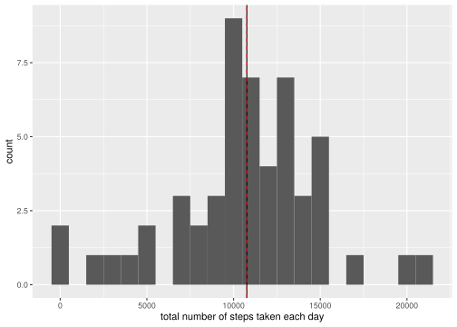
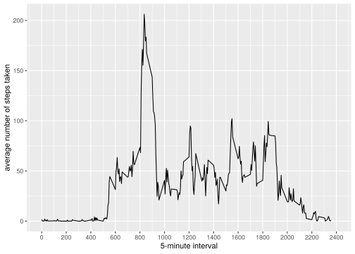
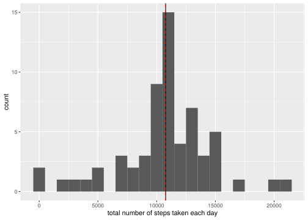
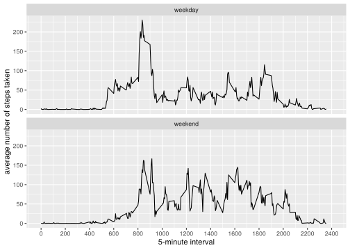

## Loading and preprocessing the data

```r
rm(list=ls()) # clean workspace
unzip(zipfile="activity.zip")
data <- read.csv("activity.csv")
head(data)
```

```
##   steps       date interval
## 1    NA 2012-10-01        0
## 2    NA 2012-10-01        5
## 3    NA 2012-10-01       10
## 4    NA 2012-10-01       15
## 5    NA 2012-10-01       20
## 6    NA 2012-10-01       25
```

```r
str(data)
```

```
## 'data.frame':	17568 obs. of  3 variables:
##  $ steps   : int  NA NA NA NA NA NA NA NA NA NA ...
##  $ date    : chr  "2012-10-01" "2012-10-01" "2012-10-01" "2012-10-01" ...
##  $ interval: int  0 5 10 15 20 25 30 35 40 45 ...
```

```r
total.steps <-data%>%
        dplyr::filter(!is.na(steps))%>%
        dplyr::group_by(date)%>%
        dplyr::summarise(stepsum =sum(steps))
```


## What is mean total number of steps taken per day?

```r
ggplot(total.steps, aes(x=stepsum)) + 
  geom_histogram(binwidth=1000) + 
        xlab("total number of steps taken each day") + 
        geom_vline(data=total.steps, xintercept=mean(total.steps[["stepsum"]])) + 
        geom_vline(data=total.steps, xintercept=median(total.steps[["stepsum"]]), color="red", linetype="dashed")
```

<!-- -->

The mean number of steps per day is 10766 (black vertical line). The median number of steps per day is 10765 (red dashed vertical line).

## What is the average daily activity pattern?


```r
average.d <-data%>%
        dplyr::group_by(interval)%>%
        dplyr::summarise(meansteps =mean(steps, na.rm = TRUE))

ggplot(data=average.d, aes(x=interval, y=meansteps)) +
    geom_line() +
    xlab("5-minute interval") +
    ylab("average number of steps taken")+
    scale_x_continuous(limits=c(0,2400), breaks=c(seq(0,2400,200)))
```

<!-- -->

The 5-minute interval "835" contains the maximum number of steps (206.2) on average across all the days in the dataset. 


## Imputing missing values

The number of missing values is shown in the following table:


```r
missing <- is.na(data[["steps"]])
kable(table(missing), col.names=c("Missing values", "Frequency (n)"), caption = "Number of missing values in the dataset:")
```


Table: Number of missing values in the dataset:

|Missing values | Frequency (n)|
|:--------------|-------------:|
|FALSE          |         15264|
|TRUE           |          2304|

As substitution rule, all of the missing values are filled in with mean value for that 5-minute interval.


```r
repl.na <- function(steps, interval) {
    replaced <- NA
    if (!is.na(steps))
        replaced <- c(steps)
    else
        replaced <- (average.d[average.d[["interval"]]==interval, "meansteps"])
    return(replaced)
}
repl.d <- data
repl.d[["steps"]] <- mapply(repl.na, repl.d[["steps"]], repl.d[["interval"]])
repl.d<- unnest(repl.d, steps)
```


```r
total.steps2 <-repl.d%>%
        dplyr::group_by(date)%>%
        dplyr::summarise(stepsum =sum(steps))

ggplot(total.steps2, aes(x=stepsum)) + 
  geom_histogram(binwidth=1000) + 
        xlab("total number of steps taken each day") + 
        geom_vline(data=total.steps2, xintercept=mean(total.steps2[["stepsum"]])) + 
        geom_vline(data=total.steps2, xintercept=median(total.steps2[["stepsum"]]), color="red", linetype="dashed")
```

<!-- -->


The mean number of steps per day is 10766 (black vertical line). The median number of steps per day is 10766 (red dashed vertical line). These values do not differ from the estimates from the first part of the assignment. Thus, the impact of imputing missing data on the estimates of the total daily number of steps is low.


## Are there differences in activity patterns between weekdays and weekends?


```r
repl.d2 <- repl.d%>%
        dplyr::mutate(date = ymd(date),
                      date2 = weekdays(date),
                      is.wke = ifelse(date2%in%c("Saturday","Sunday"), "weekend", "weekday"))
```


```r
average.d2 <-repl.d2%>%
        dplyr::group_by(interval,is.wke)%>%
        dplyr::summarise(meansteps =mean(steps, na.rm = TRUE))
```

```
## `summarise()` has grouped output by 'interval'. You can override using the
## `.groups` argument.
```

```r
ggplot(data=average.d2, aes(x=interval, y=meansteps)) +
    geom_line() +
    xlab("5-minute interval") +
    ylab("average number of steps taken")+
    scale_x_continuous(limits=c(0,2400), breaks=c(seq(0,2400,200)))+
    facet_wrap(~is.wke, ncol = 1, nrow=2)
```

<!-- -->


There is a difference in the activity pattern in that the average number of steps on the weekday is higher in the morning and lower in the afternoon/evening than a weekend day. Weekend days in the graph shown above include Saturday and Sunday.


# R environment used for this report {#rsettings}


```
## R version 4.2.0 (2022-04-22)
## Platform: x86_64-pc-linux-gnu (64-bit)
## Running under: openSUSE Tumbleweed
## 
## Matrix products: default
## BLAS:   /software/content/R/4.2.0_tumbleweed/lib/libRblas.so
## LAPACK: /software/content/R/4.2.0_tumbleweed/lib/libRlapack.so
## 
## Random number generation:
##  RNG:     Inversion 
##  Normal:  Mersenne-Twister 
##  Sample:  Rejection 
##  
## locale:
##  [1] LC_CTYPE=en_US.UTF-8       LC_NUMERIC=C              
##  [3] LC_TIME=en_US.UTF-8        LC_COLLATE=en_US.UTF-8    
##  [5] LC_MONETARY=en_US.UTF-8    LC_MESSAGES=en_US.UTF-8   
##  [7] LC_PAPER=en_US.UTF-8       LC_NAME=C                 
##  [9] LC_ADDRESS=C               LC_TELEPHONE=C            
## [11] LC_MEASUREMENT=en_US.UTF-8 LC_IDENTIFICATION=C       
## 
## attached base packages:
## [1] base      datasets  graphics  grDevices methods   stats     utils    
## 
## other attached packages:
## [1] dplyr_1.1.3     ggplot2_3.4.2   knitr_1.43      lubridate_1.9.2
## [5] tidyr_1.3.0    
## 
## loaded via a namespace (and not attached):
##  [1] bslib_0.5.0       cachem_1.0.8      cli_3.6.1         colorspace_2.1-0 
##  [5] compiler_4.2.0    digest_0.6.33     evaluate_0.21     fansi_1.0.4      
##  [9] farver_2.1.1      fastmap_1.1.1     generics_0.1.3    glue_1.6.2       
## [13] grid_4.2.0        gtable_0.3.3      highr_0.10        htmltools_0.5.6  
## [17] jquerylib_0.1.4   jsonlite_1.8.7    labeling_0.4.2    lifecycle_1.0.3  
## [21] magrittr_2.0.3    munsell_0.5.0     pillar_1.9.0      pkgconfig_2.0.3  
## [25] purrr_1.0.2       R6_2.5.1          rlang_1.1.1       rmarkdown_2.23   
## [29] rstudioapi_0.15.0 sass_0.4.7        scales_1.2.1      tibble_3.2.1     
## [33] tidyselect_1.2.0  timechange_0.2.0  tools_4.2.0       utf8_1.2.3       
## [37] vctrs_0.6.3       withr_2.5.0       xfun_0.40         yaml_2.3.7
```
