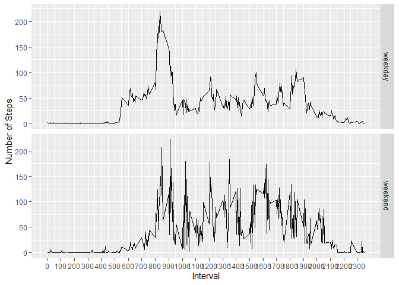

\#Loading and preprocessing the data Show any code that is needed to

1.  Load the data (i.e. read.csv())

2.  Process/transform the data (if necessary) into a format suitable for
    your analysis

<!-- -->

    setwd("C:/Users/Asus/Desktop/Coursera/Курсовая курс 5")
    activ <- read.csv("C:/Users/Asus/Desktop/Coursera/Курсовая курс 5/activity.csv", header = TRUE, sep = ",")
    activ$date <- as.Date(as.character(activ$date), "%Y-%m-%d")
    head(activ)

    ##   steps       date interval
    ## 1    NA 2012-10-01        0
    ## 2    NA 2012-10-01        5
    ## 3    NA 2012-10-01       10
    ## 4    NA 2012-10-01       15
    ## 5    NA 2012-10-01       20
    ## 6    NA 2012-10-01       25

\#What is mean total number of steps taken per day?

For this part of the assignment, you can ignore the missing values in
the dataset.

    activ.sum <- aggregate(activ$steps, by=activ["date"], FUN=sum, na.rm = TRUE)
    names(activ.sum)<- c("date","steps")
    head(activ.sum)

    ##         date steps
    ## 1 2012-10-01     0
    ## 2 2012-10-02   126
    ## 3 2012-10-03 11352
    ## 4 2012-10-04 12116
    ## 5 2012-10-05 13294
    ## 6 2012-10-06 15420

1.  Make a histogram of the total number of steps taken each day

<!-- -->

    library(ggplot2)

    ## Warning: package 'ggplot2' was built under R version 4.0.5

    ggplot(data=activ.sum, aes(date,steps)) +   geom_histogram(stat="identity", col = "black")

    ## Warning: Ignoring unknown parameters: binwidth, bins, pad

1.  Calculate and report the mean and median total number of steps taken
    per day

<!-- -->

    summary(activ.sum)

    ##       date                steps      
    ##  Min.   :2012-10-01   Min.   :    0  
    ##  1st Qu.:2012-10-16   1st Qu.: 6778  
    ##  Median :2012-10-31   Median :10395  
    ##  Mean   :2012-10-31   Mean   : 9354  
    ##  3rd Qu.:2012-11-15   3rd Qu.:12811  
    ##  Max.   :2012-11-30   Max.   :21194

mean = 9354 median = 10395

\#What is the average daily activity pattern?

    library(dplyr)

    ## 
    ## Attaching package: 'dplyr'

    ## The following objects are masked from 'package:stats':
    ## 
    ##     filter, lag

    ## The following objects are masked from 'package:base':
    ## 
    ##     intersect, setdiff, setequal, union

    actInterval <- activ %>% group_by(interval) %>% summarize(meanSteps = mean(steps, na.rm = TRUE))

    ## `summarise()` ungrouping output (override with `.groups` argument)

    head(actInterval)

    ## # A tibble: 6 x 2
    ##   interval meanSteps
    ##      <int>     <dbl>
    ## 1        0    1.72  
    ## 2        5    0.340 
    ## 3       10    0.132 
    ## 4       15    0.151 
    ## 5       20    0.0755
    ## 6       25    2.09

1.  Make a time series plot (i.e. type = “l”) of the 5-minute interval
    (x-axis) and the average number of steps taken, averaged across all
    days (y-axis)

2.  Which 5-minute interval, on average across all the days in the
    dataset, contains the maximum number of steps?

<!-- -->

    plot2 <- ggplot(data = actInterval, mapping = aes(x = interval, y = meanSteps)) + geom_line() + scale_x_continuous("Day Interval", breaks = seq(min(actInterval$interval), max(actInterval$interval), 100)) + scale_y_continuous("Average Number of Steps") + ggtitle("Average Number of Steps Taken by Interval")
    plot2

Answer: Maximum ~ 830 Day Interval

\#Imputing missing values

Note that there are a number of days/intervals where there are missing
values (coded as NA). The presence of missing days may introduce bias
into some calculations or summaries of the data.

1.  Calculate and report the total number of missing values in the
    dataset (i.e. the total number of rows with NAs

<!-- -->

    length(activ$steps[is.na(activ$steps)])

    ## [1] 2304

    length(activ$date[is.na(activ$date)])

    ## [1] 0

    length(activ$interval[is.na(activ$interval)])

    ## [1] 0

Answer: NA\`s только в столбце steps в количестве 2304 строк

1.  Devise a strategy for filling in all of the missing values in the
    dataset. The strategy does not need to be sophisticated. For
    example, you could use the mean/median for that day, or the mean for
    that 5-minute interval, etc.

We use a strategy of replacing NA with interval averages.

    active.na <- activ
    active.na$steps <- with(active.na, ave(steps, interval, FUN = function(x) replace(x, is.na(x), mean(x, na.rm = TRUE))))
    head(active.na)

    ##       steps       date interval
    ## 1 1.7169811 2012-10-01        0
    ## 2 0.3396226 2012-10-01        5
    ## 3 0.1320755 2012-10-01       10
    ## 4 0.1509434 2012-10-01       15
    ## 5 0.0754717 2012-10-01       20
    ## 6 2.0943396 2012-10-01       25

1.  Create a new dataset that is equal to the original dataset but with
    the missing data filled in.

<!-- -->

    active.sum.na <- aggregate(active.na$steps, by=active.na["date"], FUN=sum, na.rm = TRUE)
    names(active.sum.na)<- c("date","steps")

1.  Make a histogram of the total number of steps taken each day and
    Calculate and report the mean and median total number of steps taken
    per day. Do these values differ from the estimates from the first
    part of the assignment? What is the impact of imputing missing data
    on the estimates of the total daily number of steps?

<!-- -->

    ggplot(data=active.sum.na, aes(date,steps)) + geom_histogram(stat="identity", col = "black")

    ## Warning: Ignoring unknown parameters: binwidth, bins, pad

    summary(active.sum.na)

    ##       date                steps      
    ##  Min.   :2012-10-01   Min.   :   41  
    ##  1st Qu.:2012-10-16   1st Qu.: 9819  
    ##  Median :2012-10-31   Median :10766  
    ##  Mean   :2012-10-31   Mean   :10766  
    ##  3rd Qu.:2012-11-15   3rd Qu.:12811  
    ##  Max.   :2012-11-30   Max.   :21194

mean and median = 10766

Answer: The schedule changes are significant. The total number of steps
has been increased.

\#Are there differences in activity patterns between weekdays and
weekends?

For this part the weekdays() function may be of some help here. Use the
dataset with the filled-in missing values for this part.

    active.na$weekdays <- weekdays(active.na$date)
    head(active.na)

    ##       steps       date interval    weekdays
    ## 1 1.7169811 2012-10-01        0 понедельник
    ## 2 0.3396226 2012-10-01        5 понедельник
    ## 3 0.1320755 2012-10-01       10 понедельник
    ## 4 0.1509434 2012-10-01       15 понедельник
    ## 5 0.0754717 2012-10-01       20 понедельник
    ## 6 2.0943396 2012-10-01       25 понедельник

1.  Create a new factor variable in the dataset with two levels –
    “weekday” and “weekend” indicating whether a given date is a weekday
    or weekend day.

<!-- -->

    active.na$factor <- ifelse(active.na$weekdays != c("суббота", "воскресенье"), "weekday", "weekend")
    sum(active.na$factor == "weekday")

    ## [1] 15264

    sum(active.na$factor == "weekend")

    ## [1] 2304

1.  Make a panel plot containing a time series plot (i.e. type = “l”) of
    the 5-minute interval (x-axis) and the average number of steps
    taken, averaged across all weekday days or weekend days (y-axis).

<!-- -->

    actInterval2 <- active.na %>% group_by(interval, factor) %>% summarize(meanSteps = mean(steps, na.rm = TRUE))

    ## `summarise()` regrouping output by 'interval' (override with `.groups` argument)

    head(actInterval2)

    ## # A tibble: 6 x 3
    ## # Groups:   interval [3]
    ##   interval factor  meanSteps
    ##      <int> <chr>       <dbl>
    ## 1        0 weekday    1.94  
    ## 2        0 weekend    0.215 
    ## 3        5 weekday    0.384 
    ## 4        5 weekend    0.0425
    ## 5       10 weekday    0.150 
    ## 6       10 weekend    0.0165

    plotD <- ggplot(data = actInterval2, mapping = aes(x = interval, y = meanSteps)) + geom_line() + facet_grid(factor ~ .) + scale_x_continuous("Interval", breaks = seq(min(actInterval2$interval), max(actInterval2$interval), 100)) + scale_y_continuous("Number of Steps")
    plotD

