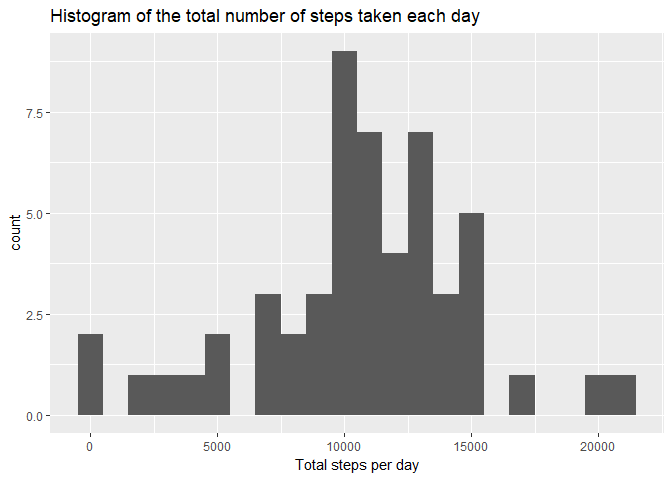
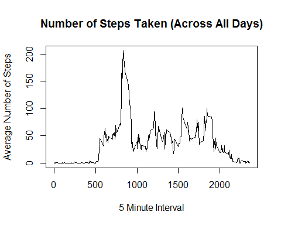
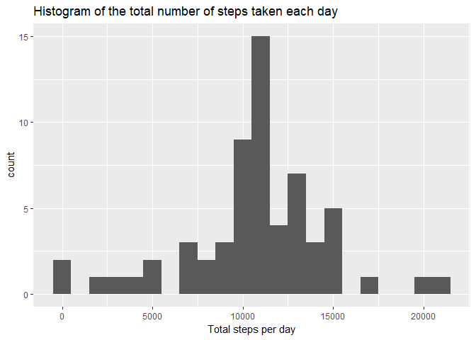
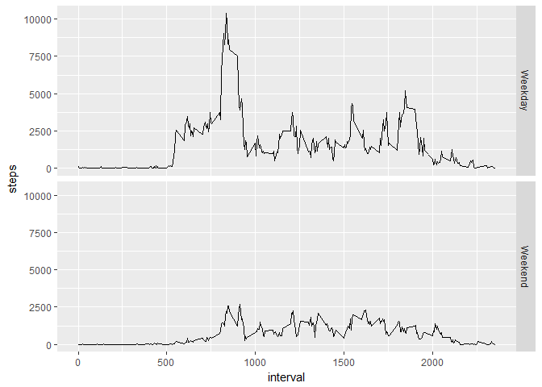

# Reproducible Research: Peer Assessment 1
Charles  
July 14th, 2017  


## Loading and preprocessing the data
Firstly we set up the working directory.

```r
setwd("C:/Study/Coursera/1 Data-Science/2 RStudio/5 Class 5/2 week2/RepData_PeerAssessment1")
```
Unzip the file and load the data:

```r
if (!file.exists("activity.csv")){
        unzip("activity.zip")
}
dataAct <- read.csv("activity.csv")
```
It seems we don't need to process the data.

## What is mean total number of steps taken per day?
Use the `aggregate` function to calcuate the total number of steps taken per day:

```r
dataByDate <- aggregate(steps ~ date, dataAct, sum)
head(dataByDate)
```

```
##         date steps
## 1 2012-10-02   126
## 2 2012-10-03 11352
## 3 2012-10-04 12116
## 4 2012-10-05 13294
## 5 2012-10-06 15420
## 6 2012-10-07 11015
```

Then use ggplot to make a histogram of the total number of steps taken each day:

```r
library(ggplot2)
g <- ggplot(dataByDate, aes(x=steps))
q <- g + geom_histogram(binwidth = 1000) +
        xlab("Total steps per day") +
        ggtitle("Histogram of the total number of steps taken each day")
plot(q)
```

<!-- -->

Calculate the mean and median:

```r
mean(dataByDate$steps)
```

```
## [1] 10766.19
```

```r
median(dataByDate$steps)
```

```
## [1] 10765
```

As we can see, the mean is 1.0766189\times 10^{4} and median
is 10765.

## What is the average daily activity pattern?
Still use `aggregate` function to sum up steps with respect to interval:

```r
dataByInterval <- aggregate(steps ~ interval, dataAct, mean)
head(dataByInterval)
```

```
##   interval     steps
## 1        0 1.7169811
## 2        5 0.3396226
## 3       10 0.1320755
## 4       15 0.1509434
## 5       20 0.0754717
## 6       25 2.0943396
```

Then use ggplot to make the time series plot:

```r
g <- ggplot(dataByInterval, aes(x=interval, y=steps))
q <- g +
        geom_line() +
        xlab("interval") +
        ylab("Number of steps") +
        ggtitle("Time series plot")
plot(q)
```

<!-- -->

Use the `which.max` function to determine which 5-minute interval contains the
maximum number of steps:


```r
dataByInterval[which.max(dataByInterval$steps),1]
```

```
## [1] 835
```

We get the 5-minute interval would be 835.


## Imputing missing values

Use the `is.na` function to determine how many NA's we have:


```r
sum(is.na(dataAct$steps))
```

```
## [1] 2304
```

We can see that there are 2304 NA value.

In order to fill in all the NA value, choose the stragety that using
the corresponding mean for that 5-minute interval:

- Create an identical dataset `dataAct2`.
- Use for loop to go through all the steps in `dataAct`.
- If the steps are NA, replace it by corresponding mean value for that 5-minute interval.

The code would be:


```r
dataAct2 <- dataAct
for (i in 1:length(dataAct$steps)){
        if (is.na(dataAct2$steps[i])){
                dataAct2$steps[i] <- dataByInterval[dataByInterval$interval == dataAct2$interval[i], 2]
        }
}
```

The created new dataset here would be `dataAct2`.

Follow the similar steps like before to make the histogram and calculate mean and median:


```r
dataByDate2 <- aggregate(steps ~ date, dataAct2, sum)
head(dataByDate2)
```

```
##         date    steps
## 1 2012-10-01 10766.19
## 2 2012-10-02   126.00
## 3 2012-10-03 11352.00
## 4 2012-10-04 12116.00
## 5 2012-10-05 13294.00
## 6 2012-10-06 15420.00
```

```r
g <- ggplot(dataByDate2, aes(x=steps))
q <- g + geom_histogram(binwidth = 1000) +
        xlab("Total steps per day") +
        ggtitle("Histogram of the total number of steps taken each day")
plot(q)
```

<!-- -->

```r
mean(dataByDate2$steps)
```

```
## [1] 10766.19
```

```r
median(dataByDate2$steps)
```

```
## [1] 10766.19
```

As we can see above, the mean value keeps the same while the median value
becomes a little bit larger.
So filling in all the NA value doesn't change the mean value since we use the mean value
to replace the NA.
In the meantime, it changed the median value.

## Are there differences in activity patterns between weekdays and weekends?

- Use `as.Date` function to transfer the date into `Date` format.
- Use for loop to creat a dataset with "Weekdays" and "Weekend" two levels.
- Use `cbind` function to generate a new dataset.

The code:


```r
weekdayOrNot <- weekdays(as.Date(dataAct2$date))
for (i in 1:length(weekdayOrNot)){
        if (weekdayOrNot[i] %in% c("Monday","Tuesday","Wednesday","Thursday","Friday")){
                weekdayOrNot[i] <- "Weekday"
        }
        else if (weekdayOrNot[i] %in% c("Saturday","Sunday")){
                weekdayOrNot[i] <- "Weekend"
        }
}
dataAct2 <- cbind(dataAct2, weekdayOrNot)
head(dataAct2)
```

```
##       steps       date interval weekdayOrNot
## 1 1.7169811 2012-10-01        0      Weekday
## 2 0.3396226 2012-10-01        5      Weekday
## 3 0.1320755 2012-10-01       10      Weekday
## 4 0.1509434 2012-10-01       15      Weekday
## 5 0.0754717 2012-10-01       20      Weekday
## 6 2.0943396 2012-10-01       25      Weekday
```

Make a panel plot containing a time series plot (i.e. type = "l") of the 5-minute interval (x-axis) and the average number of steps taken, averaged across all weekday days or weekend days (y-axis):


```r
dataByInterval2 <- aggregate(steps ~ interval + weekdayOrNot, dataAct2, sum)
head(dataByInterval2)
```

```
##   interval weekdayOrNot      steps
## 1        0      Weekday 101.301887
## 2        5      Weekday  20.037736
## 3       10      Weekday   7.792453
## 4       15      Weekday   8.905660
## 5       20      Weekday   4.452830
## 6       25      Weekday  71.566038
```

```r
g <- ggplot(dataByInterval2, aes(x=interval,y=steps))
q <- g +
        geom_line() +
        facet_grid(weekdayOrNot ~ .)
plot(q)
```

<!-- -->

As we can see above, it's obvious that the pattern between weekdays and weekends are
different.


