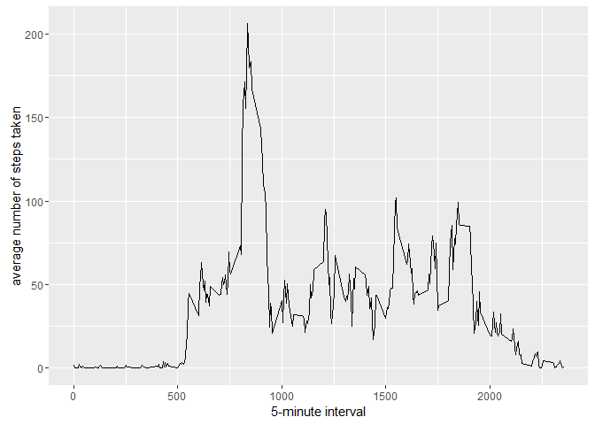

Reproducible Reseach Assignment 1
================
Abhishek
November 3, 2016

Basic Settings

``` r
echo = TRUE  # Always make code visible
options(scipen = 1)  # Turn off scientific notations for numbers
library(ggplot2)
library(scales)
library(Hmisc)
```

    ## Loading required package: lattice

    ## Loading required package: survival

    ## Loading required package: Formula

    ## 
    ## Attaching package: 'Hmisc'

    ## The following objects are masked from 'package:base':
    ## 
    ##     format.pval, round.POSIXt, trunc.POSIXt, units

Load the Data

``` r
setwd("E:/Abhishek/Personal/Analytics/John Hopkins Data Science/Courses/Course 5 Reproducible Research/Week 2/Assignment and Practice")
#unzip("repdata_data_activity.zip")
data <-read.csv("activity.csv")
```

Calculate the Total no of steps taken per day

``` r
steps_day <- tapply(data$steps, data$date, sum, na.rm = "TRUE")
#steps_day <- aggregate(steps ~ date, data, sum)
```

1.  Make a histogram of the total number of steps taken each day

``` r
qplot(steps_day, xlab='Total steps per day', ylab='Frequency using binwith 500', binwidth=500)
```


1.  Calculate and report the mean and median total number of steps taken per day

``` r
steps_day_mean <- mean(steps_day)
steps_day_median <- median(steps_day)
```

What is the average daily activity pattern?
-------------------------------------------

``` r
mean_steps_Time <- aggregate(x=list(meanSteps=data$steps), by=list(interval=data$interval), FUN=mean, na.rm=TRUE)
```

1.  Make a time series plot of the 5-minute interval (x-axis) and the average number of steps taken, averaged across all days (y-axis)

``` r
ggplot(data=mean_steps_Time, aes(x=interval, y=meanSteps)) +
    geom_line() +
    xlab("5-minute interval") +
    ylab("average number of steps taken") 
```



1.  Which 5-minute interval, on average across all the days in the dataset, contains the maximum number of steps?

``` r
max_Steps <- which.max(mean_steps_Time$meanSteps)
timeMostSteps <-  gsub("([0-9]{1,2})([0-9]{2})", "\\1:\\2", data[max_Steps,'interval'])
timeMostSteps
```

    ## [1] "8:35"

Imputing missing values
-----------------------

1.  Calculate and report the total number of missing values in the dataset (i.e. the total number of rows with NAs)

``` r
no_na <- sum(is.na(data$steps))
no_na
```

    ## [1] 2304

1.  Devise a strategy for filling in all of the missing values in the dataset. The strategy does not need to be sophisticated. For example, you could use the mean/median for that day, or the mean for that 5-minute interval, etc.

2.  Create a new dataset that is equal to the original dataset but with the missing data filled in.

``` r
imputed_dataset <- data
imputed_dataset$steps <- impute(data$steps, fun=mean)
imputed_steps_day <- tapply(imputed_dataset$steps, imputed_dataset$date, sum)
mean(imputed_steps_day)
```

    ## [1] 10766.19

``` r
median(imputed_steps_day)
```

    ## [1] 10766.19

1.  Make a histogram of the total number of steps taken each day

``` r
qplot(imputed_steps_day, xlab='Total steps per day (Imputed)', ylab='Frequency using binwith 500', binwidth=500)
```


Are there differences in activity patterns between weekdays and weekends?
-------------------------------------------------------------------------

1.  Create a new factor variable in the dataset with two levels - "weekday" and "weekend" indicating whether a given date is a weekday or weekend day.

``` r
imputed_dataset$dateType <-  ifelse(as.POSIXlt(imputed_dataset$date)$wday %in% c(0,6), 'weekend', 'weekday')
```

1.  Make a panel plot containing a time series plot (i.e. type = "l") of the 5-minute interval (x-axis) and the average number of steps taken, averaged across all weekday days or weekend days (y-axis). See the README file in the GitHub repository to see an example of what this plot should look like using simulated data.

``` r
averagedActivityDataImputed <- aggregate(steps ~ interval + dateType, data=imputed_dataset, mean)
ggplot(averagedActivityDataImputed, aes(interval, steps)) + 
    geom_line() + 
    facet_grid(dateType ~ .) +
    xlab("5-minute interval") + 
    ylab("avarage number of steps")
```


