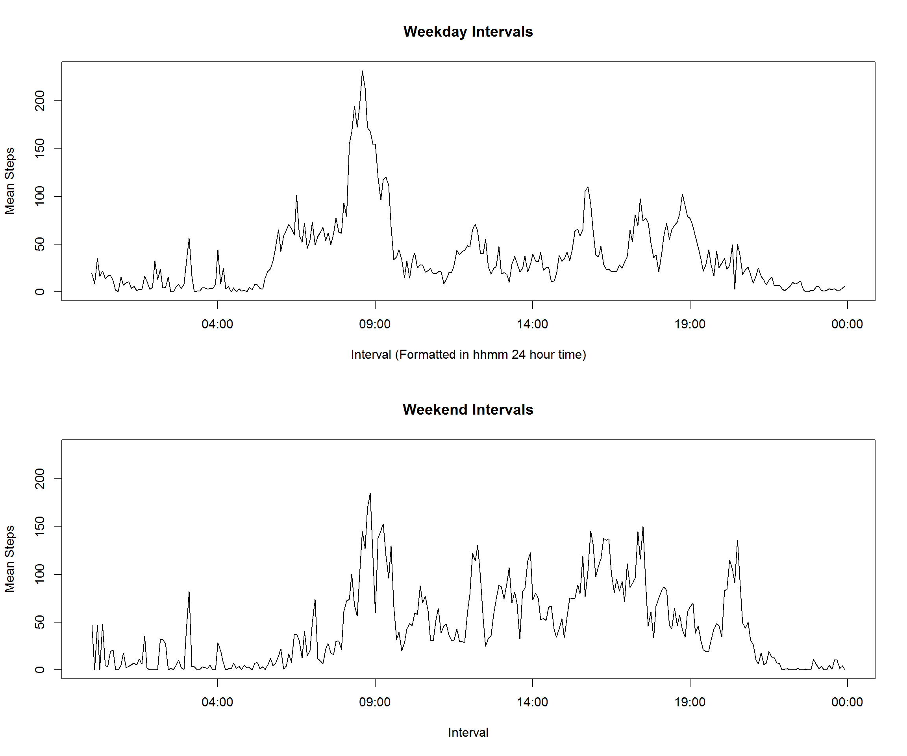

# Reproducible Research: Peer Assessment 1


## 1. Loading and preprocessing the data
#### 1.1 Load the data

```r
steps <- read.csv("activity.csv")
```

#### 1.2 Process/transform the data (if necessary) into a format suitable for your analysis
How many NAs?

```r
NAs <- sum(is.na(steps$steps)); paste(NAs, "NAs"); 
```

```
## [1] "2304 NAs"
```

```r
paste("Our data is",format(round(100*NAs/nrow(steps), 0), nsmall = 0),"percent NAs")
```

```
## [1] "Our data is 13 percent NAs"
```

Are the NAs spread out or clustered on certain dates?

```r
naDates <- steps[which(is.na(steps$steps)),]
numNADates <- length(unique(droplevels(naDates)$date)); numNADates
```

```
## [1] 8
```

NAs occur on 8 of the 61 days. Each day has 24x60mins = 1440mins = 288x5min intervals. 288x8 = 2304 = NAs  
Therefore all 8 of those days have *only* NAs, so lets remove those days completely for now

```r
newsteps <- steps[which(!is.na(steps$steps)),]
```

## 2. What is mean total number of steps taken per day?

#### 2.1 Calculate the total number of steps taken per day

```r
totalSteps <- aggregate(newsteps[,1], by = list(newsteps$date), sum)
colnames(totalSteps) <- c("date", "steps")
```

#### 2.2 Make a histogram of the total number of steps taken each day

```r
hist(  totalSteps$steps,
       breaks = 25, 
       xlab = "Steps in the Day",
       main = paste("Histogram of Steps (", NAs," NAs removed)", sep=""),
       col = "royalblue1")
```

<!-- -->

#### 2.3 Calculate and report the mean and median of the total number of steps taken per day

```r
meanDailySteps <- mean(totalSteps$steps)
medianDailySteps <- median(totalSteps$steps)

paste("Mean Daily steps =", meanDailySteps, "and Median Daily Steps =", medianDailySteps)
```

```
## [1] "Mean Daily steps = 10766.1886792453 and Median Daily Steps = 10765"
```

## 3. What is the average daily activity pattern?

#### 3.1 Make a time series plot (i.e. type = "l") of the 5-minute interval (x-axis) and the average number of steps taken, averaged across all days (y-axis)

```r
intervalMeans <- aggregate(newsteps[,1], by = list(newsteps$interval), mean)
colnames(intervalMeans) <- c("Interval", "AvgSteps")

plot(intervalMeans, type="l", col = "royalblue1", 
     main = "Steps per Interval", 
     xlab = "Interval", 
     ylab = "Steps")
```

<!-- -->

#### 3.2 Which 5-minute interval, on average across all the days in the dataset, contains the maximum number of steps?

```r
maxInterval <- intervalMeans[which.max(intervalMeans$AvgSteps),]
print(maxInterval, row.names = FALSE)
```

```
##  Interval AvgSteps
##       835 206.1698
```

## 4. Imputing missing values
#### 4.1 Calculate and report the total number of missing values in the dataset (i.e. the total number of rows with NAs)

```r
NAs
```

```
## [1] 2304
```

#### 4.2 Devise a strategy for filling in all of the missing values in the dataset. The strategy does not need to be sophisticated. For example, you could use the mean/median for that day, or the mean for that 5-minute interval, etc.

First, we will add day of week and look at the average steps by day of week

```r
totalSteps$dayOfWeek <- weekdays(as.Date(totalSteps$date))
weekdayMeans <- aggregate(totalSteps[,2], by = list(totalSteps$dayOfWeek), mean)
colnames(weekdayMeans) <- c("dayOfWeek", "steps")
weekdayMeans$dayOfWeek <- as.factor(weekdayMeans$dayOfWeek)
weekdayMeans$dayOfWeek <- factor(weekdayMeans$dayOfWeek, levels=c("Monday", "Tuesday", "Wednesday", "Thursday", "Friday", "Saturday", "Sunday"))
par(cex=0.8)
plot(weekdayMeans$dayOfWeek, weekdayMeans$steps)
```

<!-- -->

The plot shows a significant difference between the days of the week, so we will use day Of week as well as intervals to impute the data

```r
newsteps$dayOfWeek <- weekdays(as.Date(newsteps$date))
intervalDayMeans <- aggregate(newsteps[,1], by = list(dayOfWeek = newsteps$dayOfWeek, interval = newsteps$interval), mean)
```

#### 4.3 Create a new dataset that is equal to the original dataset but with the missing data filled in.

Add DayOfWeek to the original data, then add the day-interval means and combine them taking the means where steps is NA

```r
steps$dayOfWeek <- weekdays(as.Date(steps$date))
# Add the imputed values for all rows
stepsImputed <- merge(steps, intervalDayMeans, 
                      by.x = c("dayOfWeek", "interval"), 
                      by.y = c("dayOfWeek", "interval"))

# Copy the imputed values over any NA values for steps in the same row and remove the redundant column
stepsImputed$steps[is.na(stepsImputed$steps)] <- stepsImputed$x[is.na(stepsImputed$steps)]
stepsImputed$x <- NULL
```

#### 4.4 Make a histogram of the total number of steps taken each day and Calculate and report the mean and median total number of steps taken per day. Do these values differ from the estimates from the first part of the assignment? What is the impact of imputing missing data on the estimates of the total daily number of steps?

```r
totalStepsImp <- aggregate(stepsImputed$steps, by = list(stepsImputed$date), sum)
colnames(totalStepsImp) <- c("date", "steps")

hist(  totalStepsImp$steps,
       breaks = 25, 
       xlab = "Steps in the Day", ylab = "",
       main = paste("Histogram of Steps (", NAs," NAs imputed)", sep=""),
       col = "royalblue4")
```

<!-- -->

The mean and median daily steps are greater. Given the difference between average steps depending on day of week, this suggests that more of the missing data fell on days of the week with an otherwise high mean steps, so that when they were imputed, the overall mean (and median) was increased.

```r
meanDailyStepsImp <- mean(totalStepsImp$steps)
medianDailyStepsImp <- median(totalStepsImp$steps)

meanDailyStepsImp
```

```
## [1] 10821.21
```

```r
medianDailyStepsImp
```

```
## [1] 11015
```

## 5. Are there differences in activity patterns between weekdays and weekends?

#### 5.1 Create a new factor variable in the dataset with two levels - "weekday" and "weekend" indicating whether a given date is a weekday or weekend day.

```r
stepsImputed$Weekend <- "weekday"
stepsImputed$Weekend[stepsImputed$dayOfWeek %in% c("Saturday", "Sunday")] <- "weekend"
```

#### 5.2 Make a panel plot containing a time series plot (i.e. type = "l") of the 5-minute interval (x-axis) and the average number of steps taken, averaged across all weekday days or weekend days (y-axis). See the README file in the GitHub repository to see an example of what this plot should look like using simulated data.

Build the two data frames we need

```r
intervalMeansImpWeekday <- aggregate(stepsImputed[stepsImputed$Weekend == "weekday","steps"], 
                                     by = list(stepsImputed[stepsImputed$Weekend == "weekday", "interval"]), 
                                     mean)
intervalMeansImpWeekend <- aggregate(stepsImputed[stepsImputed$Weekend == "weekend","steps"], 
                                     by = list(stepsImputed[stepsImputed$Weekend == "weekend", "interval"]), 
                                     mean)
```

And plot them

```r
par(mfrow=c(2,1), mar = c(0, 1, 0, 1), oma=c(3, 3, 2, 2), cex=0.9)

plot(intervalMeansImpWeekday, xlab="", ylab="", axes=FALSE, type="l", col = "royalblue1")
title("Weekday", line = -1)
axis(3, at = seq(0,2500, 500), labels=FALSE) 
axis(2, at = seq(0,250, 50), labels=FALSE, line=-1.15)
axis(4, at = seq(0,250, 50))

plot(intervalMeansImpWeekend,  xlab="", ylab="", axes=FALSE, type="l", col = "royalblue1", ylim=c(0,200))
title("Weekend", line = -1)
axis(3, at = seq(0,2500, 500), labels=FALSE, lwd.tick=0) 
axis(2, at = seq(0,250, 50), line=-1.15)
axis(4, at = seq(0,250, 50), labels=FALSE)
axis(1, at = seq(0,2500, 500)) 

mtext('Interval', side = 1, outer = TRUE, line = 2)
mtext('Number of Steps', side = 2, outer = TRUE, line = 0)
```

<!-- -->

