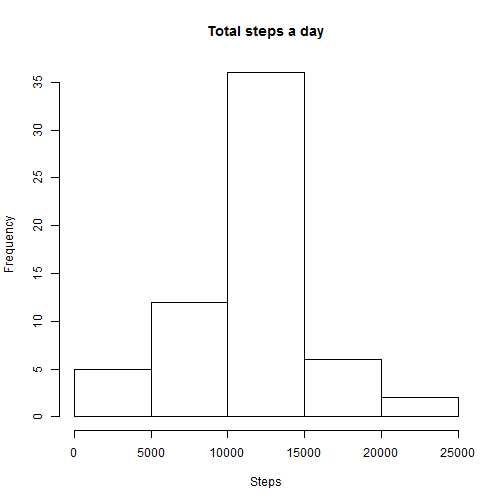
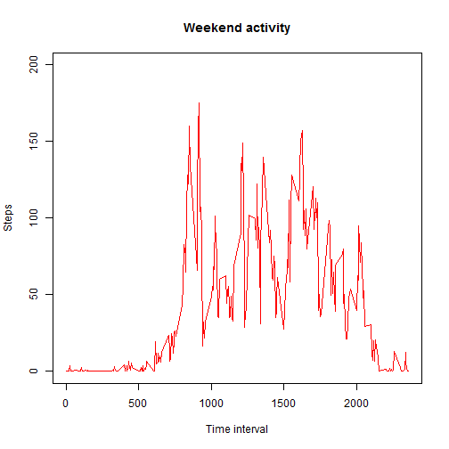

Reproducible Research - Assignment 1
====================================

Jing Z  
April 10, 2016  

## Introduction

It is now possible to collect a large amount of data about personal movement using activity monitoring devices such as a Fitbit, Nike Fuelband, or Jawbone Up. These type of devices are part of the "quantified self" movement -- a group of enthusiasts who take measurements about themselves regularly to improve their health, to find patterns in their behavior, or because they are tech geeks. But these data remain under-utilized both because the raw data are hard to obtain and there is a lack of statistical methods and software for processing and interpreting the data.

This assignment makes use of data from a personal activity monitoring device. This device collects data at 5 minute intervals through out the day. The data consists of two months of data from an anonymous individual collected during the months of October and November, 2012 and include the number of steps taken in 5 minute intervals each day.

##Data

The data for this assignment can be downloaded from the course web site:  
  https://d396qusza40orc.cloudfront.net/repdata%2Fdata%2Factivity.zip    
  The variables included in this dataset are:  
    * steps: Number of steps taking in a 5-minute interval (missing values are coded as  NA )  
    * date: The date on which the measurement was taken in YYYY-MM-DD format  
    * interval: Identifier for the 5-minute interval in which measurement was taken  

The dataset is stored in a comma-separated-value (CSV) file and there are a total of 17,568 observations in this dataset  

##Load File


```r
setwd("C:/Users/Haro Jeanny/Desktop/")
unzip(zipfile="repdata-data-activity.zip") 
data <- read.csv("activity.csv")
attach(data)
```

```
## The following objects are masked from data2:
## 
##     date, steps
```


Create a histogram to show the total number of steps taken each day:

```r
hist(tapply(steps,date,sum), xlab = 'Steps', ylab = 'Days', breaks = 15, main = 'Steps taken per day')
```


```r
data2 <- aggregate(steps ~ date, data, FUN = "sum")
barplot(data2$steps, names.arg=data2$date, xlab = 'Date', ylab = 'Steps', ylim = c(0,25000))
```



Find the mean and median number of steps taken each day:

```r
attach(data2)
```

```
## The following objects are masked from data:
## 
##     date, steps
```

```
## The following objects are masked from data2 (pos = 5):
## 
##     date, steps
```

```r
mean <- mean(steps, na.rm = TRUE)
median <- median(steps, na.rm = TRUE)
```

Create Time series, plot of the average number of steps taken:

```r
data3 <- aggregate(steps ~ date, data=data, FUN="mean")
plot(data3$steps ~ data3$date, xlab = 'Date', ylab = 'Steps', type = 'l', main = 'Time Series for Average steps')
```


Shows the 5-minute interval that, on average, contains the maximum number of steps

```r
data4 <- aggregate(steps ~ interval, data, 'mean')
data4$interval[which.max(data4$steps)]
```

```
## [1] 835
```
Code to describe and show a strategy for imputing missing data - find missing data first then replace with daily average

```r
sum(is.na(data$steps))
```

```
## [1] 2304
```

```r
data5 <- merge(data, data3, by="date", suffixes=c("", ".mean"))
nasteps <- is.na(data5$steps)
data5$steps[nasteps] <- data5$steps.mean[nasteps]
data5 <- data5[, c(1:3)]
sum(is.na(data5$steps))
```

```
## [1] 0
```

Create a histogram to show the total number of steps taken each day after missing values are imputed

```r
data6 <- aggregate(steps ~ date, data=data, FUN="sum")
barplot(data6$steps, names.arg=data6$date, xlab = 'Date', ylab = 'Steps', ylim = c(0,25000))
```


Panel plot comparing the average number of steps taken per 5-minute interval across weekdays and weekends  
First create weekday and weekend variables then make the plots

```r
data7 <- data
data7$date <- as.Date(data7$date)
data7$day <- weekdays(data7$date) == "Sunday"  | weekdays(data7$date) == "Saturday"

weekday <- data7[data7$day == FALSE, ]
weekend <- data7[data7$day == TRUE, ]

mean_weekday <- aggregate(weekday$steps ~ weekday$interval, data=data, FUN="mean")
mean_weekend <- aggregate(weekend$steps ~ weekend$interval, data=data, FUN="mean")
```

Then create two separate plots

```r
plot(mean_weekday, type = "l", xlab="Time interval", ylab="Steps", main="Weekday activity", col="green", ylim = c(0,200))
```


```r
plot(mean_weekend, type="l", xlab="Time interval", ylab="Steps", main="Weekend activity", col="red",ylim = c(0,200))
```



