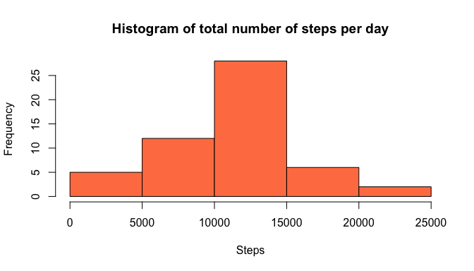
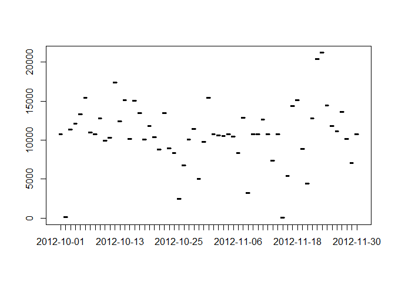

## Loading and preprocessing the data
Reading and Loading the data into R. This is the initial stage.

### 1. Load the data

```r
activity <- read.table(unz("activity.zip", "activity.csv"),header=T,sep=",")
head(activity)
```

```
##   steps       date interval
## 1    NA 2012-10-01        0
## 2    NA 2012-10-01        5
## 3    NA 2012-10-01       10
## 4    NA 2012-10-01       15
## 5    NA 2012-10-01       20
## 6    NA 2012-10-01       25
```
### 2. Process/transform the data (if necessary) into a format suitable for your analysis
Transform the data into format suitable for analysis. I shall transform the date column from factor into date:


```r
activity$date <- as.Date(activity$date)
```


## What is mean total number of steps taken per day?

Ignoring the missing values in the data:

### 1. Make a histogram of the total number of steps taken each day

```r
stepsPerDay <- aggregate(steps~date,data = activity, sum, na.rm=TRUE)
barplot(stepsPerDay$steps, names.arg = stepsPerDay$date, main = "Histogram of Number of Steps per day",xlab = "Day", ylab = "Steps")
```

<!-- -->

### 2. Calculate and report the mean and median total number of steps taken per day


```r
MeanStepsPerDay <- round(mean(stepsPerDay$steps), 0)
MeanStepsPerDay
```

```
## [1] 10766
```

```r
MedianStepsPerDay <- round(median(stepsPerDay$steps), 0)
MedianStepsPerDay
```

```
## [1] 10765
```

_Mean_ of Steps per day is **1.0766\times 10^{4}** and the _Median_ steps per day is **1.0765\times 10^{4}**.


## What is the average daily activity pattern?
### 1. Make a time series plot
(i.e. type = "l") of the 5-minute interval (x-axis) and the average number of steps taken, averaged across all days (y-axis)

```r
stepsPerInterval <- aggregate(steps~interval, data = activity, mean)
plot(stepsPerInterval, type = "l", main = "Time series plot of steps per Interval", col="blue")
```

<!-- -->

### 2. Which 5-minute interval, on average across all the days in the dataset, contains the maximum number of steps?


```r
MaxSteps <- max(stepsPerInterval$steps)
IntervalSteps <- subset(stepsPerInterval, stepsPerInterval$steps==MaxSteps)
y <- as.numeric(IntervalSteps$interval)
```

The 5-minute interval, that contains the maximum number of steps is 835


## Imputing missing values

### 1. Calculate and report the total number of missing values in the dataset (i.e. the total number of rows with NAs)


```r
head(activity)
```

```
##   steps       date interval
## 1    NA 2012-10-01        0
## 2    NA 2012-10-01        5
## 3    NA 2012-10-01       10
## 4    NA 2012-10-01       15
## 5    NA 2012-10-01       20
## 6    NA 2012-10-01       25
```

```r
missingValues <- sum(is.na(activity))
```
Total Missing values is 2304

### 2.  Devise a strategy for filling in all of the missing values in the dataset
The strategy does not need to be sophisticated. For example, you could use the mean/median for that day, or the mean for that 5-minute interval, etc.


```r
  fillNA <- function(activity){
          for(i in 1:length(activity$steps)){
            if(is.na(activity$steps[i])){
              activity$steps[i] <- stepsPerInterval$steps[match(activity$interval[i], stepsPerInterval$interval)]
            }
          }
    activity
  }
  tidyActivity <- fillNA(activity)
```

### 3. Create a new dataset that is equal to the original dataset but with the missing data filled in.


```r
#Now simply delete the extra column created above:

tidyActivity <- tidyActivity[,1:3]
dim(tidyActivity)
```

```
## [1] 17568     3
```

```r
head(tidyActivity)
```

```
##       steps       date interval
## 1 1.7169811 2012-10-01        0
## 2 0.3396226 2012-10-01        5
## 3 0.1320755 2012-10-01       10
## 4 0.1509434 2012-10-01       15
## 5 0.0754717 2012-10-01       20
## 6 2.0943396 2012-10-01       25
```

### 4. Make a histogram of the total number of steps taken each day and Calculate and report the mean and median total number of steps taken per day. 

Do these values differ from the estimates from the first part of the assignment? What is the impact of imputing missing data on the estimates of the total daily number of steps?


```r
stepsPerDay2 <- aggregate(steps~date,data = tidyActivity, sum, na.rm=TRUE)
barplot(stepsPerDay2$steps, names.arg = stepsPerDay2$date, main = "Histogram of Number of Steps per day",xlab = "Day", ylab = "Steps")
```

<!-- -->


## Are there differences in activity patterns between weekdays and weekends?

### 1. Create a new factor variable in the dataset with two levels -- "weekday" and "weekend" indicating whether a given date is a weekday or weekend day.

```r
tidyActivity <- tidyActivity[,1:3]
tidyActivity$DayOfWeek <- weekdays(tidyActivity$date)

for(i in 1:length(tidyActivity$DayOfWeek)){
  if(tidyActivity$DayOfWeek[i] %in% c("Sunday","Saturday")){
    tidyActivity$DayOfWeek[i] <- "Weekend"
  }
}
for(j in 1:length((tidyActivity$DayOfWeek))){
  if(tidyActivity$DayOfWeek[j] != "Weekend"){
    tidyActivity$DayOfWeek[j] <- "Weekday"
  }
}

tidyActivity$DayOfWeek <- factor(tidyActivity$DayOfWeek)
```
### 2. Make a panel plot containing a time series plot 

(i.e. type = "l") of the 5-minute interval (x-axis) and the average number of steps taken, averaged across all weekday days or weekend days (y-axis).


```r
library(lattice)
stepsPerDay4 <- aggregate(tidyActivity$steps, by = list(tidyActivity$interval, tidyActivity$DayOfWeek),mean)
names(stepsPerDay4) <- c("Interval", "DayOfWeek", "Steps")
xyplot(Steps ~ Interval | DayOfWeek, stepsPerDay4, type = "l", layout = c(1, 2), 
    xlab = "Interval", ylab = "Number of steps")
```

<!-- -->


