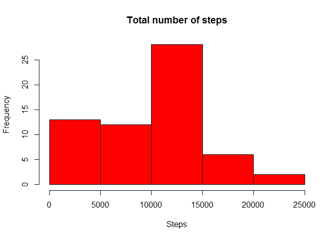
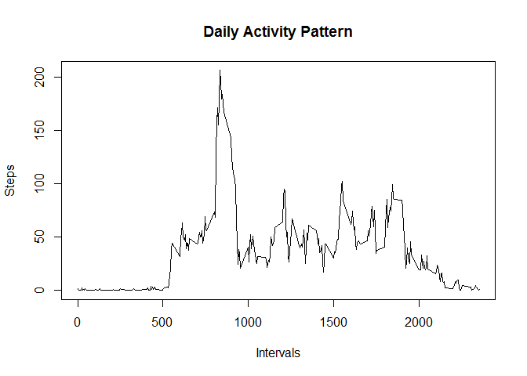
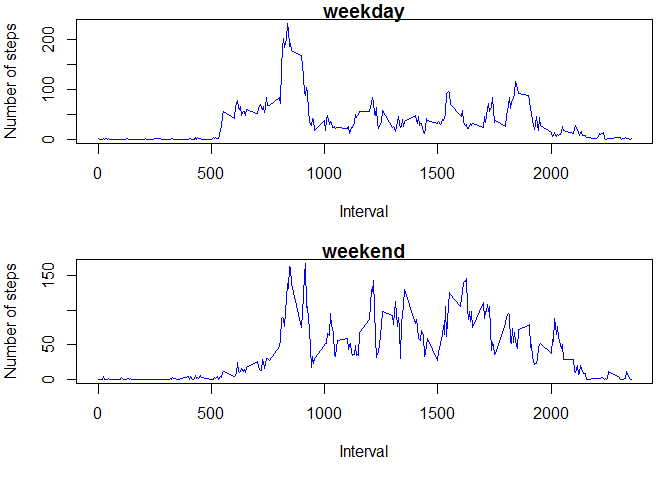

# Reproducible Research: Peer Assessment 1


## Loading and preprocessing the data
First I am loading the data in order to proceed with the analysis. I will also load the dplyr package that I am going to use for the analysis.  

```r
library(dplyr)
```

```
## 
## Attaching package: 'dplyr'
## 
## The following objects are masked from 'package:stats':
## 
##     filter, lag
## 
## The following objects are masked from 'package:base':
## 
##     intersect, setdiff, setequal, union
```

```r
data <- read.csv("./activity.csv", na.string="NA")
```


## What is mean total number of steps taken per day?
In order to calculate the total number of steps per day, I grouped the data by date and then made the appropriate calculations.  

```r
df1 <- data %>% group_by(date) %>% summarise(steps=sum(steps,na.rm=TRUE))
hist(df1$steps,col="red",main="Total number of steps",xlab="Steps")  
```

 

And then I calculated the mean and median of the steps taken per day.  

```r
mean(df1$steps)
```

```
## [1] 9354.23
```

```r
median(df1$steps)
```

```
## [1] 10395
```

## What is the average daily activity pattern?
I am grouping the data by interval in order to get the daily activity pattern based on the 5-minute intervals.  

```r
df2 <- data %>% group_by(interval) %>% summarise (steps=mean(steps,na.rm=TRUE))
plot(df2$interval,df2$steps,type="l",main="Daily Activity Pattern",xlab="Intervals",ylab="Steps")
```

 

The interval that contains the maximum number of steps across all days:

```r
df2$interval[df2$steps==max(df2$steps)]
```

```
## [1] 835
```
Which is the 5 minute interval between 8:35am and 8:40am.  

## Imputing missing values
In the analysis so far, I ignored the missing values. The number of missing values can be calculated:  

```r
sum(is.na(data))
```

```
## [1] 2304
```

```r
sum(is.na(data$steps))
```

```
## [1] 2304
```
We also notice that all of the missing values are from the "Steps" variable.    

I am going to replace the missing values with the average of that 5-minute interval. Then I will create a new dataset that is equal to the original one but with the missing data filled in.  

```r
newdata <- data %>% group_by(interval) %>% 
        mutate(steps=ifelse(is.na(steps), mean(steps,na.rm=TRUE), steps))
```
I am going to use that to create a new histogram of the total number of steps and calculate the mean and median of steps per day.


```r
df3 <- newdata %>% group_by(date) %>% summarise(steps=sum(steps))
hist(df3$steps,col="green",main="Total number of steps with no NAs",xlab="Steps")
```

 

```r
mean(df3$steps)
```

```
## [1] 10766.19
```

```r
median(df3$steps)
```

```
## [1] 10766.19
```
We notice that there are differences between these values and the estimates from the first part.  
First of all from the plots we see that in the new plot the distribution is more clearly a normal distribution than the previous one. Also after imputting the missing data, the mean and median are closer to the middle of the range of values for total step count. Generally we see that the variance is smaller.  


## Are there differences in activity patterns between weekdays and weekends?
I am adding one more variable that shows the day of the week for the respective date. After that, I am transforming that value to show whether that day is a weekday or weekend and in the end I save the variable as factor class.  

```r
newdata <- newdata %>% group_by(date) %>%
        mutate(day=weekdays(as.Date(date)))
newdata$day[newdata$day %in% c("Monday","Tuesday","Wednesday","Thursday","Friday")] <- "weekday"
newdata$day[newdata$day %in% c("Saturday","Sunday")] <- "weekend"
newdata$day <- as.factor(newdata$day)
```

Below are the plots of the activity patterns for the weekdays and weekends.  

```r
df4 <- newdata %>% group_by(day,interval) %>% 
        summarise (steps=mean(steps))
par(mfrow=c(2,1))
par(mar=c(5,4,1,1))
with(subset(df4,day=="weekday"), plot(interval,steps,type="l",col="blue",main="weekday",xlab="Interval",ylab="Number of steps"))
with(subset(df4,day=="weekend"), plot(interval,steps,type="l",col="blue",main="weekend",xlab="Interval",ylab="Number of steps"))
```

 

We see that the maximum number of steps one particular interval is higher on weekdays. At the same time, the number of steps is more evenly distributed in 5-minute intevals throughout the day during the weekend.  
