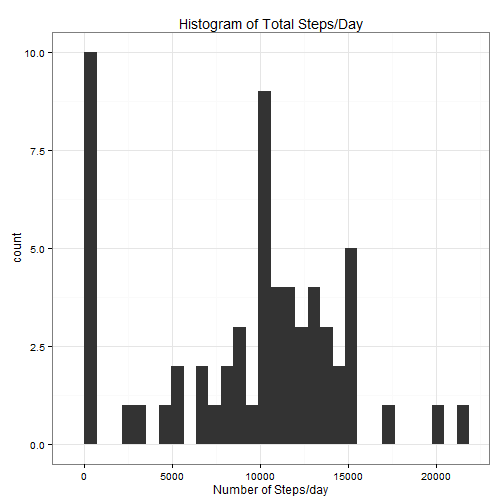
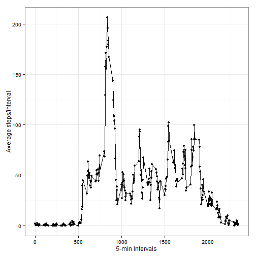
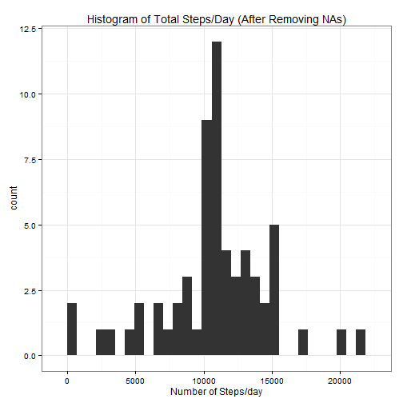
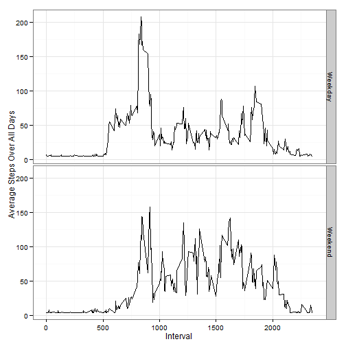

# This is a markdown script written in R for the "Reproducible Research" course assignment


The global setting for the markdown code:


##Loading and preprocessing the data
Loading the .csv file (please make sure the file is in the working directory):


```r
data_ <- read.csv("./activity.csv")
```


##What is mean total number of steps taken per day?
Calculating the mean total number of steps/day:

```r
## plotting the histogram of the total steps/day
library(ggplot2)
tot_stps_dy <- tapply(data_$steps, data_$date, sum, na.rm = TRUE)
qplot(tot_stps_dy, main = "Histogram of Total Steps/Day") + theme_bw() + labs(x = "Number of Steps/day")
```

```
## stat_bin: binwidth defaulted to range/30. Use 'binwidth = x' to adjust this.
```

 

```r

## calculating the mean and median of total steps/day
mean_steps <- mean(tot_stps_dy)
median_steps <- as.numeric(quantile(tot_stps_dy, 0.5))
```


The mean number of total steps per is: 9354.2295, and it's median is: 1.0395 &times; 10<sup>4</sup>.


## What is the average daily activity pattern?
Calculating the average steps over 5-min time intervals:

```r
## calculating the average number of steps/interval
int_ave <- aggregate(data_$steps, by = list(data_$interval), mean, na.rm = TRUE)
colnames(int_ave) = c("Interval", "Average_Steps_per_Interval")

## making a time series figure
library(ggplot2)
qplot(int_ave$Interval, int_ave$Average_Steps_per_Interval, type = "l") + geom_line() + 
    labs(x = "5-min Intervals", y = "Average steps/interval") + theme_bw()
```

 

```r

## finding the interval with maximum value
max_step_int <- int_ave[int_ave$Average_Steps_per_Interval == max(int_ave$Average_Steps_per_Interval), 
    ]
```


The interval 835 has the maximum average step over all days.

## Imputing missing values
Calculating the number of missing values, and recreating the data frame:

```r
## finding the number of missing values
missed_id = is.na(data_$steps)
missed_num <- sum(missed_id)

## creating a new dataset by replacing the missed (NA) values with mean steps
## at that day
data_2 <- data_
for (k in seq_len(length(missed_id))) {
    if (missed_id[k] == TRUE) {
        data_2[k, "steps"] = mean(data_2[data_2$date == data_2[k, "date"], "steps"], 
            na.rm = TRUE)
        ## if all of the steps in that day are NA or NaN replace it with total mean
        if (is.na(data_2[k, "steps"])) 
            data_2[k, "steps"] = mean(data_2$steps, na.rm = TRUE)
    }
}

## making a histogram of the total number of steps/day, and finding the mean
## and median values
tot_stps_dy_2 <- tapply(data_2$steps, data_2$date, sum)
library(ggplot2)
qplot(tot_stps_dy_2, main = "Histogram of Total Steps/Day (After Removing NAs)") + 
    theme_bw() + labs(x = "Number of Steps/day")
```

```
## stat_bin: binwidth defaulted to range/30. Use 'binwidth = x' to adjust this.
```

 


##Are there differences in activity patterns between weekdays and weekends?


```r
## spliting the table to weekday and weekend days
days_ <- weekdays(as.Date(data_2$date))
days_[days_ %in% c("Saturday", "Sunday")] = "Weekend"
days_[days_ %in% c("Monday", "Friday", "Tuesday", "Wednesday", "Thursday")] = "Weekday"
data_2$Weekdays = factor(days_)

## creating the time series plot
int_ave_2 <- aggregate(data_2$steps, by = list(data_2$interval, data_2$Weekdays), 
    mean)
colnames(int_ave_2) = c("interval", "Weekdays", "Ave_Stps")

library(ggplot2)
ggplot(int_ave_2, aes(interval, Ave_Stps)) + geom_line() + facet_grid(Weekdays ~ 
    .) + labs(x = "Interval", y = "Average Steps Over All Days") + theme_bw()
```

 


