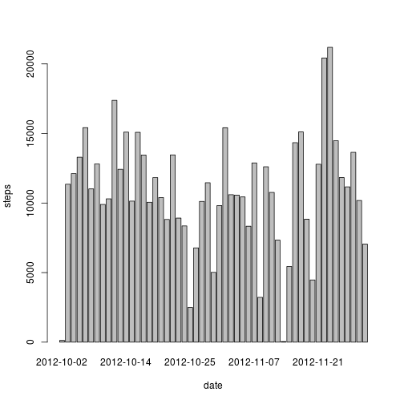

## Loading and preprocessing the data


```r
library(data.table)  # need the fread() package
dat <- fread("./activity.csv", sep = ",", na)  # read the acitivty.csv file
```

## What is mean total number of steps taken per day?

The histogram of daily steps taken

```r
steps <- tapply(dat$steps, dat$date, sum)  # daily steps taken

## Using base plotting
hist(steps, col = "black", xlab = "Steps per day", breaks = 50)
```

 

I now calculate the mean and media total number of steps taken per day:

```r
me <- mean(steps, na.rm = TRUE) # calculate mean excluding NA's
md <- median(steps, na.rm = TRUE)
```
The *mean total* is **1.0766 &times; 10<sup>4</sup>** steps taken per day.  
  
The *median total* is **10765** steps taken per day.

## What is the average daily activity pattern?


```r
library(plyr)  # we want to use "ddply" to calculate the mean of steps for a specific interval for all days 

means_interval_5 <- ddply(dat, "interval", summarise, mean(steps, na.rm = TRUE))
names(means_interval_5)[2] <- "means"

plot(type = "l", x = means_interval_5$interval, y = means_interval_5$means, xlab = "5 minute intervals", ylab = "mean of steps per interval per day", main = "Time series of number of steps taken", col = "red", lwd = 1.5)
```

 

We now find the 5-minute interval that has the maximum number of steps:

```r
max_mean_interval <- means_interval_5[which.max(means_interval_5$means), ]$interval
```
The interval with the maximum (averaged) number of steps is **835**

## Imputing missing values

Let's now try to figure out the number of rows containing NA values.
The easiest way to do this is  to differentiate the number of rows of the original data frame and the new data frame after ommitting the rows containing NA values:

```r
count_na <- nrow(dat) - nrow(na.omit(dat))
```
It turns out that there are **2304 rows containing NA's**.

I now replace all NA values with the mean of that particular 5-minute interval:

```r
## Are there differences in activity patterns between weekdays and weekends?
```
