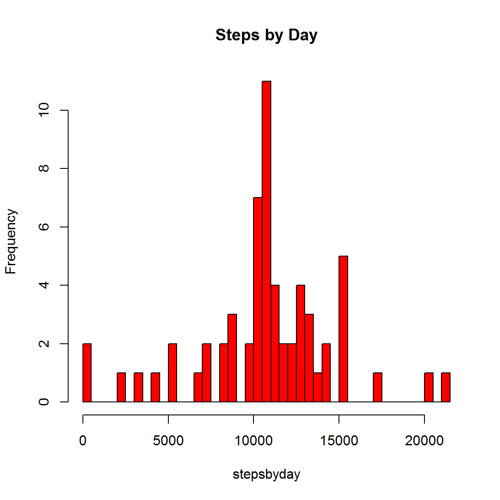
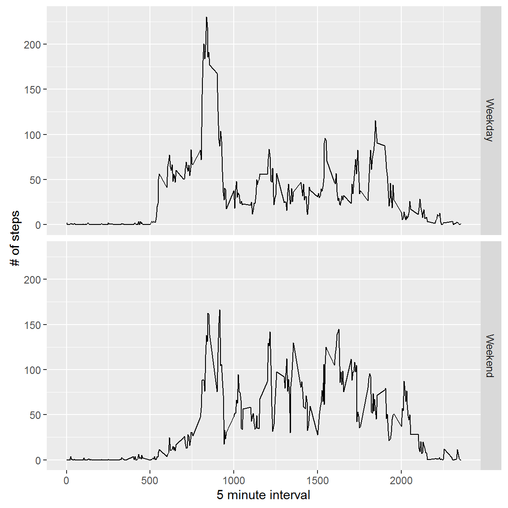

---
title: "Peer_Review"
author: "Rodney Waiters"
date: "September 22, 2016"
output:
  html_document
  fig_caption: yes
  
 ---


## The Assignment
This assignment will be described in multiple parts. You will need to write a report that answers the questions detailed below. Ultimately, you will need to complete the entire assignment in a single R markdown document that can be processed by knitr and be transformed into an HTML file.

Throughout your report make sure you always include the code that you used to generate the output you present. When writing code chunks in the R markdown document, always use echo = TRUE so that someone else will be able to read the code. This assignment will be evaluated via peer assessment so it is essential that your peer evaluators be able to review the code for your analysis.

For the plotting aspects of this assignment, feel free to use any plotting system in R (i.e., base, lattice, ggplot2)

Fork/clone the GitHub repository created for this assignment. You will submit this assignment by pushing your completed files into your forked repository on GitHub. The assignment submission will consist of the URL to your GitHub repository and the SHA-1 commit ID for your repository state.

NOTE: The GitHub repository also contains the dataset for the assignment so you do not have to download the data separately.

## Loading and preprocessing the data


```r
# Download the data
temp <- tempfile()
download.file("https://d396qusza40orc.cloudfront.net/repdata%2Fdata%2Factivity.zip", destfile = temp )
unzip(temp, "activity.csv")
data <- read.csv("activity.csv")
#Process/transform the data (if necessary) into a format suitable for your analysis
stepsbyday <- tapply(data$steps, data$date, FUN=sum, na.rm=TRUE)
```

## Make a histogram of steps taken each day


```r
hist(stepsbyday, breaks = 47,col = "blue",main = "Steps by Day")
```

<!-- -->

## Mean and Median number of steps taken each day


```r
# Mean and median number of steps taken each day
mean(stepsbyday, na.rm = TRUE)
```

```
## [1] 9354.23
```

```r
median(stepsbyday, na.rm = TRUE)
```

```
## [1] 10395
```

## Time series plot of the average number of steps taken (averaged across all days) versus the 5-minute intervals


```r
# Time series plot of the average number of steps taken
cleandata <- na.omit(data)

cleandata$date <- as.Date(cleandata$date)

averageintervals <- aggregate(steps ~ interval, data=cleandata, FUN = mean)

plot(averageintervals$interval, averageintervals$steps, type = "l", xlab = "5-minute interval", ylab = "average number of steps taken")
```

<!-- -->

```r
# The 5-minute interval that, on average, contains the maximum number of steps
averageintervals[which.max(averageintervals$steps),]
```

```
##     interval    steps
## 104      835 206.1698
```

## Imputing missing values


```r
baddata <- is.na(data$steps)

table(baddata)
```

```
## baddata
## FALSE  TRUE 
## 15264  2304
```

```r
missValue <- function(steps, interval) {
    newvalue <- NA
    if (!is.na(steps))
        newvalue <- c(steps)
    else
        newvalue <- (averageintervals[averageintervals$interval==interval, "steps"])
    return(newvalue)
}
alldata <- data

alldata$steps <- mapply(missValue, alldata$steps, alldata$interval)

stepsbyday <- tapply(alldata$steps, alldata$date, FUN=sum)

hist(stepsbyday, breaks = 47,col = "red",main = "Steps by Day")
```

<!-- -->

```r
# Mean and median number of steps taken each day
mean(stepsbyday)
```

```
## [1] 10766.19
```

```r
median(stepsbyday)
```

```
## [1] 10766.19
```

## Are there differences in activity patterns between weekdays and weekends?


```r
library(ggplot2)

weeksplit <- function(date) {
    daytype <- weekdays(date)
            if (daytype %in% c("Saturday", "Sunday"))
                  return("Weekend")
            else 
                  return("Weekday")
   }
alldata$date <- as.Date(alldata$date)

alldata$daytype <- sapply(alldata$date, FUN=weeksplit)

head(alldata)
```

```
##       steps       date interval daytype
## 1 1.7169811 2012-10-01        0 Weekday
## 2 0.3396226 2012-10-01        5 Weekday
## 3 0.1320755 2012-10-01       10 Weekday
## 4 0.1509434 2012-10-01       15 Weekday
## 5 0.0754717 2012-10-01       20 Weekday
## 6 2.0943396 2012-10-01       25 Weekday
```

```r
alldataavg <- aggregate(steps ~ interval + daytype, data=alldata, FUN =mean)

ggplot(alldataavg, aes(interval, steps)) + 
  geom_line() + facet_grid(daytype ~ .) +
  xlab("5 minute interval") +
  ylab("# of steps")
```

<!-- -->

##Session Information


```r
sessionInfo()
```

```
## R version 3.3.1 (2016-06-21)
## Platform: x86_64-w64-mingw32/x64 (64-bit)
## Running under: Windows 7 x64 (build 7601) Service Pack 1
## 
## locale:
## [1] LC_COLLATE=English_United States.1252 
## [2] LC_CTYPE=English_United States.1252   
## [3] LC_MONETARY=English_United States.1252
## [4] LC_NUMERIC=C                          
## [5] LC_TIME=English_United States.1252    
## 
## attached base packages:
## [1] stats     graphics  grDevices utils     datasets  methods   base     
## 
## other attached packages:
## [1] ggplot2_2.1.0
## 
## loaded via a namespace (and not attached):
##  [1] Rcpp_0.12.7      digest_0.6.10    plyr_1.8.4       grid_3.3.1      
##  [5] gtable_0.2.0     formatR_1.4      magrittr_1.5     evaluate_0.9    
##  [9] scales_0.4.0     stringi_1.1.1    reshape2_1.4.1   rmarkdown_1.0   
## [13] labeling_0.3     tools_3.3.1      stringr_1.1.0    munsell_0.4.3   
## [17] yaml_2.1.13      colorspace_1.2-6 htmltools_0.3.5  knitr_1.14
```
