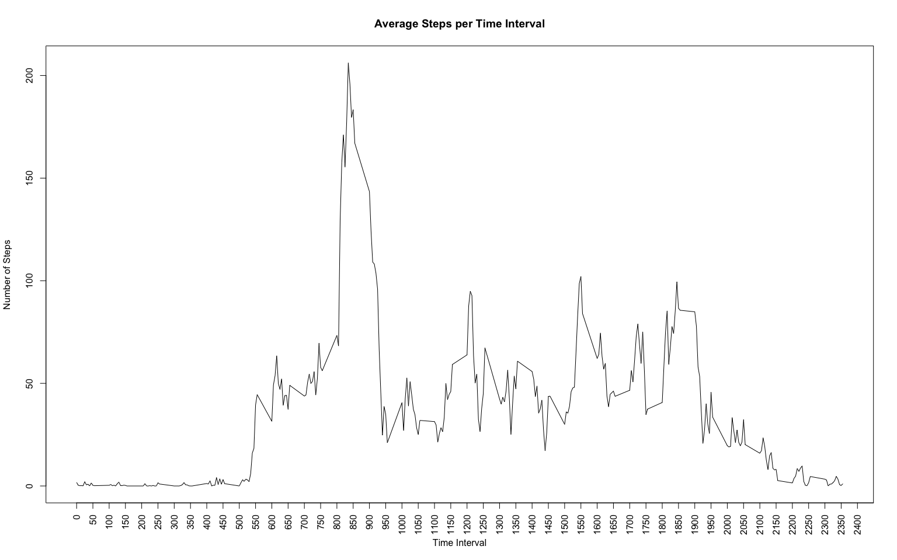
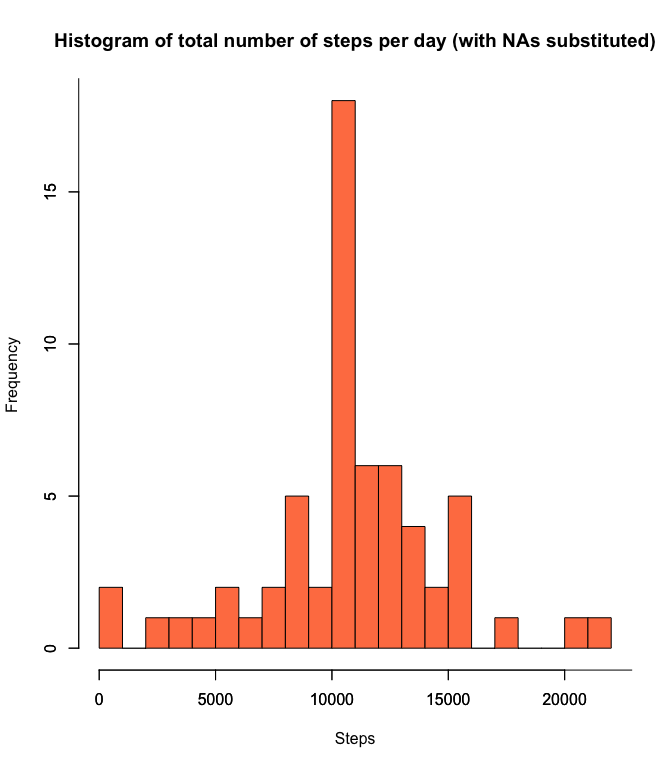
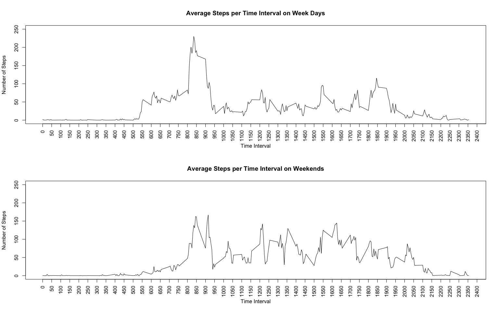

# Reproducible Research: Peer Assessment 1


## Purpose

This document details the analysis performed on data from a personal activity monitoring device. This device collected the number of steps taken at 5 minute intervals throughout the day during the months of October and November, 2012.


## 1. Loading and preprocessing the data

The activity data is read into a data frame using the following code. To aid understanding, a summary of the datset is given showing the three variables: steps, date and interval.

```r
data <- read.table(unz("activity.zip", "activity.csv"), header=T, sep=",")
data$date <- as.Date(data$date, format = "%Y-%m-%d")
summary(data)
```

```
##      steps             date               interval     
##  Min.   :  0.00   Min.   :2012-10-01   Min.   :   0.0  
##  1st Qu.:  0.00   1st Qu.:2012-10-16   1st Qu.: 588.8  
##  Median :  0.00   Median :2012-10-31   Median :1177.5  
##  Mean   : 37.38   Mean   :2012-10-31   Mean   :1177.5  
##  3rd Qu.: 12.00   3rd Qu.:2012-11-15   3rd Qu.:1766.2  
##  Max.   :806.00   Max.   :2012-11-30   Max.   :2355.0  
##  NA's   :2304
```


## 2. What is mean total number of steps taken per day?
The total number of steps per day are then calculated and the results are plotted using a histogram, followed by the calculation of the mean and median. 


```r
library("plyr")
stepsPerDay<-ddply(data, ~date, summarise, totSteps = sum(steps, na.rm = TRUE))

hist(stepsPerDay$totSteps,
     main="Histogram of total number of steps per day",
     ylab="Frequency",
     xlab="Steps",
     col="coral",
     breaks=20)
axis(1, at=seq(0,30000,by=5000))
```

 

```r
meanSteps <- mean(stepsPerDay$totSteps, na.rm = TRUE)
medianSteps <- median(stepsPerDay$totSteps, na.rm = TRUE)
```


The mean of the total number of steps taken per day is **``9354.2295082``** and the median is **``10395``**


## 3. What is the average daily activity pattern?

The average steps per time interval across all days is calculated and plotted using the code shown below. 


```r
avgStepsPerInt<-aggregate(cbind(steps) ~ interval, data = data, FUN = mean, na.rm = TRUE)
high<-which.max(avgStepsPerInt$steps)
highInt<-avgStepsPerInt[high,]$interval
plot(avgStepsPerInt$interval, avgStepsPerInt$steps, type="l", xlab="Time Interval", ylab="Number of Steps",xaxt="n")
     title ("Average Steps per Time Interval")
     axis(1, at = seq(0, 2600, by = 50), las=2)
```

 


From the plot one can see that  interval **835** contains the maximum number of steps.


## 4. Imputing missing values


```r
numNA<-length(which(is.na(data)))
```

From the code above we can establish that there are **``2304``** intervals without a value. The presence of missing values may introduce bias into some calculations or summaries of the data. To overcome this issue a strategy of substituting (imputing) the mean value of the resepctive interval for the missing values, has been adopted by way of the following code.


```r
mergedData<-merge(data, avgStepsPerInt, by="interval")
NARows <- is.na(mergedData$steps.x)
mergedData$steps.x[NARows] <- mergedData$steps.y[NARows]
```

With the NA values substituted, the analysis detailed in section 2 is replayed show the effect of missing values within the data set. 


```r
# stepsPerDay<-aggregate(cbind(steps.x) ~ date, data = mergedData, FUN = sum, na.rm = TRUE)
options(scipen=99999)
stepsPerDay<-ddply(mergedData,~date,summarise,totSteps=sum(steps.x,na.rm=TRUE))

meanSteps <- mean(stepsPerDay$totSteps, na.rm = TRUE)
medianSteps <- median(stepsPerDay$totSteps, na.rm = TRUE)

hist(stepsPerDay$totSteps,
     main="Histogram of total number of steps per day (with NAs substituted)",
     ylab="Frequency",
     xlab="Steps",
     col="coral",
     breaks=20)
axis(1, at=seq(0,30000,by=5000))
axis(2, at=seq(0,20,by=5))
```

 

The mean  and median of the total number of steps taken per day has increased as a result of the imputing to  **``10766.1886792``** and **``10766.1886792``** respectively

## 5. Are there differences in activity patterns between weekdays and weekends?

Averages per interval for both week days and weekend were calculated using the code below. These avearages were then plot alongside each other to show the differences in activity patterns between them.


```r
# --- Convert date variable to date format
suppressPackageStartupMessages(library(timeDate))
mergedData$date <- as.POSIXct(strptime(mergedData$date, "%Y-%m-%d",tz = "GMT"))

# --- add new column signifying weekday(TRUE) or weekend(FALSE)
mergedData["weekday"]<- isWeekday(mergedData$date)

# --- Calc average per interval/day type (weekday/weekend)
avgStepsPerInt<-aggregate(cbind(steps.x) ~ weekday+interval, data = mergedData, FUN = mean, na.rm = TRUE)
weekDayData<-subset(avgStepsPerInt,avgStepsPerInt$weekday==TRUE)
weekEndData<-subset(avgStepsPerInt,avgStepsPerInt$weekday==FALSE)

# --- Plot the difference between weekday and weekend steps
par(mfrow=c(2,1))
plot(weekDayData$interval, weekDayData$steps, type="l", xlab="Time Interval", ylab="Number of Steps",xaxt="n",
ylim=range(0:250))
title ("Average Steps per Time Interval on Week Days")
axis(1, at = seq(0, 2600, by = 50), las=2)
plot(weekEndData$interval, weekEndData$steps, type="l", xlab="Time Interval", ylab="Number of Steps",xaxt="n",
     ylim=range(0:250))
title ("Average Steps per Time Interval on Weekends")
axis(1, at = seq(0, 2600, by = 50), las=2)
```

 
