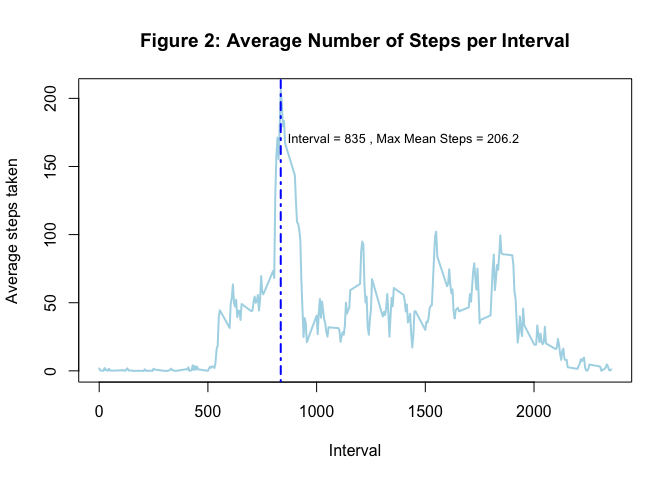
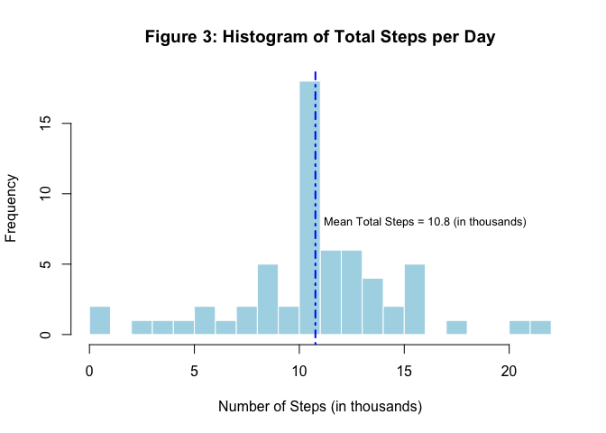
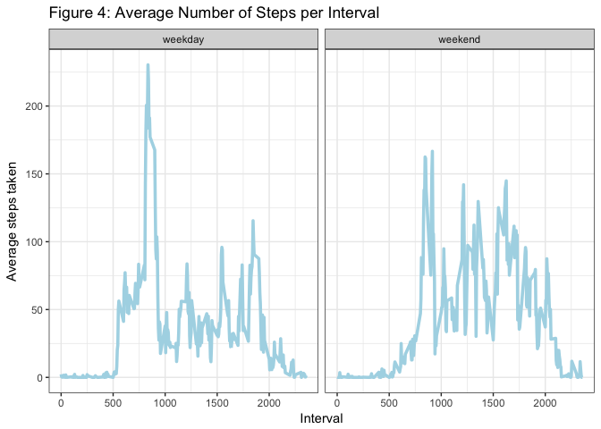

# Reproducible Research: Peer Assessment 1
Alejandro  


## Loading and preprocessing the data
Load the necessary R packages.

```r
library(dplyr)
```

```
## 
## Attaching package: 'dplyr'
```

```
## The following objects are masked from 'package:stats':
## 
##     filter, lag
```

```
## The following objects are masked from 'package:base':
## 
##     intersect, setdiff, setequal, union
```

```r
library(knitr)
library(xtable)
library(ggplot2)
```

### 1. Load data from zipfile.

```r
zip_file = unzip("activity.zip")
dat = read.csv(zip_file)
```

### 2. Transfrom data for analysis.

```r
dat = transform(dat, date = as.Date(date))
```

## What is mean total number of steps taken per day?
Compute total and average numbers of steps per day using *group_by()* and *summarize()* functions from *dplyr* package.

```r
dat2 = group_by(dat, date)
steps.by.day = summarise(dat2, 
                              total.steps = sum(steps) / 1000,
                                mean.steps = mean(steps, na.rm = TRUE),
                                median.steps = median(steps, na.rm = TRUE))
```
### 1. Make a histogram of the total number of steps by day

```r
with(steps.by.day, {
        hist(total.steps, breaks = 30, col = "light blue",
                        border = "white", 
                        main = "Figure 1: Histogram of Total Steps per Day",
                        xlab = "Number of Steps (in thousands)")
        abline(v = mean(total.steps, na.rm = T), col = "blue", lwd = 2,
               lty = 4)
        text(16, 8, 
             labels = paste("Mean Total Steps =",
                                   mean(total.steps, na.rm = T) %>%
                                           round(1),
                                   "(in thousands)"),
             cex = 0.8)
})
```

<!-- -->

### 2. Create a table to report the mean, median, and total number of steps taken per day

```r
steps.by.day %>% 
        kable(digits = 2, 
              caption = "Table 1. Steps taken per day",
              type = "html") %>%
        print
```


Table: Table 1. Steps taken per day

date          total.steps   mean.steps   median.steps
-----------  ------------  -----------  -------------
2012-10-01             NA          NaN             NA
2012-10-02           0.13         0.44              0
2012-10-03          11.35        39.42              0
2012-10-04          12.12        42.07              0
2012-10-05          13.29        46.16              0
2012-10-06          15.42        53.54              0
2012-10-07          11.02        38.25              0
2012-10-08             NA          NaN             NA
2012-10-09          12.81        44.48              0
2012-10-10           9.90        34.38              0
2012-10-11          10.30        35.78              0
2012-10-12          17.38        60.35              0
2012-10-13          12.43        43.15              0
2012-10-14          15.10        52.42              0
2012-10-15          10.14        35.20              0
2012-10-16          15.08        52.38              0
2012-10-17          13.45        46.71              0
2012-10-18          10.06        34.92              0
2012-10-19          11.83        41.07              0
2012-10-20          10.39        36.09              0
2012-10-21           8.82        30.63              0
2012-10-22          13.46        46.74              0
2012-10-23           8.92        30.97              0
2012-10-24           8.36        29.01              0
2012-10-25           2.49         8.65              0
2012-10-26           6.78        23.53              0
2012-10-27          10.12        35.14              0
2012-10-28          11.46        39.78              0
2012-10-29           5.02        17.42              0
2012-10-30           9.82        34.09              0
2012-10-31          15.41        53.52              0
2012-11-01             NA          NaN             NA
2012-11-02          10.60        36.81              0
2012-11-03          10.57        36.70              0
2012-11-04             NA          NaN             NA
2012-11-05          10.44        36.25              0
2012-11-06           8.33        28.94              0
2012-11-07          12.88        44.73              0
2012-11-08           3.22        11.18              0
2012-11-09             NA          NaN             NA
2012-11-10             NA          NaN             NA
2012-11-11          12.61        43.78              0
2012-11-12          10.77        37.38              0
2012-11-13           7.34        25.47              0
2012-11-14             NA          NaN             NA
2012-11-15           0.04         0.14              0
2012-11-16           5.44        18.89              0
2012-11-17          14.34        49.79              0
2012-11-18          15.11        52.47              0
2012-11-19           8.84        30.70              0
2012-11-20           4.47        15.53              0
2012-11-21          12.79        44.40              0
2012-11-22          20.43        70.93              0
2012-11-23          21.19        73.59              0
2012-11-24          14.48        50.27              0
2012-11-25          11.83        41.09              0
2012-11-26          11.16        38.76              0
2012-11-27          13.65        47.38              0
2012-11-28          10.18        35.36              0
2012-11-29           7.05        24.47              0
2012-11-30             NA          NaN             NA

```r
steps.by.day %>%
        xtable(digits = 2, 
              caption = "Table 1. Steps taken per day",
              type = "html") %>%
        print
```

% latex table generated in R 3.4.1 by xtable 1.8-2 package
% Sat Sep  9 14:24:59 2017
\begin{table}[ht]
\centering
\begin{tabular}{rrrrr}
  \hline
 & date & total.steps & mean.steps & median.steps \\ 
  \hline
1 & 15614.00 &  &  &  \\ 
  2 & 15615.00 & 0.13 & 0.44 & 0.00 \\ 
  3 & 15616.00 & 11.35 & 39.42 & 0.00 \\ 
  4 & 15617.00 & 12.12 & 42.07 & 0.00 \\ 
  5 & 15618.00 & 13.29 & 46.16 & 0.00 \\ 
  6 & 15619.00 & 15.42 & 53.54 & 0.00 \\ 
  7 & 15620.00 & 11.02 & 38.25 & 0.00 \\ 
  8 & 15621.00 &  &  &  \\ 
  9 & 15622.00 & 12.81 & 44.48 & 0.00 \\ 
  10 & 15623.00 & 9.90 & 34.38 & 0.00 \\ 
  11 & 15624.00 & 10.30 & 35.78 & 0.00 \\ 
  12 & 15625.00 & 17.38 & 60.35 & 0.00 \\ 
  13 & 15626.00 & 12.43 & 43.15 & 0.00 \\ 
  14 & 15627.00 & 15.10 & 52.42 & 0.00 \\ 
  15 & 15628.00 & 10.14 & 35.20 & 0.00 \\ 
  16 & 15629.00 & 15.08 & 52.38 & 0.00 \\ 
  17 & 15630.00 & 13.45 & 46.71 & 0.00 \\ 
  18 & 15631.00 & 10.06 & 34.92 & 0.00 \\ 
  19 & 15632.00 & 11.83 & 41.07 & 0.00 \\ 
  20 & 15633.00 & 10.39 & 36.09 & 0.00 \\ 
  21 & 15634.00 & 8.82 & 30.63 & 0.00 \\ 
  22 & 15635.00 & 13.46 & 46.74 & 0.00 \\ 
  23 & 15636.00 & 8.92 & 30.97 & 0.00 \\ 
  24 & 15637.00 & 8.36 & 29.01 & 0.00 \\ 
  25 & 15638.00 & 2.49 & 8.65 & 0.00 \\ 
  26 & 15639.00 & 6.78 & 23.53 & 0.00 \\ 
  27 & 15640.00 & 10.12 & 35.14 & 0.00 \\ 
  28 & 15641.00 & 11.46 & 39.78 & 0.00 \\ 
  29 & 15642.00 & 5.02 & 17.42 & 0.00 \\ 
  30 & 15643.00 & 9.82 & 34.09 & 0.00 \\ 
  31 & 15644.00 & 15.41 & 53.52 & 0.00 \\ 
  32 & 15645.00 &  &  &  \\ 
  33 & 15646.00 & 10.60 & 36.81 & 0.00 \\ 
  34 & 15647.00 & 10.57 & 36.70 & 0.00 \\ 
  35 & 15648.00 &  &  &  \\ 
  36 & 15649.00 & 10.44 & 36.25 & 0.00 \\ 
  37 & 15650.00 & 8.33 & 28.94 & 0.00 \\ 
  38 & 15651.00 & 12.88 & 44.73 & 0.00 \\ 
  39 & 15652.00 & 3.22 & 11.18 & 0.00 \\ 
  40 & 15653.00 &  &  &  \\ 
  41 & 15654.00 &  &  &  \\ 
  42 & 15655.00 & 12.61 & 43.78 & 0.00 \\ 
  43 & 15656.00 & 10.77 & 37.38 & 0.00 \\ 
  44 & 15657.00 & 7.34 & 25.47 & 0.00 \\ 
  45 & 15658.00 &  &  &  \\ 
  46 & 15659.00 & 0.04 & 0.14 & 0.00 \\ 
  47 & 15660.00 & 5.44 & 18.89 & 0.00 \\ 
  48 & 15661.00 & 14.34 & 49.79 & 0.00 \\ 
  49 & 15662.00 & 15.11 & 52.47 & 0.00 \\ 
  50 & 15663.00 & 8.84 & 30.70 & 0.00 \\ 
  51 & 15664.00 & 4.47 & 15.53 & 0.00 \\ 
  52 & 15665.00 & 12.79 & 44.40 & 0.00 \\ 
  53 & 15666.00 & 20.43 & 70.93 & 0.00 \\ 
  54 & 15667.00 & 21.19 & 73.59 & 0.00 \\ 
  55 & 15668.00 & 14.48 & 50.27 & 0.00 \\ 
  56 & 15669.00 & 11.83 & 41.09 & 0.00 \\ 
  57 & 15670.00 & 11.16 & 38.76 & 0.00 \\ 
  58 & 15671.00 & 13.65 & 47.38 & 0.00 \\ 
  59 & 15672.00 & 10.18 & 35.36 & 0.00 \\ 
  60 & 15673.00 & 7.05 & 24.47 & 0.00 \\ 
  61 & 15674.00 &  &  &  \\ 
   \hline
\end{tabular}
\caption{Table 1. Steps taken per day} 
\end{table}

## What is the average daily activity pattern?
### 1. Time series plot of daily average per 5-min intervals

```r
dat3 = group_by(dat, interval)
steps.by.interval = summarise(dat3, mean.steps = mean(steps, na.rm = TRUE))
with(steps.by.interval, {
        plot(y = mean.steps, x = dat3$interval %>% unique,
             type = "l", col = "light blue", lwd = 2,
             main = "Figure 2: Average Number of Steps per Interval",
             xlab = "Interval",
             ylab = "Average steps taken")
        abline(v = dat3$interval[which.max(mean.steps)], 
               col = "blue", lwd = 2, lty = 4)
        text(1400, 170, 
             labels = paste("Interval =",
                                   dat3$interval[which.max(mean.steps)],
                            ", Max Mean Steps =", max(mean.steps) %>%
                                    round(1)),
             cex = 0.8)
})
```

<!-- -->

### 2. Maximum 5-min mean steps interval

```r
cat("Interval =",
        dat3$interval[which.max(steps.by.interval$mean.steps)])
```

```
## Interval = 835
```

```r
cat("Max mean steps =",
        max(steps.by.interval$mean.steps))
```

```
## Max mean steps = 206.1698
```

## Imputing missing values

### 1. Total missing values in data set

```r
apply(dat, 2, function(x) is.na(x) %>% sum) 
```

```
##    steps     date interval 
##     2304        0        0
```

### 2. Filling in missing values using 5-min daily average

```r
dat4 = merge(dat, steps.by.interval, by = "interval")
head(dat4)
```

```
##   interval steps       date mean.steps
## 1        0    NA 2012-10-01   1.716981
## 2        0     0 2012-11-23   1.716981
## 3        0     0 2012-10-28   1.716981
## 4        0     0 2012-11-06   1.716981
## 5        0     0 2012-11-24   1.716981
## 6        0     0 2012-11-15   1.716981
```

### 3. Create new dataset equal to original dataset with missing data filled in

```r
dat4 = transmute(dat4, steps = ifelse(is.na(steps), mean.steps, steps),
                 date = date, interval = interval)
dat4 = dat4[order(dat4$date),]
head(dat4)
```

```
##         steps       date interval
## 1   1.7169811 2012-10-01        0
## 63  0.3396226 2012-10-01        5
## 128 0.1320755 2012-10-01       10
## 205 0.1509434 2012-10-01       15
## 264 0.0754717 2012-10-01       20
## 327 2.0943396 2012-10-01       25
```

```r
apply(dat4, 2, function(x) is.na(x) %>% sum)
```

```
##    steps     date interval 
##        0        0        0
```

### 4. Histogram of total number of steps

```r
dat5 = group_by(dat4, date)
steps.by.day = summarise(dat5, 
                              total.steps = sum(steps) / 1000,
                                mean.steps = mean(steps, na.rm = TRUE),
                                median.steps = median(steps, na.rm = TRUE))
with(steps.by.day, {
        hist(total.steps, breaks = 30, col = "light blue",
                        border = "white", 
                        main = "Figure 3: Histogram of Total Steps per Day",
                        xlab = "Number of Steps (in thousands)")
        abline(v = mean(total.steps, na.rm = T), col = "blue", lwd = 2,
               lty = 4)
        text(16, 8, 
             labels = paste("Mean Total Steps =",
                                   mean(total.steps, na.rm = T) %>%
                                           round(1),
                                   "(in thousands)"),
             cex = 0.8)
})
```

<!-- -->

Mean and median number of steps taken per day

```r
steps.by.day %>% 
        kable(digits = 2, caption = "Table 2. Steps taken per day") %>%
        print
```


Table: Table 2. Steps taken per day

date          total.steps   mean.steps   median.steps
-----------  ------------  -----------  -------------
2012-10-01          10.77        37.38          34.11
2012-10-02           0.13         0.44           0.00
2012-10-03          11.35        39.42           0.00
2012-10-04          12.12        42.07           0.00
2012-10-05          13.29        46.16           0.00
2012-10-06          15.42        53.54           0.00
2012-10-07          11.02        38.25           0.00
2012-10-08          10.77        37.38          34.11
2012-10-09          12.81        44.48           0.00
2012-10-10           9.90        34.38           0.00
2012-10-11          10.30        35.78           0.00
2012-10-12          17.38        60.35           0.00
2012-10-13          12.43        43.15           0.00
2012-10-14          15.10        52.42           0.00
2012-10-15          10.14        35.20           0.00
2012-10-16          15.08        52.38           0.00
2012-10-17          13.45        46.71           0.00
2012-10-18          10.06        34.92           0.00
2012-10-19          11.83        41.07           0.00
2012-10-20          10.39        36.09           0.00
2012-10-21           8.82        30.63           0.00
2012-10-22          13.46        46.74           0.00
2012-10-23           8.92        30.97           0.00
2012-10-24           8.36        29.01           0.00
2012-10-25           2.49         8.65           0.00
2012-10-26           6.78        23.53           0.00
2012-10-27          10.12        35.14           0.00
2012-10-28          11.46        39.78           0.00
2012-10-29           5.02        17.42           0.00
2012-10-30           9.82        34.09           0.00
2012-10-31          15.41        53.52           0.00
2012-11-01          10.77        37.38          34.11
2012-11-02          10.60        36.81           0.00
2012-11-03          10.57        36.70           0.00
2012-11-04          10.77        37.38          34.11
2012-11-05          10.44        36.25           0.00
2012-11-06           8.33        28.94           0.00
2012-11-07          12.88        44.73           0.00
2012-11-08           3.22        11.18           0.00
2012-11-09          10.77        37.38          34.11
2012-11-10          10.77        37.38          34.11
2012-11-11          12.61        43.78           0.00
2012-11-12          10.77        37.38           0.00
2012-11-13           7.34        25.47           0.00
2012-11-14          10.77        37.38          34.11
2012-11-15           0.04         0.14           0.00
2012-11-16           5.44        18.89           0.00
2012-11-17          14.34        49.79           0.00
2012-11-18          15.11        52.47           0.00
2012-11-19           8.84        30.70           0.00
2012-11-20           4.47        15.53           0.00
2012-11-21          12.79        44.40           0.00
2012-11-22          20.43        70.93           0.00
2012-11-23          21.19        73.59           0.00
2012-11-24          14.48        50.27           0.00
2012-11-25          11.83        41.09           0.00
2012-11-26          11.16        38.76           0.00
2012-11-27          13.65        47.38           0.00
2012-11-28          10.18        35.36           0.00
2012-11-29           7.05        24.47           0.00
2012-11-30          10.77        37.38          34.11

#### Comparing new and original datasets
Values from the new dataset (with no missing values) differ from the original (with missing values) in that the variability has been reduced.

## Are there differences in activity patterns between weekdays and weekends?
### 1. Create a new factor variable indicating week and weekdays

```r
dat6 = mutate(dat4, weekday = ifelse(weekdays(date) == "Saturday" |
                              weekdays(date) == "Sunday", 
                              "weekend",
                              "weekday"))
```

### 2. Panel plot of daily average 5-min interval by weekday

```r
dat7 = group_by(dat6, weekday, interval)
steps.by.interval = summarise(dat7, mean.steps = mean(steps, na.rm = TRUE))
p = ggplot(data = steps.by.interval,
           aes(y = mean.steps, 
               x = interval,
               group = weekday, color = weekday)
)
p + geom_line(color = "light blue", lwd = 1.25) + 
        facet_grid(. ~ weekday) + theme_bw() +
        ggtitle("Figure 4: Average Number of Steps per Interval") +
        labs(x = "Interval",
             y = "Average steps taken")
```

<!-- -->
