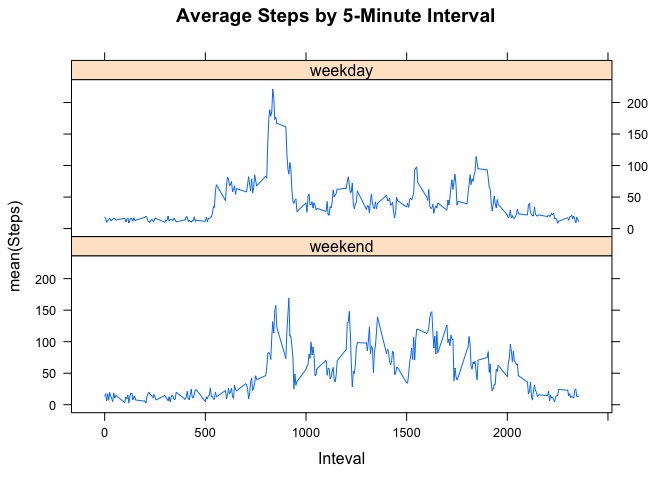

# Reproducible Research: Peer Assessment 1

## Loading and preprocessing the data
Here is where I load the data.

```r
library(knitr)
library(ggplot2)
library(lubridate)
```

```
## 
## Attaching package: 'lubridate'
```

```
## The following object is masked from 'package:base':
## 
##     date
```

```r
library(lattice)
dados <- read.csv("activity.csv")
```

## What is mean total number of steps taken per day?
Plotting Histogram  

```r
passosOctNov <- aggregate(steps ~ date, dados, sum)
hist(passosOctNov$steps, breaks = length(passosOctNov$date), main = "Histogrma de Passos por Dia", xlab = "Passos", ylab = "Frequencia")
```

<!-- -->

Calculating mean and median

```r
meanSteps <- format(mean(passosOctNov$steps, na.rm = TRUE), digits = 7, nsmall = 2)
medianSteps <- median(passosOctNov$steps, na.rm = TRUE)
```
The mean of steps is 10766.19 and the median of steps is 10765 


## What is the average daily activity pattern?
Plotting time serie

```r
passosInt <- aggregate(dados$steps ~ dados$interval, dados, mean)

graf <- ggplot(data = passosInt, aes(x=passosInt$`dados$interval`, y=passosInt$`dados$steps`))

graf <- graf + geom_line() + geom_point(color = "red")

graf <- graf + labs(title = "Time Serie 5-Minute Interval - Average Steps", x = "Interval" , y = "Average Steps")

print(graf)
```

<!-- -->


```r
maximo <- passosInt[which.max(passosInt$`dados$steps`), 1]
```

The 5-Minute interval with the maximum number of steps is 835.


## Imputing missing values
Calculating NA values

```r
dadosNA <- dados[is.na(dados), ]
tamanhoDadosNA <- dim(dadosNA)
```
Total NA values in dataset is 2304.

Replacing NA values with random values between range of passosOctNov$steps and creating a new dataset that is equal to the original but with the repalced values:

```r
limites <- range(passosOctNov$steps)
numeros <- sample(0:200, tamanhoDadosNA[1], replace = TRUE)
dados$steps[which(is.na(dados$steps))] <- numeros
```

New histogram:

```r
passosOctNov2 <- aggregate(steps ~ date, dados, sum)
hist(passosOctNov2$steps, breaks = length(passosOctNov2$date), main = "Histogrma de Passos por Dia", xlab = "Passos", ylab = "Frequencia")
```

<!-- -->

Calculating mean and median

```r
meanSteps2 <- format(mean(passosOctNov2$steps, na.rm = TRUE), digits = 7, nsmall = 2)
medianSteps2 <- median(passosOctNov2$steps, na.rm = TRUE)
```
The mean of steps is 13127.62 and the median of steps is 11458

We can observe an increase in media and median values by adding sample values replacing NA's.

## Are there differences in activity patterns between weekdays and weekends?
First, we declare a function **tipoDia** which categorize weekdays in "weekend" or "weekday":

```r
tipoDia <- function(dia){
        if (wday(dia) %in% c(1,7)){
                resultado <- 0
        } else {
                resultado <- 1
        }
        
        resultado
}
```

After that, we insert a new field called dayType in dataset:

```r
passosInt <- aggregate(dados$steps ~ dados$interval, dados, mean)
dados$dayType <- sapply(dados$date, tipoDia)
```

Then, we make a new dataset which will be used for plot:

```r
passosTipoDia <- aggregate(dados$steps ~ dados$interval + dados$dayType, dados, mean)
```

Factor variable called **fatores** 

```r
fatores <- factor(passosTipoDia$`dados$dayType`, labels = c("weekend", "weekday"))
```

At least, we plot the time series:

```r
xyplot(passosTipoDia$`dados$steps`~ passosTipoDia$`dados$interval` | fatores, type = "l", layout = c(1,2), main = "Average Steps by 5-Minute Interval", xlab = "Inteval", ylab = "mean(Steps)")
```

<!-- -->

