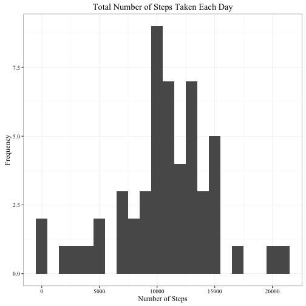
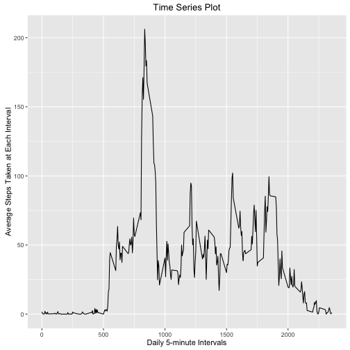
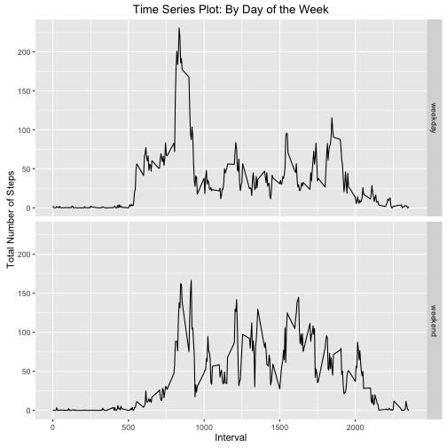

Reproducible Research Assignment #1
===================================


### Loading and preprocessing data
1. Load the data

```r
activity_file <- "https://d396qusza40orc.cloudfront.net/repdata%2Fdata%2Factivity.zip"
if (!file.exists("~/Desktop/activity.csv")) {
      download.file(activity_file, destfile = "~/Desktop/activity.zip", method = "curl")
      unzip(zipfile = "~/Desktop/activity.zip")
}
activity_data <- read.csv("~/Desktop/activity.csv")
```

- Load applicable libraries

```r
library(ggplot2)
library(dplyr)
```


2. Process/transform the data (if necessary) into a format suitable for your analysis

```r
index <- complete.cases(activity_data)
activity_data2 <- activity_data[index, ]
```


### What is the mean total number of steps taken per day?

1. Calculate the total number of steps taken per day

```r
number_steps <- with(activity_data2, aggregate(steps, by = list(date), sum))
```


2. If you do not understand the difference between a histogram and a barplot, research the difference between them. Make a histogram of the total number of steps taken each day

```r
qplot(x, data = number_steps, binwidth = 1000) +
      labs(title = "Total Number of Steps Taken Each Day", x = "Number of Steps", y = "Frequency") +
      theme_bw(base_family = "Times New Roman")
```




3. Calculate and report the mean and median of the total number of steps taken per day

```r
summary(number_steps)
```

```
##        Group.1         x        
##  2012-10-02: 1   Min.   :   41  
##  2012-10-03: 1   1st Qu.: 8841  
##  2012-10-04: 1   Median :10765  
##  2012-10-05: 1   Mean   :10766  
##  2012-10-06: 1   3rd Qu.:13294  
##  2012-10-07: 1   Max.   :21194  
##  (Other)   :47
```


### What is the average daily activity pattern?

1. Make a time series plot (i.e. 𝚝𝚢𝚙𝚎 = "𝚕") of the 5-minute interval (x-axis) and the average number of steps taken, averaged across all days (y-axis)

```r
ave_steps <- with(activity_data2, aggregate(steps, by = list(interval), mean))
ave_steps <- ave_steps %>%
      rename(Interval = Group.1, Daily_Average = x)
ggplot(ave_steps, aes(Interval, Daily_Average)) +
      geom_line() +
      labs(title = "Time Series Plot", x = "Daily 5-minute Intervals", y = "Average Steps Taken at Each Interval")
```




2. Which 5-minute interval, on average across all the days in the dataset, contains the maximum number of steps?

```r
order <- order(ave_steps$Daily_Average, decreasing = TRUE)
ave_steps[order[1],]
```

```
##     Interval Daily_Average
## 104      835      206.1698
```


### Imputing missing values

Note: There are a number of days/intervals where there are missing values (coded as 𝙽𝙰). The presence of missing days may introduce bias into some calculations or summaries of the data.


1. Calculate and report the total number of missing values in the dataset (i.e. the total number of rows with 𝙽𝙰s)

```r
sum(is.na(activity_data$steps))
```

```
## [1] 2304
```


2. Devise a strategy for filling in all of the missing values in the dataset. The strategy does not need to be sophisticated. For example, you could use the mean/median for that day, or the mean for that 5-minute interval, etc.

```r
activity_data3 <- activity_data
mean_interval <- with(activity_data3, aggregate(steps, by = list(interval), mean, na.rm = TRUE))
```


3. Create a new dataset that is equal to the original dataset but with the missing data filled in.
- As can be seen, missing values are present

```r
head(activity_data3)
```

```
##   steps       date interval
## 1    NA 2012-10-01        0
## 2    NA 2012-10-01        5
## 3    NA 2012-10-01       10
## 4    NA 2012-10-01       15
## 5    NA 2012-10-01       20
## 6    NA 2012-10-01       25
```


```r
c <- 1
for (cell in activity_data3$steps) {
      if (is.na(cell)) {
            n <- 1
            for (num in mean_interval$Group.1) {
                  if (identical(num, activity_data3$interval[c])) {
                        activity_data3$steps[c] <- mean_interval$x[n]
                  }
                  n <- n + 1
            }
      }
      c <- c + 1
}
```
- Now, those missing values have been replaced with the average of steps for that time interval

```r
head(activity_data3)
```

```
##       steps       date interval
## 1 1.7169811 2012-10-01        0
## 2 0.3396226 2012-10-01        5
## 3 0.1320755 2012-10-01       10
## 4 0.1509434 2012-10-01       15
## 5 0.0754717 2012-10-01       20
## 6 2.0943396 2012-10-01       25
```


4. Make a histogram of the total number of steps taken each day and Calculate and report the mean and median total number of steps taken per day. Do these values differ from the estimates from the first part of the assignment? What is the impact of imputing missing data on the estimates of the total daily number of steps?

```r
number_steps2 <- with(activity_data3, aggregate(steps, by = list(date), sum))
qplot(x, data = number_steps2, binwidth = 1000) +
      labs(title = "Total Number of Steps Taken Each Day", x = "Number of Steps", y = "Frequency") +
      theme_bw(base_family = "Times New Roman")
```


```r
summary(number_steps2)
```

```
##        Group.1         x        
##  2012-10-01: 1   Min.   :   41  
##  2012-10-02: 1   1st Qu.: 9819  
##  2012-10-03: 1   Median :10766  
##  2012-10-04: 1   Mean   :10766  
##  2012-10-05: 1   3rd Qu.:12811  
##  2012-10-06: 1   Max.   :21194  
##  (Other)   :55
```
- It seems as if imputing data into the NA's doesn't have much of an effect on the mean and median. This may be due to our large sample size. A smaller sample would likely be affected differently.


### Are there differences in activity patterns between weekdays and weekends?

Note: For this part the 𝚠𝚎𝚎𝚔𝚍𝚊𝚢𝚜() function may be of some help here. Use the dataset with the filled-in missing values (activity_data3) for this part.


1. Create a new factor variable in the dataset with two levels – “weekday” and “weekend” indicating whether a given date is a weekday or weekend day.

```r
activity_data3$date <- as.Date(activity_data3$date, "%Y-%m-%d")
activity_data3$day_of_week <- weekdays(activity_data3$date)
cel <- 1
for (cell in activity_data3$day_of_week) {
      if (cell == "Monday" | cell == "Tuesday" | cell == "Wednesday" | cell == "Thursday" | cell == "Friday") {
            activity_data3$weekday_end[cel] <- "weekday"
      } else {
            activity_data3$weekday_end[cel] <- "weekend"
      }
      cel <- cel + 1
}
table(activity_data3$weekday_end)
```

```
## 
## weekday weekend 
##   12960    4608
```


2. Make a panel plot containing a time series plot (i.e. 𝚝𝚢𝚙𝚎 = "𝚕") of the 5-minute interval (x-axis) and the average number of steps taken, averaged across all weekday days or weekend days (y-axis). See the README file in the GitHub repository to see an example of what this plot should look like using simulated data.

```r
ave_day_end <- with(activity_data3, aggregate(steps, by = list(interval, weekday_end), mean))
ggplot(ave_day_end, aes(Group.1, x)) +
      geom_line() +
      facet_grid(Group.2~.) +
      labs(x = "Interval", y = "Total Number of Steps", title = "Time Series Plot: By Day of the Week")
```


