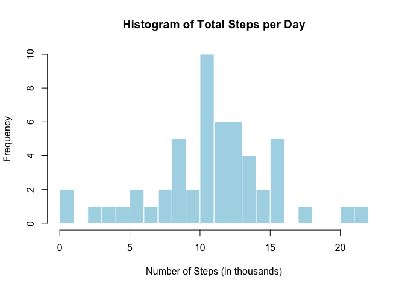

# Reproducible Research: Peer Assessment 1
Alejandro  


## Loading and preprocessing the data
Load the necessary R packages.

```r
library(dplyr)
```

```
## 
## Attaching package: 'dplyr'
```

```
## The following objects are masked from 'package:stats':
## 
##     filter, lag
```

```
## The following objects are masked from 'package:base':
## 
##     intersect, setdiff, setequal, union
```

```r
library(xtable)
```

Load data from zipfile and print four first and four last values.

```r
zip_file = unzip("activity.zip")
dat = read.csv(zip_file)
dat = transform(dat, date = as.Date(date))
head(dat, 4)
```

```
##   steps       date interval
## 1    NA 2012-10-01        0
## 2    NA 2012-10-01        5
## 3    NA 2012-10-01       10
## 4    NA 2012-10-01       15
```

```r
tail(dat, 4)
```

```
##       steps       date interval
## 17565    NA 2012-11-30     2340
## 17566    NA 2012-11-30     2345
## 17567    NA 2012-11-30     2350
## 17568    NA 2012-11-30     2355
```

## What is mean total number of steps taken per day?
Compute total and average numbers of steps per day using *group_by()* and *summarize()* functions from *dplyr* package.

```r
dat = group_by(dat, date)
steps.by.day = summarise(dat, 
                              total.steps = sum(steps) / 1000,
                                mean.steps = mean(steps, na.rm = TRUE),
                                median.steps = median(steps, na.rm = TRUE))
```
Make a histogram of the total number of steps by day

```r
with(steps.by.day, hist(total.steps, breaks = 30, col = "light blue",
                        border = "white", 
                        main = "Histogram of Total Steps per Day",
                        xlab = "Number of Steps (in thousands)"))
```

<!-- -->

Create a table to report the mean, median, and total number of steps taken per day

```r
with(steps.by.day, table(date, total.steps)) %>% 
        xtable(type = "html") %>%
        print(comment = FALSE)
```

\begin{table}[ht]
\centering
\begin{tabular}{rrrrrrrrrrrrrrrrrrrrrrrrrrrrrrrrrrrrrrrrrrrrrrrrrrrrrr}
  \hline
 & 0.041 & 0.126 & 2.492 & 3.219 & 4.472 & 5.018 & 5.441 & 6.778 & 7.047 & 7.336 & 8.334 & 8.355 & 8.821 & 8.841 & 8.918 & 9.819 & 9.9 & 10.056 & 10.119 & 10.139 & 10.183 & 10.304 & 10.395 & 10.439 & 10.571 & 10.6 & 10.765 & 11.015 & 11.162 & 11.352 & 11.458 & 11.829 & 11.834 & 12.116 & 12.426 & 12.608 & 12.787 & 12.811 & 12.883 & 13.294 & 13.452 & 13.46 & 13.646 & 14.339 & 14.478 & 15.084 & 15.098 & 15.11 & 15.414 & 15.42 & 17.382 & 20.427 & 21.194 \\ 
  \hline
2012-10-01 &   0 &   0 &   0 &   0 &   0 &   0 &   0 &   0 &   0 &   0 &   0 &   0 &   0 &   0 &   0 &   0 &   0 &   0 &   0 &   0 &   0 &   0 &   0 &   0 &   0 &   0 &   0 &   0 &   0 &   0 &   0 &   0 &   0 &   0 &   0 &   0 &   0 &   0 &   0 &   0 &   0 &   0 &   0 &   0 &   0 &   0 &   0 &   0 &   0 &   0 &   0 &   0 &   0 \\ 
  2012-10-02 &   0 &   1 &   0 &   0 &   0 &   0 &   0 &   0 &   0 &   0 &   0 &   0 &   0 &   0 &   0 &   0 &   0 &   0 &   0 &   0 &   0 &   0 &   0 &   0 &   0 &   0 &   0 &   0 &   0 &   0 &   0 &   0 &   0 &   0 &   0 &   0 &   0 &   0 &   0 &   0 &   0 &   0 &   0 &   0 &   0 &   0 &   0 &   0 &   0 &   0 &   0 &   0 &   0 \\ 
  2012-10-03 &   0 &   0 &   0 &   0 &   0 &   0 &   0 &   0 &   0 &   0 &   0 &   0 &   0 &   0 &   0 &   0 &   0 &   0 &   0 &   0 &   0 &   0 &   0 &   0 &   0 &   0 &   0 &   0 &   0 &   1 &   0 &   0 &   0 &   0 &   0 &   0 &   0 &   0 &   0 &   0 &   0 &   0 &   0 &   0 &   0 &   0 &   0 &   0 &   0 &   0 &   0 &   0 &   0 \\ 
  2012-10-04 &   0 &   0 &   0 &   0 &   0 &   0 &   0 &   0 &   0 &   0 &   0 &   0 &   0 &   0 &   0 &   0 &   0 &   0 &   0 &   0 &   0 &   0 &   0 &   0 &   0 &   0 &   0 &   0 &   0 &   0 &   0 &   0 &   0 &   1 &   0 &   0 &   0 &   0 &   0 &   0 &   0 &   0 &   0 &   0 &   0 &   0 &   0 &   0 &   0 &   0 &   0 &   0 &   0 \\ 
  2012-10-05 &   0 &   0 &   0 &   0 &   0 &   0 &   0 &   0 &   0 &   0 &   0 &   0 &   0 &   0 &   0 &   0 &   0 &   0 &   0 &   0 &   0 &   0 &   0 &   0 &   0 &   0 &   0 &   0 &   0 &   0 &   0 &   0 &   0 &   0 &   0 &   0 &   0 &   0 &   0 &   1 &   0 &   0 &   0 &   0 &   0 &   0 &   0 &   0 &   0 &   0 &   0 &   0 &   0 \\ 
  2012-10-06 &   0 &   0 &   0 &   0 &   0 &   0 &   0 &   0 &   0 &   0 &   0 &   0 &   0 &   0 &   0 &   0 &   0 &   0 &   0 &   0 &   0 &   0 &   0 &   0 &   0 &   0 &   0 &   0 &   0 &   0 &   0 &   0 &   0 &   0 &   0 &   0 &   0 &   0 &   0 &   0 &   0 &   0 &   0 &   0 &   0 &   0 &   0 &   0 &   0 &   1 &   0 &   0 &   0 \\ 
  2012-10-07 &   0 &   0 &   0 &   0 &   0 &   0 &   0 &   0 &   0 &   0 &   0 &   0 &   0 &   0 &   0 &   0 &   0 &   0 &   0 &   0 &   0 &   0 &   0 &   0 &   0 &   0 &   0 &   1 &   0 &   0 &   0 &   0 &   0 &   0 &   0 &   0 &   0 &   0 &   0 &   0 &   0 &   0 &   0 &   0 &   0 &   0 &   0 &   0 &   0 &   0 &   0 &   0 &   0 \\ 
  2012-10-08 &   0 &   0 &   0 &   0 &   0 &   0 &   0 &   0 &   0 &   0 &   0 &   0 &   0 &   0 &   0 &   0 &   0 &   0 &   0 &   0 &   0 &   0 &   0 &   0 &   0 &   0 &   0 &   0 &   0 &   0 &   0 &   0 &   0 &   0 &   0 &   0 &   0 &   0 &   0 &   0 &   0 &   0 &   0 &   0 &   0 &   0 &   0 &   0 &   0 &   0 &   0 &   0 &   0 \\ 
  2012-10-09 &   0 &   0 &   0 &   0 &   0 &   0 &   0 &   0 &   0 &   0 &   0 &   0 &   0 &   0 &   0 &   0 &   0 &   0 &   0 &   0 &   0 &   0 &   0 &   0 &   0 &   0 &   0 &   0 &   0 &   0 &   0 &   0 &   0 &   0 &   0 &   0 &   0 &   1 &   0 &   0 &   0 &   0 &   0 &   0 &   0 &   0 &   0 &   0 &   0 &   0 &   0 &   0 &   0 \\ 
  2012-10-10 &   0 &   0 &   0 &   0 &   0 &   0 &   0 &   0 &   0 &   0 &   0 &   0 &   0 &   0 &   0 &   0 &   1 &   0 &   0 &   0 &   0 &   0 &   0 &   0 &   0 &   0 &   0 &   0 &   0 &   0 &   0 &   0 &   0 &   0 &   0 &   0 &   0 &   0 &   0 &   0 &   0 &   0 &   0 &   0 &   0 &   0 &   0 &   0 &   0 &   0 &   0 &   0 &   0 \\ 
  2012-10-11 &   0 &   0 &   0 &   0 &   0 &   0 &   0 &   0 &   0 &   0 &   0 &   0 &   0 &   0 &   0 &   0 &   0 &   0 &   0 &   0 &   0 &   1 &   0 &   0 &   0 &   0 &   0 &   0 &   0 &   0 &   0 &   0 &   0 &   0 &   0 &   0 &   0 &   0 &   0 &   0 &   0 &   0 &   0 &   0 &   0 &   0 &   0 &   0 &   0 &   0 &   0 &   0 &   0 \\ 
  2012-10-12 &   0 &   0 &   0 &   0 &   0 &   0 &   0 &   0 &   0 &   0 &   0 &   0 &   0 &   0 &   0 &   0 &   0 &   0 &   0 &   0 &   0 &   0 &   0 &   0 &   0 &   0 &   0 &   0 &   0 &   0 &   0 &   0 &   0 &   0 &   0 &   0 &   0 &   0 &   0 &   0 &   0 &   0 &   0 &   0 &   0 &   0 &   0 &   0 &   0 &   0 &   1 &   0 &   0 \\ 
  2012-10-13 &   0 &   0 &   0 &   0 &   0 &   0 &   0 &   0 &   0 &   0 &   0 &   0 &   0 &   0 &   0 &   0 &   0 &   0 &   0 &   0 &   0 &   0 &   0 &   0 &   0 &   0 &   0 &   0 &   0 &   0 &   0 &   0 &   0 &   0 &   1 &   0 &   0 &   0 &   0 &   0 &   0 &   0 &   0 &   0 &   0 &   0 &   0 &   0 &   0 &   0 &   0 &   0 &   0 \\ 
  2012-10-14 &   0 &   0 &   0 &   0 &   0 &   0 &   0 &   0 &   0 &   0 &   0 &   0 &   0 &   0 &   0 &   0 &   0 &   0 &   0 &   0 &   0 &   0 &   0 &   0 &   0 &   0 &   0 &   0 &   0 &   0 &   0 &   0 &   0 &   0 &   0 &   0 &   0 &   0 &   0 &   0 &   0 &   0 &   0 &   0 &   0 &   0 &   1 &   0 &   0 &   0 &   0 &   0 &   0 \\ 
  2012-10-15 &   0 &   0 &   0 &   0 &   0 &   0 &   0 &   0 &   0 &   0 &   0 &   0 &   0 &   0 &   0 &   0 &   0 &   0 &   0 &   1 &   0 &   0 &   0 &   0 &   0 &   0 &   0 &   0 &   0 &   0 &   0 &   0 &   0 &   0 &   0 &   0 &   0 &   0 &   0 &   0 &   0 &   0 &   0 &   0 &   0 &   0 &   0 &   0 &   0 &   0 &   0 &   0 &   0 \\ 
  2012-10-16 &   0 &   0 &   0 &   0 &   0 &   0 &   0 &   0 &   0 &   0 &   0 &   0 &   0 &   0 &   0 &   0 &   0 &   0 &   0 &   0 &   0 &   0 &   0 &   0 &   0 &   0 &   0 &   0 &   0 &   0 &   0 &   0 &   0 &   0 &   0 &   0 &   0 &   0 &   0 &   0 &   0 &   0 &   0 &   0 &   0 &   1 &   0 &   0 &   0 &   0 &   0 &   0 &   0 \\ 
  2012-10-17 &   0 &   0 &   0 &   0 &   0 &   0 &   0 &   0 &   0 &   0 &   0 &   0 &   0 &   0 &   0 &   0 &   0 &   0 &   0 &   0 &   0 &   0 &   0 &   0 &   0 &   0 &   0 &   0 &   0 &   0 &   0 &   0 &   0 &   0 &   0 &   0 &   0 &   0 &   0 &   0 &   1 &   0 &   0 &   0 &   0 &   0 &   0 &   0 &   0 &   0 &   0 &   0 &   0 \\ 
  2012-10-18 &   0 &   0 &   0 &   0 &   0 &   0 &   0 &   0 &   0 &   0 &   0 &   0 &   0 &   0 &   0 &   0 &   0 &   1 &   0 &   0 &   0 &   0 &   0 &   0 &   0 &   0 &   0 &   0 &   0 &   0 &   0 &   0 &   0 &   0 &   0 &   0 &   0 &   0 &   0 &   0 &   0 &   0 &   0 &   0 &   0 &   0 &   0 &   0 &   0 &   0 &   0 &   0 &   0 \\ 
  2012-10-19 &   0 &   0 &   0 &   0 &   0 &   0 &   0 &   0 &   0 &   0 &   0 &   0 &   0 &   0 &   0 &   0 &   0 &   0 &   0 &   0 &   0 &   0 &   0 &   0 &   0 &   0 &   0 &   0 &   0 &   0 &   0 &   1 &   0 &   0 &   0 &   0 &   0 &   0 &   0 &   0 &   0 &   0 &   0 &   0 &   0 &   0 &   0 &   0 &   0 &   0 &   0 &   0 &   0 \\ 
  2012-10-20 &   0 &   0 &   0 &   0 &   0 &   0 &   0 &   0 &   0 &   0 &   0 &   0 &   0 &   0 &   0 &   0 &   0 &   0 &   0 &   0 &   0 &   0 &   1 &   0 &   0 &   0 &   0 &   0 &   0 &   0 &   0 &   0 &   0 &   0 &   0 &   0 &   0 &   0 &   0 &   0 &   0 &   0 &   0 &   0 &   0 &   0 &   0 &   0 &   0 &   0 &   0 &   0 &   0 \\ 
  2012-10-21 &   0 &   0 &   0 &   0 &   0 &   0 &   0 &   0 &   0 &   0 &   0 &   0 &   1 &   0 &   0 &   0 &   0 &   0 &   0 &   0 &   0 &   0 &   0 &   0 &   0 &   0 &   0 &   0 &   0 &   0 &   0 &   0 &   0 &   0 &   0 &   0 &   0 &   0 &   0 &   0 &   0 &   0 &   0 &   0 &   0 &   0 &   0 &   0 &   0 &   0 &   0 &   0 &   0 \\ 
  2012-10-22 &   0 &   0 &   0 &   0 &   0 &   0 &   0 &   0 &   0 &   0 &   0 &   0 &   0 &   0 &   0 &   0 &   0 &   0 &   0 &   0 &   0 &   0 &   0 &   0 &   0 &   0 &   0 &   0 &   0 &   0 &   0 &   0 &   0 &   0 &   0 &   0 &   0 &   0 &   0 &   0 &   0 &   1 &   0 &   0 &   0 &   0 &   0 &   0 &   0 &   0 &   0 &   0 &   0 \\ 
  2012-10-23 &   0 &   0 &   0 &   0 &   0 &   0 &   0 &   0 &   0 &   0 &   0 &   0 &   0 &   0 &   1 &   0 &   0 &   0 &   0 &   0 &   0 &   0 &   0 &   0 &   0 &   0 &   0 &   0 &   0 &   0 &   0 &   0 &   0 &   0 &   0 &   0 &   0 &   0 &   0 &   0 &   0 &   0 &   0 &   0 &   0 &   0 &   0 &   0 &   0 &   0 &   0 &   0 &   0 \\ 
  2012-10-24 &   0 &   0 &   0 &   0 &   0 &   0 &   0 &   0 &   0 &   0 &   0 &   1 &   0 &   0 &   0 &   0 &   0 &   0 &   0 &   0 &   0 &   0 &   0 &   0 &   0 &   0 &   0 &   0 &   0 &   0 &   0 &   0 &   0 &   0 &   0 &   0 &   0 &   0 &   0 &   0 &   0 &   0 &   0 &   0 &   0 &   0 &   0 &   0 &   0 &   0 &   0 &   0 &   0 \\ 
  2012-10-25 &   0 &   0 &   1 &   0 &   0 &   0 &   0 &   0 &   0 &   0 &   0 &   0 &   0 &   0 &   0 &   0 &   0 &   0 &   0 &   0 &   0 &   0 &   0 &   0 &   0 &   0 &   0 &   0 &   0 &   0 &   0 &   0 &   0 &   0 &   0 &   0 &   0 &   0 &   0 &   0 &   0 &   0 &   0 &   0 &   0 &   0 &   0 &   0 &   0 &   0 &   0 &   0 &   0 \\ 
  2012-10-26 &   0 &   0 &   0 &   0 &   0 &   0 &   0 &   1 &   0 &   0 &   0 &   0 &   0 &   0 &   0 &   0 &   0 &   0 &   0 &   0 &   0 &   0 &   0 &   0 &   0 &   0 &   0 &   0 &   0 &   0 &   0 &   0 &   0 &   0 &   0 &   0 &   0 &   0 &   0 &   0 &   0 &   0 &   0 &   0 &   0 &   0 &   0 &   0 &   0 &   0 &   0 &   0 &   0 \\ 
  2012-10-27 &   0 &   0 &   0 &   0 &   0 &   0 &   0 &   0 &   0 &   0 &   0 &   0 &   0 &   0 &   0 &   0 &   0 &   0 &   1 &   0 &   0 &   0 &   0 &   0 &   0 &   0 &   0 &   0 &   0 &   0 &   0 &   0 &   0 &   0 &   0 &   0 &   0 &   0 &   0 &   0 &   0 &   0 &   0 &   0 &   0 &   0 &   0 &   0 &   0 &   0 &   0 &   0 &   0 \\ 
  2012-10-28 &   0 &   0 &   0 &   0 &   0 &   0 &   0 &   0 &   0 &   0 &   0 &   0 &   0 &   0 &   0 &   0 &   0 &   0 &   0 &   0 &   0 &   0 &   0 &   0 &   0 &   0 &   0 &   0 &   0 &   0 &   1 &   0 &   0 &   0 &   0 &   0 &   0 &   0 &   0 &   0 &   0 &   0 &   0 &   0 &   0 &   0 &   0 &   0 &   0 &   0 &   0 &   0 &   0 \\ 
  2012-10-29 &   0 &   0 &   0 &   0 &   0 &   1 &   0 &   0 &   0 &   0 &   0 &   0 &   0 &   0 &   0 &   0 &   0 &   0 &   0 &   0 &   0 &   0 &   0 &   0 &   0 &   0 &   0 &   0 &   0 &   0 &   0 &   0 &   0 &   0 &   0 &   0 &   0 &   0 &   0 &   0 &   0 &   0 &   0 &   0 &   0 &   0 &   0 &   0 &   0 &   0 &   0 &   0 &   0 \\ 
  2012-10-30 &   0 &   0 &   0 &   0 &   0 &   0 &   0 &   0 &   0 &   0 &   0 &   0 &   0 &   0 &   0 &   1 &   0 &   0 &   0 &   0 &   0 &   0 &   0 &   0 &   0 &   0 &   0 &   0 &   0 &   0 &   0 &   0 &   0 &   0 &   0 &   0 &   0 &   0 &   0 &   0 &   0 &   0 &   0 &   0 &   0 &   0 &   0 &   0 &   0 &   0 &   0 &   0 &   0 \\ 
  2012-10-31 &   0 &   0 &   0 &   0 &   0 &   0 &   0 &   0 &   0 &   0 &   0 &   0 &   0 &   0 &   0 &   0 &   0 &   0 &   0 &   0 &   0 &   0 &   0 &   0 &   0 &   0 &   0 &   0 &   0 &   0 &   0 &   0 &   0 &   0 &   0 &   0 &   0 &   0 &   0 &   0 &   0 &   0 &   0 &   0 &   0 &   0 &   0 &   0 &   1 &   0 &   0 &   0 &   0 \\ 
  2012-11-01 &   0 &   0 &   0 &   0 &   0 &   0 &   0 &   0 &   0 &   0 &   0 &   0 &   0 &   0 &   0 &   0 &   0 &   0 &   0 &   0 &   0 &   0 &   0 &   0 &   0 &   0 &   0 &   0 &   0 &   0 &   0 &   0 &   0 &   0 &   0 &   0 &   0 &   0 &   0 &   0 &   0 &   0 &   0 &   0 &   0 &   0 &   0 &   0 &   0 &   0 &   0 &   0 &   0 \\ 
  2012-11-02 &   0 &   0 &   0 &   0 &   0 &   0 &   0 &   0 &   0 &   0 &   0 &   0 &   0 &   0 &   0 &   0 &   0 &   0 &   0 &   0 &   0 &   0 &   0 &   0 &   0 &   1 &   0 &   0 &   0 &   0 &   0 &   0 &   0 &   0 &   0 &   0 &   0 &   0 &   0 &   0 &   0 &   0 &   0 &   0 &   0 &   0 &   0 &   0 &   0 &   0 &   0 &   0 &   0 \\ 
  2012-11-03 &   0 &   0 &   0 &   0 &   0 &   0 &   0 &   0 &   0 &   0 &   0 &   0 &   0 &   0 &   0 &   0 &   0 &   0 &   0 &   0 &   0 &   0 &   0 &   0 &   1 &   0 &   0 &   0 &   0 &   0 &   0 &   0 &   0 &   0 &   0 &   0 &   0 &   0 &   0 &   0 &   0 &   0 &   0 &   0 &   0 &   0 &   0 &   0 &   0 &   0 &   0 &   0 &   0 \\ 
  2012-11-04 &   0 &   0 &   0 &   0 &   0 &   0 &   0 &   0 &   0 &   0 &   0 &   0 &   0 &   0 &   0 &   0 &   0 &   0 &   0 &   0 &   0 &   0 &   0 &   0 &   0 &   0 &   0 &   0 &   0 &   0 &   0 &   0 &   0 &   0 &   0 &   0 &   0 &   0 &   0 &   0 &   0 &   0 &   0 &   0 &   0 &   0 &   0 &   0 &   0 &   0 &   0 &   0 &   0 \\ 
  2012-11-05 &   0 &   0 &   0 &   0 &   0 &   0 &   0 &   0 &   0 &   0 &   0 &   0 &   0 &   0 &   0 &   0 &   0 &   0 &   0 &   0 &   0 &   0 &   0 &   1 &   0 &   0 &   0 &   0 &   0 &   0 &   0 &   0 &   0 &   0 &   0 &   0 &   0 &   0 &   0 &   0 &   0 &   0 &   0 &   0 &   0 &   0 &   0 &   0 &   0 &   0 &   0 &   0 &   0 \\ 
  2012-11-06 &   0 &   0 &   0 &   0 &   0 &   0 &   0 &   0 &   0 &   0 &   1 &   0 &   0 &   0 &   0 &   0 &   0 &   0 &   0 &   0 &   0 &   0 &   0 &   0 &   0 &   0 &   0 &   0 &   0 &   0 &   0 &   0 &   0 &   0 &   0 &   0 &   0 &   0 &   0 &   0 &   0 &   0 &   0 &   0 &   0 &   0 &   0 &   0 &   0 &   0 &   0 &   0 &   0 \\ 
  2012-11-07 &   0 &   0 &   0 &   0 &   0 &   0 &   0 &   0 &   0 &   0 &   0 &   0 &   0 &   0 &   0 &   0 &   0 &   0 &   0 &   0 &   0 &   0 &   0 &   0 &   0 &   0 &   0 &   0 &   0 &   0 &   0 &   0 &   0 &   0 &   0 &   0 &   0 &   0 &   1 &   0 &   0 &   0 &   0 &   0 &   0 &   0 &   0 &   0 &   0 &   0 &   0 &   0 &   0 \\ 
  2012-11-08 &   0 &   0 &   0 &   1 &   0 &   0 &   0 &   0 &   0 &   0 &   0 &   0 &   0 &   0 &   0 &   0 &   0 &   0 &   0 &   0 &   0 &   0 &   0 &   0 &   0 &   0 &   0 &   0 &   0 &   0 &   0 &   0 &   0 &   0 &   0 &   0 &   0 &   0 &   0 &   0 &   0 &   0 &   0 &   0 &   0 &   0 &   0 &   0 &   0 &   0 &   0 &   0 &   0 \\ 
  2012-11-09 &   0 &   0 &   0 &   0 &   0 &   0 &   0 &   0 &   0 &   0 &   0 &   0 &   0 &   0 &   0 &   0 &   0 &   0 &   0 &   0 &   0 &   0 &   0 &   0 &   0 &   0 &   0 &   0 &   0 &   0 &   0 &   0 &   0 &   0 &   0 &   0 &   0 &   0 &   0 &   0 &   0 &   0 &   0 &   0 &   0 &   0 &   0 &   0 &   0 &   0 &   0 &   0 &   0 \\ 
  2012-11-10 &   0 &   0 &   0 &   0 &   0 &   0 &   0 &   0 &   0 &   0 &   0 &   0 &   0 &   0 &   0 &   0 &   0 &   0 &   0 &   0 &   0 &   0 &   0 &   0 &   0 &   0 &   0 &   0 &   0 &   0 &   0 &   0 &   0 &   0 &   0 &   0 &   0 &   0 &   0 &   0 &   0 &   0 &   0 &   0 &   0 &   0 &   0 &   0 &   0 &   0 &   0 &   0 &   0 \\ 
  2012-11-11 &   0 &   0 &   0 &   0 &   0 &   0 &   0 &   0 &   0 &   0 &   0 &   0 &   0 &   0 &   0 &   0 &   0 &   0 &   0 &   0 &   0 &   0 &   0 &   0 &   0 &   0 &   0 &   0 &   0 &   0 &   0 &   0 &   0 &   0 &   0 &   1 &   0 &   0 &   0 &   0 &   0 &   0 &   0 &   0 &   0 &   0 &   0 &   0 &   0 &   0 &   0 &   0 &   0 \\ 
  2012-11-12 &   0 &   0 &   0 &   0 &   0 &   0 &   0 &   0 &   0 &   0 &   0 &   0 &   0 &   0 &   0 &   0 &   0 &   0 &   0 &   0 &   0 &   0 &   0 &   0 &   0 &   0 &   1 &   0 &   0 &   0 &   0 &   0 &   0 &   0 &   0 &   0 &   0 &   0 &   0 &   0 &   0 &   0 &   0 &   0 &   0 &   0 &   0 &   0 &   0 &   0 &   0 &   0 &   0 \\ 
  2012-11-13 &   0 &   0 &   0 &   0 &   0 &   0 &   0 &   0 &   0 &   1 &   0 &   0 &   0 &   0 &   0 &   0 &   0 &   0 &   0 &   0 &   0 &   0 &   0 &   0 &   0 &   0 &   0 &   0 &   0 &   0 &   0 &   0 &   0 &   0 &   0 &   0 &   0 &   0 &   0 &   0 &   0 &   0 &   0 &   0 &   0 &   0 &   0 &   0 &   0 &   0 &   0 &   0 &   0 \\ 
  2012-11-14 &   0 &   0 &   0 &   0 &   0 &   0 &   0 &   0 &   0 &   0 &   0 &   0 &   0 &   0 &   0 &   0 &   0 &   0 &   0 &   0 &   0 &   0 &   0 &   0 &   0 &   0 &   0 &   0 &   0 &   0 &   0 &   0 &   0 &   0 &   0 &   0 &   0 &   0 &   0 &   0 &   0 &   0 &   0 &   0 &   0 &   0 &   0 &   0 &   0 &   0 &   0 &   0 &   0 \\ 
  2012-11-15 &   1 &   0 &   0 &   0 &   0 &   0 &   0 &   0 &   0 &   0 &   0 &   0 &   0 &   0 &   0 &   0 &   0 &   0 &   0 &   0 &   0 &   0 &   0 &   0 &   0 &   0 &   0 &   0 &   0 &   0 &   0 &   0 &   0 &   0 &   0 &   0 &   0 &   0 &   0 &   0 &   0 &   0 &   0 &   0 &   0 &   0 &   0 &   0 &   0 &   0 &   0 &   0 &   0 \\ 
  2012-11-16 &   0 &   0 &   0 &   0 &   0 &   0 &   1 &   0 &   0 &   0 &   0 &   0 &   0 &   0 &   0 &   0 &   0 &   0 &   0 &   0 &   0 &   0 &   0 &   0 &   0 &   0 &   0 &   0 &   0 &   0 &   0 &   0 &   0 &   0 &   0 &   0 &   0 &   0 &   0 &   0 &   0 &   0 &   0 &   0 &   0 &   0 &   0 &   0 &   0 &   0 &   0 &   0 &   0 \\ 
  2012-11-17 &   0 &   0 &   0 &   0 &   0 &   0 &   0 &   0 &   0 &   0 &   0 &   0 &   0 &   0 &   0 &   0 &   0 &   0 &   0 &   0 &   0 &   0 &   0 &   0 &   0 &   0 &   0 &   0 &   0 &   0 &   0 &   0 &   0 &   0 &   0 &   0 &   0 &   0 &   0 &   0 &   0 &   0 &   0 &   1 &   0 &   0 &   0 &   0 &   0 &   0 &   0 &   0 &   0 \\ 
  2012-11-18 &   0 &   0 &   0 &   0 &   0 &   0 &   0 &   0 &   0 &   0 &   0 &   0 &   0 &   0 &   0 &   0 &   0 &   0 &   0 &   0 &   0 &   0 &   0 &   0 &   0 &   0 &   0 &   0 &   0 &   0 &   0 &   0 &   0 &   0 &   0 &   0 &   0 &   0 &   0 &   0 &   0 &   0 &   0 &   0 &   0 &   0 &   0 &   1 &   0 &   0 &   0 &   0 &   0 \\ 
  2012-11-19 &   0 &   0 &   0 &   0 &   0 &   0 &   0 &   0 &   0 &   0 &   0 &   0 &   0 &   1 &   0 &   0 &   0 &   0 &   0 &   0 &   0 &   0 &   0 &   0 &   0 &   0 &   0 &   0 &   0 &   0 &   0 &   0 &   0 &   0 &   0 &   0 &   0 &   0 &   0 &   0 &   0 &   0 &   0 &   0 &   0 &   0 &   0 &   0 &   0 &   0 &   0 &   0 &   0 \\ 
  2012-11-20 &   0 &   0 &   0 &   0 &   1 &   0 &   0 &   0 &   0 &   0 &   0 &   0 &   0 &   0 &   0 &   0 &   0 &   0 &   0 &   0 &   0 &   0 &   0 &   0 &   0 &   0 &   0 &   0 &   0 &   0 &   0 &   0 &   0 &   0 &   0 &   0 &   0 &   0 &   0 &   0 &   0 &   0 &   0 &   0 &   0 &   0 &   0 &   0 &   0 &   0 &   0 &   0 &   0 \\ 
  2012-11-21 &   0 &   0 &   0 &   0 &   0 &   0 &   0 &   0 &   0 &   0 &   0 &   0 &   0 &   0 &   0 &   0 &   0 &   0 &   0 &   0 &   0 &   0 &   0 &   0 &   0 &   0 &   0 &   0 &   0 &   0 &   0 &   0 &   0 &   0 &   0 &   0 &   1 &   0 &   0 &   0 &   0 &   0 &   0 &   0 &   0 &   0 &   0 &   0 &   0 &   0 &   0 &   0 &   0 \\ 
  2012-11-22 &   0 &   0 &   0 &   0 &   0 &   0 &   0 &   0 &   0 &   0 &   0 &   0 &   0 &   0 &   0 &   0 &   0 &   0 &   0 &   0 &   0 &   0 &   0 &   0 &   0 &   0 &   0 &   0 &   0 &   0 &   0 &   0 &   0 &   0 &   0 &   0 &   0 &   0 &   0 &   0 &   0 &   0 &   0 &   0 &   0 &   0 &   0 &   0 &   0 &   0 &   0 &   1 &   0 \\ 
  2012-11-23 &   0 &   0 &   0 &   0 &   0 &   0 &   0 &   0 &   0 &   0 &   0 &   0 &   0 &   0 &   0 &   0 &   0 &   0 &   0 &   0 &   0 &   0 &   0 &   0 &   0 &   0 &   0 &   0 &   0 &   0 &   0 &   0 &   0 &   0 &   0 &   0 &   0 &   0 &   0 &   0 &   0 &   0 &   0 &   0 &   0 &   0 &   0 &   0 &   0 &   0 &   0 &   0 &   1 \\ 
  2012-11-24 &   0 &   0 &   0 &   0 &   0 &   0 &   0 &   0 &   0 &   0 &   0 &   0 &   0 &   0 &   0 &   0 &   0 &   0 &   0 &   0 &   0 &   0 &   0 &   0 &   0 &   0 &   0 &   0 &   0 &   0 &   0 &   0 &   0 &   0 &   0 &   0 &   0 &   0 &   0 &   0 &   0 &   0 &   0 &   0 &   1 &   0 &   0 &   0 &   0 &   0 &   0 &   0 &   0 \\ 
  2012-11-25 &   0 &   0 &   0 &   0 &   0 &   0 &   0 &   0 &   0 &   0 &   0 &   0 &   0 &   0 &   0 &   0 &   0 &   0 &   0 &   0 &   0 &   0 &   0 &   0 &   0 &   0 &   0 &   0 &   0 &   0 &   0 &   0 &   1 &   0 &   0 &   0 &   0 &   0 &   0 &   0 &   0 &   0 &   0 &   0 &   0 &   0 &   0 &   0 &   0 &   0 &   0 &   0 &   0 \\ 
  2012-11-26 &   0 &   0 &   0 &   0 &   0 &   0 &   0 &   0 &   0 &   0 &   0 &   0 &   0 &   0 &   0 &   0 &   0 &   0 &   0 &   0 &   0 &   0 &   0 &   0 &   0 &   0 &   0 &   0 &   1 &   0 &   0 &   0 &   0 &   0 &   0 &   0 &   0 &   0 &   0 &   0 &   0 &   0 &   0 &   0 &   0 &   0 &   0 &   0 &   0 &   0 &   0 &   0 &   0 \\ 
  2012-11-27 &   0 &   0 &   0 &   0 &   0 &   0 &   0 &   0 &   0 &   0 &   0 &   0 &   0 &   0 &   0 &   0 &   0 &   0 &   0 &   0 &   0 &   0 &   0 &   0 &   0 &   0 &   0 &   0 &   0 &   0 &   0 &   0 &   0 &   0 &   0 &   0 &   0 &   0 &   0 &   0 &   0 &   0 &   1 &   0 &   0 &   0 &   0 &   0 &   0 &   0 &   0 &   0 &   0 \\ 
  2012-11-28 &   0 &   0 &   0 &   0 &   0 &   0 &   0 &   0 &   0 &   0 &   0 &   0 &   0 &   0 &   0 &   0 &   0 &   0 &   0 &   0 &   1 &   0 &   0 &   0 &   0 &   0 &   0 &   0 &   0 &   0 &   0 &   0 &   0 &   0 &   0 &   0 &   0 &   0 &   0 &   0 &   0 &   0 &   0 &   0 &   0 &   0 &   0 &   0 &   0 &   0 &   0 &   0 &   0 \\ 
  2012-11-29 &   0 &   0 &   0 &   0 &   0 &   0 &   0 &   0 &   1 &   0 &   0 &   0 &   0 &   0 &   0 &   0 &   0 &   0 &   0 &   0 &   0 &   0 &   0 &   0 &   0 &   0 &   0 &   0 &   0 &   0 &   0 &   0 &   0 &   0 &   0 &   0 &   0 &   0 &   0 &   0 &   0 &   0 &   0 &   0 &   0 &   0 &   0 &   0 &   0 &   0 &   0 &   0 &   0 \\ 
  2012-11-30 &   0 &   0 &   0 &   0 &   0 &   0 &   0 &   0 &   0 &   0 &   0 &   0 &   0 &   0 &   0 &   0 &   0 &   0 &   0 &   0 &   0 &   0 &   0 &   0 &   0 &   0 &   0 &   0 &   0 &   0 &   0 &   0 &   0 &   0 &   0 &   0 &   0 &   0 &   0 &   0 &   0 &   0 &   0 &   0 &   0 &   0 &   0 &   0 &   0 &   0 &   0 &   0 &   0 \\ 
   \hline
\end{tabular}
\end{table}

```r
mytable = xtable(steps.by.day, type = "html", 
                 caption = "Steps per Day")
print(mytable)
```

% latex table generated in R 3.4.1 by xtable 1.8-2 package
% Fri Sep  8 16:08:07 2017
\begin{table}[ht]
\centering
\begin{tabular}{rrrrr}
  \hline
 & date & total.steps & mean.steps & median.steps \\ 
  \hline
1 & 15614.00 &  &  &  \\ 
  2 & 15615.00 & 0.13 & 0.44 & 0.00 \\ 
  3 & 15616.00 & 11.35 & 39.42 & 0.00 \\ 
  4 & 15617.00 & 12.12 & 42.07 & 0.00 \\ 
  5 & 15618.00 & 13.29 & 46.16 & 0.00 \\ 
  6 & 15619.00 & 15.42 & 53.54 & 0.00 \\ 
  7 & 15620.00 & 11.02 & 38.25 & 0.00 \\ 
  8 & 15621.00 &  &  &  \\ 
  9 & 15622.00 & 12.81 & 44.48 & 0.00 \\ 
  10 & 15623.00 & 9.90 & 34.38 & 0.00 \\ 
  11 & 15624.00 & 10.30 & 35.78 & 0.00 \\ 
  12 & 15625.00 & 17.38 & 60.35 & 0.00 \\ 
  13 & 15626.00 & 12.43 & 43.15 & 0.00 \\ 
  14 & 15627.00 & 15.10 & 52.42 & 0.00 \\ 
  15 & 15628.00 & 10.14 & 35.20 & 0.00 \\ 
  16 & 15629.00 & 15.08 & 52.38 & 0.00 \\ 
  17 & 15630.00 & 13.45 & 46.71 & 0.00 \\ 
  18 & 15631.00 & 10.06 & 34.92 & 0.00 \\ 
  19 & 15632.00 & 11.83 & 41.07 & 0.00 \\ 
  20 & 15633.00 & 10.39 & 36.09 & 0.00 \\ 
  21 & 15634.00 & 8.82 & 30.63 & 0.00 \\ 
  22 & 15635.00 & 13.46 & 46.74 & 0.00 \\ 
  23 & 15636.00 & 8.92 & 30.97 & 0.00 \\ 
  24 & 15637.00 & 8.36 & 29.01 & 0.00 \\ 
  25 & 15638.00 & 2.49 & 8.65 & 0.00 \\ 
  26 & 15639.00 & 6.78 & 23.53 & 0.00 \\ 
  27 & 15640.00 & 10.12 & 35.14 & 0.00 \\ 
  28 & 15641.00 & 11.46 & 39.78 & 0.00 \\ 
  29 & 15642.00 & 5.02 & 17.42 & 0.00 \\ 
  30 & 15643.00 & 9.82 & 34.09 & 0.00 \\ 
  31 & 15644.00 & 15.41 & 53.52 & 0.00 \\ 
  32 & 15645.00 &  &  &  \\ 
  33 & 15646.00 & 10.60 & 36.81 & 0.00 \\ 
  34 & 15647.00 & 10.57 & 36.70 & 0.00 \\ 
  35 & 15648.00 &  &  &  \\ 
  36 & 15649.00 & 10.44 & 36.25 & 0.00 \\ 
  37 & 15650.00 & 8.33 & 28.94 & 0.00 \\ 
  38 & 15651.00 & 12.88 & 44.73 & 0.00 \\ 
  39 & 15652.00 & 3.22 & 11.18 & 0.00 \\ 
  40 & 15653.00 &  &  &  \\ 
  41 & 15654.00 &  &  &  \\ 
  42 & 15655.00 & 12.61 & 43.78 & 0.00 \\ 
  43 & 15656.00 & 10.77 & 37.38 & 0.00 \\ 
  44 & 15657.00 & 7.34 & 25.47 & 0.00 \\ 
  45 & 15658.00 &  &  &  \\ 
  46 & 15659.00 & 0.04 & 0.14 & 0.00 \\ 
  47 & 15660.00 & 5.44 & 18.89 & 0.00 \\ 
  48 & 15661.00 & 14.34 & 49.79 & 0.00 \\ 
  49 & 15662.00 & 15.11 & 52.47 & 0.00 \\ 
  50 & 15663.00 & 8.84 & 30.70 & 0.00 \\ 
  51 & 15664.00 & 4.47 & 15.53 & 0.00 \\ 
  52 & 15665.00 & 12.79 & 44.40 & 0.00 \\ 
  53 & 15666.00 & 20.43 & 70.93 & 0.00 \\ 
  54 & 15667.00 & 21.19 & 73.59 & 0.00 \\ 
  55 & 15668.00 & 14.48 & 50.27 & 0.00 \\ 
  56 & 15669.00 & 11.83 & 41.09 & 0.00 \\ 
  57 & 15670.00 & 11.16 & 38.76 & 0.00 \\ 
  58 & 15671.00 & 13.65 & 47.38 & 0.00 \\ 
  59 & 15672.00 & 10.18 & 35.36 & 0.00 \\ 
  60 & 15673.00 & 7.05 & 24.47 & 0.00 \\ 
  61 & 15674.00 &  &  &  \\ 
   \hline
\end{tabular}
\caption{Steps per Day} 
\end{table}


## What is the average daily activity pattern?


## Imputing missing values


## Are there differences in activity patterns between weekdays and weekends?
