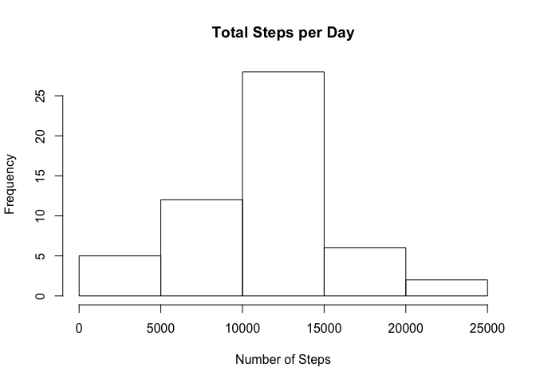
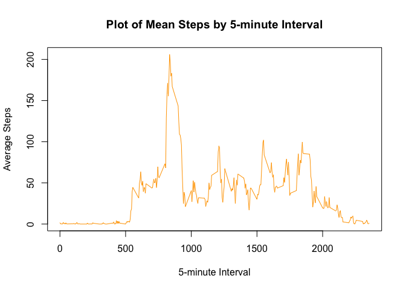
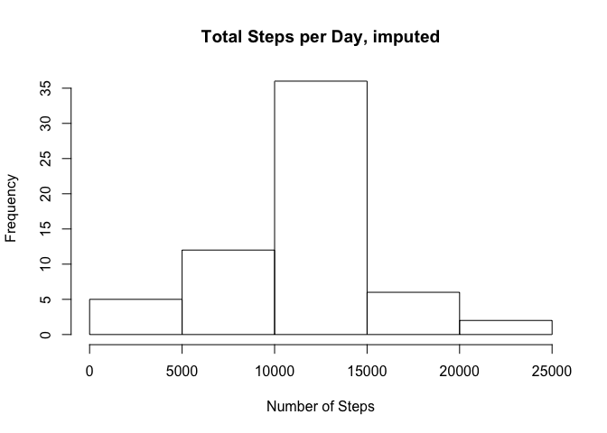
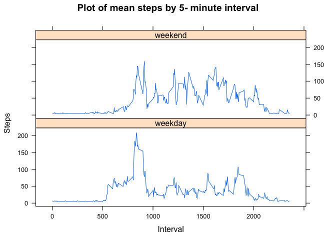

# Reproducible Research: Peer Assessment 1


## Loading and preprocessing the data
'activity' is a loaded data frame.


```r
if(!file.exists("getdata-projectfiles-UCI HAR Dataset.zip")) {
        tmp <- tempfile()
        download.file("https://d396qusza40orc.cloudfront.net/repdata%2Fdata%2Factivity.zip", tmp)
        unzip(tmp)
        unlink(tmp)
}
activity <- read.csv("activity.csv")
```

## What is mean total number of steps taken per day?
1. 'Dailysteps' is the result of total steps per day.
2. Create a histogram and calculate mean and median.

```r
Dailysteps <- aggregate(steps ~ date, activity, sum)
hist(Dailysteps$steps, main = "Total Steps per Day", xlab = "Number of Steps")
```

<!-- -->

```r
Meansteps <- mean(Dailysteps$steps)
Mediansteps <- median(Dailysteps$steps)
```
The mean of total daily steps per day is **1.0766189\times 10^{4}**.
The median of total daily steps per day is **10765**.

## What is the average daily activity pattern?


```r
Intervalsteps <- aggregate(steps ~ interval, activity, mean)
plot(Intervalsteps$interval, Intervalsteps$steps, type = "l", main = "Plot of Mean Steps by 5-minute Interval", xlab = "5-minute Interval", ylab = "Average Steps", col = "orange")
```

<!-- -->

```r
MaxIntervalsteps <- Intervalsteps[which.max(Intervalsteps$steps), 1]
```
The maximum number of steps is **835**.

## Imputing missing values
1.First, calculate the total number of missing values in the dataset.

```r
### Find NA's from the dataset.
### From summary(activity), the variable 'steps' has NA's which is 2304.
missingvalues <- is.na(activity$steps)
### Logical value TRUE is 1 and FALSE is 0. The tactics is to calculate
### a sum of missingvalues.
countmissing <- sum(missingvalues)
```
Total number of missing values is **2304**.

2. Devise a strategy for filling in all of the misisng values in the dataset.
3. Create a new dataset that is equal to the original dataset but with the missing data filled in.

```r
library(Hmisc)
```

```
## Loading required package: lattice
```

```
## Loading required package: survival
```

```
## Loading required package: Formula
```

```
## Loading required package: ggplot2
```

```
## 
## Attaching package: 'Hmisc'
```

```
## The following objects are masked from 'package:base':
## 
##     format.pval, round.POSIXt, trunc.POSIXt, units
```

```r
Imputedactivity <- activity
Imputedactivity$steps <- impute(activity$steps, fun = mean)
```

4. Make a histogram of the total number of steps taken each day. Also calculate and report the mean and median total number of steps taken per day.

```r
ImputedDailysteps <- aggregate(steps ~ date, Imputedactivity, sum)
hist(ImputedDailysteps$steps, main = "Total Steps per Day, imputed", xlab = "Number of Steps")
```

<!-- -->

```r
ImputedMeansteps <- mean(ImputedDailysteps$steps)
ImputedMediansteps <- median(ImputedDailysteps$steps)
DiffMeansteps <- Meansteps - ImputedMeansteps
DiffMediansteps <- Mediansteps - ImputedMediansteps
```
The mean of daily steps with the imputed dataset is **1.0766189\times 10^{4}**.

The median of daily steps with the imputed dataset is **1.0766189\times 10^{4}**.

For the comparison, the original mean and median of daily steps are **1.0766189\times 10^{4}** and **10765**.

The impact of imputing is **0** with mean and **-1.1886792** with median.

## Are there differences in activity patterns between weekdays and weekends?
1. Create a new factor variable in the dataset with two levels - "weekday" and "weekend" indicating whether a given date is a weekday or weekend day.

```r
IdentifyWeekday <- function(date){
        identifyDay <- weekdays(date)
        if (identifyDay %in% c("Monday", "Tuesday", "Wednesday", "Thursday", "Friday"))
                return("weekday")
        else if (identifyDay %in% c("Saturday", "Sunday"))
                return("weekend")
}
Imputedactivity$date <- as.Date(Imputedactivity$date)
Imputedactivity$day <- sapply(Imputedactivity$date, FUN = IdentifyWeekday)
```

2. Make a panel plot containing a time series plot(i.e. type = "l") of the 5-minute interval(x-axis) andn the average number of steps take, averaged across all weekday days or weekend days(y-axis).

```r
ImputedIntervalsteps <- aggregate(steps ~ interval + day, Imputedactivity, mean)
library(lattice)
xyplot(ImputedIntervalsteps$steps ~ ImputedIntervalsteps$interval|ImputedIntervalsteps$day, main = "Plot of mean steps by 5- minute interval", xlab = "Interval", ylab = "Steps", layout = c(1, 2), type = "l")
```

<!-- -->
                          
