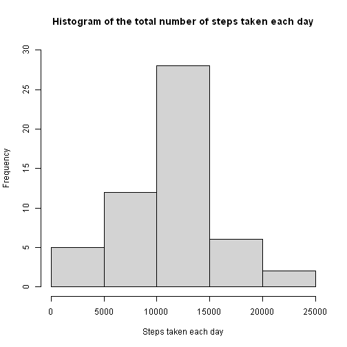
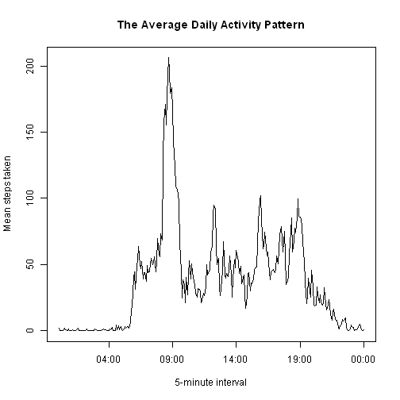
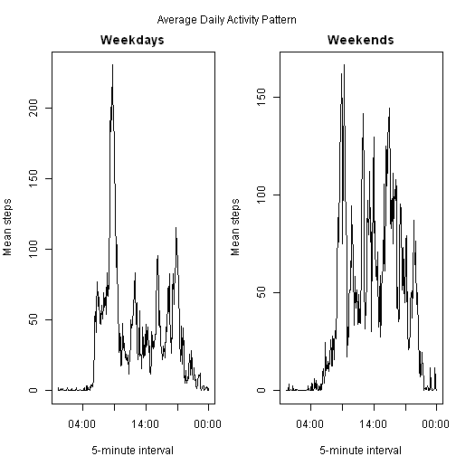

```r
dataUrl <- "https://d396qusza40orc.cloudfront.net/repdata%2Fdata%2Factivity.zip"
#download.file(dataUrl, "activity.zip")
unzip("activity.zip")
data <- read.csv("activity.csv")
```

## What is mean total number of steps taken per day (ignoring the missing values in the dataset)?
1. Calculate the **total** number of steps taken **per day**;
2. Make a **histogram** of the total number of steps taken each day;
3. Calculate and report the **mean & median** of the total number of steps taken per day.

```r
# total number of steps taken per day:
s <- aggregate(steps~date, data, FUN = sum, na.rm = TRUE)
hist(s$steps, 
     main = "Histogram of the total number of steps taken each day", 
     xlab = "Steps taken each day", ylim = c(0,30))
```



```r
m <- mean(s$steps)
paste ("The Mean number of steps taken each day is", m)
```

```
## [1] "The Mean number of steps taken each day is 10766.1886792453"
```

```r
med <- median(s$steps)
paste ("The Median number of steps taken each day is", med)
```

```
## [1] "The Median number of steps taken each day is 10765"
```


## What is the average daily activity pattern?
1. Make a time series plot (i.e. type = "l") of the 5-minute interval (x-axis) and the average number of steps taken, averaged **across all days** (y-axis);
2. Which 5-minute interval, on average across all the days in the dataset, contains the maximum number of steps?

```r
ss <- aggregate(steps~interval, data, FUN = mean, na.rm = TRUE)

ss5m <- ss
ss5m$interval <- strptime("00:00","%H:%M")+300*1:288
plot(ss5m,
     type = "l",
     xlab = "5-minute interval", 
     ylab = "Mean steps taken",
     main = "The Average Daily Activity Pattern")
```



```r
intmax <- ss5m$interval[which.max(ss5m$steps)]
paste ("On average, across all the days in the dataset, the 5-minute interval begins at", format(intmax, "%H:%M"), "contains the maximum number of steps.")
```

```
## [1] "On average, across all the days in the dataset, the 5-minute interval begins at 08:40 contains the maximum number of steps."
```


## Imputing missing values
1. Calculate and report the total number of missing values in the dataset (i.e. the total number of rows with NAs);
2. Devise a strategy for filling in all of the missing values in the dataset. The strategy does not need to be sophisticated. For example, you could use the mean/median for that day, or the mean for that 5-minute interval, etc.;
3. Create a new dataset that is equal to the original dataset but with the missing data filled in;

```r
na <- sum(is.na(data$steps))
paste0("The total number of missing values in the dataset is ", na, ".")
```

```
## [1] "The total number of missing values in the dataset is 2304."
```

```r
#Imputing NA with the mean for that 5-minute interval:
sum(is.na(ss5m$steps)) # none NA exists in the mean data
```

```
## [1] 0
```

```r
imputed <- merge(data, ss, 
                 by = "interval", 
                 all.x = TRUE,
                 sort = FALSE)
i <- is.na(imputed$steps.x)    
imputed$steps.x[i] <- imputed$steps.y[i]

newset <-  imputed[order(imputed[,3],imputed[1]),]
        # The new dataset with missing data filled in
```

4. Make a histogram of the total number of steps taken each day and Calculate and report the mean and median total number of steps taken per day. Do these values differ from the estimates from the first part of the assignment? What is the impact of imputing missing data on the estimates of the total daily number of steps?

```r
# histogram of the total number of steps taken each day
newsum <- aggregate(steps.x~date, newset, 
                    FUN = sum, na.rm = TRUE)
hist(newsum$steps, 
     main = "Histogram of the total number of steps taken each day", 
     xlab = "Steps taken each day")
```


```r
newm <- mean(newsum$steps)
paste0("The Mean number of steps taken each day is ", newm, ".")
```

```
## [1] "The Mean number of steps taken each day is 10766.1886792453."
```

```r
newmed <- median(newsum$steps)
paste0("The Median number of steps taken each day is ", newmed, ".")
```

```
## [1] "The Median number of steps taken each day is 10766.1886792453."
```

```r
newm - m
```

```
## [1] 0
```

```r
newmed - med
```

```
## [1] 1.188679
```


## Are there differences in activity patterns between weekdays and weekends?
1. Create a new factor variable in the dataset with two levels – “weekday” and “weekend” indicating whether a given date is a weekday or weekend day;
2. Make a panel plot containing a time series plot (i.e. type = "l") of the 5-minute interval (x-axis) and the average number of steps taken, averaged across all weekday days or weekend days (y-axis). 

```r
newtime <- newset

library(dplyr)
newtime <- mutate(newtime, week = 
weekdays(strptime(newset$date, "%Y-%m-%d"))) %>% 
        mutate(week = factor((week == "Saturday" | week == "Sunday"), labels = c("weekday", "weekend"))) %>% 
        group_by(week) 

wkd <- aggregate(steps.x ~ interval, subset(newtime, week == "weekday"),
                 FUN = mean, na.rm = TRUE)
wkn <- aggregate(steps.x ~ interval, subset(newtime, week == "weekend"),
                 FUN = mean, na.rm = TRUE)

wkd5m <- mutate(wkd, interval = strptime("00:00","%H:%M") + 300*1:288)
wkn5m <- mutate(wkn, interval = strptime("00:00","%H:%M") + 300*1:288)

par(mfrow = c(1,2), 
    mar = c(4, 4, 2, 1), oma = c(0, 0, 2, 0))
plot(wkd5m,
     type = "l",
     xlab = "5-minute interval", 
     ylab = "Mean steps",
     main = "Weekdays")
plot(wkn5m,
     type = "l",
     xlab = "5-minute interval", 
     ylab = "Mean steps",
     main = "Weekends")
mtext("Average Daily Activity Pattern", outer = TRUE)
```




