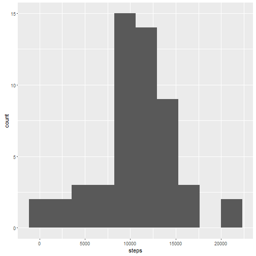
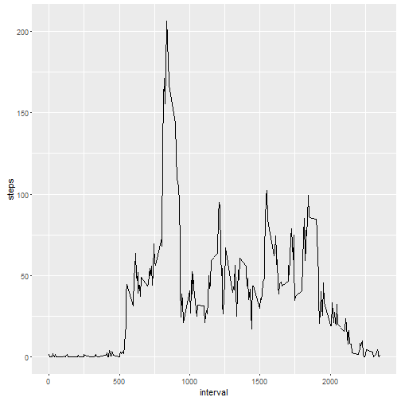
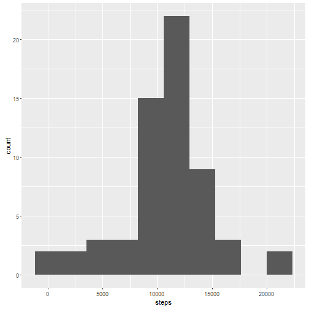
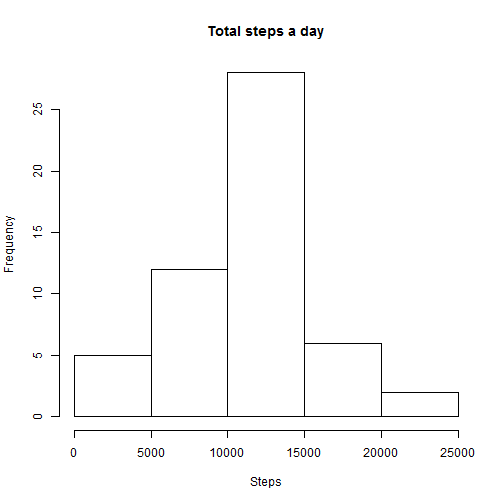

### About the Data Set

It is now possible to collect a large amount of data about personal movement using activity monitoring devices such as a Fitbit, Nike Fuelband, or Jawbone Up. These type of devices are part of the “quantified self” movement – a group of enthusiasts who take measurements about themselves regularly to improve their health, to find patterns in their behavior, or because they are tech geeks. But these data remain under-utilized both because the raw data are hard to obtain and there is a lack of statistical methods and software for processing and interpreting the data.

This assignment makes use of data from a personal activity monitoring device. This device collects data at 5 minute intervals through out the day. The data consists of two months of data from an anonymous individual collected during the months of October and November, 2012 and include **the number of steps taken in 5 minute intervals each day**.

The data for this assignment can be downloaded from the course web site:

* Dataset: [Activity monitoring data](https://d396qusza40orc.cloudfront.net/repdata%2Fdata%2Factivity.zip) [53K]

### Code for reading in the dataset and/or processing the data


```r
df <- read.csv("activity.csv")
df.ignore.na <- df[!is.na(df$steps),]
library(ggplot2)
```

### Histogram of the total number of steps taken each day


```r
df.steps.per.day <- aggregate(steps ~ date, data = df.ignore.na, FUN = sum, na.rm = TRUE)
ggplot(df.steps.per.day, aes(steps)) + geom_histogram(bins = 10)
```



```r
steps.mean.per.day <- mean(df.steps.per.day$steps)
steps.median.per.day <- median(df.steps.per.day$steps)
```

### Mean and median number of steps taken each day

The mean of the steps is **1.0766189 &times; 10<sup>4</sup>** and the median is **10765**.

### Time series plot of the average number of steps taken


```r
df.steps.per.interval <- aggregate(steps ~ interval, data = df.ignore.na, FUN = mean)
ggplot(df.steps.per.interval, aes(interval, steps)) + geom_line()
```



```r
max.index <- which.max(df.steps.per.interval$steps)
max.item <- df.steps.per.interval[max.index,]
```

### The 5-minute interval that, on average, contains the maximum number of steps

The interval **835** contains **206.1698113** steps, which is the most.

### Code to describe and show a strategy for imputing missing data

First, we need to roughly analysis the data.


```r
steps.na <- sum(is.na(df$steps))
date.na <- sum(is.na(df$date))
interval.na <- sum(is.na(df$interval))
```

We can see that there are **2304** missing in steps column, **0** in date column and **0** in interval column. Missing values only appear in the steps column. So in this case, we can use the **mean value of the same interval** to impute the missing value.

### Histogram of the total number of steps taken each day after missing values are imputed


```r
df.imputed <- df
for (i in 1:nrow(df.imputed)) {
    if (is.na(df.imputed[i,]$steps)) {
        df.imputed[i,]$steps <- df.steps.per.interval[which(df.steps.per.interval$interval == df.imputed[i,]$interval),]$steps
    }
}
df.imputed.steps.per.day <- aggregate(steps ~ date, data = df.imputed, FUN = sum)
ggplot(df.imputed.steps.per.day, aes(steps)) + geom_histogram(bins = 10)
```



```r
steps.imputed.mean.per.day <- mean(df.imputed.steps.per.day$steps)
steps.imputed.median.per.day <- median(df.imputed.steps.per.day$steps)
```

The mean of the steps is **1.0766189 &times; 10<sup>4</sup>** and the median is **1.0766189 &times; 10<sup>4</sup>**. Compared with the original data, the mean and median value is basically the same.

### Panel plot comparing the average number of steps taken per 5-minute interval across weekdays and weekends

```r
weekend.or.weekday <- function(date) {
    if (format(as.Date(date), "%w") %in% c(6, 0)) {
        "weekend"
    } else {
        "weekday"
    }
}
df.imputed$weekday <- as.factor(sapply(df.imputed$date, weekend.or.weekday))
df.imputed.steps.per.interval <- aggregate(steps ~ interval + weekday, data = df.imputed, FUN = mean)
ggplot(df.imputed.steps.per.interval, aes(interval, steps)) + geom_line(aes(color = weekday), size = 1)
```



That's all ~
