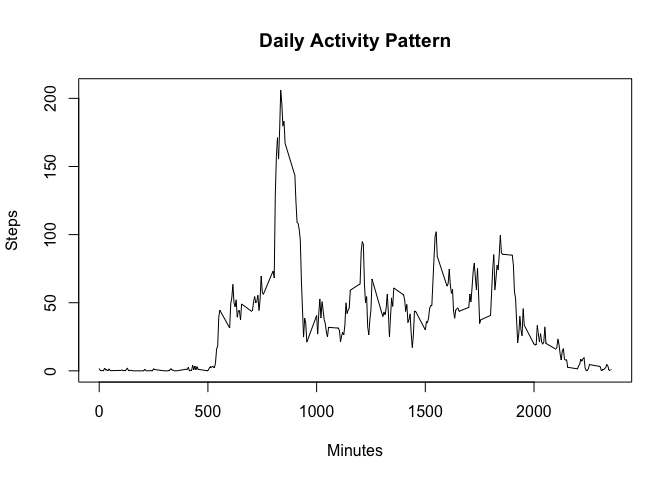

## Loading and preprocessing the data
The data were previously supplied and can be downloaded from the course website 
using this direct link: [Activity monitoring data](https://d396qusza40orc.cloudfront.net/repdata%2Fdata%2Factivity.zip).  

* Alternatively, the following code creates a data file, downloads and then 
unzips the data:

```r
if(!file.exists("./data")){dir.create("./data")}

fileUrl = "https://d396qusza40orc.cloudfront.net/repdata%2Fdata%2Factivity.zip"
download.file(fileUrl, destfile = "./data/activity.zip", method = "curl")

unzip(zipfile = "activity.zip")
```

* To see the content of the activity data, first load it and view the structure:

```r
activity <- read.csv("activity.csv", header = TRUE, na.strings = "NA")
str(activity)
```

```
## 'data.frame':	17568 obs. of  3 variables:
##  $ steps   : int  NA NA NA NA NA NA NA NA NA NA ...
##  $ date    : chr  "2012-10-01" "2012-10-01" "2012-10-01" "2012-10-01" ...
##  $ interval: int  0 5 10 15 20 25 30 35 40 45 ...
```

* Notice the date variable is classed as 'character' - this should be 
transformed into date format to be used in later calculations _(the NA values
in the steps variable can be dealt with later)_:

```r
activity$date <- as.Date(activity$date)
str(activity$date)
```

```
##  Date[1:17568], format: "2012-10-01" "2012-10-01" "2012-10-01" "2012-10-01" "2012-10-01" ...
```

## What is mean total number of steps taken per day?
1. Calculate the total number of steps taken per day

```r
totalSteps <- aggregate(steps ~ date, activity, sum)
head(totalSteps)
```

```
##         date steps
## 1 2012-10-02   126
## 2 2012-10-03 11352
## 3 2012-10-04 12116
## 4 2012-10-05 13294
## 5 2012-10-06 15420
## 6 2012-10-07 11015
```


2. If you do not understand the difference between a histogram and a barplot, 
research the difference between them. Make a histogram of the total number of 
steps taken each day

```r
hist(totalSteps$steps,
     xlab = "Steps per day",
     main = "Total number of steps per day")
```

<!-- -->


3. Calculate and report the mean and median of the total number of steps taken 
per day

```r
stepsMean <- mean(totalSteps$steps, na.rm = TRUE)

stepsMedian <- median(totalSteps$steps, na.rm = TRUE)
```
* The calculations above show: 
  * the __*mean*__ of total steps taken per day is 1.0766\times 10^{4} steps.  
  _(Note: I don't know why the mean returns an exponential number. In the console it shows a whole number (10766))_  
  * the __*median*__ of total steps taken per day is 10765 steps.  

* Another option is to run `summary()` code shown below,which will yield the 
 mean and median, along with additional statistics:

```r
summary(totalSteps$steps)
```

```
##    Min. 1st Qu.  Median    Mean 3rd Qu.    Max. 
##      41    8841   10765   10766   13294   21194
```
 

## What is the average daily activity pattern?
1. Make a time series plot (i.e. \color{red}{\verb|type = "l"|}type = "l") of 
the 5-minute interval (x-axis) and the average number of steps taken, averaged 
across all days (y-axis)

```r
# create mean of steps per interval
meanIntervalSteps <- aggregate(steps ~ interval, 
                               data=activity, 
                               FUN="mean", 
                               na.exclude=TRUE)
# create plot
with(meanIntervalSteps,
     plot(interval, steps, 
          type = "l", 
          xlab = "5-minute Intervals",
          ylab = "Average Number of Steps taken",
          main = "Steps per Interval across all days"))
```

<!-- -->

2. Which 5-minute interval, on average across all the days in the dataset, 
contains the maximum number of steps?

```r
maxStepsInterval <- meanIntervalSteps$interval[
        which.max(meanIntervalSteps$steps)]

maxSteps <- round(max(meanIntervalSteps$steps))
```
* The 5-minute interval 835 contains the maximum steps (206)


## Imputing missing values
1. Calculate and report the total number of missing values in the dataset (i.e. 
the total number of rows with \color{red}{\verb|NA|}NAs)

```r
missVal <- sum(is.na(activity))
```
* The missing values (NA) equate to 2304 in the activity dataset.

* The NA values can also be shown using the `summary()` command on the activity 
data frame, where it can be seen that the only variable that contains them is 
the 'steps' variable:

```r
summary(activity)
```

```
##      steps             date               interval     
##  Min.   :  0.00   Min.   :2012-10-01   Min.   :   0.0  
##  1st Qu.:  0.00   1st Qu.:2012-10-16   1st Qu.: 588.8  
##  Median :  0.00   Median :2012-10-31   Median :1177.5  
##  Mean   : 37.38   Mean   :2012-10-31   Mean   :1177.5  
##  3rd Qu.: 12.00   3rd Qu.:2012-11-15   3rd Qu.:1766.2  
##  Max.   :806.00   Max.   :2012-11-30   Max.   :2355.0  
##  NA's   :2304
```

2. Devise a strategy for filling in all of the missing values in the dataset. 
The strategy does not need to be sophisticated. For example, you could use the 
mean/median for that day, or the mean for that 5-minute interval, etc.

```r
# create data set so as to destroy the original
fillMissVal <- activity

# replace NA with previous mean steps calculation (rounded to whole numbers)
fillMissVal[is.na(fillMissVal)] <- round(meanIntervalSteps$steps)
str(fillMissVal)
```

```
## 'data.frame':	17568 obs. of  3 variables:
##  $ steps   : num  2 0 0 0 0 2 1 1 0 1 ...
##  $ date    : Date, format: "2012-10-01" "2012-10-01" ...
##  $ interval: int  0 5 10 15 20 25 30 35 40 45 ...
```

3. Create a new dataset that is equal to the original dataset but with the 
missing data filled in.

```r
activityNew <- fillMissVal
head(activityNew)   # New data set
```

```
##   steps       date interval
## 1     2 2012-10-01        0
## 2     0 2012-10-01        5
## 3     0 2012-10-01       10
## 4     0 2012-10-01       15
## 5     0 2012-10-01       20
## 6     2 2012-10-01       25
```

```r
head(activity)      # Comparing the original data set
```

```
##   steps       date interval
## 1    NA 2012-10-01        0
## 2    NA 2012-10-01        5
## 3    NA 2012-10-01       10
## 4    NA 2012-10-01       15
## 5    NA 2012-10-01       20
## 6    NA 2012-10-01       25
```

4a. Make a histogram of the total number of steps taken each day and Calculate 
and report the mean and median total number of steps taken per day.

```r
# 
totalStepsNew <- aggregate(steps ~ date, activityNew, sum)
head(totalStepsNew)
```

```
##         date steps
## 1 2012-10-01 10762
## 2 2012-10-02   126
## 3 2012-10-03 11352
## 4 2012-10-04 12116
## 5 2012-10-05 13294
## 6 2012-10-06 15420
```

```r
hist(totalStepsNew$steps,
     xlab = "Steps per day (new values added)",
     main = "Total number of steps per day with NA values replaced")
```

<!-- -->

```r
stepsMeanNew <- mean(totalStepsNew$steps) # no NA's to remove

stepsMedianNew <- median(totalStepsNew$steps)
```
* The calculations for the average number of steps taken according to the new 
data set show:
  * __Mean__ = 1.0765639\times 10^{4} _(Same problem with number, as previous)_
  * __Median__ = 1.0762\times 10^{4}

* Again, `summary()` gives the information required:

```r
summary(totalStepsNew$steps)
```

```
##    Min. 1st Qu.  Median    Mean 3rd Qu.    Max. 
##      41    9819   10762   10766   12811   21194
```
4b. Do these values differ from the estimates from the first part of the 
assignment?

* recap the summary of the original:

```r
summary(totalSteps$steps)
```

```
##    Min. 1st Qu.  Median    Mean 3rd Qu.    Max. 
##      41    8841   10765   10766   13294   21194
```
4c. What is the impact of imputing missing data on the estimates of the total 
daily number of steps?

* and the difference between the two summaries:

```r
diff <- summary(totalSteps$steps) - summary(totalStepsNew$steps)
diff
```

```
##      Min.   1st Qu.    Median      Mean   3rd Qu.      Max. 
##    0.0000 -978.0000    3.0000    0.5493  483.0000    0.0000
```

* In this example there is no difference between the minimum and maximum steps
taken. However, deducting the summaries shows that there were 978 fewer steps
taken in the 1st quartile; and 483 extra steps taken in the 3rd quartile. The 
median step count increased by 3 steps; and the mean half-step increase (0.55) 
can be discounted due to measuring full steps.

## Are there differences in activity patterns between weekdays and weekends?
1. Create a new factor variable in the dataset with two levels – “weekday” and 
“weekend” indicating whether a given date is a weekday or weekend day.

```r
library(dplyr)
```

```
## Warning: package 'dplyr' was built under R version 4.0.2
```

```
## 
## Attaching package: 'dplyr'
```

```
## The following objects are masked from 'package:stats':
## 
##     filter, lag
```

```
## The following objects are masked from 'package:base':
## 
##     intersect, setdiff, setequal, union
```

```r
days <- weekdays(activityNew$date) # create variable for days of the week
activityDays <- mutate(activityNew, days) # add 'days' to "activityNew" in new df

# replace days names with "weekday" or "weekend"
for (i in 1:nrow(activityDays)) {
    if (activityDays[i,]$days %in% c("Saturday","Sunday")) {
        activityDays[i,]$days <- "weekend"
    }
    else{
        activityDays[i,]$days <- "weekday"
    }
}
activityDays$days <- as.factor(activityDays$days) # change class from character to factor

table(activityDays$days) # output
```

```
## 
## weekday weekend 
##   12960    4608
```


2. Make a panel plot containing a time series plot 
(i.e. \color{red}{\verb|type = "l"|}type = "l") of the 5-minute interval 
(x-axis) and the average number of steps taken, averaged across all weekday days
or weekend days (y-axis). See the README file in the GitHub repository to see an
example of what this plot should look like using simulated data.

```r
meanDaySteps <- aggregate(steps ~ interval + days,
                          data=activityDays, "mean")
```

```r
library(lattice)
xyplot(steps ~ interval | days, meanDaySteps,
       layout = c(1,2), 
       xlab = "Interval", 
       ylab = "Number of Steps", 
       type = "l")
```

<!-- -->
