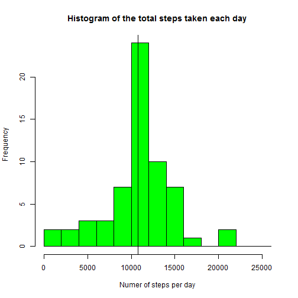
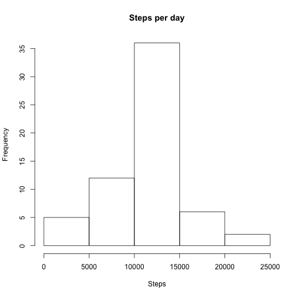

# PA1 Template

##### Scott Brown

This is an analysis of data from a personal activity monitoring device. The device collected data at 5 minute intervals through out the day. The data consists of two months of data from an anonymous individual collected during the months of October and November, 2012 and include the number of steps taken in 5 minute intervals each day.

## Loading the data

The dataset activity.csv was copied to the working directory from 
https://d396qusza40orc.cloudfront.net/repdata%2Fdata%2Factivity.zip on Oct 5, 2015 at 10:21am PDT

Load needed libraries and read the data using read.csv and convert the date to type Date


```r
library(dplyr)
library(ggplot2)
activity <- read.csv("activity.csv")
activity$date <- as.Date(activity$date)
```
## Daily steps

The following histogram shows the total number of steps taken per day.  The most frequent total is between 10,000 and 15,000 steps. 


```r
byDay <- group_by(activity,date)  
sumData <- summarize(byDay, sum(steps))
names(sumData) <- c("date","TotalSteps")
hist(sumData$TotalSteps,col="green",xlab="Total Steps per day",
     main="Total steps")
```

 

The mean and median are very close together at 10766.2 and 10765 respectively.


```r
print (paste("Mean steps per day: ",mean(sumData$TotalSteps,na.rm=TRUE)))
```

```
## [1] "Mean steps per day:  10766.1886792453"
```

```r
print (paste("Median steps per day: ",median(sumData$TotalSteps,na.rm=TRUE)))
```

```
## [1] "Median steps per day:  10765"
```
## Daily Activity Pattern

The following is a time series plot of the 5-minute intervals and the average number of steps taken, averaged across all days.  It shows a spike in activity around interval 800.


```r
byDaySteps <- group_by(activity,interval)
sumData <- summarize(byDaySteps, mean(steps,na.rm=TRUE))
names(sumData) <- c("interval","meanSteps")
with (sumData, plot(interval,meanSteps,col="green",type="l",
                    main = "Steps per interval",
                    ylab="Average Steps",lwd=2))
```

 

On average across all the days in the dataset, interval 835 had the most steps with an average of 206.17


```r
subset(sumData,sumData$meanSteps == max(sumData$meanSteps))
```

```
## Source: local data frame [1 x 2]
## 
##   interval meanSteps
## 1      835  206.1698
```
## Imputed missing values

The data set has 2304 missing values in the steps column


```r
sapply(activity, function(x) sum(is.na(x)))
```

```
##    steps     date interval 
##     2304        0        0
```

The dataset was modified to add estimates for the missing values by using the mean for that 5-minute interval for rows that an NA value for steps.


```r
for (i in seq(1,nrow(activity))){
    if (is.na(activity$steps[i])){
        j <- activity$interval[i]
        activity$steps[i] <- 
                sumData$meanSteps[grep(j,sumData$interval,fixed=TRUE)[1]]
  }
}
```

After imputing the missing data, the histogram, mean and median were recomputed.  While there are more observations, the results do not differ significantly from the first analysis.  The mean remains the same at 10766.2 and the median is now equal to the mean. 


```r
byDay <- group_by(activity,date)  
sumData <- summarize(byDay, sum(steps))
names(sumData) <- c("date","TotalSteps")

hist(sumData$TotalSteps,col="green",xlab="Total Steps per day",
     main="Total steps")
```

 

```r
print (paste("Mean steps per day: ",mean(sumData$TotalSteps)))
```

```
## [1] "Mean steps per day:  10766.1886792453"
```

```r
print (paste("Median steps per day: ",median(sumData$TotalSteps)))
```

```
## [1] "Median steps per day:  10766.1886792453"
```
## Weekday vs weekend activity

A new factor variable was added to the dataset with two levels – “weekday” and “weekend” indicating whether a given date is a weekday or weekend day.


```r
activity$wkd <- weekdays(activity$date)
for (i in seq(1,nrow(activity))){
    if (activity$wkd[i] == "Saturday" | activity$wkd[i] == "Sunday"){
        activity$dayType[i] <- "Weekend"
    } else {
        activity$dayType[i] <- "Weekday"
    }
}
```

The following plot compares activity levels by intervals for weekdays vs weekends.  The activity spike at interval 835 only occurs on weekdays.  Weekend activity starts later in the day and is more uniform throughout the day


```r
byDaySteps <- group_by(activity,dayType, interval)
sumData <- summarize(byDaySteps, mean(steps))
names(sumData) <- c("dayType","interval","meanSteps")
g<-ggplot(sumData,aes(x=interval,y=meanSteps,dayType=dayType))

g + facet_grid(dayType~.)  + geom_line(aes(color=dayType)) +
  labs(title="Weekday vs Weekend steps") +
  labs(y = "Average Steps")
```

 
