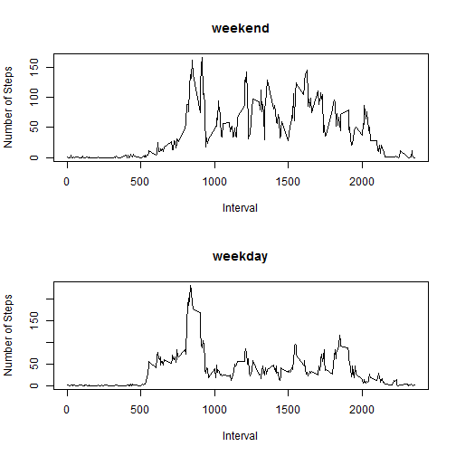
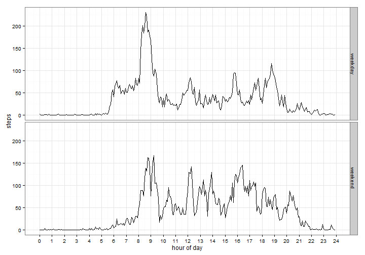

#Reproducible Research - Peer Assessment 1


###Loading and preprocessing the data

For the purpose of this exercise it is assumed that the activity monitoring dataset has been downloaded from the [URL](https://d396qusza40orc.cloudfront.net/repdata%2Fdata%2Factivity.zip) provided in the Peer Assessment 1 instructions and unzipped into the working directory. After the data is loaded into R, a first look is taken at some of its general characteristics to determine the necessary steps for preprocessing.


```r
data <- read.csv("activity.csv")
head(data)
```

```
##   steps       date interval
## 1    NA 2012-10-01        0
## 2    NA 2012-10-01        5
## 3    NA 2012-10-01       10
## 4    NA 2012-10-01       15
## 5    NA 2012-10-01       20
## 6    NA 2012-10-01       25
```

```r
str(data)
```

```
## 'data.frame':	17568 obs. of  3 variables:
##  $ steps   : int  NA NA NA NA NA NA NA NA NA NA ...
##  $ date    : Factor w/ 61 levels "2012-10-01","2012-10-02",..: 1 1 1 1 1 1 1 1 1 1 ...
##  $ interval: int  0 5 10 15 20 25 30 35 40 45 ...
```

There are 61 factor levels in the *date* variable, so the dataset consists of observations for 61 days.


```r
summary(data)
```

```
##      steps                date          interval     
##  Min.   :  0.00   2012-10-01:  288   Min.   :   0.0  
##  1st Qu.:  0.00   2012-10-02:  288   1st Qu.: 588.8  
##  Median :  0.00   2012-10-03:  288   Median :1177.5  
##  Mean   : 37.38   2012-10-04:  288   Mean   :1177.5  
##  3rd Qu.: 12.00   2012-10-05:  288   3rd Qu.:1766.2  
##  Max.   :806.00   2012-10-06:  288   Max.   :2355.0  
##  NA's   :2304     (Other)   :15840
```

Clearly there are some missing values in the *steps* variable of the dataset. As there are 288 observations per date and the number of NA values (2304) is a multiple of 288, it appears that data is missing for eight of the dates contained in the dataset. In this case the NAs will be dealt with at a later point, as there are some specific assignments regarding the missing values. It can also be seen that the *date* column is not yet in a date format, so it needs to be transformed.


```r
data$date <- as.Date(data$date,"%Y-%m-%d")
```

Furthermore, the 5-minute intervals need to be transformed as well to avoid problems when plotting the data. First, all values are converted into a *hh:mm* format. 


```r
data$interval <- as.character(formatC(data$interval,width=4,format="d",flag="0",big.mark=":",big.interval=2L))
head(data)
```

```
##   steps       date interval
## 1    NA 2012-10-01    00:00
## 2    NA 2012-10-01    00:05
## 3    NA 2012-10-01    00:10
## 4    NA 2012-10-01    00:15
## 5    NA 2012-10-01    00:20
## 6    NA 2012-10-01    00:25
```

They are then changed to time periods using the hm() function from the lubridate package. In a final step, they are transformed back into 5-min intervals.


```r
library(lubridate)
data$interval <- hm(data$interval)
data$interval <- period_to_seconds(data$interval)/60
head(data)
```

```
##   steps       date interval
## 1    NA 2012-10-01        0
## 2    NA 2012-10-01        5
## 3    NA 2012-10-01       10
## 4    NA 2012-10-01       15
## 5    NA 2012-10-01       20
## 6    NA 2012-10-01       25
```

The intervals are now shown as periods ranging from 0 to 1435 minutes for each day and the data is ready for further analyses.

###What is mean total number of steps taken per day?

In order to answer this question the data first needs to be grouped into the individual days. This is done with the dplyr package.


```r
library(dplyr)
data <- group_by(data,date)
```
Then the sum of total steps is calculated for each group (= each day). Missing values are ignored in this case.

```r
totalsteps <- summarise_each(data,funs(sum(.,na.rm=TRUE)),steps)
head(totalsteps)
```

```
## Source: local data frame [6 x 2]
## 
##         date steps
## 1 2012-10-01     0
## 2 2012-10-02   126
## 3 2012-10-03 11352
## 4 2012-10-04 12116
## 5 2012-10-05 13294
## 6 2012-10-06 15420
```

```r
hist(totalsteps$steps,breaks=20,xlim=c(0,25000))
mean <- mean(totalsteps$steps)
median <- median(totalsteps$steps)
abline(v=mean,col="red",lwd=2)
text(8000,10.2,"mean",col = "red")
abline(v=median,col="blue",lwd=2)
text(12000,10.2,"median",col = "blue")
```

 

The mean of the total number of steps taken each day is  9354.23, and the median is  10395 steps.

###What is the average daily activity pattern?
In order to look at the daily activity pattern the data is grouped by the 5-minute intervals and the average number of steps is calculated for each interval. Missing values are, once again, ignored.

```r
data <- group_by(data,interval)
intervalmean <- summarise_each(data,funs(mean(.,na.rm=TRUE)),steps)
head(intervalmean)
```

```
## Source: local data frame [6 x 2]
## 
##   interval     steps
## 1        0 1.7169811
## 2        5 0.3396226
## 3       10 0.1320755
## 4       15 0.1509434
## 5       20 0.0754717
## 6       25 2.0943396
```

The relationship between the time intervals and the average number of steps taken is shown in a time series plot.

```r
with(intervalmean,plot(interval/60,steps,"l",xlab="hour of day"))
axis(1,at=1:24)
```

 

As shown below, interval 515, which starts at 8.35 am, contains the maximum number of steps of any 5-minute interval on average across all the days in the dataset.


```r
intervalmean[which.max(intervalmean$steps),]
```

```
## Source: local data frame [1 x 2]
## 
##   interval    steps
## 1      515 206.1698
```

###Imputing missing values
Since TRUE equals 1 when a logical vector is coerced into an integer vector, adding up the output of the is.na() function shows the number of total missing values in the dataset.


```r
sum(is.na(data))
```

```
## [1] 2304
```

This equals the number of missing values found in the *steps* variable after running the summary() function on the dataset (see above). Missing values are filled in by using the mean for the correspondent 5-minute interval.


```r
filledindata <- data
while(sum(is.na(filledindata))>0){
  filledindata$steps[is.na(filledindata$steps)] <-
    intervalmean$steps[intervalmean$interval==filledindata$interval[is.na(filledindata$steps)]]
}
sum(is.na(filledindata))
```

```
## [1] 0
```

So as proven by the 0 above, the missing values have now been filled in. Below there is a comparison of the first couple of rows of the original dataset, the data that was used to fill in its missing values, and the resulting dataset that no longer contains any NAs.


```r
head(data)
```

```
## Source: local data frame [6 x 3]
## 
##   steps       date interval
## 1    NA 2012-10-01        0
## 2    NA 2012-10-01        5
## 3    NA 2012-10-01       10
## 4    NA 2012-10-01       15
## 5    NA 2012-10-01       20
## 6    NA 2012-10-01       25
```

```r
head(intervalmean)
```

```
## Source: local data frame [6 x 2]
## 
##   interval     steps
## 1        0 1.7169811
## 2        5 0.3396226
## 3       10 0.1320755
## 4       15 0.1509434
## 5       20 0.0754717
## 6       25 2.0943396
```

```r
head(filledindata)
```

```
## Source: local data frame [6 x 3]
## 
##       steps       date interval
## 1 1.7169811 2012-10-01        0
## 2 0.3396226 2012-10-01        5
## 3 0.1320755 2012-10-01       10
## 4 0.1509434 2012-10-01       15
## 5 0.0754717 2012-10-01       20
## 6 2.0943396 2012-10-01       25
```

```r
filledindata <- group_by(filledindata,date)
totalstepsnew <- summarise_each(filledindata,funs(sum),steps)
head(totalstepsnew)
```

```
## Source: local data frame [6 x 2]
## 
##         date    steps
## 1 2012-10-01 10766.19
## 2 2012-10-02   126.00
## 3 2012-10-03 11352.00
## 4 2012-10-04 12116.00
## 5 2012-10-05 13294.00
## 6 2012-10-06 15420.00
```

```r
hist(totalstepsnew$steps,breaks=20,xlim=c(0,25000),ylim=c(0,20))
meannew <- mean(totalstepsnew$steps)
mediannew <- median(totalstepsnew$steps)
abline(v=meannew,col="red",lwd=2)
text(9000,20,"mean",col="red")
abline(v=mediannew,col="blue",lty=2,lwd=2)
text(13000,20,"median",col="blue")
```

 

Both the mean and the median of the total number of steps taken each day have changed for the filled-in dataset. The mean now is  10766.19 instead of 9354.23 steps in the dataset with the missing values. The median has shifted from 10395 to 10766.19 steps. After imputing the missing values the mean and the median are now identical. 10766.19 is also the total number of steps taken in a day for which all values were missing and imputed with the means of the corresponding 5-minute intervals. The 10000 to 11000 steps bin that contains these days now has clearly increased compared with the histogram of the original dataset. Simultaneously, the number of cases in the 0 to 1000 steps bin has decreased significantly. It appears that the NA values were treated as zeros in the original histogram.

###Are there differences in activity patterns between weekdays and weekends?
Below a column is added to the filled-in dataset. It determines whether a specific date is a weekday or a weekend day.


```r
filledindata$day <- ifelse(weekdays(filledindata$date)!="Saturday"&weekdays(filledindata$date)!="Sunday","weekday","weekend")
filledindata <- transform(filledindata, day = factor(day))
str(filledindata)
```

```
## 'data.frame':	17568 obs. of  4 variables:
##  $ steps   : num  1.717 0.3396 0.1321 0.1509 0.0755 ...
##  $ date    : Date, format: "2012-10-01" "2012-10-01" ...
##  $ interval: num  0 5 10 15 20 25 30 35 40 45 ...
##  $ day     : Factor w/ 2 levels "weekday","weekend": 1 1 1 1 1 1 1 1 1 1 ...
```

To address this question the data is first grouped by the weekday/weekend day factor variable and secondly by the intervals. Means are calculated for each interval attributed to weekday days and each interval in weekend days.


```r
filledindata <- group_by(filledindata,day,interval)
meanweekday <- summarise_each(filledindata,funs(mean),steps)
library(ggplot2)
```

In the plot below, which compares the 5-minute intervals of weekday and weekend days, some obvious differences in the activity patterns are visible. For example, activities start earlier on weekday days, but appear to be more evenly distributed over the course of the waking hours on weekends.


```r
p <- ggplot(meanweekday,aes(interval/60,steps)) +
  geom_line() +
  facet_grid(day~.) +
  theme_bw() +
  scale_x_continuous(breaks=seq(0, 24, 1)) +
  xlab("hour of day")
p
```

 
