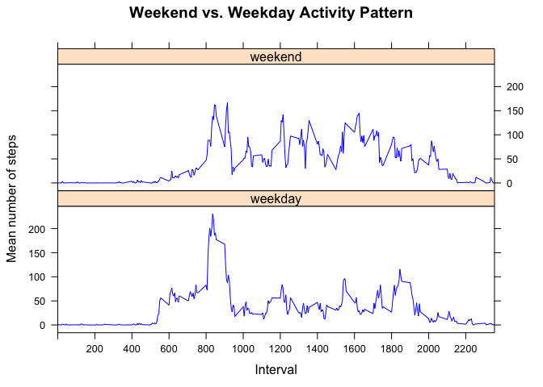

# Reproducible Research: Peer Assessment 1
Sylvester Cash  
March 6, 2016  

## Loading and processing the data

1. Load required library packages

```r
library(ggplot2)
library(knitr)
library(lubridate)
library(dplyr)
```

```
## 
## Attaching package: 'dplyr'
```

```
## The following objects are masked from 'package:lubridate':
## 
##     intersect, setdiff, union
```

```
## The following objects are masked from 'package:stats':
## 
##     filter, lag
```

```
## The following objects are masked from 'package:base':
## 
##     intersect, setdiff, setequal, union
```

```r
library(rmarkdown)
```

load data file

```r
data <- read.csv("activity.csv", header = TRUE, sep = ',', colClasses = c("numeric", "character", "integer"))
```

2. Change date format 

```r
data$date <- ymd(data$date)
```

## What is mean total number of steps taken per day?

1. Calculate steps take per day

```r
steps <- data %>%
  filter(!is.na(steps)) %>%
  group_by(date) %>%
  summarize(steps = sum(steps)) %>%
  print
```

```
## Source: local data frame [53 x 2]
## 
##          date steps
##        (time) (dbl)
## 1  2012-10-02   126
## 2  2012-10-03 11352
## 3  2012-10-04 12116
## 4  2012-10-05 13294
## 5  2012-10-06 15420
## 6  2012-10-07 11015
## 7  2012-10-09 12811
## 8  2012-10-10  9900
## 9  2012-10-11 10304
## 10 2012-10-12 17382
## ..        ...   ...
```

2. Create plot for total steps taken per day

```r
ggplot(steps, aes(x = steps)) +
geom_histogram(fill = "blue", binwidth = 1000) +
labs(title = "Total Number of Steps Taken Per Day", x = "Steps Per Day", y = "Frequency")
```


3. Calculate and print mean of the total step taken per day

```r
meanSteps <- mean(steps$steps, na.rm = TRUE)
meanSteps
```

```
## [1] 10766.19
```

Calculate and print median of the total steps taken per day

```r
medianSteps <- median(steps$steps, na.rm = TRUE)
medianSteps
```

```
## [1] 10765
```

## What is the average daily activity pattern?

1. Average number of steps taken averaged accross all days

```r
interval <- data %>%
filter(!is.na(steps)) %>%
group_by(interval) %>%
summarize(steps = mean(steps))
```

Create Plot for above scenario

```r
ggplot(interval, aes(x=interval, y=steps)) +
  geom_line(color = "blue")
```


2. Five minute interval,on average across all days in subset, contains the maximum nimber of steps

```r
interval[which.max(interval$steps),]
```

```
## Source: local data frame [1 x 2]
## 
##   interval    steps
##      (int)    (dbl)
## 1      835 206.1698
```

## Imputing missing values

1. Calculate and report the total number of missing values

```r
sum(is.na(data$steps))
```

```
## [1] 2304
```

2. Fill in all the missing values in the data set

```r
data_full <- data
nas <- is.na(data_full$steps)
avg_interval <- tapply(data_full$steps, data_full$interval, mean, na.rm=TRUE, simplify=TRUE)
data_full$steps[nas] <- avg_interval[as.character(data_full$interval[nas])]
```

Validate that there are no missing values

```r
sum(is.na(data$steps))
```

```
## [1] 2304
```

3. Create new data set that is eaual to the original dataset but with the missing values filled in

```r
data_full <- data
nas <- is.na(data_full$steps)
avg_interval <- tapply(data_full$steps, data_full$interval, mean, na.rm=TRUE, simplify=TRUE)
data_full$steps[nas] <- avg_interval[as.character(data_full$interval[nas])]
```

Validate that there are no missing values

```r
sum(is.na(data_full$steps))
```

```
## [1] 0
```

4. Create histogram of the total number of steps taken each day 

```r
steps_full <- data_full %>%
filter(!is.na(steps)) %>%
group_by(date) %>%
summarize(steps = sum(steps)) %>%
print
```

```
## Source: local data frame [61 x 2]
## 
##          date    steps
##        (time)    (dbl)
## 1  2012-10-01 10766.19
## 2  2012-10-02   126.00
## 3  2012-10-03 11352.00
## 4  2012-10-04 12116.00
## 5  2012-10-05 13294.00
## 6  2012-10-06 15420.00
## 7  2012-10-07 11015.00
## 8  2012-10-08 10766.19
## 9  2012-10-09 12811.00
## 10 2012-10-10  9900.00
## ..        ...      ...
```

```r
ggplot(steps_full, aes(x = steps)) +
geom_histogram(fill = "blue", binwidth = 1000) +
labs(title = "Total Number of Steps Taken Each Day (Including Missing Values)", x = "Steps Per day", y = "Frequency")
```


Calculate and report the mean total number of steps taken per day

```r
mean_steps_full <- mean(steps_full$steps, na.rm = TRUE)
mean_steps_full
```

```
## [1] 10766.19
```

Calculate and report the median number of steps taken per day

```r
median_steps_full <- median(steps_full$steps, na.rm = TRUE)
median_steps_full
```

```
## [1] 10766.19
```

Do these values differ from the estimates from the first part of the assignment?
There is negligible difference in these values versus the estimates from the first part of the assignment.(current values: mean=10766.19 and median=10766.19 versus ealier values: mean=10766.19, mmedian=10765 versus mean=)

What is the impact of imputing missing data on the estimates of the total daily number of steps
There is no impact to imputing missing data on the estimates of the total daily number of steps

##Are there differences in activity patterns between weekdays and weekends?

1. Create a new factor variable in the dataset with two levels – “weekday” and “weekend” indicating whether a given date is a weekday or weekend day.


```r
data_full <- mutate(data_full, weektype = ifelse(weekdays(data_full$date) == "Saturday" | weekdays(data_full$date) == "Sunday", "weekend", "weekday"))
data_full$weektype <- as.factor(data_full$weektype)
head(data_full)
```

```
##       steps       date interval weektype
## 1 1.7169811 2012-10-01        0  weekday
## 2 0.3396226 2012-10-01        5  weekday
## 3 0.1320755 2012-10-01       10  weekday
## 4 0.1509434 2012-10-01       15  weekday
## 5 0.0754717 2012-10-01       20  weekday
## 6 2.0943396 2012-10-01       25  weekday
```

2. Make a panel plot containing a time series plot of the 5-minute interval (x-axis) and the average number of steps taken, averaged across all weekday days or weekend days. 


```r
interval_full <- data_full %>%
group_by(interval, weektype) %>%
summarise(steps = mean(steps))
s <- ggplot(interval_full, aes(x=interval, y=steps, color = weektype)) +
geom_line() +
facet_wrap(~weektype, ncol=2, nrow=1)
print(s)
```


