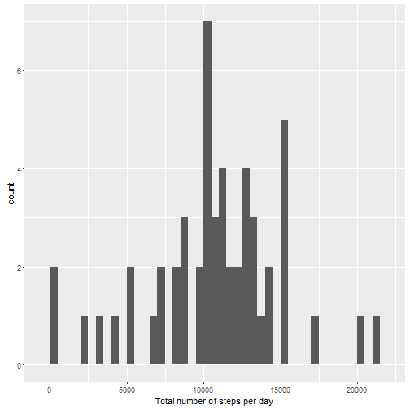
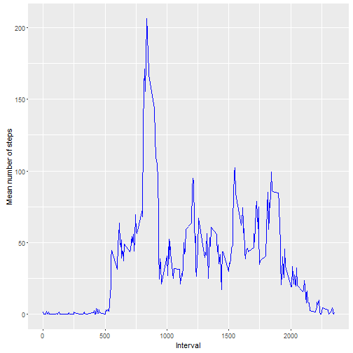
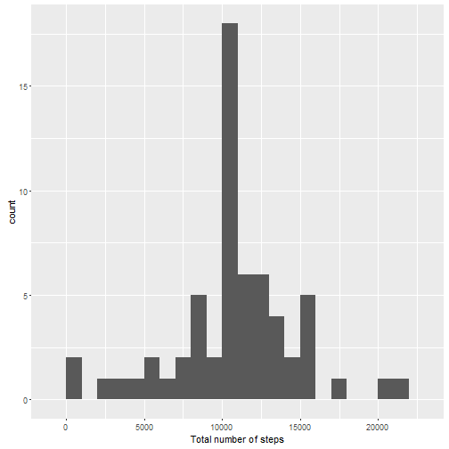
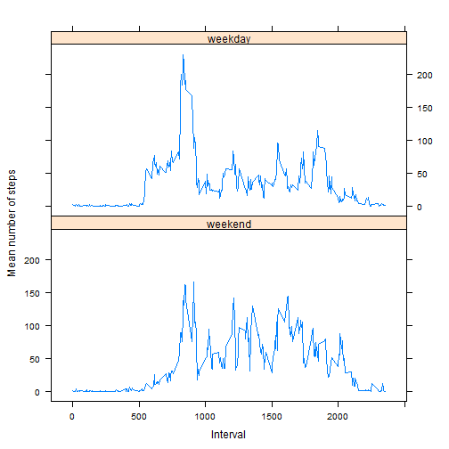

# Assignment: Course Project 1
Submit by January 10, 11:59 PM PT

See [Coursera - Reproducible Research](https://www.coursera.org/learn/reproducible-research/peer/gYyPt/course-project-1) or [GitHub](https://github.com/Maletino/RepData_PeerAssessment1) for more details.

## Introduction

It is now possible to collect a large amount of data about personal movement using activity monitoring devices such as a [Fitbit](http://www.fitbit.com/), [Nike Fuelband](http://www.nike.com/us/en_us/c/nikeplus-fuelband), or [Jawbone Up](https://jawbone.com/up). These type of devices are part of the "quantified self" movement - a group of enthusiasts who take measurements about themselves regularly to improve their health, to find patterns in their behavior, or because they are tech geeks. But these data remain under-utilized both because the raw data are hard to obtain and there is a lack of statistical methods and software for processing and interpreting the data.

This assignment makes use of data from a personal activity monitoring device. This device collects data at 5 minute intervals through out the day. The data consists of two months of data from an anonymous individual collected during the months of October and November, 2012 and include the number of steps taken in 5 minute intervals each day.

## Data

The data for this assignment can be downloaded from the course web site:

* Dataset: [Activity monitoring data](https://d396qusza40orc.cloudfront.net/repdata%2Fdata%2Factivity.zip) [52K].

The variables included in this dataset are:

* **steps**: Number of steps taking in a 5-minute interval (missing values are coded as NA)

* **date**: The date on which the measurement was taken in YYYY-MM-DD format

* **interval**: Identifier for the 5-minute interval in which measurement was taken

The dataset is stored in a comma-separated-value (CSV) file and there are a total of 17,568 observations in this dataset.

## Analysis

#### Loading and preprocessing the data

1. Load or read data using `read.csv`


```r
# Load the data

activity <- read.csv("activity.csv")
```

Missing values are ignored or removed from the dataset in this step of the analysis.

2. Process/transform the data (if necessary) into a format suitable for the analysis

**Remove any missing value (NA)**


```r
# removing missing values

good <- complete.cases(activity)
good_activity <- activity[good,]

# Load libraries used, may install respective packages first
# install.packages("plyr")
library(plyr)
# install.packages("dplyr")
library(dplyr)
```

```
## Warning: package 'dplyr' was built under R version 3.2.3
```

```
## 
## Attaching package: 'dplyr'
```

```
## The following objects are masked from 'package:plyr':
## 
##     arrange, count, desc, failwith, id, mutate, rename, summarise,
##     summarize
```

```
## The following objects are masked from 'package:stats':
## 
##     filter, lag
```

```
## The following objects are masked from 'package:base':
## 
##     intersect, setdiff, setequal, union
```

```r
# install.packages("ggplot2")
library(ggplot2)
```

```
## Warning: package 'ggplot2' was built under R version 3.2.3
```

```r
#install.packages("timeDate") 
library(timeDate)
```


#### What is mean total number of steps taken per day?

1. Calculate the total number of steps taken per day


```r
# need dplyr
by_day <- group_by(good_activity, date)
steps_by_day <- summarise(by_day, total_steps_daily = sum(steps))
steps_by_day
```

```
## Source: local data frame [53 x 2]
## 
##          date total_steps_daily
##        (fctr)             (int)
## 1  2012-10-02               126
## 2  2012-10-03             11352
## 3  2012-10-04             12116
## 4  2012-10-05             13294
## 5  2012-10-06             15420
## 6  2012-10-07             11015
## 7  2012-10-09             12811
## 8  2012-10-10              9900
## 9  2012-10-11             10304
## 10 2012-10-12             17382
## ..        ...               ...
```

2. Make a histogram of the total number of steps taken each day


```r
# need plyr and ggplot2 packages

# summarise data
date_summary <- ddply(good_activity, .(date), summarise, total_steps = sum(steps, na.rm = TRUE))

# plot the summary
qplot(total_steps, data = date_summary, xlab = "Total number of steps per day", binwidth = 500) 
```



3. Calculate and report the mean and median total number of steps taken per day


```r
# calculate mean total steps
mean_total_steps <- mean(date_summary$total_steps, na.rm = TRUE)

# calculate median total steps
median_total_steps <- median(date_summary$total_steps, na.rm = TRUE)
```

1. Mean is 10766.19.
2. Median is 10765.


#### What is the average daily activity pattern?

1. Make a time series plot (i.e. `type = "l"`) of the 5-minute interval (x-axis) and the average number of steps taken, averaged across all days (y-axis)


```r
# summarize interval mean
interval_mean <- ddply(activity, .(interval), summarise, mean_steps = mean(steps, na.rm = TRUE))

# plot interval means using ggplot
p <- ggplot(interval_mean, aes(interval, mean_steps))
p + geom_line(color = "blue") + xlab("Interval") + ylab("Mean number of steps")
```



2. Which 5-minute interval, on average across all the days in the dataset, contains the maximum number of steps?


```r
## Function to determine the interval with maximum number of steps
## 
maxinterval <- function(x){
        maxstep = x[1,2]
        maxi = 1
        
        for (i in 2:nrow(x)) 
                if (x[i,2] > maxstep){ 
                        maxi = i
                        maxstep = x[i,2]
                        
                }
        x[maxi,1]
}

# call function to return interval with maximum number of steps
max_interval <- maxinterval(interval_mean)
```

The 5-minute interval with the maximum number of steps is 835.


#### Imputing missing values

Note that there are a number of days/intervals where there are missing values (coded as `NA`). The presence of missing days may introduce bias into some calculations or summaries of the data.

1. Calculate and report the total number of missing values in the dataset (i.e. the total number of rows with `NA`s)


```r
number_missing_values <- sum(!complete.cases(activity))
```

Number of missing values in the dataset is 2304.

2. Strategy for filling in all of the missing values in the dataset.

In this analysis, the mean for a 5-minute interval is used to fill in the missing values.

3. Create a new dataset that is equal to the original dataset but with the missing data filled in.


```r
## This code chunk fills the missing values with the mean number of steps for each 5-minute interval

imputed_activity <- activity
for (i in 1:nrow(imputed_activity)){
        if (is.na(imputed_activity[i,1]))
                for (j in 1:nrow(interval_mean))
                        if (imputed_activity[i,3] == interval_mean[j,1])
                                imputed_activity[i,1] = interval_mean[j,2]
}
```

4. Make a histogram of the total number of steps taken each day and Calculate and report the mean and median total number of steps taken per day. Do these values differ from the estimates from the first part of the assignment? What is the impact of imputing missing data on the estimates of the total daily number of steps?

4a. Make a histogram of the total number of steps taken each day


```r
activity_summary <- ddply(imputed_activity, .(date), summarise, new_total_steps = sum(steps))
qplot(new_total_steps, data = activity_summary, xlab = "Total number of steps", binwidth = 1000)
```



4b. Calculate and report the mean and median total number of steps taken per day


```r
new_mean <- mean(activity_summary$new_total_steps)
new_median <- median(activity_summary$new_total_steps)
```

    1. New mean is 10766.19
    2. New median is 10766.19

The mean remains the same. On the other hand the median changes, in this case, increases slightly as well as it is the same as the mean.


#### Are there differences in activity patterns between weekdays and weekends?

For this part the `weekdays()` function may be of some help here. Use the dataset with the filled-in missing values for this part.

1. Create a new factor variable in the dataset with two levels - "weekday" and "weekend" indicating whether a given date is a weekday or weekend day.


```r
#install.packages("timeDate") 
#library(timeDate)

# Create a new factor variable in the dataset with two levels - "weekday" and "weekend"
imputed_activity$weekdays <- factor(isWeekday(as.Date(as.character(imputed_activity$date), format = "%Y-%m-%d"), wday = 1:5), labels = c("weekend", "weekday"))

## summarize data
imputed_interval_mean <- ddply(imputed_activity, c('weekdays','interval'), summarise, mean_steps = mean(steps, na.rm = TRUE))
```

2. Make a **panel plot** containing a time series plot (i.e. `type = "l"`) of the 5-minute interval (x-axis) and the average number of steps taken, averaged across all weekday days or weekend days (y-axis). 


```r
library(lattice)
xyplot(mean_steps ~ interval | weekdays, data = imputed_interval_mean, type = "l", layout = c(1, 2), xlab = "Interval", ylab = "Mean number of steps")
```


