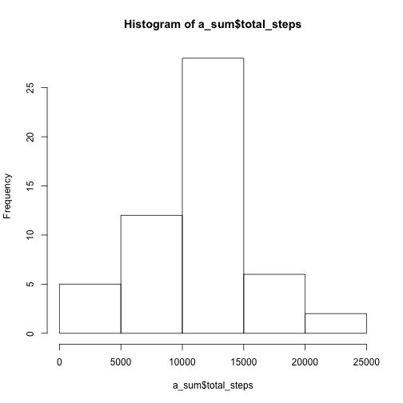
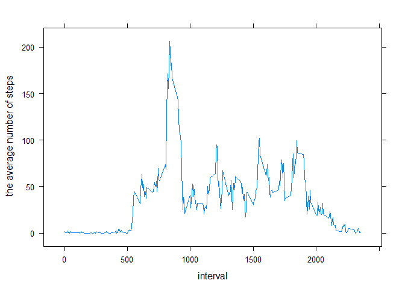
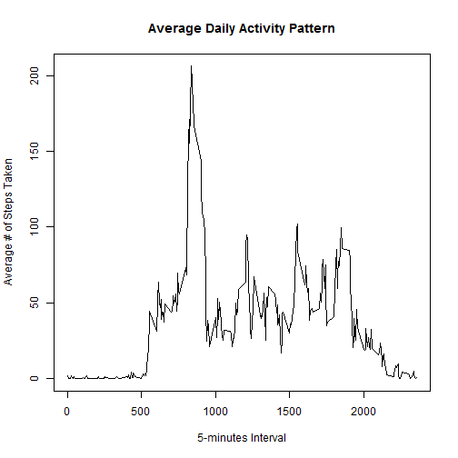
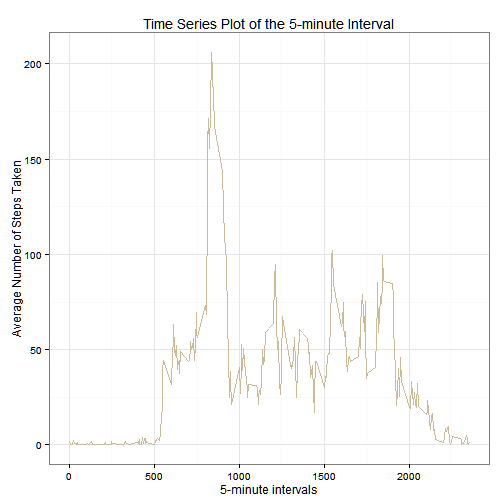

# Reproducible Research Assignment #1
## Authored by Brandon Shelton
========================================================

This is an analysis of steps taken while wearing a personal activity monitoring device.

## Loading and preprocessing the data

Through this process we will:

1. Load our necessary packages
2. Set our working directory loctaion
3. Unzip and read the "activity" csv file from the URL.


```r
library(ggplot2)
```

```
## Warning: package 'ggplot2' was built under R version 3.0.3
```

```r
library(lubridate)
```

```
## Warning: package 'lubridate' was built under R version 3.0.3
```

```r
setwd("C:/Users/bshelto1/Documents/Data Scientist Coursera/Reproducible Research/Assignment 1")

fileURL <- "http://d396qusza40orc.cloudfront.net/repdata%2Fdata%2Factivity.zip"
download.file(fileURL, destfile = "./Assignment1.zip")
df <- unzip("./Assignment1.zip")
data <- read.csv("./activity.csv", header = TRUE)
```


## Identifying the Mean Total Number of Steps per Day

We will now remove the NA values from scope, then:

1. Create a histogram showing the total number of steps taken each day
2. Calculate the mean of steps per day
3. Calculate the median of steps per day


```r
data2 <- data[!is.na(data$steps), ]
a <- aggregate(steps ~ date, data = data2, FUN = sum)
b <- ggplot(a, aes(x = steps))
c <- b + geom_histogram(aes(fill = ..count..)) + scale_fill_gradient("# of Days") + labs(title = "Histogram: Number of Steps Taken per Day", x = "Number of Steps", y = "Number of Days")
c
```

```
## stat_bin: binwidth defaulted to range/30. Use 'binwidth = x' to adjust this.
```

 

```r
steps_mean <- mean(a$steps)
steps_mean
```

```
## [1] 10766.19
```

```r
steps_median <- median(a$steps)
steps_median
```

```
## [1] 10765
```


## Average Daily Activity Pattern

We will now view the average daily steps activity pattern over the daily time intervals. Then, through sorting, will be able to tell that **the time interval with the highest average of steps activity is Inteveral 835 with an average of 206 steps**.


```r
data2 <- data[!is.na(data$steps), ]
a <- aggregate(steps ~ interval, data = data2, FUN = mean)
b <- ggplot(a, aes(x = interval, y = steps))
c <- b + geom_line()
c
```

 

```r
a_sorted <- a[with(a, order(-steps)), ]
head(a_sorted)
```

```
##     interval    steps
## 104      835 206.1698
## 105      840 195.9245
## 107      850 183.3962
## 106      845 179.5660
## 103      830 177.3019
## 101      820 171.1509
```


## Imputing Missing Values

Now we will:

Calculate the total number of missing steps values from the original data set

```r
data3 <- data[is.na(data$steps), ]
Count_of_NAs <- length(data3$steps)
Count_of_NAs
```

```
## [1] 2304
```

Create a new field titled **"Adj_Steps"** by using the replacing any missing steps values with it's interval average value

```r
colnames(a) <- c("interval", "step_averages")
data4 <- merge(data, a, by = "interval")
data4$step_adj <- ifelse(is.na(data4$steps), data4$step_averages, data4$steps)
data4$steps <- NULL
data4$step_averages <- NULL
```

Create a new histogram, mean, and median values using the new "Adj_Steps" value

```r
a <- aggregate(step_adj ~ date, data = data4, FUN = sum)
b <- ggplot(a, aes(x = step_adj))
c <- b + geom_histogram(aes(fill = ..count..)) + scale_fill_gradient("# of Days") + labs(title = "Histogram: Adjusted Number of Steps Taken per Day", x = "Adjusted Number of Steps", y = "Number of Days")
c
```

```
## stat_bin: binwidth defaulted to range/30. Use 'binwidth = x' to adjust this.
```

 

```r
adjusted_steps_mean <- mean(a$step_adj)
adjusted_steps_mean
```

```
## [1] 10766.19
```

```r
adjusted_steps_median <- median(a$step_adj)
adjusted_steps_median
```

```
## [1] 10766.19
```

## Activity Pattern Differences between Weekdays and Weekends

This final analysis will look at the differences in average "Adj_Step" activity per Interval between data taken from Weekday versus data taken from Weekends.

```r
data4$wkday_id <- wday(data4$date, label = TRUE)
data4$wkday_or_wkend <- as.factor(ifelse(data4$wkday == "Sat" | data4$wkday == "Sun", "Weekend", "Weekday"))

a <- aggregate(step_adj ~ interval + wkday_or_wkend, data = data4, FUN = mean)
b <- ggplot(a, aes(x = interval, y = step_adj))
c <- b + geom_line(aes(colour = wkday_or_wkend)) + facet_wrap(~ wkday_or_wkend, ncol = 1) + labs(title = "Average Number of Steps per Day at Different Time Intervals", x = "Time of Day Interval", y = "Average Number of Steps per Day")
c
```

 
