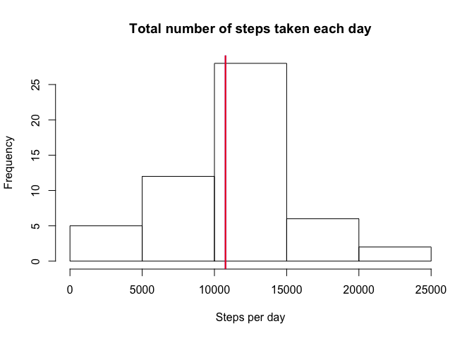
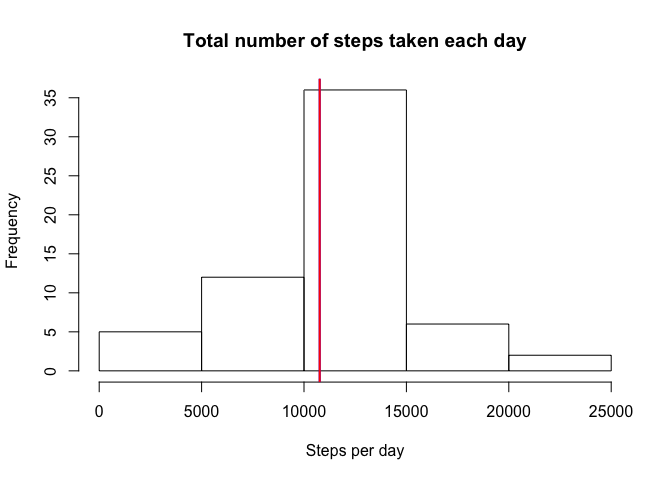
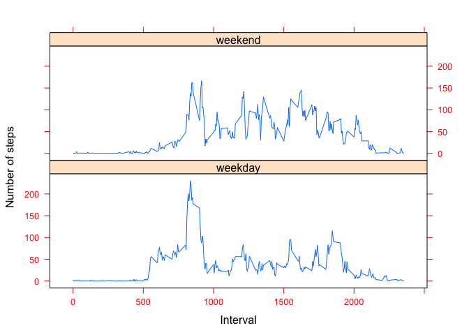

#Reproducible Research Assignment 1


```r
knitr::opts_chunk$set(echo = TRUE)
```

#Loading and preprocessing the data


```r
library(rmarkdown)
library(knitr)
library(lattice)

dsActivity <- read.csv("activity.csv")
## ignore NA values
ds_complete <- dsActivity[complete.cases(dsActivity), ]
## convert date from factor to date format
ds_complete$date <- as.Date(as.POSIXlt(ds_complete$date))
```

#Histogram of the total number of steps taken each day

```r
steps_per_day <- aggregate(steps ~ date, ds_complete, sum)
hist(steps_per_day$steps, xlab = "Steps per day", main = "Total number of steps taken each day")
##Mean and median number of steps taken each day
mn <- mean(steps_per_day$steps)
md <- median(steps_per_day$steps)
abline(v = mn, col = "blue", lwd = 2)
abline(v = md, col = "red", lwd = 2)
```

<!-- -->

```r
print(mn)
```

```
## [1] 10766.19
```

```r
print(md)
```

```
## [1] 10765
```

#Time series plot of the average number of steps taken

```r
avg_steps_per_interval <- aggregate(steps ~ interval, ds_complete, mean)

plot(avg_steps_per_interval$interval, avg_steps_per_interval$steps, type ="l", col="red", xlab = "5 minute interval", ylab = "Average steps taken", main = "Average Daily Activity Pattern")
```

<!-- -->

```r
##The 5-minute interval that, on average, contains the maximum number of steps
maxInt <- avg_steps_per_interval[which.max(avg_steps_per_interval$steps), ]$interval
print(maxInt)
```

```
## [1] 835
```

#Imputing missing values

```r
## find NA values
ds_NA <- dsActivity[!complete.cases(dsActivity), ]
print(nrow(ds_NA))
```

```
## [1] 2304
```

```r
##strategy for imputing missing data
for(i in 1:nrow(ds_NA)){
     ds_NA$steps[i] <- avg_steps_per_interval[which(avg_steps_per_interval$interval == ds_NA$interval[i]), ]$steps
}
##Create a new dataset that is equal to the original dataset but with the missing data filled in.
new_ds <- rbind(ds_complete, ds_NA)
```

#Histogram of the total number of steps taken each day after missing values are imputed

```r
steps_per_day <- aggregate(steps ~ date, new_ds, sum)
hist(steps_per_day$steps, xlab = "Steps per day", main = "Total number of steps taken each day")
##Mean and median number of steps taken each day
mn <- mean(steps_per_day$steps)
md <- median(steps_per_day$steps)
abline(v = mn, col = "blue", lwd = 2)
abline(v = md, col = "red", lwd = 2)
```

<!-- -->

```r
print(mn)
```

```
## [1] 10766.19
```

```r
print(md)
```

```
## [1] 10766.19
```
##The values of mean and median with inputing the missing dataset doesn't differ much from the dataset without the na values.

#Panel plot comparing the average number of steps taken per 5-minute interval across weekdays and weekends

```r
for(i in 1:nrow(new_ds)){
        w_day <- weekdays(new_ds$date[i])
        if(w_day == "Saturday" | w_day == "Sunday")
                new_ds$day[i] <- "weekend"
        else
                new_ds$day[i] <- "weekday"   
}
avg_steps <- aggregate(steps ~ interval + day, new_ds, mean)
xyplot(steps ~ interval | day, data=avg_steps, type = "l", layout = c(1,2),
       scales=list(cex=.8, col="red"),
       ylab="Number of steps", xlab="Interval")
```

<!-- -->

