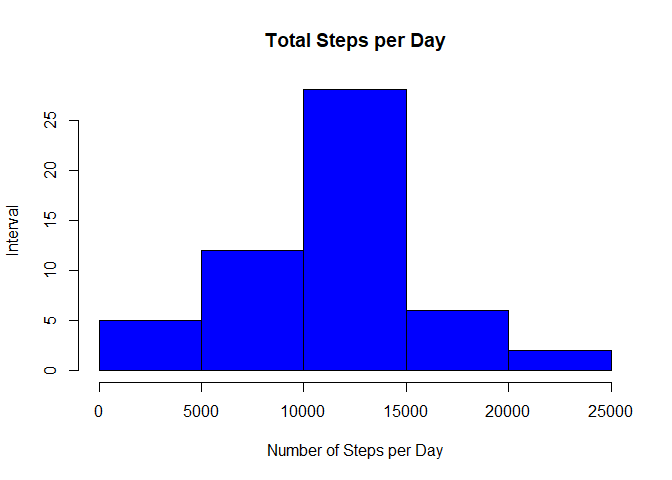

# Reproducible Research: Peer Assessment 1
  
## Loading and preprocessing the data


```r
data_steps<-read.csv2("activity.csv", sep=",",colClasses=c("integer","Date","integer"))
```
  

```r
steps_sum<-aggregate(steps~date,data = data_steps,sum)
hist(steps_sum$steps,breaks=5,col="red",main ="Steps histogram",ylab="Number of days",xlab="Steps")
```

<!-- -->
  
## What is mean total number of steps taken per day?  
  

```r
mean_steps<-as.character(floor(mean(steps_sum$steps)))
median_steps<-as.character(floor(median(steps_sum$steps)))
```
  
Mean is 10766 steps per day.  
Median is 10765 steps per day.  
  
## What is the average daily activity pattern?  
  

```r
steps_during_day<-aggregate(steps~interval,data = data_steps,mean)
plot(steps_during_day$steps,type="l",xlab="Time of the day (hour)",main ="Average steps during day",ylab="Number of steps",xaxt = "n")
axis(1, at=seq(from=0, to=288, by=12), labels=c(0:24))
```

<!-- -->
  

```r
max_interval<-steps_during_day[steps_during_day$steps==max(steps_during_day$steps),1]
```
  
The interval with the max steps is: 835  
  
## Imputing missing values  
  

```r
#Number of missing values
nb_missing_values<-sum(is.na(data_steps[,1]))

#replace NA by the mean value during day
data_completed<-data_steps
for (i in 1:nrow(data_steps)){
if (is.na(data_steps[i,1])==TRUE)
    data_completed[i,1]<-steps_during_day[steps_during_day[,1]==data_steps[i,3],2]
}
```
  
There were 2304 missing values  
  

```r
steps_sum2<-aggregate(steps~date,data = data_completed,sum)
hist(steps_sum2$steps,breaks=5,col="red",main ="Steps histogram",ylab="Number of days",xlab="Steps")
```

<!-- -->
  
The histogram is the same the one we ploted before => that's reassuring  
    
## Are there differences in activity patterns between weekdays and weekends?  
  

```r
data_steps$isweekday<-(as.POSIXlt(data_steps$date)$wday %in% 1:5)
data_steps_week<-data_steps[data_steps$isweekday==TRUE,]
data_steps_weekend<-data_steps[data_steps$isweekday==FALSE,]
steps_sum_week<-aggregate(steps~interval ,data = data_steps_week,mean)
steps_sum_weekend<-aggregate(steps~interval ,data = data_steps_weekend,mean)

plot(steps_sum_week$steps,type="l",xlab="Time of the day (hour)",main ="Average steps during day",ylab="Number of steps",xaxt = "n",
col="red", ylim=c(0.0,300.0))
axis(1, at=seq(from=0, to=288, by=12), labels=c(0:24))
par(new=T)
plot(steps_sum_weekend$steps,type="l",xlab="",main ="",ylab="",xaxt = "n",yaxt = "n",col="blue", ylim=c(0.0,300.0))
legend("topright",legend=c("week","weekend"),col=c("red", "blue"),lty=1)
```

<!-- -->
  
People tend to wake up later on week end  
  
