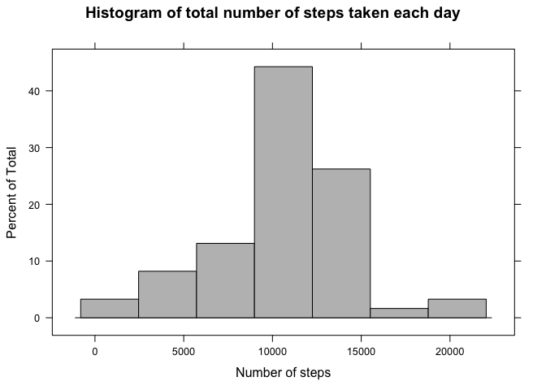
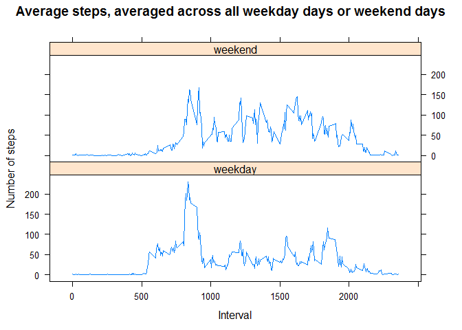

# Reproducible Research: Peer Assessment 1


#### Loading and preprocessing the data

Load required libraries quietly

```r
library(dplyr,quietly = T) 
```

```
## Warning: package 'dplyr' was built under R version 3.1.3
```

```
## 
## Attaching package: 'dplyr'
```

```
## The following objects are masked from 'package:stats':
## 
##     filter, lag
```

```
## The following objects are masked from 'package:base':
## 
##     intersect, setdiff, setequal, union
```

```r
library(tidyr,quietly = T)
```

```
## Warning: package 'tidyr' was built under R version 3.1.3
```

```r
library(lubridate,quietly = T)
```

```
## Warning: package 'lubridate' was built under R version 3.1.3
```

```r
library(ggplot2,quietly = T)
```

```
## Warning: package 'ggplot2' was built under R version 3.1.3
```

```r
library(lattice,quietly = T)
```

```
## Warning: package 'lattice' was built under R version 3.1.3
```

Unziping the 'activity.zip' file

```r
unzip("activity.zip")
```

Reading the unziped file in a file variable 'activity'

```r
activity <- read.csv("activity.csv")
```

A quick look at the structure of the data file 'activity'

```r
str(activity)
```

```
## 'data.frame':	17568 obs. of  3 variables:
##  $ steps   : int  NA NA NA NA NA NA NA NA NA NA ...
##  $ date    : Factor w/ 61 levels "2012-10-01","2012-10-02",..: 1 1 1 1 1 1 1 1 1 1 ...
##  $ interval: int  0 5 10 15 20 25 30 35 40 45 ...
```

Summary of the data file 'activity'

```r
summary(activity)
```

```
##      steps                date          interval     
##  Min.   :  0.00   2012-10-01:  288   Min.   :   0.0  
##  1st Qu.:  0.00   2012-10-02:  288   1st Qu.: 588.8  
##  Median :  0.00   2012-10-03:  288   Median :1177.5  
##  Mean   : 37.38   2012-10-04:  288   Mean   :1177.5  
##  3rd Qu.: 12.00   2012-10-05:  288   3rd Qu.:1766.2  
##  Max.   :806.00   2012-10-06:  288   Max.   :2355.0  
##  NA's   :2304     (Other)   :15840
```

Looking at the first few rows of the data file 'activity'

```r
head(activity)
```

```
##   steps       date interval
## 1    NA 2012-10-01        0
## 2    NA 2012-10-01        5
## 3    NA 2012-10-01       10
## 4    NA 2012-10-01       15
## 5    NA 2012-10-01       20
## 6    NA 2012-10-01       25
```

Transforming the data file by removing all the 'NAs', and converting the 'date' 
variable into a date format

```r
activity2 <- activity %>%
        filter(steps != is.na(steps)) %>%
        mutate(date = ymd(date))
```

Look at the summary of the transformed dataframe 'activity2'

```r
summary(activity2)
```

```
##      steps            date                        interval   
##  Min.   :  1.0   Min.   :2012-10-02 00:00:00   Min.   :   0  
##  1st Qu.: 25.0   1st Qu.:2012-10-14 00:00:00   1st Qu.: 845  
##  Median : 56.0   Median :2012-10-28 00:00:00   Median :1325  
##  Mean   :134.3   Mean   :2012-10-29 15:39:13   Mean   :1323  
##  3rd Qu.:146.8   3rd Qu.:2012-11-16 00:00:00   3rd Qu.:1800  
##  Max.   :806.0   Max.   :2012-11-29 00:00:00   Max.   :2355
```

Look at the first few rows in the transformed dataframe 'activity2'

```r
head(activity2)
```

```
##   steps       date interval
## 1   117 2012-10-02     2210
## 2     9 2012-10-02     2215
## 3     4 2012-10-03      410
## 4    36 2012-10-03      430
## 5    25 2012-10-03      535
## 6    90 2012-10-03      550
```

Look at the structure of the transformed dataframe 'activity2'

```r
str(activity2)
```

```
## 'data.frame':	4250 obs. of  3 variables:
##  $ steps   : int  117 9 4 36 25 90 411 413 415 519 ...
##  $ date    : POSIXct, format: "2012-10-02" "2012-10-02" ...
##  $ interval: int  2210 2215 410 430 535 550 555 600 605 610 ...
```


#### What is mean total number of steps taken per day?

Transforming dataframe 'activity2' by selecting only the 'date', and 'steps' variables
then group by 'date' to get the total number of steps taken per day

```r
activity3 <- activity2 %>%
        select(steps,date) %>%
        group_by(date) %>%  
        summarise(steps = sum(steps))
```

Look at the first few rows in the transformed dataframe 'activity3'

```r
head(activity3)
```

```
## Source: local data frame [6 x 2]
## 
##         date steps
##       (time) (int)
## 1 2012-10-02   126
## 2 2012-10-03 11352
## 3 2012-10-04 12116
## 4 2012-10-05 13294
## 5 2012-10-06 15420
## 6 2012-10-07 11015
```

A histogram of the total number of steps taken per day using the 'Lattice' package

```r
histogram(activity3$steps, xlab = 'Total number of steps', main = "Histogram of total number of steps taken each day", col = 'grey')
```


The mean of the total number of steps taken per day

```r
activity3 %>%
  summarise(mean = mean(steps)) %>%
  print()
```

```
## Source: local data frame [1 x 1]
## 
##       mean
##      (dbl)
## 1 10766.19
```
        
The median of the total number of steps taken per day 

```r
activity3 %>%
  summarise(median = median(steps)) %>%
  print()
```

```
## Source: local data frame [1 x 1]
## 
##   median
##    (int)
## 1  10765
```

#### What is the average daily activity pattern?

Transforming the dataframe 'activity' by converting the 'interval' variable to a factor
then grouping the dataframe by the 'interval' variable, and taking the mean

```r
activity4 <- activity %>%
        mutate(interval = as.factor(interval)) %>%
        group_by(interval) %>%
        summarise(Avesteps = mean(steps,na.rm = T))
```

Look at the first few rows of the transformed dataframe 'activity4'

```r
head(activity4)
```

```
## Source: local data frame [6 x 2]
## 
##   interval  Avesteps
##     (fctr)     (dbl)
## 1        0 1.7169811
## 2        5 0.3396226
## 3       10 0.1320755
## 4       15 0.1509434
## 5       20 0.0754717
## 6       25 2.0943396
```

Use the xyplot() function from the lattice package to graph

```r
xyplot(activity4$Avesteps ~ activity4$interval,type = "l",xlab = "5-minute interval",
ylab = "average number of steps taken",main ="Average daily activity pattern",scales=list(x=list(tick.number = 6, at = seq(1, 288, 48), 
labels = levels(activity4$interval)[seq(1,288,48)])))
```


5-minute interval, on average across all the days in the dataset, that contains the maximum number of steps

```r
Interval <- activity4$interval[which(activity4$Avesteps == max(activity4$Avesteps))]
```

The 5-minute interval, on average across all the days in the dataset, that contains the 
maximum number of steps is 835

#### Imputing missing values

The total number of rows with ```NA```s 

```r
sum(!complete.cases(activity))
```

```
## [1] 2304
```

I will use the mean for the 5-minute interval, for filling in all the missing values in the dataset.

```r
activity5 <- activity %>%
        group_by(interval) %>%
        summarise(mean = mean(steps,na.rm = T))
dim(activity5)
```

```
## [1] 288   2
```

```r
activity5
```

```
## Source: local data frame [288 x 2]
## 
##    interval      mean
##       (int)     (dbl)
## 1         0 1.7169811
## 2         5 0.3396226
## 3        10 0.1320755
## 4        15 0.1509434
## 5        20 0.0754717
## 6        25 2.0943396
## 7        30 0.5283019
## 8        35 0.8679245
## 9        40 0.0000000
## 10       45 1.4716981
## ..      ...       ...
```

A new dataset that is equal to the original dataset but with the missing data filled in.

```r
NAindx <- which(is.na(activity$steps) == T)
activity6 <- activity         
activity6$steps[NAindx] <- activity5$mean
summary(activity6)
```

```
##      steps                date          interval     
##  Min.   :  0.00   2012-10-01:  288   Min.   :   0.0  
##  1st Qu.:  0.00   2012-10-02:  288   1st Qu.: 588.8  
##  Median :  0.00   2012-10-03:  288   Median :1177.5  
##  Mean   : 37.38   2012-10-04:  288   Mean   :1177.5  
##  3rd Qu.: 27.00   2012-10-05:  288   3rd Qu.:1766.2  
##  Max.   :806.00   2012-10-06:  288   Max.   :2355.0  
##                   (Other)   :15840
```

Transforming the new dataset activity6 by selecting variables  'steps' and 'date', 
then group by date and get the sums of steps.

```r
activity7 <- activity6 %>%
        select(steps,date) %>%
        group_by(date) %>%
        summarise(steps = sum(steps))
head(activity7)
```

```
## Source: local data frame [6 x 2]
## 
##         date    steps
##       (fctr)    (dbl)
## 1 2012-10-01 10766.19
## 2 2012-10-02   126.00
## 3 2012-10-03 11352.00
## 4 2012-10-04 12116.00
## 5 2012-10-05 13294.00
## 6 2012-10-06 15420.00
```

#### Plot a histogram

```r
histogram(activity7$steps, xlab = "Number of steps", main = "Histogram of total number of steps taken each day", col = 'gray')
```



Calculate and report the mean and median total number of steps taken per day

```r
activity7 %>%
  summarise(mean = mean(steps)) %>%
  print()
```

```
## Source: local data frame [1 x 1]
## 
##       mean
##      (dbl)
## 1 10766.19
```

```r
activity7 %>%
  summarise(median = median(steps)) %>%
  print()
```

```
## Source: local data frame [1 x 1]
## 
##     median
##      (dbl)
## 1 10766.19
```

These values differ from the estimates from the first part of the assignment, the median changed from 10765 to 10766.19 which is the mean. The mean did not change, this is because I used the mean values of the 5-minute interval accross all days for the missing values in the daily 5-minute intervals.

#### Are there differences in activity patterns between weekdays and weekends?

```r
activity8 <- mutate(activity6,day = weekdays(ymd(date)))

activity8$day[activity8$day == "Saturday" | activity8$day == "Sunday"] <- "weekend"
activity8$day[activity8$day != "weekend"] <- "weekday"
activity8 <- mutate(activity8, day = factor(day,levels = c("weekday","weekend")))
summary(activity8)
```

```
##      steps                date          interval           day       
##  Min.   :  0.00   2012-10-01:  288   Min.   :   0.0   weekday:12960  
##  1st Qu.:  0.00   2012-10-02:  288   1st Qu.: 588.8   weekend: 4608  
##  Median :  0.00   2012-10-03:  288   Median :1177.5                  
##  Mean   : 37.38   2012-10-04:  288   Mean   :1177.5                  
##  3rd Qu.: 27.00   2012-10-05:  288   3rd Qu.:1766.2                  
##  Max.   :806.00   2012-10-06:  288   Max.   :2355.0                  
##                   (Other)   :15840
```

```r
head(activity8)
```

```
##       steps       date interval     day
## 1 1.7169811 2012-10-01        0 weekday
## 2 0.3396226 2012-10-01        5 weekday
## 3 0.1320755 2012-10-01       10 weekday
## 4 0.1509434 2012-10-01       15 weekday
## 5 0.0754717 2012-10-01       20 weekday
## 6 2.0943396 2012-10-01       25 weekday
```

```r
activity9 <- activity8 %>%
        group_by(interval,day) %>%
        summarise(mean = mean(steps))
summary(activity9)
```

```
##     interval           day           mean        
##  Min.   :   0.0   weekday:288   Min.   :  0.000  
##  1st Qu.: 588.8   weekend:288   1st Qu.:  2.047  
##  Median :1177.5                 Median : 28.133  
##  Mean   :1177.5                 Mean   : 38.988  
##  3rd Qu.:1766.2                 3rd Qu.: 61.263  
##  Max.   :2355.0                 Max.   :230.378
```

```r
activity9
```

```
## Source: local data frame [576 x 3]
## Groups: interval [?]
## 
##    interval     day        mean
##       (int)  (fctr)       (dbl)
## 1         0 weekday 2.251153040
## 2         0 weekend 0.214622642
## 3         5 weekday 0.445283019
## 4         5 weekend 0.042452830
## 5        10 weekday 0.173165618
## 6        10 weekend 0.016509434
## 7        15 weekday 0.197903564
## 8        15 weekend 0.018867925
## 9        20 weekday 0.098951782
## 10       20 weekend 0.009433962
## ..      ...     ...         ...
```

```r
xyplot(activity9$mean ~ activity9$interval | activity9$day,type = "l",layout = c(1,2),xlab = "interval",ylab = 'steps')
```


