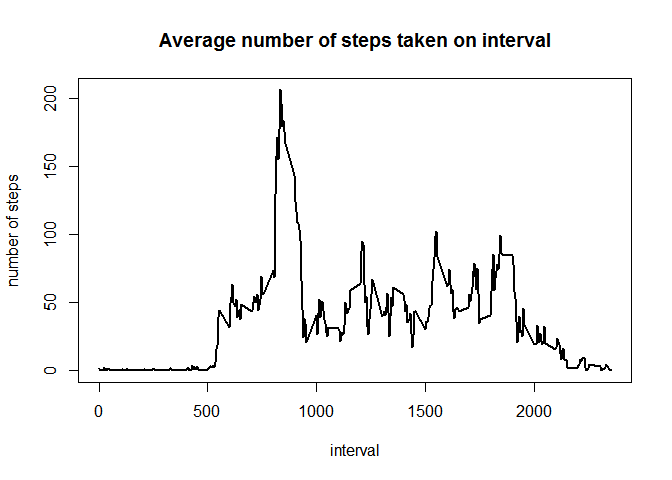
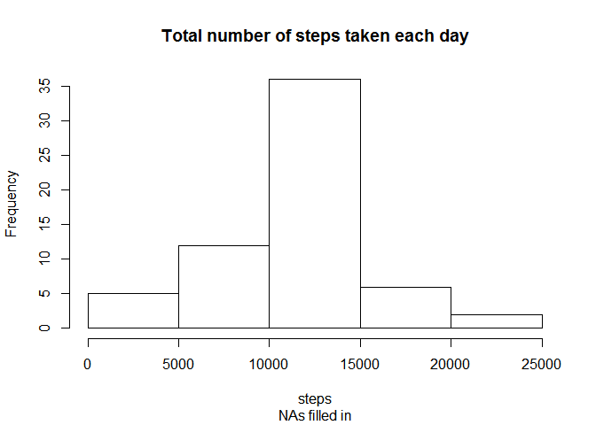
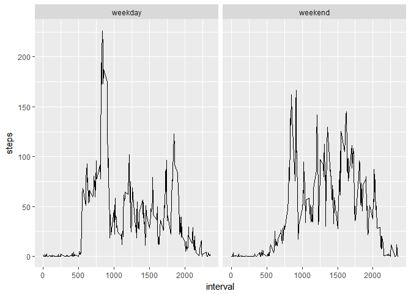

# Reproducible Research: Peer Assessment 1


## Loading and preprocessing the data

The data is in the working directory and is loaded with the chunk:

```r
activity <- read.csv("activity.csv")
```


## What is mean total number of steps taken per day?

1. Calculate the total number of steps taken per day:  
The data frame activity is grouped by date and then the sum of steps is computed.  
A histogram is made with the total number of steps per day:

```r
library(dplyr)
```

```
## 
## Attaching package: 'dplyr'
```

```
## The following objects are masked from 'package:stats':
## 
##     filter, lag
```

```
## The following objects are masked from 'package:base':
## 
##     intersect, setdiff, setequal, union
```

```r
actbyday <- summarise(group_by(activity, date), sum(steps))
names(actbyday)[[2]] <- "steps"
with(actbyday, hist(steps, main = "Total number of steps taken each day",
                            sub = "NAs ignored"))
```

<!-- -->

2. The mean and the median of the number of steps per day is computed:

```r
mean(actbyday$steps, na.rm = TRUE)
```

```
## [1] 10766.19
```

```r
median(actbyday$steps, na.rm = TRUE)
```

```
## [1] 10765
```


## What is the average daily activity pattern?

1. The data frame is grouped by interval and for each the mean of the number of steps is summarised. A plot of the 5-minute interval and mean number of steps is made:

```r
asd <- summarise(group_by(activity, interval), mean(steps, na.rm = TRUE))
names(asd)[[2]] <- "msteps"
with(asd, plot(interval, msteps, ylab = "number of steps",
			main = "Average number of steps taken on interval",
			type = "l", lwd = 2))
```

<!-- -->
2. The interval containing the maximum averaged over all days number of steps:

```r
max(asd$msteps)
```

```
## [1] 206.1698
```

```r
arrange(asd, desc(msteps))[1,1]
```

```
## # A tibble: 1 × 1
##   interval
##      <int>
## 1      835
```

## Imputing missing values
1. The total number of missing values:

```r
sum(is.na(activity))
```

```
## [1] 2304
```
2. The missing values will be filled in with the averaged number of steps per the respective interval. First a subse containing the missing values is merged with the data frame containing the averaged values per interval.  

```r
nas <- subset(activity, is.na(steps))
complet <- merge(nas, asd, by.x = "interval", by.y = "interval")
complet <- mutate(complet, steps = msteps)
complet <- select(complet, - msteps)
```
3.Then this is binded with the subset without missing values:

```r
comp.act <- rbind(complet, subset(activity, !is.na(steps)))
```
4. Making a histogram of the total number of steps taken each day:

```r
abd <- summarise(group_by(comp.act, date), sum(steps))
names(abd)[[2]] <- "steps"
with(abd, hist(steps, main = "Total number of steps taken each day",
                        sub = "NAs filled in"))
```

<!-- -->

Reporting the mean and the median total number of steps taken per day:

```r
mean(abd$steps)
```

```
## [1] 10766.19
```

```r
median(abd$steps)
```

```
## [1] 10766.19
```
The value of the mean number the steps is the same, the median is increasing slightly.  
The frequencies are just a little bigger as expected.

## Are there differences in activity patterns between weekdays and weekends?

1. A data frame with two variables "weekday" and "weekpart" is created and then merged with the data frame with the dataframe containing the averages per interval after filling in missing values. A new variable is added, a factor with two values: "weekday" and "weekend".

```r
week <- cbind(c("Monday", "Tuesday", "Wednesday", "Thorsday", "Friday", "Saturday", "Sunday"),
c("weekday","weekday","weekday","weekday","weekday","weekend", "weekend"))

week <- as.data.frame(week)
names(week) <- c("day", "weekpart")
comp.act <- mutate(comp.act, day = weekdays(as.Date(date)))
fin.act <- merge(comp.act, week, by.x = "day", by.y = "day")
```
2. Making the panel plot with ggplot2:

```r
fin.asd <- summarise(group_by(fin.act, weekpart, interval), mean(steps))
names(fin.asd)[[3]] <- "steps"
library(ggplot2)
qplot(interval, steps, data = fin.asd, facets = . ~ weekpart, geom = "line")
```

<!-- -->
