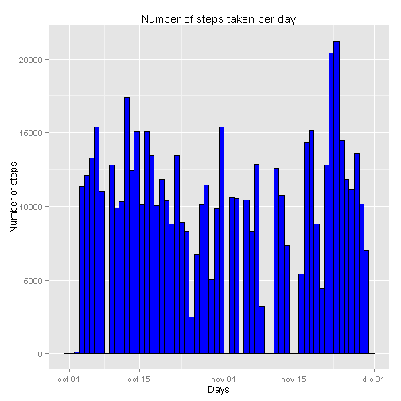
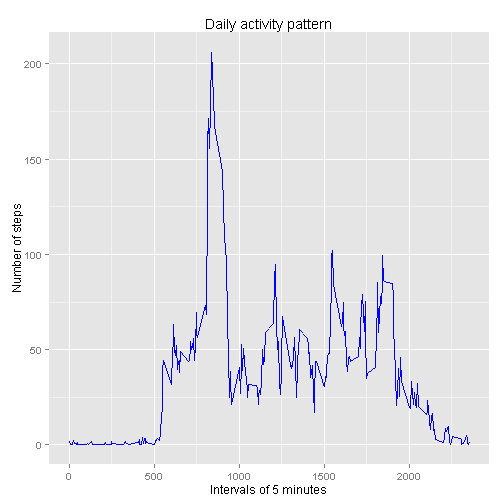
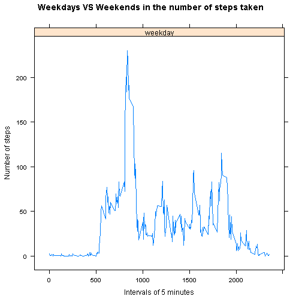
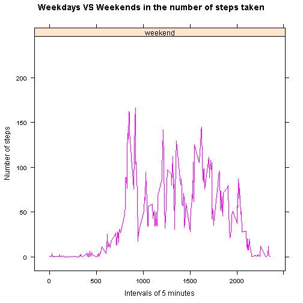

# Reproducible Research: Peer Assessment 1

## Loading and preprocessing the data

Required R libraries:

* ggplot2
* knitr
* lattice


The data for this assignment can be downloaded from the course web site:

* Dataset: [Activity monitoring data [52K]] (https://d396qusza40orc.cloudfront.net/repdata%2Fdata%2Factivity.zip)

Quick summary:


```r
activity <- read.csv("./activity.csv")
activity$date <- as.Date(activity$date)
summary(activity)
```

```
##      steps            date               interval   
##  Min.   :  0.0   Min.   :2012-10-01   Min.   :   0  
##  1st Qu.:  0.0   1st Qu.:2012-10-16   1st Qu.: 589  
##  Median :  0.0   Median :2012-10-31   Median :1178  
##  Mean   : 37.4   Mean   :2012-10-31   Mean   :1178  
##  3rd Qu.: 12.0   3rd Qu.:2012-11-15   3rd Qu.:1766  
##  Max.   :806.0   Max.   :2012-11-30   Max.   :2355  
##  NA's   :2304
```

## What is mean total number of steps taken per day?

Make a histogram of the total number of steps taken each day

- To calculate the mean of the total number of steps taken per day it's 
neccesary to ignore the missing values (NA) on the column steps.

- Graphic representation:


```r
qplot(date,  
      weight=activity$steps, 
      data = activity, 
      main="Number of steps taken per day", 
      xlab="Days", 
      ylab="Number of steps",
      binwidth = 1,
      color=I("black"),
      fill=I("blue"))
```

 

Calculate and report the **mean** and **median** total number of steps taken per day:


```r
mean_steps<-mean(tapply(activity$steps, activity$date, sum, na.rm = TRUE))
median_steps<-median(tapply(activity$steps, activity$date, sum, na.rm = TRUE))
```
- Mean steps: 9354.2295
- Median steps: 10395


## What is the average daily activity pattern?

Make a time series plot (i.e. type = "l") of the 5-minute interval (x-axis) and the average number of steps taken, averaged across all days (y-axis).

- Graphic representation:


```r
average_steps<-data.frame(cbind(activity$interval,
                                tapply(activity$steps,
                                       activity$interval, 
                                       mean, 
                                       na.rm = TRUE)))


colnames(average_steps) <- c("interval", "steps")

ggplot(data=average_steps,
       aes(x=interval,
           y=steps)) + 
  geom_line(color='blue',
            size=0.5) + 
  ggtitle("Daily activity pattern") +
  xlab("Intervals of 5 minutes") +
  ylab("Number of steps") 
```

 

Which 5-minute interval, on average across all the days in the dataset, contains the maximum number of steps?


```r
max_steps_interval <- average_steps[which.max(average_steps$steps),
                                    "interval"]
min_steps_interval <- average_steps[which.min(average_steps$steps),
                                    "interval"]

paste("Max steps interval:",
      max_steps_interval,
      "(UTC Time:",
      intervalToHour(max_steps_interval), 
      ")")
```

```
## [1] "Max steps interval: 835 (UTC Time: 13:55 )"
```

```r
paste("Min steps interval:",
      min_steps_interval,
      "(UTC Time:",
      intervalToHour(min_steps_interval),
      ")")
```

```
## [1] "Min steps interval: 40 (UTC Time: 00:40 )"
```

## Imputing missing values

Note that there are a number of days/intervals where there are missing values (coded as NA). The presence of missing days may introduce bias into some calculations or summaries of the data.

Calculate and report the total number of missing values in the dataset (i.e. the total number of rows with NAs)


```r
sum(is.na(activity$steps))
```

```
## [1] 2304
```

Devise a strategy for filling in all of the missing values in the dataset.
The strategy does not need to be sophisticated. For example, you could use the mean/median for that day, or the mean for that 5-minute interval, etc.
And create a new dataset that is equal to the original dataset but with the missing data filled in.
**(the strategy will be replace NA by the 5-minute interval mean)**


```r
strategy<-activity
strategy[is.na(strategy[, 1]), 1]<-average_steps[is.na(strategy[, 1]),2]
```

Make a histogram of the total number of steps taken each day and Calculate and report the mean and median total number of steps taken per day. 


```r
qplot(date, 
      weight=strategy$steps, 
      data=strategy,       
      main="Number of steps taken per day (with NA strategy)", 
      xlab="Days", 
      ylab="Number of steps",
      binwidth = 1,
      color=I("black"),
      fill=I("blue"))
```

.png) 

```r
mean(tapply(strategy$steps, strategy$date, sum))
```

```
## [1] 10766
```

```r
median(tapply(strategy$steps, strategy$date, sum))
```

```
## [1] 10766
```

Do these values differ from the estimates from the first part of the assignment? 

- Viewing the histogram of question 1 and this, we can conclude that they still have a similar structure.

What is the impact of imputing missing data on the estimates of the total da???ily number of steps?

- In this case the median and the mean are equals, and it's a little more higher.

## Are there differences in activity patterns between weekdays and weekends?

For this part the weekdays() function may be of some help here. Use the dataset with the filled-in missing values for this part.

Create a new factor variable in the dataset with two levels - "weekday" and "weekend" indicating whether a given date is a weekday or weekend day.


```r
strategy$type_of_day<-as.factor(
  ifelse(
    spanishToEnglishWeekday(strategy$date) %in%
      c("Saturday","Sunday"),
    "weekend",
    "weekday"))
```

Make a panel plot containing a time series plot (i.e. type = "l") of the 5-minute interval (x-axis) and the average number of steps taken, averaged across all weekday days or weekend days (y-axis). The plot should look something like the following, which was creating using simulated data:


```r
xyplot(steps ~ interval | type_of_day,
       aggregate(steps ~ interval + type_of_day,
                 strategy,
                 FUN = mean),
       layout = c(1, 1),
       type = "l",
       main = "Weekdays VS Weekends in the number of steps taken",
       xlab = "Intervals of 5 minutes",
       ylab = "Number of steps",
       group = type_of_day)
```

  

The plots are similar although there are more activity on the first hours of the day on weekdays.
