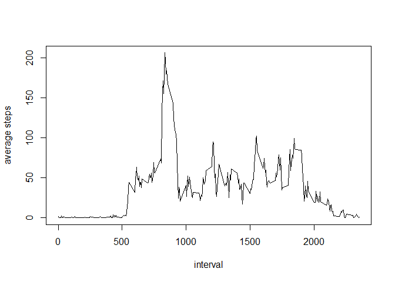
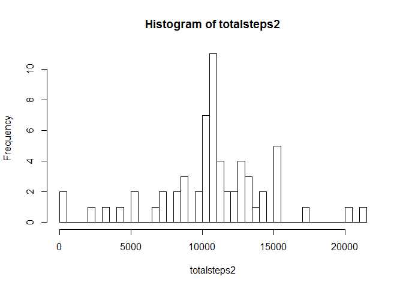

# Reproducible Research: Peer Assessment 1

```r
knitr::opts_chunk$set(cache=TRUE)
```

### Load the required libraries

```r
library(lubridate)
library(ggplot2)
library(dplyr)
```

### Loading and preprocessing the data

1. Unzip and load the data


```r
if(!file.exists("./RepData_Peerassessment1/activity.zip")){
        unzip("activity.zip")
}
activity = read.csv("activity.csv")
```

2. Process/transform the data (if necessary) into a format suitable for your analysis
We need the variable date in a date-format, instead of factor


```r
activity$date <- ymd(as.character(activity$date))
```

## What is mean total number of steps taken per day?

1. Calculate the total number of steps per day

```r
totalsteps <- tapply(activity$steps,activity$date,sum,na.rm=TRUE)
```

2. Make a histogram of the total number of steps taken each day

```r
hist(totalsteps, breaks = 50)
```

<!-- -->

3. Calculate and report the mean and median of the total number of steps taken per day

```r
stmn <- mean(totalsteps, na.rm = TRUE)
stmd <- median(totalsteps, na.rm = TRUE)
```
Mean is 9354.23 and median is 10395.

## What is the average daily activity pattern?

1. Make a time series plot (i.e. type = "l") of the 5-minute interval (x-axis) and the average number of steps taken, averaged across all days (y-axis)

```r
a_int <- tapply(activity$steps,activity$interval,mean, na.rm = TRUE)
plot(names(a_int),a_int,type = "l",xlab="interval",ylab="average steps")
```

<!-- -->

2. Which 5-minute interval, on average across all the days in the dataset, contains the maximum number of steps?

```r
max_int <- which.max(a_int)
```
The 835th interval contains the maximum number of steps.

## Imputing missing values

1. Calculate and report the total number of missing values in the dataset (i.e. the total number of rows with NAs)

```r
missing <- is.na(activity)
s <- sum(missing)
summary(missing)
```

```
##    steps            date          interval      
##  Mode :logical   Mode :logical   Mode :logical  
##  FALSE:15264     FALSE:17568     FALSE:17568    
##  TRUE :2304      NA's :0         NA's :0        
##  NA's :0
```
We see that we have 2304 missing values, only for the variable steps.

2. Devise a strategy for filling in all of the missing values in the dataset. The strategy does not need to be sophisticated. For example, you could use the mean/median for that day, or the mean for that 5-minute interval, etc.

First we need to know if not too many data are missing (5% is "allowed")

```r
s/dim(activity)[1]
```

```
## [1] 0.1311475
```
It's actually a bit too much (13%), but we still follow the assignment.
Let's fill the missing values with the mean number of steps per interval.

3. Create a new dataset that is equal to the original dataset but with the missing data filled in.


```r
activity_nomissing <- activity
activity_nomissing[which(is.na(activity_nomissing$steps)),1]<-
        a_int[as.character(activity_nomissing[which(is.na(activity_nomissing$steps)),3])]
```
Check if we still have any missing values?

```r
sum(is.na(activity_nomissing$steps))
```

```
## [1] 0
```
4. Make a histogram of the total number of steps taken each day and Calculate and report the mean and median total number of steps taken per day. Do these values differ from the estimates from the first part of the assignment? What is the impact of imputing missing data on the estimates of the total daily number of steps?


```r
totalsteps2 <- tapply(activity_nomissing$steps,activity_nomissing$date,sum,na.rm=TRUE)
hist(totalsteps2, breaks = 50)
```

<!-- -->


```r
stmn2 <- mean(totalsteps2)
stmd2 <- median(totalsteps2)
```
Mean is 1.0766189\times 10^{4} and median is 1.0766189\times 10^{4}.
The mean and the median are now the same

## Are there differences in activity patterns between weekdays and weekends?

1. Create a new factor variable in the dataset with two levels - "weekday" and "weekend" indicating whether a given date is a weekday or weekend day.
NB my computer is set to Dutch language, so I select zaterdag and zondag instead of Saturday and Sunday to get the results.


```r
actnm <- activity_nomissing
actnm <- mutate(actnm, weekfactor = ifelse(weekdays(actnm$date) == "zaterdag" | weekdays(actnm$date) == "zondag", "weekend", "weekday"))
actnm$weekfactor <- as.factor(actnm$weekfactor)
```

2. Make a panel plot containing a time series plot (i.e. type = "l") of the 5-minute interval (x-axis) and the average number of steps taken, averaged across all weekday days or weekend days (y-axis). See the README file in the GitHub repository to see an example of what this plot should look like using simulated data.


```r
anf <- aggregate(actnm$steps,list(interval = actnm$interval, daytype = actnm$weekfactor), sum)
colnames(anf)[3] <- c("number_of_steps")
g <- ggplot(anf, aes(interval, number_of_steps))
g + geom_line() + facet_grid(daytype ~ .)
```

<!-- -->

We can see from the chart that people take a lot less steps on weekend days
