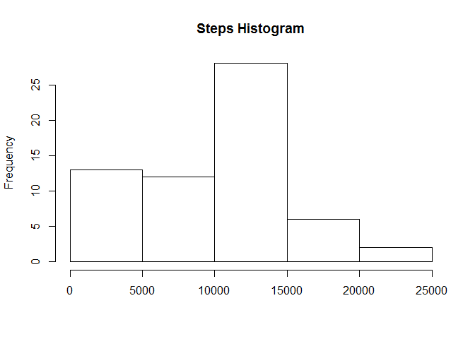
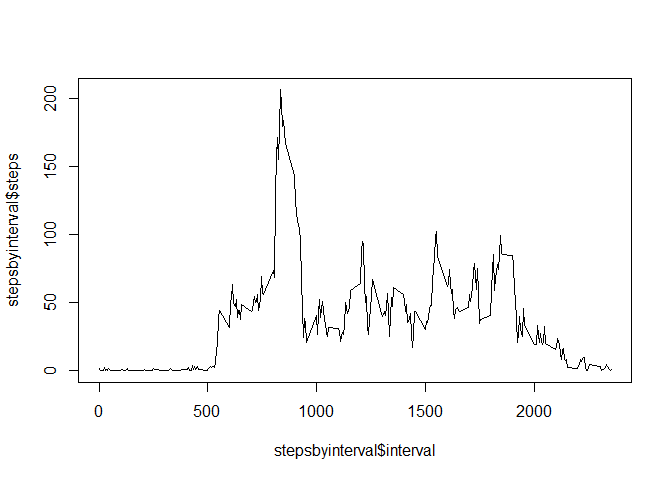
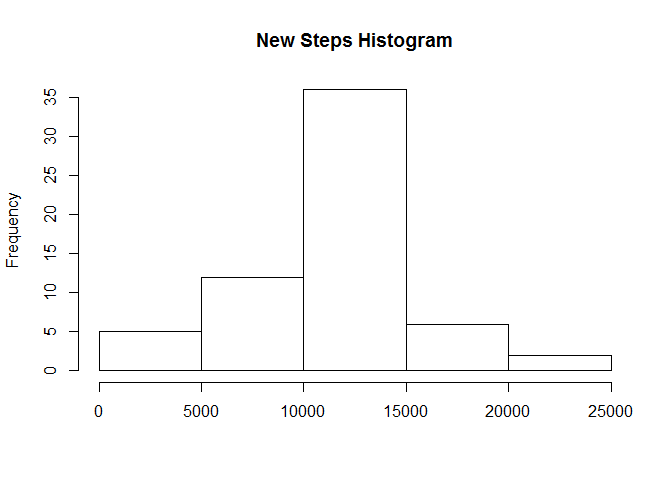
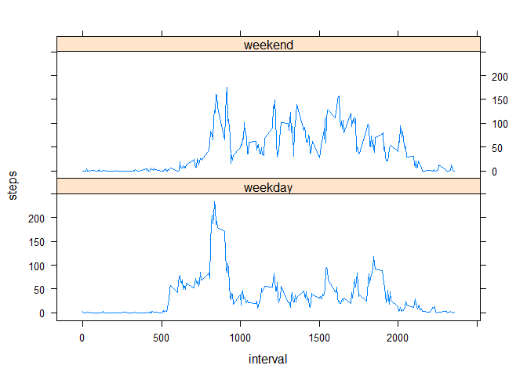

# Reproducible Research: Peer Assessment 1

Course Project 1
================
2016-02-17

# Assignment

This assignment makes use of data from a personal activity monitoring device. This device collects data at 5 minute intervals through out the day. The data consists of two months of data from an anonymous individual collected during the months of October and November, 2012 and include the number of steps taken in 5 minute intervals each day.

## Setup

First if your envoriment is not from USA you need to set it to english.


```r
# Set enviroment to be in english
Sys.setenv(LANG = "en")
Sys.setlocale("LC_TIME", "English")
```

```
## [1] "English_United States.1252"
```

## Loading and preprocessing the data

0. Download file (if necessary)


```r
# Getting raw data
rawfilename<-"activity.zip"
if (!file.exists(rawfilename)) {
    download.file(url="https://d396qusza40orc.cloudfront.net/repdata%2Fdata%2Factivity.zip", rawfilename)  
}
```

1. Load the data (i.e. read.csv())


```r
# Code for reading in the dataset
activity <-read.csv(unz(rawfilename, "activity.csv"))
```

2. Process/transform the data (if necessary) into a format suitable for your analysis


```r
# Code for processing the data
activity$date<-as.Date(activity$date)
```

## What is mean total number of steps taken per day?

1. Calculate the total number of steps taken per day


```r
stepsday <-aggregate(activity["steps"], by=list(Group.date=activity$date), 
                    FUN=sum, na.rm=TRUE)
steps<-stepsday$steps
```

2. If you do not understand the difference between a histogram and a barplot, research the difference between them. Make a histogram of the total number of steps taken each day


```r
# Histogram of the total number of steps taken each day
hist(steps, main="Steps Histogram", xlab="")
```



3. Calculate and report the mean and median of the total number of steps taken per day


```r
# Mean and median number of steps taken each day
mean(steps, na.rm = TRUE)
```

```
## [1] 9354.23
```

```r
median(steps, na.rm = TRUE)
```

```
## [1] 10395
```

## What is the average daily activity pattern?

1. Make a time series plot (i.e. type = "l") of the 5-minute interval (x-axis) and the average number of steps taken, averaged across all days (y-axis)


```r
# Time series plot of the average number of steps taken
stepsbyinterval <-aggregate(activity["steps"], by=list(Group.interval=activity$interval), 
                            FUN=mean, na.rm=TRUE)
names(stepsbyinterval)<-c("interval","steps")
plot(stepsbyinterval$interval, stepsbyinterval$steps, type="l")
```



2. Which 5-minute interval, on average across all the days in the dataset, contains the maximum number of steps?


```r
# The 5-minute interval that, on average, contains the maximum number of steps
stepsbyinterval[which(stepsbyinterval$steps==max(stepsbyinterval$steps)),"interval"]
```

```
## [1] 835
```

## Imputing missing values

1. Calculate and report the total number of missing values in the dataset (i.e. the total number of rows with NAs)


```r
sum(is.na(activity$steps))
```

```
## [1] 2304
```

2. Devise a strategy for filling in all of the missing values in the dataset. The strategy does not need to be sophisticated. For example, you could use the mean/median for that day, or the mean for that 5-minute interval, etc.


```r
# Code to describe and show a strategy for imputing missing dat

## The avarege steps per interval will replace the respective missing values.
imputMDat<-merge(activity, stepsbyinterval, by="interval", all.x = TRUE)
for(i in 1:nrow(imputMDat)){
    if (is.na(imputMDat$steps.x[i])) {
        imputMDat$steps.x[i]<-imputMDat$steps.y[i]
    }
}
```

3. Create a new dataset that is equal to the original dataset but with the missing data filled in.


```r
activity2<-imputMDat[,c(2,3,1)]
names(activity2)<-c("steps","date","interval")
activity2<-activity2[order(activity2$date, activity2$interval),]
```

4. Make a histogram of the total number of steps taken each day and Calculate and report the mean and median total number of steps taken per day. Do these values differ from the estimates from the first part of the assignment? What is the impact of imputing missing data on the estimates of the total daily number of steps?


```r
# Histogram of the total number of steps taken each day after missing values are imputed
newstepsday <-aggregate(activity2["steps"], by=list(Group.date=activity2$date), 
                     FUN=sum, na.rm=TRUE)
newsteps<-newstepsday$steps
hist(newsteps, main="New Steps Histogram", xlab="")
```



```r
mean(newsteps, na.rm = TRUE)
```

```
## [1] 10766.19
```

```r
median(newsteps, na.rm = TRUE)
```

```
## [1] 10766.19
```

The data now is more Gaussian.

## Are there differences in activity patterns between weekdays and weekends?

1. Create a new factor variable in the dataset with two levels – “weekday” and “weekend” indicating whether a given date is a weekday or weekend day.


```r
# Panel plot comparing the average number of steps taken per 5-minute interval across weekdays and weekends
activity$weekdays<-weekdays(activity$date)

activity$weekendweek[activity$weekdays == "Saturday" | activity$weekdays == "Sunday"] <- "weekend"
activity$weekendweek[activity$weekdays != "Saturday" & activity$weekdays != "Sunday"] <- "weekday"
activity$weekendweek <- as.factor(activity$weekendweek)
```

2. Make a panel plot containing a time series plot (i.e. type = "l") of the 5-minute interval (x-axis) and the average number of steps taken, averaged across all weekday days or weekend days (y-axis). See the README file in the GitHub repository to see an example of what this plot should look like using simulated data.


```r
stepsbyiw <-aggregate(activity["steps"], by=list(Group.interval=activity$interval, Group.weekendweek=activity$weekendweek), 
                            FUN=mean, na.rm=TRUE)
names(stepsbyiw)<-c("interval", "weekendweek", "steps")

library(lattice)
xyplot(steps ~ interval | weekendweek, layout=c(1,2), data=stepsbyiw, type="l")
```


