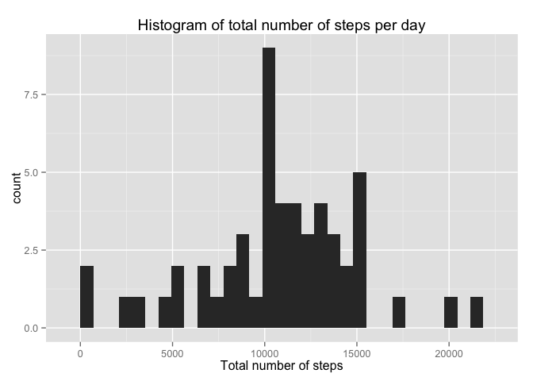
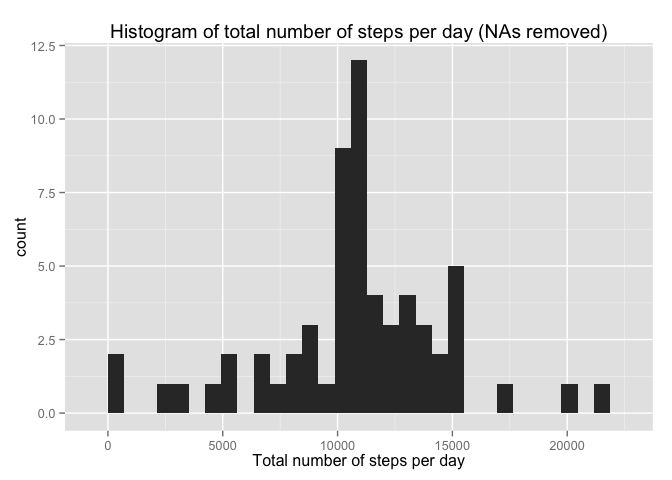
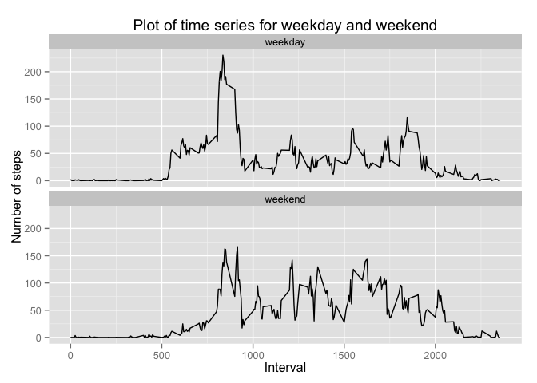

# Reproducible Research - Peer Assessment 1

This assignment makes use of data from a personal activity monitoring device. This device collects data at 5 minute intervals through out the day. There are three variables: steps, date and interval (5 minutes). 

**Part 1: Loading and preprocessing the data**

Load R libraries used in this assignment

```r
library("ggplot2")
library("dplyr")
```

Download the dataset and unzip in working directory

```r
fileUrl1 = "https://d396qusza40orc.cloudfront.net/repdata%2Fdata%2Factivity.zip"
download.file(fileUrl1,destfile="./repdata%2Fdata%2Factivity.zip",method="curl")
unzip(zipfile="./repdata%2Fdata%2Factivity.zip",exdir="./")
```

Load the data (i.e. read.csv())

```r
activity <- read.csv("activity.csv")
```

Process/transform the data (if necessary) into a format suitable for your analysis

```r
activity$date <- as.POSIXct(activity$date,format = "%Y-%m-%d") # convert to date format
```

**Part 2: What is mean total number of steps taken per day?**

Calculate the total number of steps taken per day

```r
data_sum <- aggregate(steps~date, data=activity, FUN=sum, na.rm = TRUE)
```

Make a histogram of the total number of steps taken each day

```r
qplot(data_sum$steps,geom="histogram",main ="Histogram of total number of steps per day",xlab = "Total number of steps")
```

```
## stat_bin: binwidth defaulted to range/30. Use 'binwidth = x' to adjust this.
```

 

Calculate and report the mean and median of the total number of steps taken per day

```r
mean(data_sum$steps)
```

```
## [1] 10766.19
```

```r
median(data_sum$steps)
```

```
## [1] 10765
```

**Part 3: What is the average daily activity pattern?**

Make a time series plot (i.e. type = "l") of the 5-minute interval (x-axis) and the average number of steps taken, averaged across all days (y-axis)


```r
data_mean_interval <- aggregate(steps~interval, data=activity, FUN=mean)
```


```r
qplot(interval, steps, data = data_mean_interval, geom=c("line"), type = 'l',main ="Plot of time series", xlab = "Interval", ylab = "Number of steps")
```

 

Which 5-minute interval, on average across all the days in the dataset, contains the maximum number of steps?


```r
which.max(data_mean_interval$steps)
```

```
## [1] 104
```

**Part 4: Imputing missing values**

Calculate and report the total number of missing values in the dataset (i.e. the total number of rows with NAs)


```r
sum(is.na(activity$steps))
```

```
## [1] 2304
```

Devise a strategy for filling in all of the missing values in the dataset. The strategy does not need to be sophisticated. For example, you could use the mean/median for that day, or the mean for that 5-minute interval, etc.

My strategy is to replace NAs with the mean of each interval.

Create a new dataset that is equal to the original dataset but with the missing data filled in.


```r
data_no_nas <- activity %>% 
    group_by(interval) %>% 
    mutate(steps= ifelse(is.na(steps), mean(steps, na.rm=TRUE), steps))
```


```r
data_sum_no_nas <- aggregate(steps~date, data=data_no_nas, FUN=sum)
```

Make a histogram of the total number of steps taken each day and Calculate and report the mean and median total number of steps taken per day.


```r
qplot(data_sum_no_nas$steps,geom="histogram",main ="Histogram of total number of steps per day (NAs removed)", xlab = "Total number of steps per day")
```

```
## stat_bin: binwidth defaulted to range/30. Use 'binwidth = x' to adjust this.
```

 


```r
mean(data_sum_no_nas$steps)
```

```
## [1] 10766.19
```

```r
median(data_sum_no_nas$steps)
```

```
## [1] 10766.19
```

Do these values differ from the estimates from the first part of the assignment? What is the impact of imputing missing data on the estimates of the total daily number of steps?

There is no change with the calculated mean, but does show a single digit increase in median.

with NAs | mean: 10766.19 | median: 10765

no NAs | mean: 10766.19 | median: 10766.19

The histograms show a similar skew when cross compared, but there are higher counts in the total number of steps per day in the no NAs. By replacing NAs with the means, the number of steps per interval were increased.

**part 5 - Are there differences in activity patterns between weekdays and weekends?**

Create a new factor variable in the dataset with two levels – “weekday” and “weekend” indicating whether a given date is a weekday or weekend day.


```r
data_no_nas$weekdaylabel <- ifelse(weekdays(data_no_nas$date) %in% c("Saturday", "Sunday"), "weekend", "weekday")
```


```r
data_sum_no_nas_mean <- aggregate(steps~interval+weekdaylabel, data_no_nas, mean)
```

Make a panel plot containing a time series plot (i.e. type = "l") of the 5-minute interval (x-axis) and the average number of steps taken, averaged across all weekday days or weekend days (y-axis).


```r
qplot(interval, steps, data = data_sum_no_nas_mean, geom=c("line"), type = 'l',main ="Plot of time series for weekday and weekend", xlab = "Interval", ylab = "Number of steps") +
facet_wrap(~weekdaylabel, ncol = 1)
```

 
