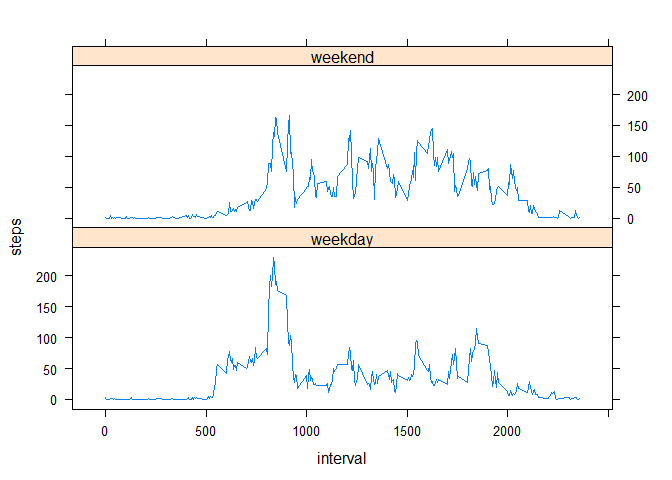

# Reproducible Research: Peer Assessment 1

## Loading and preprocessing the data

```r
unzip("activity.zip")
activity <- read.csv("activity.csv")
```

## What is mean total number of steps taken per day?
- Make a histogram of the total number of steps taken each day

```r
library("dplyr", warn.conflicts = FALSE)
steps_date <- 
  activity %>%
  group_by(date) %>%
  summarise(steps = sum(steps, na.rm = TRUE))

hist(steps_date$steps, xlab = "Total steps per day", main = "Histogram of total steps per day")
```

 

- Calculate and report the mean and median of the total number of steps taken per day

```r
mean(steps_date$steps)
```

```
## [1] 9354.23
```

```r
median(steps_date$steps)
```

```
## [1] 10395
```

## What is the average daily activity pattern?
- Make a time series plot (i.e. `type = "l"`) of the 5-minute interval (x-axis) and the average number of steps taken, averaged across all days (y-axis)

```r
steps_interval <-
activity %>%
  group_by(interval) %>%
  summarise(steps = mean(steps, na.rm = TRUE))

plot(steps_interval$interval, steps_interval$steps, type="l", xlab = "Interval",
     ylab = "Mean steps", main = "Mean steps per interval")
```

 

- Which 5-minute interval, on average across all the days in the dataset, contains the maximum number of steps?


```r
steps_interval_max <-
  steps_interval %>%
  mutate(max_steps = max(steps, na.rm = TRUE)) %>%
  filter( steps == max_steps) %>%
  select(1)
as.data.frame(steps_interval_max)
```

```
##   interval
## 1      835
```

## Imputing missing values
- Calculate and report the total number of missing values in the dataset (i.e. the total number of rows with `NA`s)

```r
sum(is.na(activity))
```

```
## [1] 2304
```

- Create a new dataset that is equal to the original dataset but with the missing data filled in.

```r
activity_new <-
  activity %>%
  left_join(steps_interval, by = "interval") %>%
  mutate(steps = ifelse( is.na(steps.x), steps.y, steps.x )) %>%
  select(c(2, 3, 5))
```
- Make a histogram of the total number of steps taken each day and Calculate and report the mean and median total number of steps taken per day.


```r
steps_date_new <- 
  activity_new %>%
  group_by(date) %>%
  summarise(steps = sum(steps, na.rm = TRUE))

hist(steps_date_new$steps, xlab = "Total steps per day", 
     main = "Histogram of total steps per day")
```

 

```r
mean(steps_date_new$steps)
```

```
## [1] 10766.19
```

```r
median(steps_date_new$steps)
```

```
## [1] 10766.19
```

- Do these values differ from the estimates from the first part of the assignment?
    - *Yes, of course*
- What is the impact of imputing missing data on the estimates of the total daily number of steps?
    - *The distribution of total steps per day seems that is more likely normal distribution than the first one*

## Are there differences in activity patterns between weekdays and weekends?
- Create a new factor variable in the dataset with two levels – “weekday” and “weekend” indicating whether a given date is a weekday or weekend day.

```r
activity_new <- 
  activity_new %>%
  mutate(day_type = as.factor(ifelse( weekdays(as.Date(date) ) %in% c("szombat", "vasárnap"),
                            "weekend", "weekday"))
        )
```
I am from Hungary thats why the name of **[Saturday](https://translate.google.hu/?ie=UTF-8&hl=hu&client=tw-ob#en/hu/Saturday)** and **[Sunday](https://translate.google.hu/?ie=UTF-8&hl=hu&client=tw-ob#en/hu/Sunday)** is different

- Make a panel plot containing a time series plot (i.e. `type = "l"`) of the 5-minute interval (x-axis) and the average number of steps taken, averaged across all weekday days or weekend days (y-axis).

```r
steps_interval_new <-
  activity_new %>%
  group_by(interval, day_type) %>%
  summarise(steps = mean(steps, na.rm = TRUE))

library("ggplot2")
qplot(interval, steps, data = steps_interval_new, facets = day_type~., geom = "line")
```

 

```r
library("lattice")
xyplot(steps ~ interval | day_type, data = steps_interval_new, type = "l", layout = c(1, 2))
```

 

***Chooe one of the above plots! :)***
