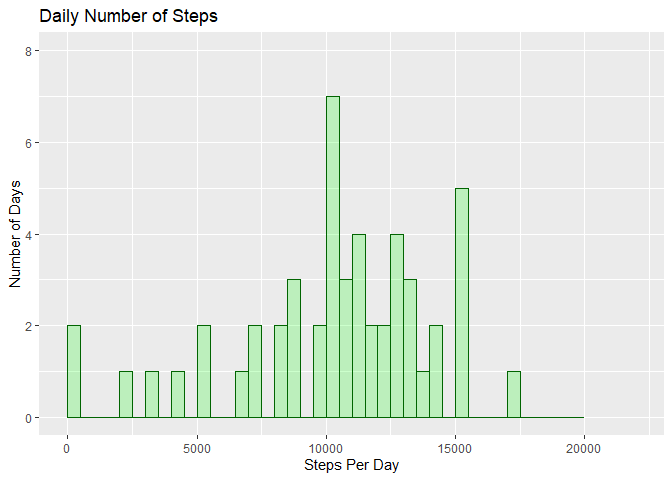
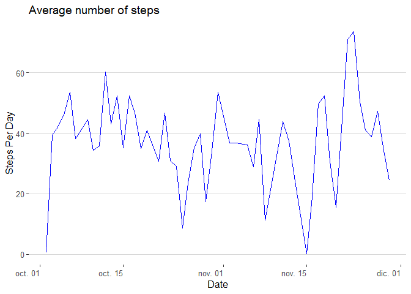
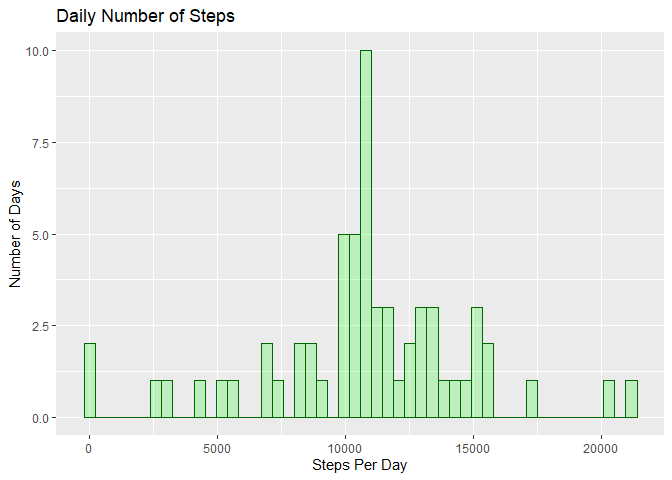
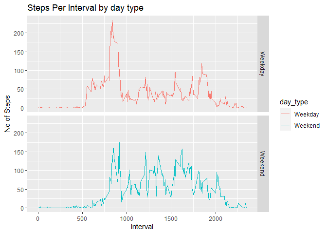

# Reproducible Research: 
## Assessment 1
## ========================================================

###  1.	Code for reading in the dataset and/or processing the data


```r
library(knitr);
library(ggplot2)
library(dplyr)
```

```
## 
## Attaching package: 'dplyr'
```

```
## The following objects are masked from 'package:stats':
## 
##     filter, lag
```

```
## The following objects are masked from 'package:base':
## 
##     intersect, setdiff, setequal, union
```

```r
library(ggthemes)

setwd("C:/Users/KRAUSE/Documents/GitHub/RepData_PeerAssessment1")
activity <- read.csv("activity.csv")

#Exploring the basics of this data

dim(activity)
```

```
## [1] 17568     3
```

```r
names(activity)
```

```
## [1] "steps"    "date"     "interval"
```

```r
head(activity)
```

```
##   steps       date interval
## 1    NA 2012-10-01        0
## 2    NA 2012-10-01        5
## 3    NA 2012-10-01       10
## 4    NA 2012-10-01       15
## 5    NA 2012-10-01       20
## 6    NA 2012-10-01       25
```

```r
str(activity)
```

```
## 'data.frame':	17568 obs. of  3 variables:
##  $ steps   : int  NA NA NA NA NA NA NA NA NA NA ...
##  $ date    : chr  "2012-10-01" "2012-10-01" "2012-10-01" "2012-10-01" ...
##  $ interval: int  0 5 10 15 20 25 30 35 40 45 ...
```

```r
#total number of missing data
sum(is.na(activity$steps))/dim(activity)[[1]]
```

```
## [1] 0.1311475
```

```r
#transforming the date column into date format
activity = activity %>% 
  mutate(date = as.Date(date))
```
### 2.	Histogram of the total number of steps taken each day


```r
# total number of steps taken per day
StepsTotal <- aggregate(steps ~ date, data=activity, sum, na.rm=TRUE)

summary(StepsTotal$steps)
```

```
##    Min. 1st Qu.  Median    Mean 3rd Qu.    Max. 
##      41    8841   10765   10766   13294   21194
```

```r
ggplot(data=StepsTotal, aes(steps)) + 
  geom_histogram(breaks=seq(0, 20000, by=500),col="darkgreen", 
                 fill="green", 
                 alpha = .2) + 
  labs(title="Daily Number of Steps", x="Steps Per Day", y="Number of Days") + 
  xlim(c(0,22000)) + 
  ylim(c(0,8))
```

<!-- -->

### 3.	Mean and median number of steps taken each day


```r
# mean
mean(StepsTotal$steps)
```

```
## [1] 10766.19
```

```r
# median
median(StepsTotal$steps)
```

```
## [1] 10765
```

### 4.	Time series plot of the average number of steps taken

```r
avg_steps_per_day <- aggregate(steps ~ date, activity, mean)

ggplot(avg_steps_per_day, aes(x = date, y = steps))+ geom_line( color="blue", size=0.1) +
  theme_hc () +
  scale_colour_manual("",values="blue")+
  scale_fill_manual("",values="grey12")+  
  labs(title="Average number of steps", y="Steps Per Day", x="Date") + 
  theme(axis.text.x=element_text(angle=0, hjust=1), panel.background = element_rect(fill = NA)) 
```

<!-- -->
### 5.	The 5-minute interval that, on average, contains the maximum number of steps

```r
avg_steps_per_interval <- aggregate(steps ~ interval, activity, mean)

interval_idx <- which.max(avg_steps_per_interval$steps)
```
### 6.	Code to describe and show a strategy for imputing missing data

```r
# Loop thru all the rows of activity, find the one with NA for steps.
# For each identify the interval for that row
# Then identify the avg steps for that interval in avg_steps_per_interval
# Substitute the NA value with that value

avg_steps_per_interval <- aggregate(steps ~ interval, activity, mean)
activity_im <- activity
for (i in 1:nrow(activity_im)) {
  if(is.na(activity_im$steps[i])) {
    val <- lapply(avg_steps_per_interval$steps[which(avg_steps_per_interval$interval == activity_im$interval[i])], round,0)
    activity_im$steps[i] <- as.numeric(val)
  }
}
```
### 7.	Histogram of the total number of steps taken each day after missing values are imputed

```r
# Aggregate the steps per day with the imputed values
steps_per_day_im <- aggregate(steps ~ date, activity_im, sum)

# Draw a histogram of the value 
ggplot(data=steps_per_day_im, aes(steps)) + 
  geom_histogram(bins  = 50, col="darkgreen", 
                 fill="green", 
                 alpha = .2) + 
  labs(title="Daily Number of Steps", x="Steps Per Day", y="Number of Days") 
```

<!-- -->
### 8.	Panel plot comparing the average number of steps taken per 5-minute interval across weekdays and weekends

```r
# 

#Cretae a function to determine if the date is a weekday
week_day <- function(date_val) {
  wd <- weekdays(as.Date(date_val, '%Y-%m-%d'))
  if  (!(wd == 'sábado' || wd == 'domingo')) {
    x <- 'Weekday'
  } else {
    x <- 'Weekend'
  }
  x
}

# Apply the week_day function and add a new column to activity dataset
activity$day_type <- as.factor(sapply(activity$date, week_day))


# Create the aggregated data frame by intervals and day_type
steps_per_day_impute <- aggregate(steps ~ interval+day_type, activity, mean)

# Create the plot
ggplot(steps_per_day_impute, aes(interval, steps)) +
  geom_line(stat = "identity", aes(colour = day_type)) +
  theme_gray() +
  facet_grid(day_type ~ ., scales="fixed", space="fixed") +
  labs(x="Interval", y=expression("No of Steps")) +
  ggtitle("Steps Per Interval by day type")
```

<!-- -->
