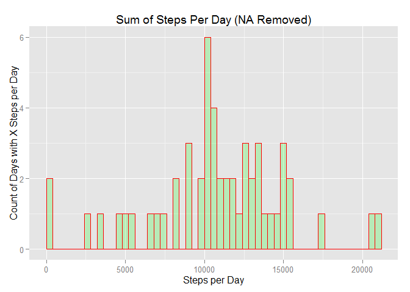
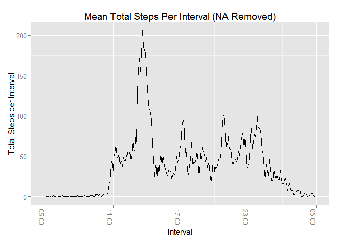
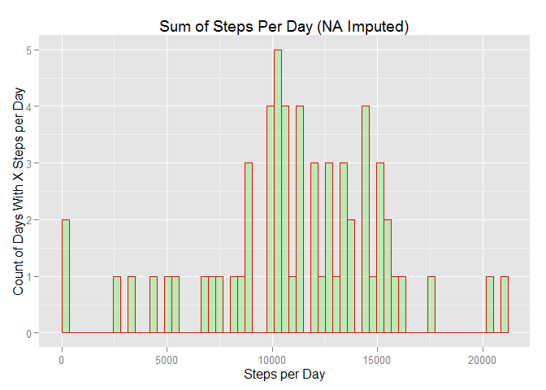
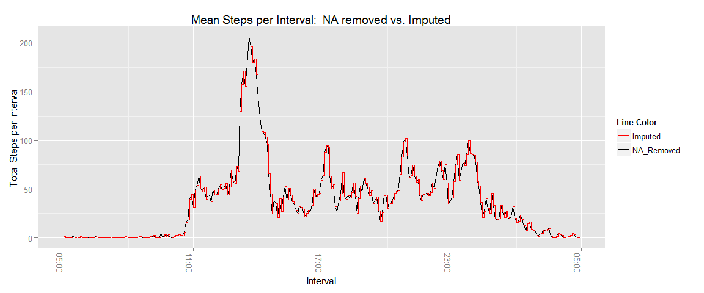
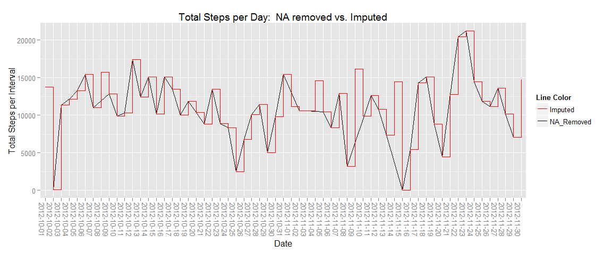
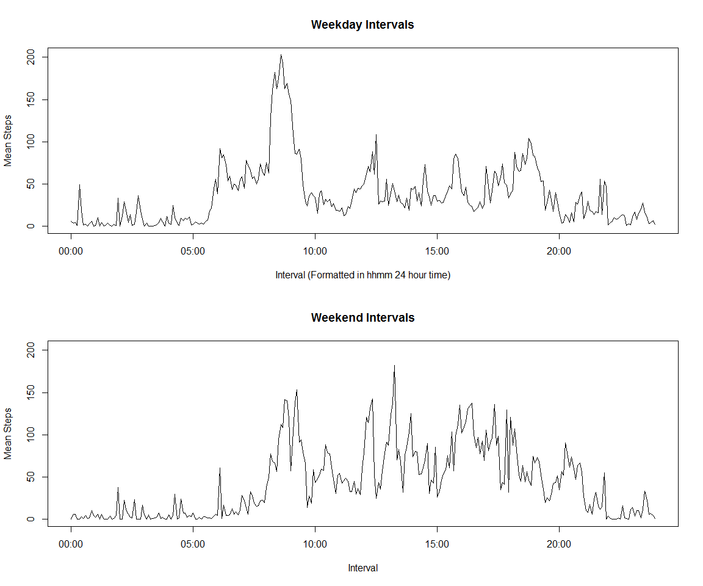

# Reproducable Research

#Introduction

It is now possible to collect a large amount of data about personal movement using activity monitoring devices such as a Fitbit, Nike Fuelband, or Jawbone Up. These type of devices are part of the "quantified self" movement - a group of enthusiasts who take measurements about themselves regularly to improve their health, to find patterns in their behavior, or because they are tech geeks. But these data remain under-utilized both because the raw data are hard to obtain and there is a lack of statistical methods and software for processing and interpreting the data.

This assignment makes use of data from a personal activity monitoring device. This device collects data at 5 minute intervals through out the day. The data consists of two months of data from an anonymous individual collected during the months of October and November, 2012 and include the number of steps taken in 5 minute intervals each day.

#Data

The data for this assignment can be downloaded from the course web site:
Dataset: [Activity monitoring data](https://d396qusza40orc.cloudfront.net/repdata%2Fdata%2Factivity.zip)  
The variables included in this dataset are:
steps: Number of steps taking in a 5-minute interval (missing values are coded as NA)
date: The date on which the measurement was taken in YYYY-MM-DD format
interval: Identifier for the 5-minute interval in which measurement was taken
The dataset is stored in a comma-separated-value (CSV) file and there are a total of 17,568 observations in this dataset.

###Conventions used in this document:
Variable names from a dataset are in all capital letters.

###Requirements
Reproducing this analysis requires use of the following R packages

```r
library(dplyr);
```

```
## Warning: package 'dplyr' was built under R version 3.2.2
```

```
## 
## Attaching package: 'dplyr'
## 
## The following objects are masked from 'package:stats':
## 
##     filter, lag
## 
## The following objects are masked from 'package:base':
## 
##     intersect, setdiff, setequal, union
```

```r
library(ggplot2);
```

```
## Warning: package 'ggplot2' was built under R version 3.2.2
```

```r
library(mice);
```

```
## Warning: package 'mice' was built under R version 3.2.2
```

```
## Loading required package: Rcpp
## Loading required package: lattice
## mice 2.22 2014-06-10
```

```r
library(knitr);
```

```
## Warning: package 'knitr' was built under R version 3.2.2
```

```r
library(chron);
library(scales);
```

###Load Raw Data:


```r
#helper function to get data
getData <- function(url, zipName, dataFileName){
  print(paste("loading data file: ", dataFileName));
  tryCatch(
    {
      
      #check if data file already exists
      if(file.exists(dataFileName)){
        print(paste("ready to use: ", dataFileName));
        return();
      }
      else{
        print(paste(dataFileName, " does not exist, attempting to get data from: ", zipName));
      }
      
      #if data file does not exist look for an archive that should contain it
      #or download the archive
      if(!file.exists(zipName)){
        print(paste(zipName, " does not exist, attempting to get data from: ", url));
        download.file(dataURL, destfile = zipName);
        print(paste(zipName, " successfully downloaded from: ", url));
      }
      
      #if the archive is found try to unpack it
      if(file.exists(zipName)){
        print(paste("unzipping: ", zipName));
        unzip(zipName)
        print(paste(zipName, " successfully unzipped"));
      }
      else{
        stop(paste(zipName, " does not exist, check URL and zip name for accuracy"));
      }
    
      #check if data file was in the archive
      if(!file.exists(dataFileName)){
        stop(paste("File not found: ", dataFileName))
      }
      
    }, 
    warning = function(w) {print(w);}, 
    error = function(e) {print(e);}
  );
}


dataURL="https://d396qusza40orc.cloudfront.net/repdata%2Fdata%2Factivity.zip"
zipName <- "repdata-data-activity.zip"
dataFileName <- "activity.csv";

#download and unzip data if necessary
getData(zipName, zipName, dataFileName);

#read raw data
rawActivityData <- read.csv(dataFileName, header=TRUE);
```

#Perform exploratory analysis on the raw data.

###Routine summary views:


```r
dim(rawActivityData);
```

```
## [1] 17568     3
```

```r
str(rawActivityData);
```

```
## 'data.frame':	17568 obs. of  3 variables:
##  $ steps   : int  NA NA NA NA NA NA NA NA NA NA ...
##  $ date    : Factor w/ 61 levels "2012-10-01","2012-10-02",..: 1 1 1 1 1 1 1 1 1 1 ...
##  $ interval: int  0 5 10 15 20 25 30 35 40 45 ...
```

```r
summary(rawActivityData);
```

```
##      steps                date          interval     
##  Min.   :  0.00   2012-10-01:  288   Min.   :   0.0  
##  1st Qu.:  0.00   2012-10-02:  288   1st Qu.: 588.8  
##  Median :  0.00   2012-10-03:  288   Median :1177.5  
##  Mean   : 37.38   2012-10-04:  288   Mean   :1177.5  
##  3rd Qu.: 12.00   2012-10-05:  288   3rd Qu.:1766.2  
##  Max.   :806.00   2012-10-06:  288   Max.   :2355.0  
##  NA's   :2304     (Other)   :15840
```

```r
head(rawActivityData);
```

```
##   steps       date interval
## 1    NA 2012-10-01        0
## 2    NA 2012-10-01        5
## 3    NA 2012-10-01       10
## 4    NA 2012-10-01       15
## 5    NA 2012-10-01       20
## 6    NA 2012-10-01       25
```

The STEPS variable contains 2304 NA entries,  
we'll need to look at the distribution of NA values.

The DATES variable appears to have reasonable entries,  
we'll need to verify the dates are valid and data is collected  
in the same manner for each date.

The INTERVAL variable contains cryptic values,  
we'll need to interpret the meaning of entries in this variable.

Segment raw data by DATE to ensure the date values represent valid dates,  
and each DATE has the same number of INTERVAL values which are measured  
by the same intervals:


```r
#ensure DATE variable contains valid date values, this function will fail
#if some entry is not a valid date
validDates <- data.frame(dates = as.Date(rawActivityData$date));

#check the range of dates for validity
range(validDates$dates);
```

```
## [1] "2012-10-01" "2012-11-30"
```

```r
#segment data by DATE
dataByDate <- split(rawActivityData, rawActivityData$date);  

#check number of dates
dateCount <- length(dataByDate);

#make sure all dates have the same number of intervals
rowCountByDate <- sapply(dataByDate, function(x) nrow(x));
allCountsEqual <- all(rowCountByDate == rowCountByDate[1]);

#test if each date has the exact same intervals
intervals <- lapply(dataByDate, function(x) as.data.frame(x)[,3]);
intervalComparison <- all(unlist(intervals[1]) == unlist(intervals));
```

We see all DATE entries represent valid dates,  
the range of dates 2012-10-01 -- 2012-11-30 matches the data description,  
and the data contains 61 dates.  
Each date contains 288 observations,  
and  each DATE is segmented by the same INTERVAL values.

According the description of the raw data, each  
INTERVAL represents 5 minutes of time.  So given 288  
observations per day we account for 24 hours per day.


```r
#do the math to show range of intervals equates to 24 hours per day
5 * 288 / 60
```

```
## [1] 24
```

The data contains 288 unique intervals.  
visually examine the INTERVAL values to interpret their meaning:

```r
unique(rawActivityData$interval);
```

```
##   [1]    0    5   10   15   20   25   30   35   40   45   50   55  100  105
##  [15]  110  115  120  125  130  135  140  145  150  155  200  205  210  215
##  [29]  220  225  230  235  240  245  250  255  300  305  310  315  320  325
##  [43]  330  335  340  345  350  355  400  405  410  415  420  425  430  435
##  [57]  440  445  450  455  500  505  510  515  520  525  530  535  540  545
##  [71]  550  555  600  605  610  615  620  625  630  635  640  645  650  655
##  [85]  700  705  710  715  720  725  730  735  740  745  750  755  800  805
##  [99]  810  815  820  825  830  835  840  845  850  855  900  905  910  915
## [113]  920  925  930  935  940  945  950  955 1000 1005 1010 1015 1020 1025
## [127] 1030 1035 1040 1045 1050 1055 1100 1105 1110 1115 1120 1125 1130 1135
## [141] 1140 1145 1150 1155 1200 1205 1210 1215 1220 1225 1230 1235 1240 1245
## [155] 1250 1255 1300 1305 1310 1315 1320 1325 1330 1335 1340 1345 1350 1355
## [169] 1400 1405 1410 1415 1420 1425 1430 1435 1440 1445 1450 1455 1500 1505
## [183] 1510 1515 1520 1525 1530 1535 1540 1545 1550 1555 1600 1605 1610 1615
## [197] 1620 1625 1630 1635 1640 1645 1650 1655 1700 1705 1710 1715 1720 1725
## [211] 1730 1735 1740 1745 1750 1755 1800 1805 1810 1815 1820 1825 1830 1835
## [225] 1840 1845 1850 1855 1900 1905 1910 1915 1920 1925 1930 1935 1940 1945
## [239] 1950 1955 2000 2005 2010 2015 2020 2025 2030 2035 2040 2045 2050 2055
## [253] 2100 2105 2110 2115 2120 2125 2130 2135 2140 2145 2150 2155 2200 2205
## [267] 2210 2215 2220 2225 2230 2235 2240 2245 2250 2255 2300 2305 2310 2315
## [281] 2320 2325 2330 2335 2340 2345 2350 2355
```

Interesting, rather than sequentially numbering the  
the intervals 1-288 the INTERVAL values equate to 24  
hour time in the format hhmm, with 0 as midnight -- the minutes change  
in increments of 5.

Examine the distribution of NA values:


```r
naCounts <- sapply(dataByDate, function(x) sum(is.na(as.data.frame(x)[,1])==TRUE));
tnaCounts <- table(naCounts);
tnaCounts
```

```
## naCounts
##   0 288 
##  53   8
```

This shows each day contains either 0 or 288 NA values for the STEPS variable,  
with 8 dates which contain only NA values for STEPS.   
The missing (NA) STEP entries account for 13.11% of the data.

Other than the abundance of NA values the data looks pretty clean,  
so let's get to work.


#Q & A

###What is mean total number of steps taken per day?  

1. Calculate total number of steps taken each day

```r
sumStepsPerDate <- rawActivityData[complete.cases(rawActivityData),]  %>% 
                   group_by(date) %>% 
                   summarise(totalsteps=sum(steps));

#quick exam of summary data
str(sumStepsPerDate);
head(sumStepsPerDate);
dim(sumStepsPerDate);
```

2. Make a histogram of the total number of steps taken each day.


```r
ggplot(data=sumStepsPerDate, aes(sumStepsPerDate$totalsteps)) + 
  geom_histogram(breaks=seq(0, max(sumStepsPerDate$totalsteps), 
                            by = max(sumStepsPerDate$totalsteps) / length(unique(sumStepsPerDate$date))), 
                 col="red", 
                 fill="green", 
                 alpha = .2) + 
  xlab("Steps per Day") +
  ylab("Count of Days with X Steps per Day") +
  ggtitle("Sum of Steps Per Day (NA Removed)");
```

 

3. Calculate and report the mean and median of the total number of steps taken per day.


```r
meanSumStepsPerDay <- mean(sumStepsPerDate$totalsteps);
medianSumStepsPerDay <- median(sumStepsPerDate$totalsteps);
```

Mean total steps taken per day (rounded): 10766  
Median of total steps taken per day: 10765  

###What is the average daily activity pattern?

1. Make a time series plot (i.e. type = "l") of the 5-minute interval (x-axis) and 
the average number of steps taken, averaged across all days (y-axis).


```r
#compute mean steps per 5 minute interval
meanStepsPerInterval <- rawActivityData[complete.cases(rawActivityData),]  %>% 
                        group_by(interval) %>% 
                        summarise(meansteps=mean(steps));

formattedIntervals <- sprintf("%04d", meanStepsPerInterval$interval);

splitCodes <- paste(substr(formattedIntervals,1,2) , ":" , 
                    substr(formattedIntervals,3,4), ":", "00", 
                    sep="");

#splitTimes <- times(splitCodes);
posixIntervals <- as.POSIXct(splitCodes, format="%H:%M:%S")

#create line plot - looks like the max mean interval is around 200 steps
ggplot(NULL, aes(posixIntervals, meanStepsPerInterval$meansteps)) + 
  geom_line() +
  xlab("Interval") +
  ylab("Total Steps per Interval") +
  ggtitle("Mean Total Steps Per Interval (NA Removed)") +
  scale_x_datetime(labels=date_format("%H:%M")) +
  theme(axis.text.x = element_text(angle = -90, hjust = 1));
```

 

2. Which 5-minute interval, on average across all the days in the dataset, 
contains the maximum number of steps?


```r
#compute max average interval
maxStepsPerInterval = max(meanStepsPerInterval$meansteps);

maxInterval <- meanStepsPerInterval %>% 
               filter(meansteps == maxStepsPerInterval) %>%
               select(interval);
```
Interval 835 contains the maximum average steps across all days (rounded): 206.17.

###Imputing missing values  

1. Calculate and report the total number of missing values in the dataset (i.e. the total number of rows with NAs)  

Previous NA analysis shows 8 dates contain only NA values for STEPS.


```r
#compute number of NA values in raw data
table(is.na(rawActivityData));
#2304 total NAs in raw data

#which columns contain NA values?
summary(rawActivityData);
#looks like only the steps variable contains NA values

#confirm the 2304 NAs are one per row
table(complete.cases(rawActivityData));

#what percent of data is missing from the steps variable?
pctNA <- sum(is.na(rawActivityData$steps))/length(rawActivityData$steps)*100;
```

Further analysis of the NA values shows all 2304 NAs appear in the STEPS field,
which comprises 13.11% of the data in this field.


2. Devise a strategy for filling in all of the missing values in the dataset.

Use the [MICE](https://cran.r-project.org/web/packages/mice/index.html) package to impute missing data!  
It's definitely more interesting then computing more means, etc...

3. Create a new dataset that is equal to the original dataset but with the missing data filled in.


```r
#show the MICE summary of the raw data,
#confirming STEPS variable contains 2304 NA values
md.pattern(rawActivityData);

#impute missing values -- this takes a minute or two depending on values for m and maxit.
tempData <- mice(rawActivityData, m=1, maxit=1, meth='pmm', seed=500);
imputedActivityData <- complete(tempData,1);
```


```r
#show summary of dataframe with imputed values for steps
summary(imputedActivityData);
```

```
##      steps                date          interval     
##  Min.   :  0.00   2012-10-01:  288   Min.   :   0.0  
##  1st Qu.:  0.00   2012-10-02:  288   1st Qu.: 588.8  
##  Median :  0.00   2012-10-03:  288   Median :1177.5  
##  Mean   : 38.77   2012-10-04:  288   Mean   :1177.5  
##  3rd Qu.: 15.00   2012-10-05:  288   3rd Qu.:1766.2  
##  Max.   :806.00   2012-10-06:  288   Max.   :2355.0  
##                   (Other)   :15840
```

4. Make a histogram of the total number of steps taken each day and Calculate and report the mean and median total number of steps taken per day. Do these values differ from the estimates from the first part of the assignment? What is the impact of imputing missing data on the estimates of the total daily number of steps?


```r
#compute sum of steps for each date
sumImputedStepsPerDate <- imputedActivityData  %>% 
                          group_by(date) %>% 
                          summarise(totalsteps=sum(steps));

ggplot(data=sumImputedStepsPerDate, aes(sumImputedStepsPerDate$totalsteps)) + 
  geom_histogram(breaks=seq(0, max(sumImputedStepsPerDate$totalsteps), 
                            by = max(sumImputedStepsPerDate$totalsteps) / length(unique(sumImputedStepsPerDate$date))), 
                 col="red", 
                 fill="green", 
                 alpha = .2) + 
  xlab("Steps per Day") +
  ylab("Count of Days With X Steps per Day") +
  ggtitle("Sum of Steps Per Day (NA Imputed)");
```

 

```r
meanSumImputedStepsPerDay <- mean(sumImputedStepsPerDate$totalsteps);
medianSumImputedStepsPerDay <- median(sumImputedStepsPerDate$totalsteps);
```


###Mean steps per day change
Mean total steps per day of data with NAs removed (rounded): 10766  
Mean total steps per day of imputed data (rounded): 11164 

The difference between NA removed data and Imputed data is (rounded): -398    
which equates to the perrcent change(rounded):  -0.91  

###Mean steps per day change
Median total steps per day of r data with NAs removed: 10765  
Median total steps per day of imputed data: 11162  

The difference in NA removed data and Imputed data is: -397  
which equates to the perrcent change:  -0.91  


Graphical comparison of mean steps per interval: NAs removed vs. imputing values for NAs


```r
#impute data and then compare mean per interval between NA removed data and imputed data
#compute mean steps per interval using imputed data
meanImputedStepsPerInterval <- imputedActivityData  %>% 
                               group_by(interval) %>% 
                               summarise(meansteps=mean(steps));

formattedIntervals <- sprintf("%04d", meanImputedStepsPerInterval$interval);

splitCodes <- paste(substr(formattedIntervals,1,2) , ":" , 
                    substr(formattedIntervals,3,4), ":", "00", 
                    sep="");

#splitTimes <- times(splitCodes);
posixIntervals <- as.POSIXct(splitCodes, format="%H:%M:%S");

#create plot
ggplot(NULL, aes(posixIntervals, meanStepsPerInterval$meansteps)) + 
  geom_line(data = meanStepsPerInterval, aes(color="NA_Removed")) +
  geom_step(data = meanImputedStepsPerInterval, aes(color="Imputed")) +
  xlab("Interval") +
  ylab("Total Steps per Interval") +
  ggtitle("Mean Steps per Interval:  NA removed vs. Imputed") + 
  scale_x_datetime(labels=date_format("%H:%M")) +
  scale_colour_manual(name="Line Color", values=c(NA_Removed="black", Imputed="red")) +
  theme(axis.text.x = element_text(angle = -90, hjust = 1));
```

 


Graphical comparison of total steps per day: NAs removed vs. imputing values for NAs


```r
#compare plot of sum steps per date:  raw data (NA removed)  vs. imputed data
ggplot(NULL, aes(date, totalsteps, group=1)) + 
  geom_line(data = sumStepsPerDate, aes(color="NA_Removed")) +
  geom_step(data = sumImputedStepsPerDate, aes(color="Imputed")) +
  xlab("Date") +
  ylab("Total Steps per Interval") +
  ggtitle("Total Steps per Day:  NA removed vs. Imputed")+
  theme(axis.text.x = element_text(angle = -90, hjust = 1)) + 
  scale_colour_manual(name="Line Color", values=c(NA_Removed="black", Imputed="red"));
```

 

###Are there differences in activity patterns between weekdays and weekends?

1. Create a new factor variable in the dataset with two levels - "weekday" and "weekend" indicating whether a given date is a weekday or weekend day.


```r
#add weekend/weekday factor to the data set
#that contains imputed data
imputedActivityData$day_type <- as.factor(ifelse(grepl("Saturday|Sunday" , weekdays(as.Date( as.character(imputedActivityData$date)))), "weekend", "weekday"));

#confirm new factor column appears correct
str(imputedActivityData);
```

```
## 'data.frame':	17568 obs. of  4 variables:
##  $ steps   : int  0 0 51 0 0 757 17 36 0 8 ...
##  $ date    : Factor w/ 61 levels "2012-10-01","2012-10-02",..: 1 1 1 1 1 1 1 1 1 1 ...
##   ..- attr(*, "contrasts")= num [1:61, 1:60] 0 1 0 0 0 0 0 0 0 0 ...
##   .. ..- attr(*, "dimnames")=List of 2
##   .. .. ..$ : chr  "2012-10-01" "2012-10-02" "2012-10-03" "2012-10-04" ...
##   .. .. ..$ : chr  "2" "3" "4" "5" ...
##  $ interval: int  0 5 10 15 20 25 30 35 40 45 ...
##  $ day_type: Factor w/ 2 levels "weekday","weekend": 1 1 1 1 1 1 1 1 1 1 ...
```

```r
table(imputedActivityData$day_type)
```

```
## 
## weekday weekend 
##   12960    4608
```

2. Make a panel plot containing a time series plot (i.e. type = "l") of the 5-minute interval (x-axis) and the average number of steps taken, averaged across all weekday days or weekend days (y-axis).


```r
#summarize weekday data by interval
imputedWeekDaysMeanStepsPerInterval <- subset(imputedActivityData, day_type == "weekday") %>% 
                                       group_by(interval) %>% 
                                       summarise(meansteps=mean(steps));

#summarize weekend data by interval
imputedWeekEndsMeanStepsPerInterval <- subset(imputedActivityData, day_type == "weekend") %>% 
                                       group_by(interval) %>% 
                                       summarise(meansteps=mean(steps));


formattedIntervals <- sprintf("%04d", imputedWeekDaysMeanStepsPerInterval$interval);

splitCodes <- paste(substr(formattedIntervals,1,2) , ":" , 
                    substr(formattedIntervals,3,4), ":", "00", 
                    sep="");

#splitTimes <- times(splitCodes);
posixIntervals <- as.POSIXct(splitCodes, format="%H:%M:%S");

#2 panel plot off weekends vs. weekdays
par(mfrow=c(2,1));
plot(x=posixIntervals, 
     y=imputedWeekDaysMeanStepsPerInterval$meansteps, 
     type="l",
     xlab="Interval (Formatted in hhmm 24 hour time)", 
     ylab="Mean Steps",
     ylim=c(0, max(imputedWeekDaysMeanStepsPerInterval$meansteps,
                   imputedWeekEndsMeanStepsPerInterval$meansteps)));
     title(main="Weekday Intervals");

plot(x=posixIntervals, 
     y=imputedWeekEndsMeanStepsPerInterval$meansteps, 
     type="l",
     xlab="Interval", 
     ylab="Mean Steps",
     ylim=c(0, max(imputedWeekDaysMeanStepsPerInterval$meansteps,
                   imputedWeekEndsMeanStepsPerInterval$meansteps)));
     title(main="Weekend Intervals");
```

 


This analysis is begging for a over-lay of the previous 2 graphs,  
so here it is:


```r
plot(x=posixIntervals, 
     y=imputedWeekDaysMeanStepsPerInterval$meansteps, 
     type="l",
     col="red",
     xlab="Interval", 
     ylab="Mean Steps",
     ylim=c(0, max(imputedWeekDaysMeanStepsPerInterval$meansteps,
                   imputedWeekEndsMeanStepsPerInterval$meansteps)));

lines(x=posixIntervals, 
      y=imputedWeekEndsMeanStepsPerInterval$meansteps,
      col="black");

title(main="Weekday vs Weekend Mean Steps per Interval");
legend(x="topright", legend=c("Weekdays", "Weekends"),
       col=c("red", "black"), lwd=1)
```

 

This shows clear indication that people walk/run more
during the morning of weekdays, while they walk/run more
during the afternoon of weekends.


