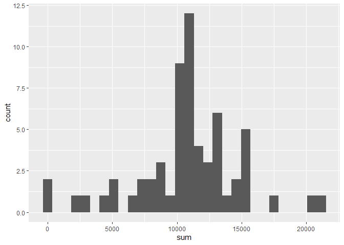
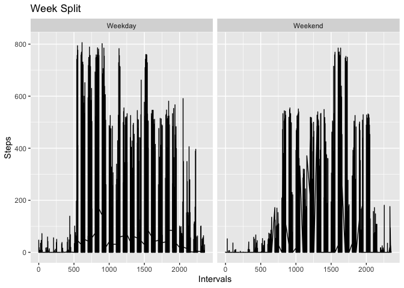
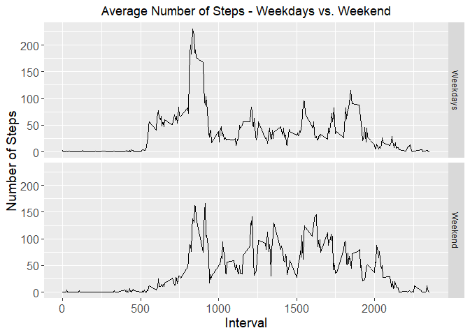
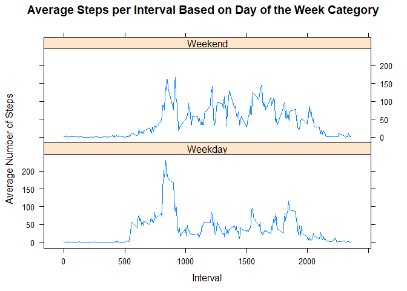

# Reproducible Research: Peer Assessment 1


## Loading and preprocessing the data
 1. Load the data (i.e. read.csv())
 2. Process/transform the data (if necessary) into a format suitable for your analysis.
 
needed library and setting echo to true

```r
library("knitr")
opts_chunk$set(echo = TRUE, results = 'hold')
```


```r
library("xtable")
library("ggplot2")
```

 Reading in the  csv, remove NA values and store it in data.
 

```r
unzip("activity.zip")
data <- read.csv("activity.csv", sep=",", header = TRUE, stringsAsFactors = FALSE, na.strings = "NA")
```

 Display the data, a use to sellect a number of data entries from the head.

```r
head(data, 10)
```

```
##    steps       date interval
## 1     NA 2012-10-01        0
## 2     NA 2012-10-01        5
## 3     NA 2012-10-01       10
## 4     NA 2012-10-01       15
## 5     NA 2012-10-01       20
## 6     NA 2012-10-01       25
## 7     NA 2012-10-01       30
## 8     NA 2012-10-01       35
## 9     NA 2012-10-01       40
## 10    NA 2012-10-01       45
```

#--------------------------------------------------------------------
## What is mean total number of steps taken per day?

Extract complete cases and store them in datasteps.

```r
datasteps <- data[complete.cases(data),]
```
 1. Calculate the total number of steps taken per day.


```r
total_steps_per_day <- tapply(datasteps$steps, datasteps$date, sum, na.rm = TRUE)
total_steps_per_day
```

```
## 2012-10-02 2012-10-03 2012-10-04 2012-10-05 2012-10-06 2012-10-07 
##        126      11352      12116      13294      15420      11015 
## 2012-10-09 2012-10-10 2012-10-11 2012-10-12 2012-10-13 2012-10-14 
##      12811       9900      10304      17382      12426      15098 
## 2012-10-15 2012-10-16 2012-10-17 2012-10-18 2012-10-19 2012-10-20 
##      10139      15084      13452      10056      11829      10395 
## 2012-10-21 2012-10-22 2012-10-23 2012-10-24 2012-10-25 2012-10-26 
##       8821      13460       8918       8355       2492       6778 
## 2012-10-27 2012-10-28 2012-10-29 2012-10-30 2012-10-31 2012-11-02 
##      10119      11458       5018       9819      15414      10600 
## 2012-11-03 2012-11-05 2012-11-06 2012-11-07 2012-11-08 2012-11-11 
##      10571      10439       8334      12883       3219      12608 
## 2012-11-12 2012-11-13 2012-11-15 2012-11-16 2012-11-17 2012-11-18 
##      10765       7336         41       5441      14339      15110 
## 2012-11-19 2012-11-20 2012-11-21 2012-11-22 2012-11-23 2012-11-24 
##       8841       4472      12787      20427      21194      14478 
## 2012-11-25 2012-11-26 2012-11-27 2012-11-28 2012-11-29 
##      11834      11162      13646      10183       7047
```

 2. histogram showing the steps per day


```r
hist(total_steps_per_day, col="red", xlab = "Steps per Day", main = "Number of Steps per Day")
```



 3. Calculate and report the mean and median of the total number of steps taken per day
 

```r
summary(total_steps_per_day)
```

```
##    Min. 1st Qu.  Median    Mean 3rd Qu.    Max. 
##      41    8841   10760   10770   13290   21190
```
# mean_total of steps


```r
mean_total <- mean(total_steps_per_day)
mean_total
```

```
## [1] 10766.19
```

# median_total of steps

```r
median_total <- median(total_steps_per_day)
median_total
```

```
## [1] 10765
```

#---------------------------------------------------------------------

## What is the average daily activity pattern?

```r
data_pattern <- data[complete.cases(data),]
    daily_activity <- tapply(data_pattern$steps, data_pattern$interval, mean, na.rm = TRUE)
    head(daily_activity, 10)
```

```
##         0         5        10        15        20        25        30 
## 1.7169811 0.3396226 0.1320755 0.1509434 0.0754717 2.0943396 0.5283019 
##        35        40        45 
## 0.8679245 0.0000000 1.4716981
```
 1. Make a time series plot (i.e. type = "l") of the 5-minute interval (x-axis) and the average number of steps taken, averaged across all days (y-axis)
# Plot of average daily activity

```r
plot(names(daily_activity), daily_activity, type = "l", xlab = "5 minute Interval", ylab = "Average Number of Steps Taken Througout the Days", main = "Average Daily Activity", col = "red")
```


 2. Which 5-minute interval, on average across all the days in the dataset, contains the maximum number of steps?

```r
largest_n_steps_interval <- which.max(daily_activity)
names(largest_n_steps_interval)
```

```
## [1] "835"
```
# -----------------------------------------------------------------

## Imputing missing values
 1. Calculate and report the total number of missing values in the dataset (i.e. the total number of rows with NAs) 
 
# Number of missing values stores in number_na.

```r
number_na <- sum(!(complete.cases(data)))
number_na
```

```
## [1] 2304
```


 2. Devise a strategy for filling in all of the missing values in the dataset. The strategy does not need to be sophisticated. For example, you could use the mean/median for that day, or the mean for that 5-minute interval, etc. and 
 3. create a new dataset that is equal to the original dataset but with the missing data filled in. asign each NA value the average number of steps for all days as calculated in previous steps.
 

```r
new_data_filling_NA <- data
    for (i in 1:nrow(new_data_filling_NA)){
        if (is.na(new_data_filling_NA$steps[i])){
            new_data_filling_NA$steps[i] <- mean(new_data_filling_NA$steps[new_data_filling_NA$interval == new_data_filling_NA$interval[i]], na.rm=TRUE)
        }
    }   
```
 4. Make a histogram of the total number of steps taken each day and Calculate and report the mean and median total number of steps taken per day. Do these values # differ from the estimates from the first part of the assignment? What is the impact of imputing missing data on the estimates of the total daily number of steps?
 

```r
total_steps_per_day2 <- tapply(new_data_filling_NA$steps, new_data_filling_NA$date, sum)
```

```r
hist(total_steps_per_day2, col = "blue",xlab = "Steps taken per Day", main = "Average number of Steps per Day\n With Filled in Missing Values")
```



```r
summary(total_steps_per_day2)
```

```
##    Min. 1st Qu.  Median    Mean 3rd Qu.    Max. 
##      41    9819   10770   10770   12810   21190
```

# mean_total of steps with filled in missing values


```r
mean_total2 <- mean(total_steps_per_day2)
mean_total2
```

```
## [1] 10766.19
```


# median_total of steps with filled in missing values

```r
median_total2 <- median(total_steps_per_day2)
median_total2
```

```
## [1] 10766.19
```
# difference in mean between filled in and not filled in


```r
mean_total2 - mean_total
```

```
## [1] 0
```
# difference in median between filled in and not filled in.

```r
median_total2 - median_total
```

```
## [1] 1.188679
```

#----------------------------------------------------------------------

## Are there differences in activity patterns between weekdays and weekends?

 1. For this part the weekdays() function may be of some help here. Use the dataset with the filled-in missing values for this part.

 2. Create a new factor variable in the dataset with two levels - "weekday" and "weekend" indicating whether a given date is a weekday or weekend day.

 3. Make a panel plot containing a time series plot (i.e. type = "l") of the 5-minute interval (x-axis) and the average number of steps taken, averaged across all weekday days or weekend days (y-axis). See the README file in the GitHub repository to see an example of what this plot should look like using simulated data.
 

```r
week <- weekdays(strptime(new_data_filling_NA$date, format = "%Y-%m-%d"))
    for (i in 1:length(week))
        {
            if (week[i] == "Saturday" | week[i] == "Sunday"){
            week[i] <- "weekend"
        } 
    else {
            week[i] <- "weekday"
         }
}
```


```r
library("lattice")
```


```r
week <- as.factor(week)
new_data_filling_NA$week <- week
```


 

```r
final_data <- aggregate(steps ~ interval + week, data = new_data_filling_NA, mean)
```


```r
xyplot(steps ~ interval | week, final_data
     , type = "l"
     , xlab = "Interval"
     , ylab = "Number of steps"
     , main = "Average steps, averaged across all weekday days or weekend days"
     , layout = c(1, 2))
```


