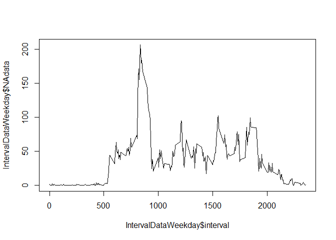

# Reproducible Research: Peer Assessment 1
### Installing from library

```r
library(ggplot2)
setwd("C:/Users/Tdashi/Documents/GitHub/RepData_PeerAssessment1")
```

### Loading and preprocessing the data

```r
unzip(zipfile = "activity.zip")
RawData <- read.csv("activity.csv")
OmittedData <- na.omit(RawData)
```

### What is mean total number of steps taken per day?
####1. Calculate the total number of steps taken per day using omitted data.

```r
stepdata1_O <- aggregate(OmittedData["steps"], by=OmittedData["date"], FUN=sum)
head(stepdata1_O)
```

```
##         date steps
## 1 2012-10-02   126
## 2 2012-10-03 11352
## 3 2012-10-04 12116
## 4 2012-10-05 13294
## 5 2012-10-06 15420
## 6 2012-10-07 11015
```

####2. Make a histogram of the total number of steps taken each day

```r
sd1 <- ggplot(stepdata1_O, aes(x = steps)) 
sd1 + geom_histogram(binwidth = 2500) +
      ggtitle("The total number of steps taken each day")
```

 

####3. Calculate and report the mean and median of the total number of steps taken per day
- mean

```r
mean(stepdata1_O$steps)
```

```
## [1] 10766.19
```
- median

```r
median(stepdata1_O$steps)
```

```
## [1] 10765
```


### What is the average daily activity pattern?

####1. Make a time series plot of the 5-minute interval (x-axis) and the average number across all days.

```r
stepdata2_O <- aggregate(OmittedData["steps"], by=OmittedData["interval"], FUN=mean)

sd2 <- ggplot(stepdata2_O, aes(x = interval, y = steps))
sd2 + geom_line() + ggtitle("The average number of steps across all days")
```

 

####2. Which 5-minute interval, on average across all the days in the dataset, contains the maximum number of steps?

```r
stepdata2_O$interval[stepdata2_O$steps == max(stepdata2_O$steps)]
```

```
## [1] 835
```

### Imputing missing values

####1. Calculate and report the total number of missing values in the dataset (i.e. the total number of rows with NAs)

```r
sum(is.na(RawData))
```

```
## [1] 2304
```

####2.Devise a strategy for filling in all of the missing values in the dataset. 

- Create a new dataset that is equal to the original dataset.

```r
filledData <- RawData
```
- ...but with the missing data filled in. I used the mean for that 5-minute interval.

```r
num <- 1:length(RawData[,1])
for (i in num){
    if(is.na(RawData[i, 1])){
        filledData[i, 1] <- stepdata2_O[stepdata2_O$interval == RawData[i,3], 2]
    }
}
```

####3. Make a histogram of the total number of steps taken each day

```r
stepdata3_Filled <- aggregate(filledData["steps"], by=filledData["date"], FUN=sum)
sd3 <- ggplot(stepdata3_Filled, aes(x = steps)) 
sd3 + geom_histogram(binwidth = 2500) +
      ggtitle("The total number of steps taken each day (filled)")
```

 
* We can see only the middle bar is extended.
* Because the value witch are filled in NA are close to the average value. 

####4. Calculate and report the mean and median of the total number of steps taken per day.
- mean

```r
mean(stepdata3_Filled$steps)
```

```
## [1] 10766.19
```
- median

```r
median(stepdata3_Filled$steps)
```

```
## [1] 10766.19
```
* These data are not changed compareed to the raw data.


### Are there differences in activity patterns between weekdays and weekends?
####1. Create a new factor variable in the dataset with two levels - "weekday" and "weekend"

```r
filledData$week <- weekdays(as.Date.factor(filledData[, 2]))
filledData$weekday <- ""
num <- 1:length(RawData[,1])
for (i in num){
    if(filledData[i, 4] == "Sunday" || filledData[i, 4] == "Saturday"){
        filledData[i, "weekday"] <- "Weekends"

    } else {
        filledData[i, "weekday"] <- "Weekdays"
    }
}
```


####2. Make time seriese graph and compare "weekday" and "weekend".

```r
twolevel <-aggregate(filledData["steps"], by=filledData[c("interval", "weekday")], FUN=mean)

g <- ggplot(data = twolevel, aes(x=interval, y=steps, col=weekday))
g + geom_line() + facet_grid(weekday ~.) +
    ggtitle("The average number of steps across all days")
```

 
