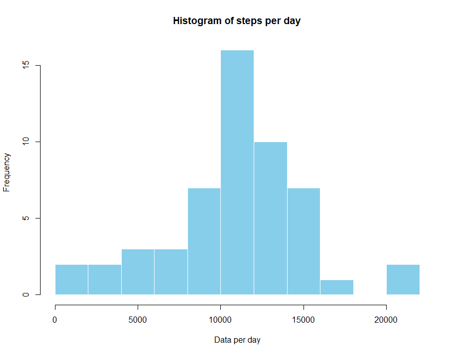
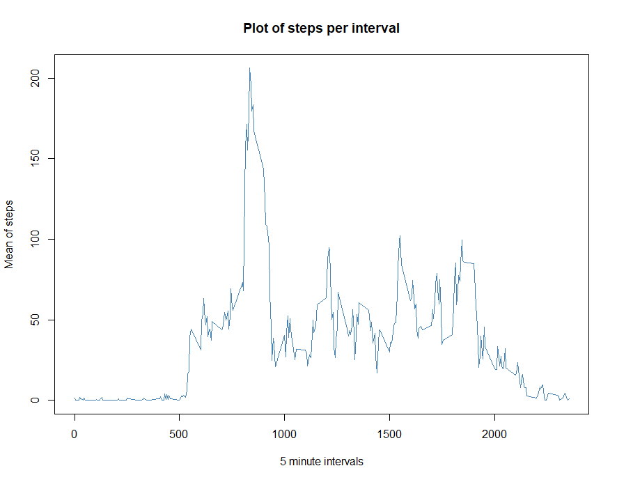
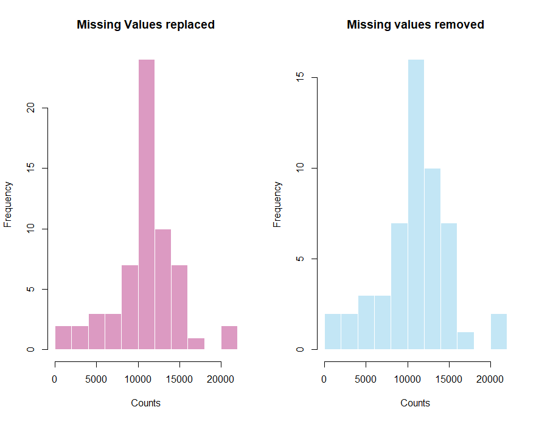
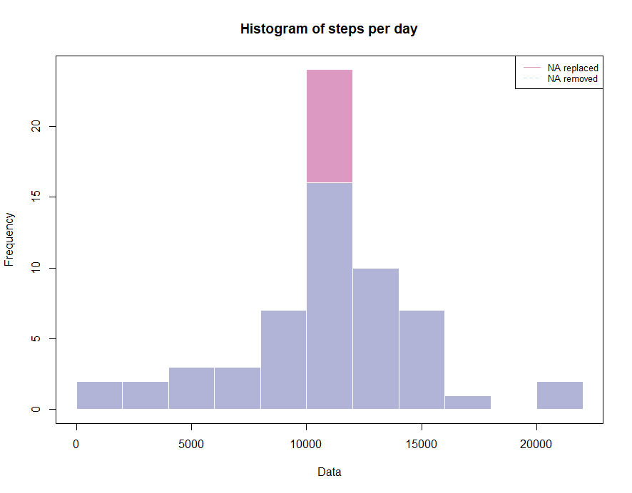
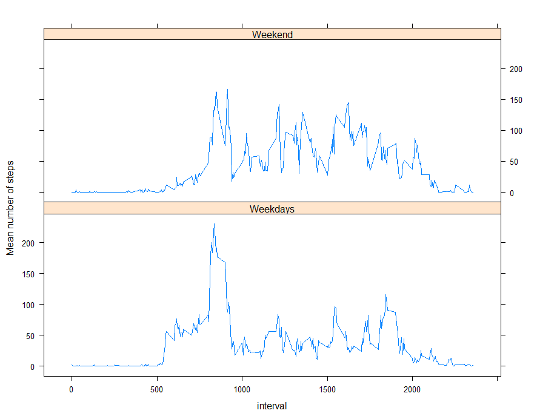

## Loading and preprocessing the data  
First the data is loaded and preprocessed. The date is transformed from `char` to `date` class.  


```r
unzip("activity.zip")
activity <- na.omit(read.csv("activity.csv"))
activity$date <-as.Date(activity$date, format = c("%Y-%m-%d"))
str(activity)
```

```
## 'data.frame':	15264 obs. of  3 variables:
##  $ steps   : int  0 0 0 0 0 0 0 0 0 0 ...
##  $ date    : Date, format: "2012-10-02" "2012-10-02" ...
##  $ interval: int  0 5 10 15 20 25 30 35 40 45 ...
##  - attr(*, "na.action")= 'omit' Named int [1:2304] 1 2 3 4 5 6 7 8 9 10 ...
##   ..- attr(*, "names")= chr [1:2304] "1" "2" "3" "4" ...
```

```r
summary(activity)
```

```
##      steps             date               interval     
##  Min.   :  0.00   Min.   :2012-10-02   Min.   :   0.0  
##  1st Qu.:  0.00   1st Qu.:2012-10-16   1st Qu.: 588.8  
##  Median :  0.00   Median :2012-10-29   Median :1177.5  
##  Mean   : 37.38   Mean   :2012-10-30   Mean   :1177.5  
##  3rd Qu.: 12.00   3rd Qu.:2012-11-16   3rd Qu.:1766.2  
##  Max.   :806.00   Max.   :2012-11-29   Max.   :2355.0
```
## What is mean total number of steps taken per day?
The data is grouped using the `ddply()` function by day and the total number of steps are calculated.

```r
library(plyr)
```

```
## Warning: package 'plyr' was built under R version 4.0.2
```

```r
dataperday <- ddply(activity, .(date), 
                    function(x) {steps_sum <- sum(x$steps);
                                 steps_mean <- mean(x$steps);
                                 steps_median <- median(x$steps);
                                 ans <- cbind(steps_sum, steps_mean, steps_median)})

hist(dataperday$steps_sum, breaks = 10, col = "skyblue", border = F, main = "Histogram of steps per day" , xlab ="Data per day")
```
<!-- -->

Here is the summary of the sum, mean and median per day  

```r
head(dataperday)
```

```
##         date steps_sum steps_mean steps_median
## 1 2012-10-02       126    0.43750            0
## 2 2012-10-03     11352   39.41667            0
## 3 2012-10-04     12116   42.06944            0
## 4 2012-10-05     13294   46.15972            0
## 5 2012-10-06     15420   53.54167            0
## 6 2012-10-07     11015   38.24653            0
```

```r
mean_steps <-as.integer(mean(dataperday$steps_sum))
median_steps <- as.integer(median(dataperday$steps_sum))
```

However, the total mean and median of the total number of steps taken per day  are 10766 and 10765 respectively

```r
summary(dataperday$steps_sum)
```

```
##    Min. 1st Qu.  Median    Mean 3rd Qu.    Max. 
##      41    8841   10765   10766   13294   21194
```

## What is the average daily activity pattern?
First, the data is grouped by interval using the `ddply()` function by interval and the mean of steps is calculated.  


```r
dataperinterval <- ddply(activity, .(interval), 
                    function(x) {interval_sum <- mean(x$steps)})

plot(dataperinterval$interval, dataperinterval$V1, col = "steelblue", type ='l', main = "Plot of steps per interval" , xlab ="5 minute intervals", ylab = "Mean of steps")
```
<!-- -->


On average the interval that contains the maximun number of steps is the interval 835 with an average of 206.17 steps  


```r
dataperinterval[which.max(dataperinterval[,2]),]
```

```
##     interval       V1
## 104      835 206.1698
```

## Imputing missing values
There are 2304 missing values. 

```r
missingvalues <- read.csv("activity.csv")
nrow(missingvalues)-nrow(activity)
```

```
## [1] 2304
```

```r
head(missingvalues)
```

```
##   steps       date interval
## 1    NA 2012-10-01        0
## 2    NA 2012-10-01        5
## 3    NA 2012-10-01       10
## 4    NA 2012-10-01       15
## 5    NA 2012-10-01       20
## 6    NA 2012-10-01       25
```

To fill the missing values the average of that interval is going to be used

```r
mv_replace <- function(x) {
  x <- data.frame(x)
  x <- setNames(x, c("steps","date", "interval"))
  val <- dataperinterval$V1[dataperinterval$interval==x$interval[1]]
  if (sum(is.na(x$steps)) != 0) {
  x[is.na(x$steps),][,1] <- val
  x}
}

split_data<-split(missingvalues,missingvalues$interval)

for (i in 1:length(split_data)) { 
  ans <- mv_replace(split_data[i])
    if (i==1) { mv2 <- ans} else {mv2 <- rbind(mv2,ans)}
}

mv2$date <-as.Date(mv2$date, format = c("%Y-%m-%d"))
mv2 <-arrange(mv2, date)
head(mv2) 
```

```
##       steps       date interval
## 1 1.7169811 2012-10-01        0
## 2 0.3396226 2012-10-01        5
## 3 0.1320755 2012-10-01       10
## 4 0.1509434 2012-10-01       15
## 5 0.0754717 2012-10-01       20
## 6 2.0943396 2012-10-01       25
```


```r
dataperday_new <- ddply(mv2, .(date), 
                    function(x) {steps_sum <- sum(x$steps)})
dataperday_new <- setNames(dataperday_new, c("date","steps"))

par(mfrow=c(1,2))
hist(dataperday_new$steps, breaks = 10, col=rgb(0.7294,0.2078,0.52156,0.5), border = F, main = "Missing Values replaced" , xlab ="Counts")
hist(dataperday$steps_sum, breaks = 10, col=rgb(0.5294,0.8078,0.92156,0.5), border = F, main = "Missing values removed" , xlab ="Counts")
```
<!-- -->

Visualizing it together. 

```r
hist(dataperday_new$steps, breaks = 10, col=rgb(0.7294,0.2078,0.52156,0.5), border = F, main = "Histogram of steps per day" , xlab ="Data", )
hist(dataperday$steps_sum, breaks = 10, col=rgb(0.5294,0.8078,0.92156,0.5), border = F, add = T)
legend("topright", legend=c("NA replaced", "NA removed"),
       col=c(rgb(0.7294,0.2078,0.52156,0.5), rgb(0.5294,0.8078,0.92156,0.5)), lty=1:2, cex=0.8)
box()
```
<!-- -->

The mean and the median total number of steps taken per day from the new data set are 10766 and 10766.19 respectively. The value of the mean remains unchanged while the median slighty changes.

```r
mean(dataperday_new$steps)
```

```
## [1] 10766.19
```

```r
median(dataperday_new$steps)
```

```
## [1] 10766.19
```


## Are there differences in activity patterns between weekdays and weekends?


```r
weekend_fun <- function(x) {
  weekends <- c("Sunday", "Saturday")
  
  if (weekdays(x) %in% weekends)
  {ans <- "Weekend"} 
  else{ ans <- "Weekdays"}
  ans
}

mv2$week <- simplify2array(lapply(mv2[,2], weekend_fun))

library(lattice)
dataperinterval_weeks <- ddply(mv2, .(week, interval), function(x) {interval_sum <- mean(x$steps)})
xyplot(V1 ~ interval| week, data = dataperinterval_weeks, layout=c(1,2), type = "l", ylab = "Mean number of steps")
```

<!-- -->


