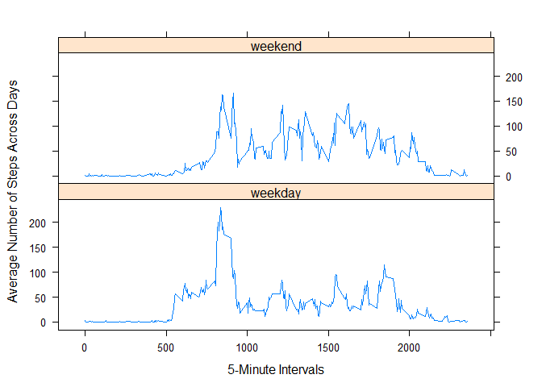

# Reproducible Research: Peer Assessment 1

## Loading and preprocessing the data

```r
Activity <- read.csv(unz("./activity.zip", "activity.csv"))
AnoNA <- complete.cases(Activity)
ActivityNoNA <- Activity[AnoNA, ]
library(dplyr)
```

```
## 
## Attaching package: 'dplyr'
```

```
## The following objects are masked from 'package:stats':
## 
##     filter, lag
```

```
## The following objects are masked from 'package:base':
## 
##     intersect, setdiff, setequal, union
```

## What is mean total number of steps taken per day?

### Step 1: Calculate the total number of steps taken per day

```r
SByDate <- group_by(ActivityNoNA, date)
StepSumByDate <- summarize(SByDate, StepSum = sum(steps)) ## table of totals by date
```

### Step 2: Make a histogram of the total number of steps taken each day

```r
with(StepSumByDate, {
     hist(StepSum, main = "Histogram of the Total Number of Steps Taken Each Day", 
          xlab = "Total Steps Each Day")
     abline(v=mean(StepSum), lwd = 4, col = "purple")
     legend("topright", lwd = 4, col = "purple", legend = "Mean")
})
```

<!-- -->

### Step 3: Calculate and report the mean and median of the total number of steps taken per day

```r
MeanStepSum <- format(mean(StepSumByDate$StepSum), digits=7, nsmall=2) ## calc mean

MedianStepSum <- format(median(StepSumByDate$StepSum), digits=7, nsmall=2)  ## calc median
```
####The MEAN for the total number of steps taken each day is **10766.19**

####The MEDIAN for the total number of steps taken each day is **10765**


## What is the average daily activity pattern?

### Step 1: Make a time series plot (i.e. type = "l") of the 5-minute interval (x-axis) and the average number of steps taken, averaged across all days (y-axis)


```r
SByInt <- group_by(ActivityNoNA, interval)
StepAvgByInt <- summarize(SByInt, StepAvg = mean(steps)) ## table of avg by interval

## PLOT IT:
with(StepAvgByInt, {
     plot(interval, StepAvg, type="l", 
     main = "Time Series of Average Number of Steps for each 5-Minute Interval", 
     xlab = "5 - Minute Intervals",
     ylab = "Average Number of Steps Across All Days")
})
```

<!-- -->

### Step 2: Find which 5-minute interval, on average across all the days in the dataset, contains the maximum number of steps?

```r
IntMaxStep <- StepAvgByInt[which(StepAvgByInt$StepAvg == max(StepAvgByInt$StepAvg)), ]
```
####Interval ID # 835 has the most steps at **206.1698** average number of steps

## Imputing missing values

### Step 1: Calculate and report the total number of missing values in the dataset (i.e. the total number of rows with NAs)

####There are 2304 missing values in the data set.

### Step 2: Devise a strategy for filling in all of the missing values in the dataset. 

The strategy is to use the the mean for that 5-minute interval across all days.  There are days where the steps are all "NA" so, I cannot rely on getting the average for the "NA" days.

### Step 3: Create a new dataset that is equal to the original dataset but with the missing data filled in.

```r
ActivityFull <- Activity  ## Create new dataset
for(i in 1 : nrow(ActivityFull)) {
  if(is.na(ActivityFull$steps[i])) {
    ActivityFull$steps[i] <- StepAvgByInt$StepAvg[StepAvgByInt$interval==ActivityFull$interval[i]]
  }
}
```

### Step 4.Make a histogram of the total number of steps taken each day and Calculate and report the mean and median total number of steps taken per day. Do these values differ from the estimates from the first part of the assignment? What is the impact of imputing missing data on the estimates of the total daily number of steps?

```r
SByDateFull <- group_by(ActivityFull, date)
StepSumByDateFull <- summarize(SByDateFull, StepSum = sum(steps)) ## table of totals by date
with(StepSumByDateFull, {
     hist(StepSum, main = "Total Number of Steps Taken Each Day with Missing Values Filled In", 
          xlab = "Total Steps Each Day")
     abline(v=mean(StepSum), lwd = 4, col = "purple")
     legend("topright", lwd = 4, col = "purple", legend = "Mean")
})
```

<!-- -->

```r
MeanStepSumFull <- format(mean(StepSumByDateFull$StepSum), digits=7, nsmall=2) ## calc mean
MedianStepSumFull <- median(StepSumByDateFull$StepSum)  ## calc median
```
####The MEAN for the total number of steps taken each day is **10766.19**

####The MEDIAN for the total number of steps taken each day is **10766.19**

####By filling in the missing values in the dataset, there seems to be no discernible difference with the other histogram except for the 10,000 to 15,000 total step count limit.  
####The addition of the data has increased the frequency of the 10,000 to 15,000 total step count from approximately 29 to 36 and the mean and medium are now exactly the same.


## Are there differences in activity patterns between weekdays and weekends?

###For this part the weekdays() function may be of some help here. Use the dataset with the filled-in missing values for this part.

###Step 1: Create a new factor variable in the dataset with two levels – “weekday” and “weekend” indicating whether a given date is a weekday or weekend day.

```r
ActivityWeek <- ActivityFull
ActivityWeek$week <- as.factor(ifelse((weekdays(as.Date(ActivityWeek$date)) %in% c("Saturday","Sunday")),"weekend","weekday"))
```

###Step2: Make a panel plot containing a time series plot (i.e. type = "l") of the 5-minute interval (x-axis) and the average number of steps taken, averaged across all weekday days or weekend days (y-axis). See the README file in the GitHub repository to see an example of what this plot should look like using simulated data.

```r
library(lattice)
ActivityWeek <- group_by(ActivityWeek, week, interval)
WkStepAvgByInt <- summarize(ActivityWeek, StepAvg = mean(steps)) ## table of avg by interval
xyplot(StepAvg ~ interval | week, 
       data = WkStepAvgByInt, 
       layout=c(1,2), 
       type = "l", 
       xlab = "5-Minute Intervals", 
       ylab = "Average Number of Steps Across Days")
```

<!-- -->
