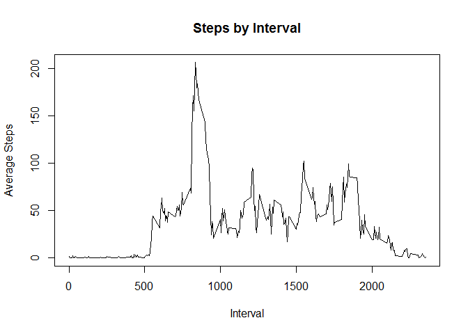
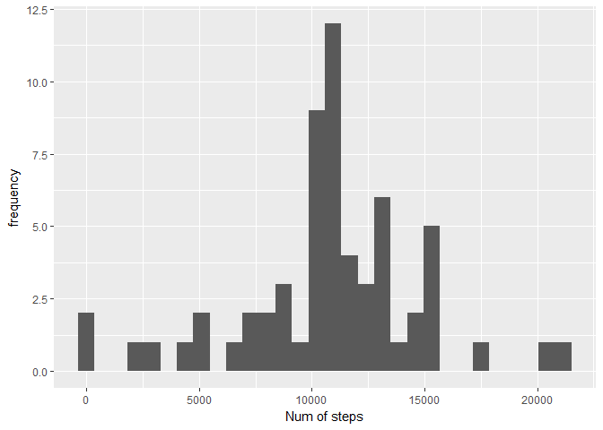
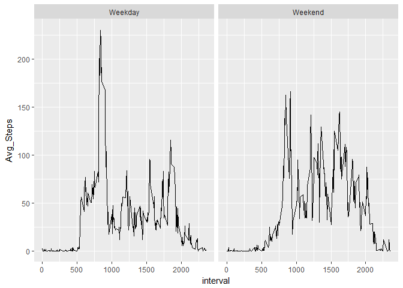

Read Activity Dataset and Inspect
---------------------------------

Activity data is in a csv file with headers. The file contains three
variables:

-   *steps*: Number of steps taking in a 5-minute interval (missing
    values are coded as **NA**)  
-   *date*: The date on which the measurement was taken in YYYY-MM-DD
    format  
-   *interval*: Identifier for the 5-minute interval in which
    measurement was taken

<!-- -->

    activityData <- read.csv(file="C:/Users/samenon/Documents/Coursera/ReproResearch/activity.csv",header=TRUE,sep=",")
    head(activityData)

    ##   steps       date interval
    ## 1    NA 2012-10-01        0
    ## 2    NA 2012-10-01        5
    ## 3    NA 2012-10-01       10
    ## 4    NA 2012-10-01       15
    ## 5    NA 2012-10-01       20
    ## 6    NA 2012-10-01       25

1. Data preparation
-------------------

Here data is processed for charting and analysis

### a.First step to remove NA from the steps readings:

Read and omit missing values

    activityDataNoNA = na.omit(activityData)
    head(activityDataNoNA)

    ##     steps       date interval
    ## 289     0 2012-10-02        0
    ## 290     0 2012-10-02        5
    ## 291     0 2012-10-02       10
    ## 292     0 2012-10-02       15
    ## 293     0 2012-10-02       20
    ## 294     0 2012-10-02       25

### b. create data set where steps are aggregated by day

Data aggregation

    library(dplyr)

    ## 
    ## Attaching package: 'dplyr'

    ## The following objects are masked from 'package:stats':
    ## 
    ##     filter, lag

    ## The following objects are masked from 'package:base':
    ## 
    ##     intersect, setdiff, setequal, union

    activityDataByDay = group_by(activityDataNoNA,date)
    activityDataByDay = summarise(activityDataByDay,Sum_Steps=sum(steps))
    head(activityDataByDay)

    ## # A tibble: 6 × 2
    ##         date Sum_Steps
    ##       <fctr>     <int>
    ## 1 2012-10-02       126
    ## 2 2012-10-03     11352
    ## 3 2012-10-04     12116
    ## 4 2012-10-05     13294
    ## 5 2012-10-06     15420
    ## 6 2012-10-07     11015

### c. create data set where steps are aggregated by interval

Data aggregation

    library(dplyr)
    activityDataByInt = group_by(activityDataNoNA,interval)
    activityDataByInt = summarise(activityDataByInt,Avg_Steps=mean(steps))
    head(activityDataByInt)

    ## # A tibble: 6 × 2
    ##   interval Avg_Steps
    ##      <int>     <dbl>
    ## 1        0 1.7169811
    ## 2        5 0.3396226
    ## 3       10 0.1320755
    ## 4       15 0.1509434
    ## 5       20 0.0754717
    ## 6       25 2.0943396

2. Histogram of daily steps & print mean/median
-----------------------------------------------

Charting

    library(ggplot2)
    qplot(activityDataByDay$Sum_Steps,geom = "histogram",xlab="Num of steps", ylab="frequency")

    ## `stat_bin()` using `bins = 30`. Pick better value with `binwidth`.

    print (paste("Median daily steps is:",median(activityDataByDay$Sum_Steps)))

    ## [1] "Median daily steps is: 10765"

    print (paste("Mean daily steps is:",mean(activityDataByDay$Sum_Steps)))

    ## [1] "Mean daily steps is: 10766.1886792453"

3 Time series plot of steps by interval & max 5-min interval
------------------------------------------------------------

Time series plot

     plot.ts(activityDataByInt$interval,activityDataByInt$Avg_Steps,main="Steps by Interval",type="l",xlab="Interval", ylab="Average Steps")

    maxIndex <- which.max(activityDataByInt$Avg_Steps)
    print(paste("Max Avg. steps happen at interval:",activityDataByInt[maxIndex,1]))

    ## [1] "Max Avg. steps happen at interval: 835"

4 Missing Values
----------------

First populate missing values with average of the interval

    activityDataAugment <- merge(activityData,activityDataByInt,by="interval")
      activityDataAugment[is.na(activityDataAugment[,2]),2] <- activityDataAugment[is.na(activityDataAugment[,2]),4]

Now create the histogram and estimate mean/medians

    library(ggplot2)
    New_activityDataByDay = group_by(activityDataAugment,date)
    New_activityDataByDay = summarise(New_activityDataByDay,Sum_Steps=sum(steps))
    qplot(New_activityDataByDay$Sum_Steps,geom = "histogram",xlab="Num of steps", ylab="frequency")

    ## `stat_bin()` using `bins = 30`. Pick better value with `binwidth`.

    print (paste("Median daily steps is:",median(New_activityDataByDay$Sum_Steps)))

    ## [1] "Median daily steps is: 10766.1886792453"

    print (paste("Mean daily steps is:",mean(New_activityDataByDay$Sum_Steps)))

    ## [1] "Mean daily steps is: 10766.1886792453"

Here, median has changed since the missing values are populated. The
Mean has not changed since the default value was the mean for the
interval

5 Weekday vs. Weekend analysis
------------------------------

Are there any difference by weekend and weekdays

    activityDataAugment$DOW <- weekdays(as.Date(activityDataAugment$date))
    activityDataAugment$DOW <- ifelse(activityDataAugment$DOW %in% c("Saturday","Sunday"),"Weekend","Weekday")
    activityDataByNewInt = group_by(activityDataAugment,interval,DOW)
    activityDataByNewInt = summarise(activityDataByNewInt,Avg_Steps=mean(steps))
    ggplot(data=activityDataByNewInt,aes(interval,Avg_Steps))+stat_summary(fun.y=mean,geom="line") + facet_grid(~DOW)

Here, we see higher volatility in weekday activity
