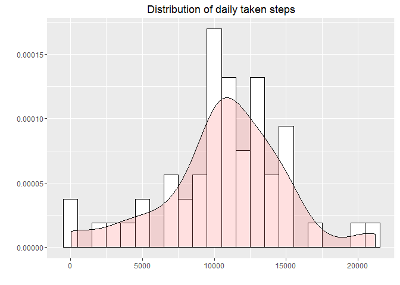
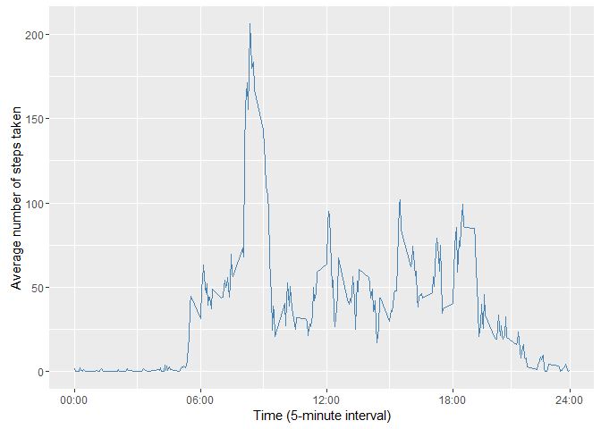
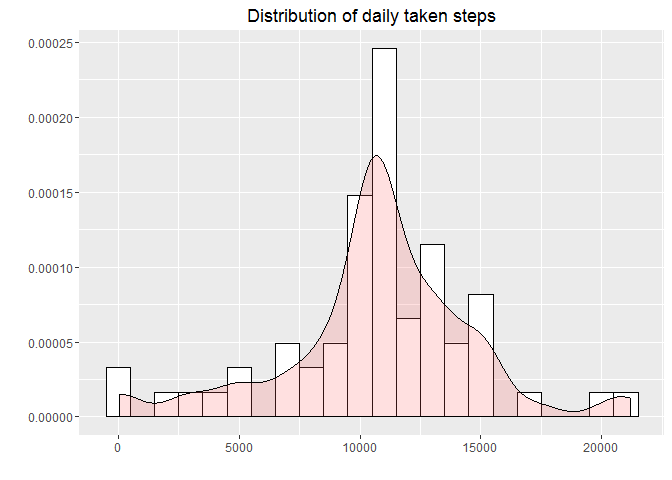
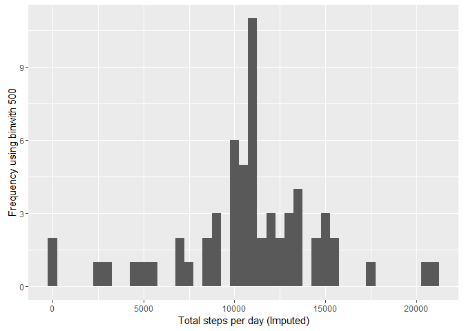

Assignment
================

``` r
knitr::opts_chunk$set(fig.path="figures/")
```

#### 1. Introduction

It is now possible to collect a large amount of data about personal movement using activity monitoring devices such as a Fitbit, Nike Fuelband, or Jawbone Up. The following short paper makes use of data from a personal activity monitoring device. This device collects data at 5 minute intervals through out the day. The data consists of two months of data from an anonymous individual collected during the months of October and November, 2012 and includes the number of steps taken in 5 minute intervals each day. More precisely, the data contains the following three variables.

-   steps: Number of steps taking in a 5-minute interval (missing values are coded as NA)
-   date: The date on which the measurement was taken in YYYY-MM-DD format
-   interval: Identifier for the 5-minute interval in which measurement was taken

#### 2. Downloading and reading the data

First things first, let's read the data using the readr package.

``` r
if(!exists("./data_activity_monitoring")){
        dir.create("./data_ activity_monitoring")
}
```

    ## Warning in dir.create("./data_ activity_monitoring"): '.\data_
    ## activity_monitoring' existiert bereits

``` r
destination_file <- "./data_ activity_monitoring/d_am.R"

download.file("https://d396qusza40orc.cloudfront.net/repdata%2Fdata%2Factivity.zip",
        destination_file)

unzip(zipfile = "./data_ activity_monitoring/d_am.R",
      exdir   = "./data_ activity_monitoring")

library(tidyverse)
```

    ## Warning: package 'tidyverse' was built under R version 3.2.5

    ## Loading tidyverse: ggplot2
    ## Loading tidyverse: tibble
    ## Loading tidyverse: tidyr
    ## Loading tidyverse: readr
    ## Loading tidyverse: purrr
    ## Loading tidyverse: dplyr

    ## Warning: package 'ggplot2' was built under R version 3.2.5

    ## Warning: package 'tibble' was built under R version 3.2.5

    ## Warning: package 'tidyr' was built under R version 3.2.5

    ## Warning: package 'readr' was built under R version 3.2.5

    ## Warning: package 'purrr' was built under R version 3.2.5

    ## Warning: package 'dplyr' was built under R version 3.2.5

    ## Conflicts with tidy packages ----------------------------------------------

    ## filter(): dplyr, stats
    ## lag():    dplyr, stats

``` r
activity_data <- read_csv("activity.csv", col_names = TRUE)
```

    ## Parsed with column specification:
    ## cols(
    ##   steps = col_integer(),
    ##   date = col_date(format = ""),
    ##   interval = col_integer()
    ## )

Then, using the command glimpse(), we will quickly inspect if reading worked properly, if the data frame is "tidy" and if the variables have an adequate class.

``` r
# take a glimpse
glimpse(activity_data)
```

    ## Observations: 17,568
    ## Variables: 3
    ## $ steps    <int> NA, NA, NA, NA, NA, NA, NA, NA, NA, NA, NA, NA, NA, N...
    ## $ date     <date> 2012-10-01, 2012-10-01, 2012-10-01, 2012-10-01, 2012...
    ## $ interval <int> 0, 5, 10, 15, 20, 25, 30, 35, 40, 45, 50, 55, 100, 10...

Everything worked properly resulting in a dataframe which contains 17568 observation and 3 variables. Note, there seem to be rather a lot missing values. We will deal with this later on.

#### 3. Analysis

##### 3.1 What is mean total number of steps taken per day?

Let's take a look at the distribution of the total number of steps taken per day. In order to do so, we will calculate the sum of steps made by the person each day. We then, will plot the distribution using a histogram.

``` r
# group the data by day and calculate the sum, mean and median of steps 
activity_data_grday <- activity_data %>%
                        group_by(date) %>%
                        summarise(sum_steps = sum(steps))
                            
# histogram
p1 <- ggplot(activity_data_grday, aes(x=sum_steps)) +
        geom_histogram(aes(y=..density..), colour="black", fill="white", binwidth = 1000) + 
        geom_density(alpha=.2, fill="#FF6666") + 
        ggtitle("Distribution of daily taken steps") + 
        labs(x="", y="")
p1
```

    ## Warning: Removed 8 rows containing non-finite values (stat_bin).

    ## Warning: Removed 8 rows containing non-finite values (stat_density).



Looks rather normally distributed. Finally, to round things off, lets calculate and report the mean and median of the total number of steps taken per day.

``` r
summary(activity_data_grday$sum_steps)
```

    ##    Min. 1st Qu.  Median    Mean 3rd Qu.    Max.    NA's 
    ##      41    8841   10760   10770   13290   21190       8

##### 3.2 What is the average daily activity pattern?

So here we will, inspect the average daily activity pattern. Put differently, we gonna ask how on average a day looked like?

``` r
# group the data by time intervals and calculate the mean
activity_data_grinter <- activity_data %>%
                        group_by(interval) %>% 
                        summarise(mean_int = mean(steps, na.rm=TRUE)) 
    
# plot time series
ggplot(activity_data_grinter, aes(interval, mean_int)) + 
        geom_line(color = "steelblue") +
        xlab("Time (5-minute interval)") + ylab("Average number of steps taken") + 
        scale_x_continuous(breaks = c(0,600,1200,1800,2355), labels = c("00:00", "06:00", "12:00", "18:00", "24:00"))
```



So what we basically see is that the person on average started it's day at around 6 a.m. in the morning. During the morning hours we can observe a sharp peak, before the number of steps break down drastically. During the afternoon there is almost some kind of cyclic behavior it seems. Finally, at around 7 pm the number of steps start to continiously decrease.

Next, we gonna check which 5 minute intervall on average shows the highest number of steps.

``` r
activity_data %>%
               group_by(interval) %>% 
               summarise(mean(steps, na.rm=TRUE)) %>%
               top_n(n=1) # select the top  entrie
```

    ## Selecting by mean(steps, na.rm = TRUE)

    ## # A tibble: 1 × 2
    ##   interval `mean(steps, na.rm = TRUE)`
    ##      <int>                       <dbl>
    ## 1      835                    206.1698

##### 3.3 Missing data

Now, let's deal with the missing values. First, we gonna filter all incomplete observation.

``` r
activity_data_na <- activity_data %>% 
                        filter(!complete.cases(.))  

dim(activity_data_na )                        
```

    ## [1] 2304    3

``` r
table(activity_data_na$date)
```

    ## 
    ## 2012-10-01 2012-10-08 2012-11-01 2012-11-04 2012-11-09 2012-11-10 
    ##        288        288        288        288        288        288 
    ## 2012-11-14 2012-11-30 
    ##        288        288

After a quick look we see that there are 2304 missing values. Besides, it is obvious that all missing data is caused by 8 days where none data was collected at all. Therefore, using the mean/median for that day is not an option. Instead, we gonna replace the missing values with the corresponding mean for that 5-minute interval. Using dplyr() this is done pretty quickly.

``` r
activity_data_imp <- activity_data %>% 
                        group_by(interval) %>% 
                        mutate(steps= ifelse(is.na(steps), mean(steps, na.rm=TRUE), steps))

sum(is.na(activity_data_imp$steps)) 
```

    ## [1] 0

Next, we gonna inspect the mean total number of steps taken per day. This, time however we use the imputed data.

``` r
# group the data by day and calculate the sum, mean and median of steps 
activity_data_imp_grday <- activity_data_imp %>%
                                        group_by(date) %>%
                                        summarise(sum_steps = sum(steps))
                                   

# histogram

ggplot(activity_data_imp_grday, aes(x=sum_steps)) +
        geom_histogram(aes(y=..density..), colour="black", fill="white", binwidth = 1000) +         geom_density(alpha=.2, fill="#FF6666") + 
        ggtitle("Distribution of daily taken steps") + 
        labs(x="", y="")
```



Using the table above, we can see that there is very little difference in both the mean and the median number of steps taken between the data with missing values and the imputed dataset.

``` r
summary(activity_data_imp_grday$sum_steps)
```

    ##    Min. 1st Qu.  Median    Mean 3rd Qu.    Max. 
    ##      41    9819   10770   10770   12810   21190

##### 3.4 Are there differences in activity patterns between weekdays and weekends?

Finally, we will check if there are any differences between weekdays and the weekend. We thus, will create the variable "weekday" indicating which day it is. Next, based on "weekday" we created another variable indicating if it is either weekday or weekend. Then, we group the data by interval and daytype and plot the average daily activity pattern.

``` r
activity_data_imp2 <- activity_data_imp %>% 
                                mutate(weekday = weekdays(date)) %>%
                                mutate(weekday = as.factor(weekday)) %>%
                                mutate(daytype = ifelse(weekday == "Samstag" | weekday == "Sunday", "weekend", "weekday")) %>%
                                group_by(interval, daytype) %>% 
                                summarise(mean_int = mean(steps, na.rm=TRUE))

ggplot(activity_data_imp2, aes(interval, mean_int)) + 
        geom_line(color = "steelblue") +
        facet_grid(daytype ~ .) +
        xlab("5-minute interval") + ylab("average number of steps taken") + 
        scale_x_continuous(breaks = c(0,600,1200,1800,2355), labels = c("00:00", "06:00", "12:00", "18:00", "24:00"))
```



The graph shows that there clearly are some differences. First, during the weeksdays there is much more activity in the morning observable and the highest peak amongst all of the 5-minute intervals is much higher as well. Secondly, during weekdays there is less activity during the afternoon. Lastly, on the weekend the person was more active in the evening.

``` r
library(knitr)
library(markdown)
```

    ## Warning: package 'markdown' was built under R version 3.2.5

``` r
knit2html("I:/R snippets/coursera_training/data science/reproducible_research/assignment1/PA1_template.md.md"
,"I:/R snippets/coursera_training/data science/reproducible_research/assignment1/PA1_template.html.html")
```

    ## 
    ## 
    ## processing file: I:/R snippets/coursera_training/data science/reproducible_research/assignment1/PA1_template.md.md

    ## 
      |                                                                       
      |                                                                 |   0%
      |                                                                       
      |.................................................................| 100%
    ##   ordinary text without R code

    ## output file: PA1_template.md.txt
