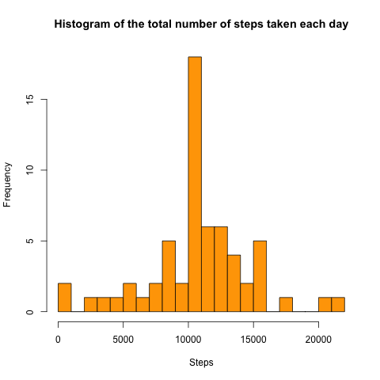

## Reproducible Research Peer Assessment 1  
  Beforehand, download datafiles from URL unzip to working directory.  
## Loading data, processing data, and answer Q1:  
**What is the mean total number of steps taken per day?**  

```r
data<-read.csv("activity.csv")
sum<-with(data, tapply(steps, date, sum, na.rm=TRUE))
```
Here is the histogram of Q1.  

```r
hist(sum, breaks=30, col="red", xlab="Steps", main="Histogram of the total number of steps taken each day")
```

 

```r
mean<-mean(sum)
median<-median(sum)
```
The mean of total number of steps taken per day is 9354.2295082.  
The median of total number of steps taken per day is 10395.  

## Q2.  
**What is the average daily activity pattern?**  

```r
library(dplyr)
grouped<-group_by(data, interval)
Summary<-summarize(grouped,mean(steps, na.rm=TRUE))
names(Summary)<-c("interval","Average")
which<-with(Summary, which(Average==max(Average))) 
## Calculated that the row104 of Summary gives the max average.
TheInterval<-Summary$interval[which] 
## Calcualted that the max average correpsonds to 835 min.
```
Here shows the plot for average daily activity pattern with *maximum number of steps*.  

```r
with(Summary, plot(interval, Average, type="l", xlab="interval (min)", ylab="Average steps"))
abline(v=Summary$interval[104], lwd=2, lty=2,col="red")
mtext(Summary$interval[104], 1,at=Summary$interval[104])
```

 
## Q3.  
**Imputing missing values**  
Calculate and report total number of missing values (coded as NA)

```r
sum(is.na(data$steps))
```

```
## [1] 2304
```
Total number of missing values is 2304.  
Fill in all missing values, using the mean for that 5-min interval.  

```r
## create a new dataset called data_new, replace each NA in data_new with the average steps corresponding to that 5-min interval.
data_new<-data
for(i in 1:nrow(data_new)) {
	if(is.na(data_new$steps[i])) {
		index<-with(Summary, which(interval==data_new$interval[i]))
		fill<-Summary$Average[index]
		data_new$steps[i]<-fill}
	}
## Now data_new is the new dataset with its NAs being filled by the mean of that 5-min interval.  
```
Here shows the histogram for this new data and reports mean, median.  

```r
 sum_new<-with(data_new, tapply(steps, date, sum, na.rm=T))
 hist(sum_new, breaks=30, col="orange",xlab="Steps",main="Histogram of the total number of steps taken each day")
```

 

```r
 mean_new<-mean(sum_new)
 median_new<-median(sum_new)
```
 The mean total number of steps is 1.0766189 &times; 10<sup>4</sup>.  
 The median total number of steps is 1.0766189 &times; 10<sup>4</sup>.  
 
 ## Q4.  
 **Are there differences in activity patterns between weekdays and weekends?**  
 Create a new factor variable with two levels (weekday and weekend).  
 
 ```r
 Date<-data_new$date
 Day<-weekdays(as.Date(Date))
 for (j in 1:length(Day)) {
 	if(Day[j]=="Monday" | Day[j]=="Tuesday" | Day[j]=="Wednesday" | Day[j]=="Thursday"|Day[j]=="Friday") {
 		Day[j] <- "weekday"}
 	if(Day[j]=="Saturday" | Day[j]=="Sunday") {
 		Day[j] <- "weekend"}
 		}
 Day<-as.factor(Day)
 ## This "Day" represents the new factor with two levels.
 ```
 Here shows the plot of average steps vs. 5-min intervals.  
 
 ```r
 data_new$Type<-Day
 group2<-group_by(data_new,interval,Type)
 sum2<-summarize(group2,mean(steps))
 names(sum2)<-c("interval","Type","steps")
 library(ggplot2)
 ggplot(sum2, aes(interval,steps,col=Type)) + geom_line() + facet_grid(Type~.) + labs(title="Differences in between weekdays & weekends")
 ```
 
  
 

 
 

