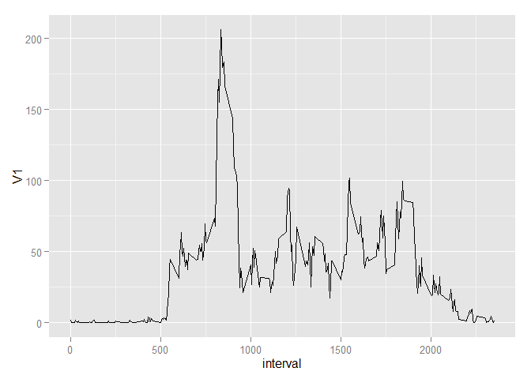
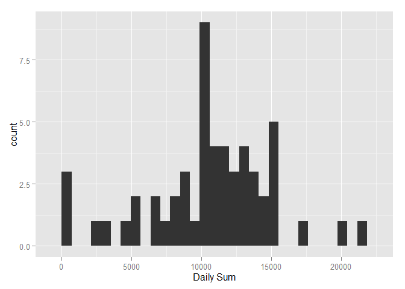

# Reproducible Research: Peer Assessment 1


## Loading and preprocessing the data

As per project guidelines, please make sure to open the .md file for the evaluation instead of the .Rmd file. Do not expect to see plots in the .Rmd file! They will appear in the .md or html. I clarify due to observed mistakes in previous evaluations.


```r
#Read csv file

activity<-read.csv("activity.csv")

#convert date from a factor to a date object

activity$date<-strptime(as.character(activity$date),
                        format = "%Y-%m-%d")
```


## What is mean total number of steps taken per day?

```r
library(data.table)

#reading data using data.table package
activitydt<-fread("activity.csv")

#Creating histogram using qplot and data.table "by" grouping
library(ggplot2)

qplot(V1,data=activitydt[,sum(steps),by=date],
      xlab = "Daily sum")
```

```
## stat_bin: binwidth defaulted to range/30. Use 'binwidth = x' to adjust this.
```

 

Below is the code and the evaluation of the code to calculate the mean and median of the total number of steps taken per day.

```r
#mean calculation using data.table "by" grouping

mean(activitydt[,sum(steps),by=date]$V1,
     na.rm = T)
```

```
## [1] 10766.19
```

```r
#median calculation using data.table "by" grouping

median(activitydt[,sum(steps),by=date]$V1,
     na.rm = T)
```

```
## [1] 10765
```


## What is the average daily activity pattern?
The pattern is found using the following code (Plot should be visible is you are reading the .md file).

```r
#Creating a timeserie variable containig steps mean by interval

timeserie<-activitydt[,mean(steps,na.rm = T),
                      .(interval)]
#plotting the time serie
qplot(interval,V1,
      data = timeserie,
      geom = "line")
```

 

The code used to calcule the interval that contains the maximum number of steps is as follows:

```r
#For the last question we will get the max ave # of steps

timeserie[V1==max(timeserie$V1)]
```

```
##    interval       V1
## 1:      835 206.1698
```


## Imputing missing values
The total number of missing values is calculated as follows:

```r
sum(is.na(activitydt$steps))
```

```
## [1] 2304
```


```r
means<-activitydt[,mean(steps,na.rm = T),
                  .(date)]$V1
activitydt2<-as.data.frame(activitydt)
k<-0
for(i in 1:61){
  if(i==1){
    activitydt2[(i+k):(i*288),"steps"][is.na(activitydt2[(i+k):(i*288),"steps"])]<-means[i+1]  
  }
  if(i==61){
    activitydt2[(i+k):(i*288),"steps"][is.na(activitydt2[(i+k):(i*288),"steps"])]<-means[i-1]
  }
  k<-k+288
}
```
Now, the new dataset is called activitydt2.

The plots are shown below.

```r
activitydt2<-as.data.table(activitydt2)
qplot(V1,data=activitydt2[,sum(steps),by=date],
      xlab = "Daily Sum")
```

```
## stat_bin: binwidth defaulted to range/30. Use 'binwidth = x' to adjust this.
```

 

Below is the code and the evaluation of the code to calculate the mean and median of the total number of steps taken per day.

```r
#mean calculation using data.table "by" grouping

mean(activitydt2[,sum(steps),by=date]$V1,
     na.rm = T)
```

```
## [1] 10569.15
```

```r
#median calculation using data.table "by" grouping

median(activitydt2[,sum(steps),by=date]$V1,
     na.rm = T)
```

```
## [1] 10682.5
```

## Are there differences in activity patterns between weekdays and weekends?
