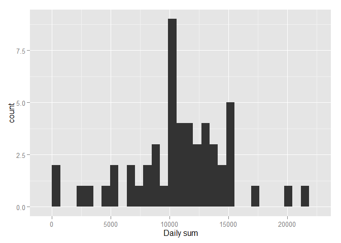

# Reproducible Research: Peer Assessment 1


## Loading and preprocessing the data


```r
#Read csv file

activity<-read.csv("activity.csv")

#convert date from a factor to a date object

activity$date<-strptime(as.character(activity$date),
                        format = "%Y-%m-%d")
```


## What is mean total number of steps taken per day?

```r
library(data.table)

#reading data using data.table package
activitydt<-fread("activity.csv")

#Creating histogram using qplot and data.table "by" grouping
library(ggplot2)

qplot(V1,data=activitydt[,sum(steps),by=date],
      xlab = "Daily sum")
```

```
## stat_bin: binwidth defaulted to range/30. Use 'binwidth = x' to adjust this.
```

 

```r
#mean calculation using data.table "by" grouping

mean(activitydt[,sum(steps),by=date]$V1,
     na.rm = T)
```

```
## [1] 10766.19
```

```r
#median calculation using data.table "by" grouping

median(activitydt[,sum(steps),by=date]$V1,
     na.rm = T)
```

```
## [1] 10765
```


## What is the average daily activity pattern?

```r
#Creating a timeserie variable containig steps mean by interval

timeserie<-activitydt[,mean(steps,na.rm = T),
                      .(interval)]
#plotting the time serie
qplot(interval,V1,
      data = timeserie,
      geom = "line")
```

 

```r
#For the last question we will get the max ave # of steps

timeserie[V1==max(timeserie$V1)]
```

```
##    interval       V1
## 1:      835 206.1698
```

## Imputing missing values


## Are there differences in activity patterns between weekdays and weekends?
