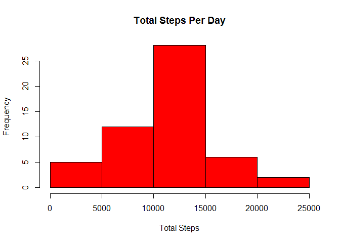
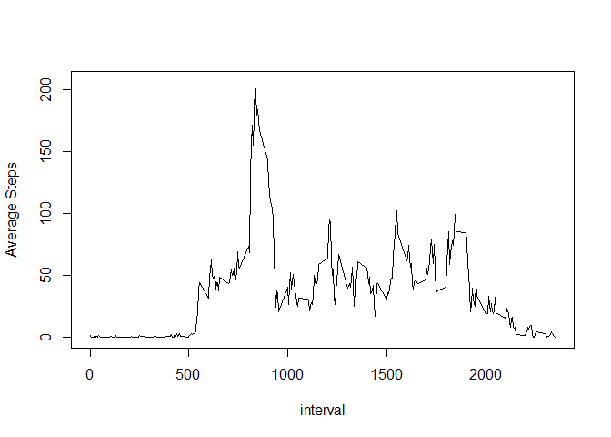

keep\_md: true

Loading and preprocessing the data
----------------------------------

1.  Load the data

``` r
data<-read.csv('activity.csv')
```

1.  Process/transform the data (if necessary) into a format suitable for your analysis

``` r
data <- transform(data, date = factor(date))
```

What is mean total number of steps taken per day?
-------------------------------------------------

1.  Make a histogram of the total number of steps taken each day

``` r
aggregatedTotalByDate <- aggregate(steps ~ date, data, sum)
with(aggregatedTotalByDate,hist(steps,col = "red",xlab='Total Steps',main = "Total Steps Per Day"))
```



1.  Calculate and report the mean and median total number of steps taken per day

``` r
meanByDate <- aggregate(steps ~ date, data, mean)
summary(meanByDate)
```

    ##          date        steps        
    ##  2012-10-02: 1   Min.   : 0.1424  
    ##  2012-10-03: 1   1st Qu.:30.6979  
    ##  2012-10-04: 1   Median :37.3785  
    ##  2012-10-05: 1   Mean   :37.3826  
    ##  2012-10-06: 1   3rd Qu.:46.1597  
    ##  2012-10-07: 1   Max.   :73.5903  
    ##  (Other)   :47

``` r
medianByDate <- aggregate(steps ~ date, data, median)
summary(medianByDate)
```

    ##          date        steps  
    ##  2012-10-02: 1   Min.   :0  
    ##  2012-10-03: 1   1st Qu.:0  
    ##  2012-10-04: 1   Median :0  
    ##  2012-10-05: 1   Mean   :0  
    ##  2012-10-06: 1   3rd Qu.:0  
    ##  2012-10-07: 1   Max.   :0  
    ##  (Other)   :47

What is the average daily activity pattern?
-------------------------------------------

1.  Make a time series plot (i.e. type = "l") of the 5-minute interval (x-axis) and the average number of steps taken, averaged across all days (y-axis)

``` r
timeseries<-aggregate(steps ~ interval, data, mean)
with(timeseries,plot(interval,steps,type="l",ylab="Average Steps"))
```



1.  Which 5-minute interval, on average across all the days in the dataset, contains the maximum number of steps?

``` r
timeseries$interval[which.max(timeseries$steps)]
```

    ## [1] 835

Imputing missing values
-----------------------

1.  Calculate and report the total number of missing values in the dataset (i.e. the total number of rows with NAs)

``` r
library(plyr)
count<-count(data,"steps")
count$freq[is.na(count$steps)]
```

    ## [1] 2304

1.  Devise a strategy for filling in all of the missing values in the dataset. The strategy does not need to be sophisticated.

    Here we use the mean steps of the day to fill in the missing values within the day.

2.  Create a new dataset that is equal to the original dataset but with the missing data filled in.

``` r
data<-read.csv('activity.csv',stringsAsFactors = FALSE)
meanByDate <- aggregate(steps ~ date, data, mean,na.action = na.pass)

for(i in 1:dim.data.frame(data)[1])
{
  if(is.na(data$steps[i])){
    if(is.na(meanByDate$steps[meanByDate$date==data$date[i]])){
      data$steps[i]=0
    }
    else{
      data$steps[i]=meanByDate$steps[meanByDate$date==data$date[i]]
    }
  }
}
```

1.  Make a histogram of the total number of steps taken each day and Calculate and report the mean and median total number of steps taken per day.

``` r
aggregatedTotalByDate <- aggregate(steps ~ date, data, sum)
meanByDate <- aggregate(steps ~ date, data, mean)
summary(meanByDate)
```

    ##      date               steps      
    ##  Length:61          Min.   : 0.00  
    ##  Class :character   1st Qu.:23.53  
    ##  Mode  :character   Median :36.09  
    ##                     Mean   :32.48  
    ##                     3rd Qu.:44.48  
    ##                     Max.   :73.59

``` r
medianByDate <- aggregate(steps ~ date, data, median)
summary(medianByDate)
```

    ##      date               steps  
    ##  Length:61          Min.   :0  
    ##  Class :character   1st Qu.:0  
    ##  Mode  :character   Median :0  
    ##                     Mean   :0  
    ##                     3rd Qu.:0  
    ##                     Max.   :0

### Do these values differ from the estimates from the first part of the assignment?

    As we use the mean of the day to fill in the missing values, the mean of the day will not be affected before or after filling in. As the missing values within a day is relatively few, they does not affet the median either.

### What is the impact of imputing missing data on the estimates of the total daily number of steps?

    In some days, no value is reported so without filling in the NAs, they are not reported in the 'mean of the day' or 'median of the day' data. Filling in these missing values make these days' data more comparable to others.

Are there differences in activity patterns between weekdays and weekends?
-------------------------------------------------------------------------

1.  Create a new factor variable in the dataset with two levels -- "weekday" and "weekend" indicating whether a given date is a weekday or weekend day.

``` r
data$date<-as.Date(data$date,format="%Y-%m-%d")
Type <- vector(mode="character", length=dim.data.frame(data)[1])
weekdays<-weekdays(data$date)
data<-cbind(data,weekdays)
data<-cbind(data,Type)
data$Type<-as.character(data$Type)

for(i in 1:dim.data.frame(data)[1])
{##As I'm working in Chinese environment, the characters below should be ##replaced by "Sunday" or "Saturday" if in English environment

  if(data$weekdays[i]=="星期日"||data$weekdays[i]=="星期六"){
    data$Type[i]="weekend"
  }
  else{
    data$Type[i]="weekday"
  }
}

data$Type<-as.factor(data$Type)
```

1.  Make a panel plot containing a time series plot (i.e. type = "l") of the 5-minute interval (x-axis) and the average number of steps taken, averaged across all weekday days or weekend days (y-axis).

``` r
sub_weekend<-data[data$Type=="weekend",]
sub_weekday<-data[data$Type=="weekday",]

meanByweekday <- aggregate(steps ~ interval, sub_weekday, mean)
Type <- vector(mode="character", length=dim.data.frame(meanByweekday)[1])
sub_weekday<-cbind(meanByweekday,Type)

for(i in 1:dim.data.frame(meanByweekday)[1])
{
  meanByweekday$Type="weekday"
}

meanByweekend <- aggregate(steps ~ interval, sub_weekend, mean)
Type <- vector(mode="character", length=dim.data.frame(meanByweekend)[1])
sub_weekday<-cbind(meanByweekend,Type)

for(i in 1:dim.data.frame(meanByweekend)[1])
{
  meanByweekend$Type="weekend"
}

meanbytype<-rbind(meanByweekend,meanByweekday)

library(lattice)
xyplot(steps ~ interval | Type, data=meanbytype,layout=c(1,2),xlab="Interval",ylab="Number of steps",type="l")
```


