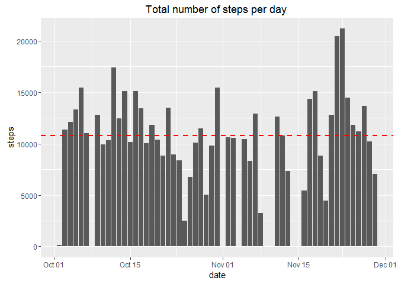
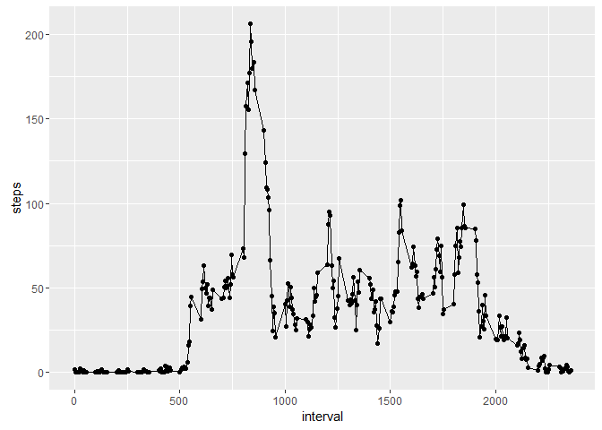
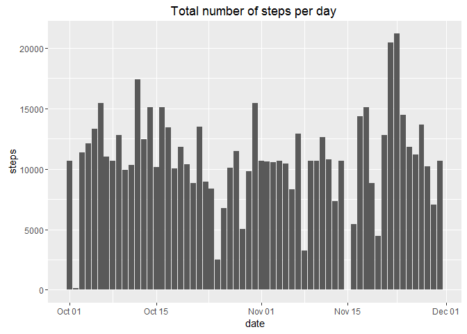

# Reproducible Research: Peer Assessment 1
## Loading and preprocessing the data


```r
 activityunzip <- unz("activity.zip","activity.csv")
 activity <- read.table(file = activityunzip,header = TRUE,sep = ",")
```
Convert the columns in their correct class to allow their analysis.


```r
  activity$date<-as.Date( activity$date, format = "%Y-%m-%d")
  activity$interval <- factor(activity$interval )  
```
Load the libraries


```r
library(ggplot2)
```

## What is mean total number of steps taken per day?


```r
Total_steps_day <- aggregate(steps ~ date, activity,sum, na.rm=TRUE)
mean_data <- round(mean(Total_steps_day$steps, na.rm=TRUE))
median_data <-round(median(Total_steps_day$steps, na.rm=TRUE))  
hist1 <- ggplot(Total_steps_day,aes(x=date,y=steps)) + 
  geom_bar(stat="identity") + 
  ggtitle("Total number of steps per day ")+
  geom_hline(yintercept = mean_data, color = "brown", linetype = "dashed",size = 1) +          geom_hline(yintercept = median_data, color = "red", linetype = "dashed", size = 1)         
print(hist1)
```



```r
print(c("The mean is",mean_data))
```

```
## [1] "The mean is" "10766"
```

```r
print(c("The median is",median_data))
```

```
## [1] "The median is" "10765"
```

## What is the average daily activity pattern?


```r
Average_steps_day <-aggregate(steps ~ interval, activity,mean, na.rm=TRUE)
Average_steps_day$interval<-as.numeric(levels(Average_steps_day$interval))[Average_steps_day$interval]
Max_average <- round(max(Average_steps_day$steps,na.rm=TRUE))
Average_graph<-ggplot(Average_steps_day, aes(x=interval,y=steps)) +geom_line()+geom_point()
print(Average_graph)
```



```r
print(c("Max average of number of steps",Max_average))
```

```
## [1] "Max average of number of steps" "206"
```
                                                                             
##Imputing missing values

I will replace NA values for the mean value obtainad in the first question in the steps columns.


```r
Avg_steps<- round(mean(activity$steps,na.rm=TRUE))
activity[is.na(activity)] <- Avg_steps
```

I will used the same code to generate to second Histogram


```r
Total_steps_day2 <- aggregate(steps ~ date, activity,sum, na.rm=FALSE)

hist2 <- ggplot(Total_steps_day2,aes(x=date,y=steps)) + 
  geom_bar(stat="identity") + 
  ggtitle("Total number of steps per day ")
          
print(hist2)
```



